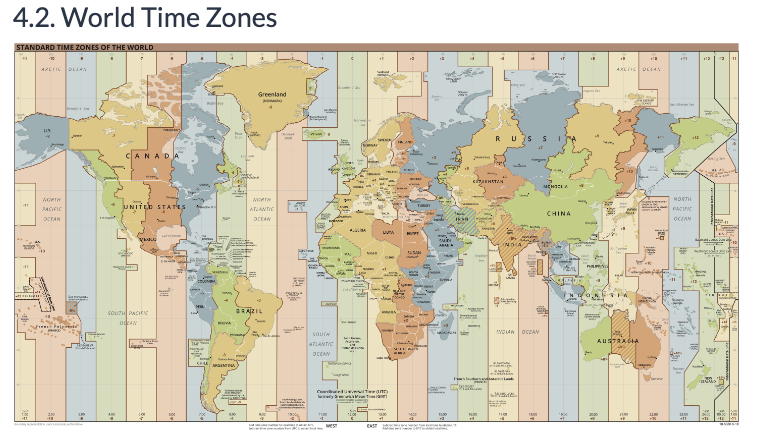

# Date & Time Transformations
Dates and timestamps are everywhere in the SQL world - this tutorial is going to be a quick fire guide you can refer back to anytime you need to revisit any specific transformation for your current problem.

Most of the examples will be done using in-line SQL code but should be pretty exhaustive in terms of the different types of operations you might want to tackle using `dates` and `timestamps`.

---

<br>

## `Date Manipulation`

<br>

### **Adding Days to Date**
```sql
-- implicit style
SELECT DATE '2023-05-04' + 7 as output;

-- explicit style (slightly clearer and better!)
SELECT DATE '2023-05-04' + INTEGER '7' AS output;
```
* Each have same output

|output|
|---|
|2023-05-11|

<br>

### **Adding Day Intervals**
Adding an `INTERVAL` to a `DATE` field actually converts the output to a `TIMESTAMP` so we will need to explicitly cast it back to `DATE` if it is required!

```sql
SELECT (DATE '2023-05-04' + INTERVAL '7 DAYS')::DATE AS output;
```
|output|
|---|
|2023-05-11|

<br>

### **Adding Different Intervals**
We can also add specific `days` or `month` intervals to date fields also - just remember that adding `INTERVAL` to any `DATE` will still return a `TIMESTAMP` like we mentioned above!

You can even add multiple types of intervals all in one go.
```sql
WITH test_data (date_column) AS (
VALUES (DATE '2020-01-01')
)
SELECT
  (date_column + INTERVAL '7 DAYS')::DATE AS add_days,
  (date_column + INTERVAL '1 MONTH')::DATE AS add_month,
  (date_column + INTERVAL '2 YEARS')::DATE AS add_days,
  (date_column + INTERVAL '1 YEAR 2 MONTHS 3 DAYS')::DATE AS add_many
FROM test_data;
```
|add_days|add_month|add_years|add_many|
|---|-----|----|----|
|2022-02-21|2022-03-14|2024-02-14|2023-04-17|

<br>

### **Subtracting Dates**
Subtracting dates is as easy using a `-` instead of a `+`
```sql
SELECT
  (DATE '2023-03-16' - INTERVAL '2 MONTHS 1 DAY')::DATE AS combined_interval_date_cast,
  (DATE '2023-03-16' - 12) AS days_default,
  (DATE '2023-03-16' - INTERVAL '2 MONTHS 1 DAY') AS interval_default
```
|combined_interval_date_cast|days_default|interval_default|
|-----|-----|-----|
|2023-01-15|2023-03-04|2023-01-15|

<br>

### **Other SQL Dialects**
In **SQL Server** and othe**r database implementations `DATEADD` is also available.

Note that this DATEADD function is not available in PostgreSQL
```sql
-- add days
SELECT DATEADD(DAY, 7, DATE '2020-01-01');

-- subtract days
SELECT DATEADD(DAY, -7, DATE '2020-01-01');
```

<br>

### **Summary**
```sql
WITH test_data (date_column) AS (
VALUES (DATE '2023-04-11')
)
SELECT
  -- addition examples
  date_column + 7 AS add_1,
  date_column + INTEGER '7' AS add_2,
  (date_column + INTERVAL '7 DAYS')::DATE AS add_3,
  (date_column + INTERVAL '3 MONTHS')::DATE AS add_4,
  -- subtraction examples
  date_column - 7 AS sub_1,
  date_column - INTEGER '7' AS sub_2,
  (date_column - INTERVAL '7 DAYS')::DATE AS sub_3,
  (date_column - INTERVAL '3 MONTHS')::DATE AS sub_4
FROM test_data;
```
|add_1|add_2|add_3|add_4|sub_1|sub_2|sub_3|sub_4|
|--|----|----|----|----|----|----|----|
|2023-04-18|2023-04-18|2023-04-18|2023-07-11|2023-04-04|2023-04-04|2023-04-04|2023-01-11|

<br><br>

### `Extracting Date Fiels`
We can make use of the `EXTRACT` function to obtain key fields from the date columns.

`EXTRAC`T and `DATE_PART` do exactly the same thing but with slightly different syntax - but we prefer to use EXTRACT where possible as it is part of the SQL Standard!

The basic usage of the EXTRACT function looks like the following: 

```sql
  SELECT
    EXTRACT(<field> FROM <date_input_or_column>)
```

* There is also an additional method using the `TO_CHAR` to generate some of these numeric outputs as actual **text outputs** 

<br>

### **Day Of Week**
The `DOW` field returns a number from **0 for Sunday** to **6 for Saturday**.\
* Think zero indexing for lists/arrays yada yada

Notice how the `TO_CHAR` second argument can be changed slightly to change the output based off the exact format.
```sql
SELECT
  EXTRACT(DOW FROM DATE '2023-05-01') AS DOW,
  TO_CHAR(DATE '2023-05-01', 'day') AS lower,
  TO_CHAR(DATE '2023-05-01', 'Day') AS Capitalize,
  TO_CHAR(DATE '2023-05-01', 'DAY') AS UPPER;
```
|dow|lower|capitalize|upper|
|---|---|-----|----|
|1|monday|Monday|MONDAY|

<br>

### **Day Of Month**
The `DAY` field returns the day of the month.
```sql
SELECT
  EXTRACT(DAY FROM DATE '2023-05-04') AS day,
  EXTRACT(DAY FROM CURRENT_DATE) AS current_day
```
|day|current_day|
|---|----|
|4|4|

<br>

### **Day Of Year**
`DOY` can be used for the day of the year - this is really useful for any analysis with seasonal trend or data with multiple years worth of values.
```sql
SELECT
  EXTRACT(DOY FROM DATE '2023-05-04') AS doy
```
|doy|
|----|
|124|

<br>

### **Month of Year**
We can also use the same EXTRACT to grab out the `month` value for values **1-12**
* Numeric Return Type
```sql
SELECT
  EXTRACT(MONTH FROM DATE '2023-05-04') AS month_int
```
|month_int|
|----|
|5|

<br>

### **Year Part**
Likewise we can also extract the `YEAR` value from a date field
```sql
SELECT
  EXTRACT(YEAR FROM DATE '2023-05-04') AS year
```
|year|
|---|
|2023|

<br>

### **Calendar Quarter**
We can also extract the calendar year `QUARTER` for the date
* Note custom TO_CHAR text field generation

```sql
SELECT
  EXTRACT(QUARTER FROM DATE '2023-05-04') AS quarter,
  -- TO_CHAR second argument similar to pandas datetime can have different formatted return types
  TO_CHAR(DATE '2023-05-04', '"FY"YY"Q"Q') AS first_char,
  TO_CHAR(DATE '2023-05-04', 'YYYY"Q"Q') AS second_char;
```
|quarter|first_char|second_char|
|----|-----|-----|
|2|FY23Q2|2023Q2|

<br>

### **Week of Year**
One very useful extraction is to get the `week number` - however we have to be super careful as some of the dates at the end and beginning of the year will overlap with the following/previous year depending on where the Monday falls.

PostgreSQL uses the **ISO 8601 week-numbering** system and because ISO weeks start on a Monday - there naturally has some overlap, so it’s recommended to use the `YEAR` extract also to make sure it’s correct!

Here are 2 edge cases below when extracting the WEEK date field

```sql
SELECT
  EXTRACT(WEEK FROM DATE '2005-01-01') AS early_jan,
  EXTRACT(WEEK FROM DATE '2012-12-31') AS late_dec;
```
|early_jan|late_dec|
|----|-----|
|53|1|

<br>

* Further Details about the `EXTRACT` values can be found at 
    - [Extract](https://www.postgresql.org/docs/12/functions-datetime.html#FUNCTIONS-DATETIME-EXTRACT)

<br><br>

### **Date Truncation**
The `DATE_TRUNC` function is similar to the `EXTRACT` function - however instead of returning the value of the specific field, this function will return a `TIMESTAMP` based off the field input used to specify the precision used to truncate the DATE or TIMESTAMP field.

Truncation is very similar in concept to rounding for numeric fields where we would “round” our dates to the most previous field value.

<br>

### **Beginning Of Month**
We can use the  `MONTH` field to truncate our date back to the beginning of the month.

This transformation is really useful for monthly aggregations for sales or events!

```sql
SELECT DATE_TRUNC('MONTH', DATE '2020-06-03')::DATE;
```
|date_trunc|
|---|
|2023-05-01|

* Looks common here that an aggregate `GROUP BY` would provide us here with a particular part of a `DATE` type field to group certain records (sales likely)

<br>

### **Beginning Of Week**
We can also truncate to the begining of the week by using the `WEEK` field

Remember that the beginning of the week is always set to the Monday’s date.

* Today is 5-5-2023 (Cinco de Mayo - Friday)
```sql
SELECT DATE_TRUNC('WEEK', DATE '2023-05-05')::DATE;
```
|date_trunc|
|----|
|2023-05-01|

* Monday of this week

<br>

###  **Custom Start of Week**
We can also adjust our  `DATE_TRUNC` outputs with **WEEK** field to return the beginning of the week at a custom day.

This is used extensively for retail companies where promotional weeks might not always lie from a Monday to Sunday schedule - for example, in Australia our supermarket specials change every Wednesday to Tuesday and all of the internal finance calculations and performance measurements are calculated for these weekly periods!
* Point to take - not all weeks are the same!


#### **Week Starts on Monday**
We can simply `DATE_TRUNC` just like the beginning of the week as it includes the target day.

* Case 1: On a Monday it should return the same date
```sql
SELECT DATE_TRUNC('week', DATE '2020-06-01')::DATE;
```
|date_trunc|
|---|
|2020-06-01|

* Case 2: On a Tuesday it should return the day before
```sql
SELECT DATE_TRUNC('week', DATE '2020-06-02')::DATE;
```
|date_trunc|
|---|
|2020-06-01|

* Case 3: On a Sunday it should return the most recent Monday
```sql
SELECT DATE_TRUNC('week', DATE '2020-06-07')::DATE;
```
|date_trunc|
|---|
|2020-06-01| 

<br>

#### **Week Starts on Tuesday**
Let’s say that we want to know find the most recent start of the week for Tuesday and not Monday - how should we go about this?

This is a super common interview question and actually requires a little bit of thought!

What happens if we were to just add a single day to our `DATE_TRUNC` output to shift the starting day of the week to Tuesday? **(so - 2020/06/02)**

Let’s run a few cases to see if our solution works.

* Case 1: if we had a day which is Tuesday, our code should return us exactly the same date. Let’s try it with the 2020-06-02 Tuesday date:

```sql
WITH test_data (date_field) AS (
  VALUES (DATE '2020-06-02')
)
SELECT (DATE_TRUNC('WEEK', date_field) + INTERVAL '1 DAY')::DATE
FROM test_data
```
|date|
|---|
|2020-06-02|

* Case 2: On Wednesday 2020-06-03 - it should return the day before
```sql
WITH test_data (date_field) AS (
  VALUES (DATE '2020-06-03')
)
SELECT (DATE_TRUNC('WEEK', date_field) + INTERVAL '1 DAY')::DATE
FROM test_data;
```
|date|
|---|
|2020-06-02|

* Case 3: On the following Monday 2020-06-08 - it should return the prior Tuesday
```sql
WITH test_data (date_field) AS (
  VALUES (DATE '2020-06-08')
)
SELECT (DATE_TRUNC('WEEK', date_field) + INTERVAL '1 DAY')::DATE
FROM test_data;
```
|date|
|---|
|2020-06-09|

* Just Note here how the most recent monday date was selected with an interval added to the day

Oh no! It doesn’t work - we should be getting the same 2020-06-02 as our output! What happened?

Ok so what if we try subtracting 1 day to our input for the DATE_TRUNC function?

```sql
WITH test_data(date_field) AS (
  VALUES(DATE '2020-06-08')
)
SELECT 
  (DATE_TRUNC('WEEK', (date_field - INTERVAL '1 DAY') + INTERVAL '1 DAY'))::DATE AS wrong,
  (DATE_TRUNC('WEEK', (date_field - INTERVAL '1 DAY')) + INTERVAL '1 DAY')::DATE AS right_encapsulated,
  -- Order of operations not necessarly required (aka encapsulation above in each second argument )
  (DATE_TRUNC('WEEK', date_field - INTERVAL '1 DAY') + INTERVAL '1 DAY')::DATE AS right_standard
FROM test_data
```
|wrong|right_encapsulated|right_standard|
|----|-----|------|
|2020-06-08|2020-06-02|2020-06-02|

* Intent was to get the Tuesday of the pass week (only possible with 6-8 as getting back to 6-1 prior for the 'WEEK' pulling the Monday date)


* Cool - this seems to work - but let’s retry this on our original 2 cases in one go:

```sql
WITH test_data (date_field) AS (
  VALUES
    (DATE '2020-06-02'),  -- Tuesday
    (DATE '2020-06-03'),  -- Wednesday
    (DATE '2020-06-08')  -- Following Monday
)
SELECT (DATE_TRUNC('WEEK', date_field - INTERVAL '1 DAY') + INTERVAL '1 DAY')::DATE
FROM test_data;
```
|date|
|----|
|2020-06-02|
|2020-06-02|
|2020-06-02|

<br>

#### `Date Trunc Exercises`
Let’s say we wish to generate the start of the week on a **Friday - 2020-06-05**, using the following dataset - update the query below to successfully perform this DATE_TRUNC transformation

```sql
WITH test_data (date_field) AS (
  VALUES
    (DATE '2020-06-04'),  -- Thursday
    (DATE '2020-06-05'),  -- Friday
    (DATE '2020-06-11'),  -- Following Thursday
    (DATE '2020-06-12')   -- Following Friday
)
SELECT *
FROM test_data;
```

```sql
WITH test_data (date_field) AS (
  VALUES
    (DATE '2020-06-04'),  -- Thursday
    (DATE '2020-06-05'),  -- Friday
    (DATE '2020-06-11'),  -- Following Thursday
    (DATE '2020-06-12')   -- Following Friday
)
SELECT *
FROM test_data;
```
|date|
|----|
|2020-06-05|
|2020-06-05|
|2020-06-12|
|2020-06-12|

---

<br>

## **Timestamp Manipulation**

### Time Intervals
In the same manner as with dates, we can use `INTERVAL` inputs to manipulate our timestamp fields.

Here are a few simple examples:

* Hour Intervals
```sql
SELECT (TIMESTAMP '2020-06-01 01:00' + INTERVAL '23 hours')::TIMESTAMP;
```
|timestamp|
|----|
|2020-06-02 00:00:00|

* Day Intervals
```sql
SELECT TIMESTAMP '2020-06-01 01:00' + INTERVAL '3 days';
```
|timestamp|
|---|
|2020-06-04 01:00:00|


Other commonly used types include:

* minutes
* seconds
* months

You can also combine multiple interval types together just like with the original form we saw with regular date types.

```sql
SELECT TIMESTAMP '2020-06-01 01:00' + INTERVAL '3 days 23 hours';
```
|timestamp|
|-----|
|2020-06-05 00:00:00|

<br>

### **Difference Between Timestamps**
When you substract one timestamp from another timestamp or a date, you will be returned an `INTERVAL` data type.

Unfortunately in Postgresql - you will need to `EXTRACT the EPOCH` from an interval to obtain the seconds and use a manual division to extract the exact values you require.

So what is the `EPOCH` you ask? It’s actually the difference between a given timestamp and 1970-01-01 00:00:00

This is quite commonly used across various data platforms, HOWEVER we need to be careful with time zones when using this - more on this soon!

* Raw Transformation

```sql
SELECT TIMESTAMP '2020-06-01 01:00' - TIMESTAMP '2020-06-01 00:00' as time_difference;
```
|time_difference|
|----|
|{ "hours": 1 }|

<br>

#### **Interval to Seconds**
```sql
SELECT
  EXTRACT(EPOCH FROM TIMESTAMP '2020-06-01 01:00')
    - EXTRACT(EPOCH FROM TIMESTAMP '2020-06-01 00:00')
    AS time_difference_seconds;
```
|time_difference_seconds|
|-----|
|3600|

<br>

#### **Interval to Minutes**
```sql
SELECT
  (EXTRACT(EPOCH FROM TIMESTAMP '2020-06-01 01:00')
    - EXTRACT(EPOCH FROM TIMESTAMP '2020-06-01 00:00'))
    / (60)  as time_difference_minutes;
```
|time_difference_minutes|
|-----|
|60|

<br>

#### **Interval to Hours**
```sql
SELECT
  (EXTRACT(EPOCH FROM TIMESTAMP '2020-06-01 01:00')
    - EXTRACT(EPOCH FROM TIMESTAMP '2020-06-01 00:00'))
    -- More or less dividing by 3600 or a default hour for the return of seconds with EPOCH
    / (60 * 60)  as time_difference_hours;
```
|time_difference_hours|
|---|
|1|

<br>

#### **Interval to Days**
* Also, let’s check what happens when you subtract a date in the future?
```sql
SELECT
  (EXTRACT(EPOCH FROM TIMESTAMP '2020-06-01 00:00')
    - EXTRACT(EPOCH FROM TIMESTAMP '2020-06-02 09:00'))
    / (24 * 60 * 60)  as time_difference_days;
```
|time_difference_days|
|----|
|-1.375|

* Non future
```sql
SELECT
  (EXTRACT(EPOCH FROM TIMESTAMP '2020-06-03 00:00')
    - EXTRACT(EPOCH FROM TIMESTAMP '2020-06-01 09:00'))
    -- How many seconds in a day (times total hours in a day)
    / (24 * 60 * 60)  as time_difference_days;
```
|time_difference_days|
|-----|
|1.625|

<br>

#### **Interval to Months**
We rarely use month differences in practice as there are different days in various months - usually if we need such a large interval, we would convert the timestamps to dates and do a straight difference between date fields to return an integer type of days and perhaps use a simplification of 1 month = 30 days.

```sql
WITH raw_inputs AS
(
SELECT
  TIMESTAMP '2020-06-01 00:00' AS start_time,
  TIMESTAMP '2020-06-16 00:00' AS end_time
)
SELECT
  (end_time::DATE - start_time::DATE) / 30 AS month_difference,
  (end_time::DATE - start_time::DATE),
  (end_time::DATE - start_time::DATE)::FLOAT / 30 as flt_difference
FROM raw_inputs;
```
|month_difference|?column?|flt_difference|
|-----|-----|-----|
|0|15|0.5|

Wait…what happened here? Shouldn’t it be 0.5 months difference??

Do you remember the integer division we mentioned in the first SQL Basics tutorial?

Let’s try casting our integer 30 denominator into a NUMERIC data type and try again!

```sql
WITH raw_inputs AS
(
SELECT
  TIMESTAMP '2020-06-01 00:00' AS start_time,
  TIMESTAMP '2020-06-16 00:00' AS end_time
)
SELECT
  (end_time::DATE - start_time::DATE) / 30::NUMERIC AS month_difference
FROM raw_inputs;
```
|month_difference|
|-----|
|0.50000000000000000000|

**Always gotta look out for that integer division!**

<br>

### **Interval to Months Using `AGE`**
We can also use `AGE` to perform a **floor month difference** for an interval.

We split up the following demonstration into multiple CTE parts to clearly illustrate the steps for using AGE to generate the month difference.

One key thing to note about the AGE function is that the latest time must be the first argument, followed by the earliest time - if you flip them around you will get negative values!

```sql
WITH raw_inputs AS
(
SELECT
  TIMESTAMP '2020-01-01 00:00' AS start_time,
  TIMESTAMP '2021-07-03 04:00' AS end_time
),
interim_age AS (
  SELECT
    AGE(end_time, start_time) AS age_difference
  FROM raw_inputs
),
age_parts AS (
  SELECT
    EXTRACT(years FROM age_difference) AS years_part,
    EXTRACT(months FROM age_difference) AS months_part,
    EXTRACT(days FROM age_difference) AS days_part,
    EXTRACT(hours FROM age_difference) AS hours_part
FROM interim_age
)
SELECT
  -- years difference x 12 + months difference
  years_part * 12 + months_part AS total_months,
  CONCAT('', years_part, ' year(s), ', months_part, ' month(s) ', (years_part * 365 + days_part), ' days ... or :  ', ((years_part * 365 + days_part) * 24 + hours_part ), ' hours'), -- totaly days * hours in day + hour difference
  --CONCAT('', years_part, ' years, ', (years_part * 12 + months_parts), ' months, ', (years_part * 365 + days_part) ' days' ) AS concat_difference,
  (SELECT * FROM interim_age) AS first_cte_value,
  (SELECT years_part FROM age_parts) AS age_parts_years,
  (SELECT months_part FROM age_parts) AS month_parts_years,
  (SELECT days_part FROM age_parts) AS day_parts_years
FROM age_parts;
```
|total_months|concat|first_cte_value|age_parts_years|month_parts_years|day_parts_years|
|-----|----|-----|----|----|-----|
|18|
|1 year(s), 6 month(s) 367 days ... or : 8812 hours|
|{ "years": 1, "months": 6, "days": 2, "hours": 4 }|
|1|
|6|
|2|


What happens when you flip the interval endpoints around and condense the query into a more compact form?

Note how we still keep the interim_age CTE as it is cleaner than repeating the AGE function twice should we not use it.

```sql
WITH raw_inputs AS
(
SELECT
  TIMESTAMP '2020-01-01 00:00' AS start_time,
  TIMESTAMP '2020-07-01 00:00' AS end_time
),
interim_age AS (
  SELECT
    AGE(start_time, end_time) AS age_difference
  FROM raw_inputs
)
SELECT
  -- years difference x 12 + months difference
  EXTRACT(years FROM age_difference) * 12
    + EXTRACT(months FROM age_difference) AS total_months
FROM interim_age;
```
|total_months|
|---|
|-6|

We can also use date columns instead of timestamps for the AGE function - note how I’ve used the fixed order of the end_time and start_time in the following query also.

```sql
WITH raw_inputs AS
(
SELECT
  DATE '2020-01-01' AS start_time,
  DATE '2020-07-01' AS end_time
),
interim_age AS (
  SELECT
    AGE(end_time, start_time) AS age_difference
  FROM raw_inputs
)
SELECT
  -- years difference x 12 + months difference
  EXTRACT(years FROM age_difference) * 12
    + EXTRACT(months FROM age_difference) AS total_months
FROM interim_age;
```
|total_months|
|---|
|6|

The same `AGE` function also works for one date and one timestamp column as inputs.
```sql
WITH raw_inputs AS
(
SELECT
  TIMESTAMP '2020-01-01 00:00' AS start_time,
  DATE '2020-07-01' AS end_time
),
interim_age AS (
  SELECT
    AGE(end_time, start_time) AS age_difference
  FROM raw_inputs
)
SELECT
  -- years difference x 12 + months difference
  EXTRACT(years FROM age_difference) * 12
    + EXTRACT(months FROM age_difference) AS total_months
FROM interim_age;
```
|total_months|
|---|
|6|

<br>

### **Subracting a Timestamp from a Date**
* Let’s demonstrate that the difference between a `date` and a `timestamp` will be an `interval` data type also.

```sql
SELECT TIMESTAMP '2020-06-01 00:00' - DATE '2020-06-16' AS difference_result;
```
|difference_result|
|----|
|{ "days": -15 }|

* Let’s try it again with a larger difference and with a specific hour input.
```sql
SELECT TIMESTAMP '2020-06-01 06:00' - DATE '2021-09-01' AS difference_result;
```
|difference_result|
|-----|
|{ "days": -456, "hours": -18 }|

* What about with the date first?
```sql
SELECT DATE '2021-09-01' - TIMESTAMP '2020-06-01 06:00' AS difference_result;
```
|difference_result|
|-----|
|{ "days": 456, "hours": 18 }|

<br>

* As you can see you - you will get the interval representation when you don’t use the EXTRACT(EPOCH FROM <timestamp/date>) value and manually divide!

<br>

### **Grouping By Hour**
We can also use the `DATE_TRUNC` function to get the hour component - this is super useful when combined with a `GROUP BY`

* Which hour had the most sales in the rentals.payment table?

```sql
SELECT
  DATE_TRUNC('hour', payment_date) AS payment_hour,
  SUM(amount) AS total_amount
FROM dvd_rentals.payment
GROUP BY 1
ORDER BY 2 DESC
LIMIT 5;
```
|payment_hour|total_amount|
|----|-----|
|2006-02-14 15:00:00.000|514.18|
|2005-07-27 03:00:00.000|189.60|
|2005-07-30 18:00:00.000|177.63|
|2005-07-27 21:00:00.000|175.66|
|2005-08-02 04:00:00.000|171.63|

* As expected - we can also use this `DATE_TRUNC` for the **minutes** and **seconds** components of the timestamp also depending on the actual use case for any analysis.

---

<br>

## Time Zone Case Study
### Introduction and Theory
This is probably the trickiest component out of this entire tutorial and dealing with time related data in general!

This will become clearer in this real life example I’ve encountered working in the retail industry.

A few basic notions need to be in place before we tackle a real life example:

1. UTC or Coordinated Universal Time is the primary standard for all the time zones in the world
2. All timezones are expressed using plus or minus time offsets from UTC
3. Physical locations can have different time zones at different times of the year (Daylight Savings for example)

<br>

### World Time Zones


<br>

### Australia Time Zones
Here is how time zones have an impact in a real world problem.

This was an exact replica of something I encountered when working with data that had transactions from supermarkets around Australia.

First of all - it’s important to know Australia’s various time zones.

For the majority of the year - there are 3 distinct time zones:

- Australian Eastern Standard Time (AEST), UTC + 10
- Australian Central Standard Time (ACST), UTC + 9.5
- Australian Western Standard Time (AWST), UTC + 8


However - In Australia, daylight saving always begins at 2am on the first Sunday in October and ends at 2am on the first Sunday in April

To make things complicated there are 2 additional time zones and only certain states have daylight saving time!

- Australian Eastern Daylight Time (AEDT), UTC +11
- Australian Central Daylight Time (ACDT), UTC +10.5

Note: Some edge cities lie on the border of state boundaries but we can ignore them for now - but they do happen, so keep this in mind!


<br>

### **Timestamps & Local Times**
Let’s say there exists a table where there is transactions data down to the time a specific customer transaction occurs.

We have information beforehand that these sales transactions come from all the stores across Australia.

There was one issue however - this `txn_timestamp` column was of a `TIMESTAMP` type - there is no specified time zone for this data type in PostgreSQL!

|txn_id|customer_id|txn_timestamp|store_id|amount|
|---|-----|-----|-----|-----|
|1|283235213|2020-06-01|12:18:27|1345|54.43|
|2|283235213|2020-06-01|16:54:33|1522|152.98|
|3|134524213|2020-06-01|21:23:52|3335|2.43|
|4|534675434|2020-06-01|12:18:27|8709|100.83|

* Now - let’s assume we were asked to look at a day’s worth of sales using this exact table and plot it by the hour. 
  - Here is what the SQL might have looked like from the sales table:

```sql
SELECT
  DATE_PART('HOUR', txn_timestamp) AS hour_of_day,
  SUM(amount) AS total_amount
FROM sales
WHERE txn_timestamp = '2020-06-01'
GROUP BY 1
ORDER BY 1;
```

* What we noticed after visualizing the outputs from this query was that, all of the sales seemed to line up with the opening hours from about 7AM through to 10pm with a few stores with sales from 10pm to 12 midnight.

<br>


* The txn_timestamp column represented the actual local time that the transaction occured!

You may have already noticed the heading of this section!

Most likely these datasets were created for reporting purposes which needed sales by the trading hour for potential use cases like:

* Identifying hourly trends in sales across various stores
* Comparing different stores and states by the shopping volumes throughout the day
* Validating that opening hours were long enough

Many other questions could be answered using data set at local time - but there was still a lingering question.

<br>

### **TIMESTAMP & TIMESTAMPZ Data Types** 
What we encountered previously in the sales example is what as known as a **timestamp without a time zone**.

This is quite common in raw and messy data where timestamps can easily be misrepresented as a string and the time zone information is lost upon reading in the data!

In PostgreSQL specifically there are 2 types of timestamps - one with a timezone and one without:

* Up until now we have been dealing with the TIMESTAMP data type, which has no timezone:
```sql
select localtimestamp;
```
|localtimestamp|
|----|
|2023-05-06 20:10:33.691|

* We now introduce the `TIMESTAMPZ` data type which does have a time zone!
```sql
select current_timestamp;
```
|current_timestamp|
|----|
|2020-06-01 13:00:15.445487+00|

As you can see - the `TIMESTAMPZ` in the above example actually has a timezone representation of 
  * +00 as the last 3 characters!

But wait - why is the time offset 0 hours - I thought Danny lives in Australia and should be +10 or +11???

This is because this current_timestamp function returns the timestamp as defined in the timezone of the database - which in our case with our Docker setup is by default in the UTC time zone!

Note that this setup is unique to PostgreSQL and other flavours of SQL might have a different variant of these timestamp data types.

For example in MySQL - all date times are stored in UTC and require conversion to time zones to reflect correctedness of the data!

<br>

### **Timezone Function**
* In PostgreSQL we have the ability to cast a `TIMESTAMP` to specific time zones using the `TIMEZONE` function:

```sql
WITH time_input AS (
SELECT
  TIMESTAMP '2020-06-01 09:30:00' AS timestamp_with_no_timezone
)
SELECT
  TIMEZONE('America/New_York', timestamp_with_no_timezone) AS new_york_time
FROM time_input;
```
|new_york_time|
|----|
|2020-06-01 13:30:00+00|

* What about a timestamp with an existing timezone?
```sql
WITH time_input AS (
SELECT
  TIMESTAMP WITH TIME ZONE '2020-06-01 09:30:00+10' AS timestamp_with_timezone
)
SELECT
  TIMEZONE('America/New_York', timestamp_with_timezone) AS new_york_time
FROM time_input;
```
|new_york_time|
|-----|
2020-05-31 19:30:00

* Woah…did you notice how that date even moved back 1 day for new york time!

This leads us onto why understanding these time zones and their conversions are super important in the digital world!

<br>

### **UTC Everything**
Nearly all timestamp related data in modern databases are stored in `UTC`.

This is especially important as we deal with data coming from different physical locations. For example:

* You browsing the internet on your iPhone when you are travelling to New York
* You coming back to your home country and purchasing something from your local supermarket
* You sending a message to your friend on LinkedIn who is in a different time zone
* Making sure the time for your LinkedIn Live Stream is not going to be when the majority of your audience are asleep

These are just simple examples but when we think of the various Digital events we care about in data - this might shed some more light on the importance of time zones!

`Scenario 1 - Digital Store Ads`

Google Ads are being served all over the world for various products for your company and you want to find out which advertisment was clicked prior to the customer landing on your website and making a purchase. How will you be able to match the sequence of Google Ads that were served to this customer exactly before they made the purchase?

`Scenario 2 - Customer Complaints`

A customer makes a complaint and the data point is logged into your system. They are complaining about a certain upgrade your company made to their website earlier in the day. How can you use this feedback to pinpoint exactly when the bug occured in your systems so you can rollback the changes and restore the previous version of the working website?

As you can see - timestamps and key events need to be comparable so we can extract correct insights from the data.

Being able to pinpoint exactly when something happens must take into account not just the time that it happened, but also which time zone!

<br>

### **Date & Time Variables**
The final part of this tutorial is to demonstrate a few default variables that will return date and time values which are useful for queries as well as SQL scripting which we will cover soon.

Different SQL flavours will have different functions - but these are the key ones to remember for PostgreSQL:

* CURRENT_DATE
* CURRENT_TIME
* CURRENT_TIMESTAMP
* LOCALTIME
* LOCALTIMESTAMP

Additionally a `precision` parameter can be input for the last 4 functions to return the precision of fractions of seconds:

CURRENT_TIME(precision)
CURRENT_TIMESTAMP(precision)
LOCALTIME(precision)
LOCALTIMESTAMP(precision)
In practice - we usually keep only the seconds data point and use a precision value of 0 OR we just keep it as a default maximum precision of 6 decimal places by not inputting any value for precision.

|current_time|current_date|current_timestamp|current_timestamp(0)|localtimestamp|
|----|----|-----|-----|-----|
|20:31:48.068041+00|2023-05-06|2023-05-06 20:31:48.068|2023-05-06 20:31:48.000|2023-05-06 20:31:48.068|

---

<br>

## `SQL Script Parameters`
We can also use specific dates as parameters for our SQL scripts so we can avoid updating every single part of our script which is related to dates when we need to run monthly reports or other related regular analyses.

This is super super super useful so please make sure this makes part makes sense - it may well be the most important part of this datetime tutorial!

<br>

### **Setting Parameters With CTEs**
A very simple method to set parameters within a single SQL query is to use a temporary table - this is the easiest method without resorting to messing around with specific command line tools 

Let’s say for example - we want to count the number of days from our parameterised `start_date` to the `current_date` default variable in PostgreSQL - note that the data output will be different depending on when you run this query so I’m not going to include a table output below!

We can do this in a single query using a CTE like below:
```sql
WITH parameters AS (
  SELECT '2021-01-01'::DATE AS start_date
)
SELECT current_date - start_date
FROM parameters;
```

* Now let’s say we want to use this to calculate the difference between our `start_date` parameter and a specific date column in a dataset - let’s use one of the first 5 rows in the `dvd_rentals.payment` table as an example.

```sql
WITH parameters AS (
  SELECT '2005-01-01'::DATE AS start_date
),
example_data AS (
  SELECT * FROM dvd_rentals.payment LIMIT 5
)
SELECT
  payment_id,
  customer_id,
  amount,
  payment_date,
  payment_date::DATE - parameters.start_date AS day_difference
-- technically this is a cross join!
FROM example_data, parameters;
```
|payment_id|customer_id|amount|payment_date|day_difference|
|----|----|-----|----|-----|
|1|1|2.99|2005-05-25 11:30:37.000|144|
|2|1|0.99|2005-05-28 10:35:23.000|147|
|3|1|5.99|2005-06-15 00:54:12.000|165|
|4|1|0.99|2005-06-15 18:02:53.000|165|
|5|1|9.99|2005-06-15 21:08:46.000|165|

<br>

### **Parameters and Filters**
Ok - now let’s also introduce a new parameter called `min_amount` which we’ll use to remove any records from our dataset which has under the `lowest_amount` value.

```sql
WITH parameters AS (
  SELECT '2005-01-01'::DATE AS start_date,
  1 AS min_amount
),
example_data AS (
  SELECT * FROM dvd_rentals.payment LIMIT 5
)
SELECT
  payment_id,
  customer_id,
  amount,
  payment_date,
  payment_date::DATE - parameters.start_date AS day_difference
-- technically this is a cross join!
FROM example_data, parameters
WHERE amount >= min_amount;
```
|payment_id|customer_id|amount|payment_date|day_difference|
|----|----|----|-----|-----|
|1|1|2.99|2005-05-25 11:30:37.000|144|
|3|1|5.99|2005-06-15 00:54:12.000|165|
|5|1|9.99|2005-06-15 21:08:46.000|165|

<br>

### **Temporary Tables**
Now that we’ve seen how we can do this `parameterisation` using CTEs - let’s also demonstrate how to do this with a temporary table.

Remember that with a temporary table - we can generate this at the beginning of our session and will ensure that all SQL queries ran in that session will relate to that same table inputs - this makes it really useful for scripts where you will need to refer to the same variables multiple times in the same longer SQL script.

It also　means that you will only need to change the inputs for the temporary table only once when you need to update the SQL script - or better yet, you can use a date related input variable so you avoid needing to change anything for each time the script runs!

This is super useful, especially when you need to repeatedly run SQL reports and analyses that will generate different outputs based on the actual running date of the query - usually we will use the CURRENT_DATE or other default variables to help us do this by specifiying a shared parameter within the initial temporary table kept at the top of our report scripts.

This is a relatively hassle free and platform agnostic method to generate default variables and parameters that we can use in our SQL queries!

Also as a bonus - I’ll show you what is commonly used for WHERE filters so you can easily comment out different lines by having the additional 1=1 at the top next to the WHERE - it’s not always done but it can be useful when you are struggling to find which filters should be applied properly!

```sql
-- first create a temp table with all our _parameters
-- notice the _ in front of parameters - this is good to help you not only
-- identify your temp table but also to avoid accidentally dropping some other
-- table which is called "parameters" from your database!!!
DROP TABLE IF EXISTS _parameters;
CREATE TEMP TABLE _parameters AS
  SELECT
    '2005-05-01'::DATE AS start_date,
    '2005-05-01'::DATE + INTERVAL '1 MONTH' AS end_date,
    1 AS min_amount;

-- count rows from dvd_rentals.payment which meet our criteria
SELECT
  COUNT(*)
FROM dvd_rentals.payment, _parameters
WHERE 1=1
  AND payment_date BETWEEN _parameters.start_date AND _parameters.end_date
  AND _parameters.min_amount <= payment.amount;

-- you can also update your _parameters table on the fly in your script
-- rerun the same query as above to see the difference after you run this step
UPDATE _parameters
SET min_amount = 2;
```
|count|
|---|
|941|

--- 

<br>

### **Conclusion**
This quick-start guide on all things related to dates and timestamps should cover the majority of general questions you might face as you start tackling SQL problems in the real world!

There is much more indepth details and explanations included in the PostgreSQL documentation - I’ll include a few useful links below!

https://www.postgresql.org/docs/9.1/datatype-datetime.html
https://www.postgresql.org/docs/9.1/functions-datetime.html
https://www.postgresql.org/docs/9.1/functions-formatting.html