# Data Exploration Summary
* Let’s summarize this first data exploration section of the course with a systematic approach with some code snippets that you can follow for any future data exploration problem you might come across.

<br>

## Inspect Row Counts
* Straight forward enough to get a count of total rows for any particular table
```sql
SELECT
  COUNT(*) AS row_count
FROM health.user_logs;
```
|count|
|----|
43891

---

<br>

## Check For Duplicates & Record Frequency
* Using a like `GROUP BY` SQL statement below will return any unique row combination for the table as well as any duplicate counts for that row within the table
* The `GROUP BY` Statement must include all columns for the table along with the aggregate `COUNT` function to perform the duplicates/record frequency in your table
* The query is grouping by each column and thus any unique value in a column will return as a different row

```sql
SELECT
  id,
  log_date,
  measure,
  measure_value,
  systolic,
  diastolic,
  COUNT(*) AS frequency
FROM health.user_logs
GROUP BY
  id,
  log_date,
  measure,
  measure_value,
  systolic,
  diastolic;
```
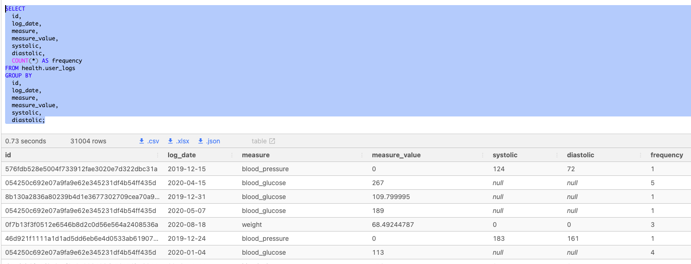
* Second Row would categorize as a duplicate row due to that row having 5 entries in the table in which all columns grouped together returned the same result/row

---

<br>

## Single Column Frequency Counts
* Aggregate `COUNT` is being partitioned by the measure for the `GROUP BY` clause
* Window `OVER` function is being applied to each partitioned group
    * Initial number of grouped by count is multiplied by a 100 to create percentage (without return percentage of total = 1 (ex : 38692/43891 = 0.88154))
    * Frequency of the group (after being multiplied) is divided by the count of all the rows and performed `OVER` the return
    * Lastly, the `ROUND` function is performed on final result to return a percentage value rounded to the second decimal

```sql
SELECT
  measure,
  COUNT(*) AS frequency,
  ROUND(
    100 * COUNT(*) / SUM(COUNT(*)) OVER (),
    2
  ) AS measure_percentage
FROM health.user_logs
GROUP BY measure
ORDER BY frequency DESC;
```
|measure|frequency|measure_percentage|
|-----|-------|--------|
|blood_glucose|38692|88.15|
|weight|2782|6.34|
|blood_pressure|2417|5.51|

---

<br>

## Summary Statistics
* Use of `MIN`, `MAX`, `AVG`, `MODE`, `STDEV`, `VARIANCE` functions to obtain  statistical value for column's (ex : measure_value) common summary stats
* Median is obtained by using `PERCENTILE_CONT` on the `ORDER BY` group (column)
    * As function returns float, `CAST`'ing as `NUMERIC` makes the return value compatible for the `ROUND` function performed 
```sql
SELECT
  'weight' AS measure,
  ROUND(MIN(measure_value), 2) AS minimum_value,
  ROUND(MAX(measure_value), 2) AS maximum_value,
  ROUND(AVG(measure_value), 2) AS mean_value,
  ROUND(
    -- this function actually returns a float which is incompatible with ROUND!
    -- we use this cast function to convert the output type to NUMERIC
    CAST(PERCENTILE_CONT(0.5) WITHIN GROUP (ORDER BY measure_value) AS NUMERIC),
    2
  ) AS median_value,
  ROUND(
    MODE() WITHIN GROUP (ORDER BY measure_value),
    2
  ) AS mode_value,
  ROUND(STDDEV(measure_value), 2) AS standard_deviation,
  ROUND(VARIANCE(measure_value), 2) AS variance_value
FROM health.user_logs
WHERE measure = 'weight';
```
|measure|minimum_value|maximum_value|mean_value|median_value|mode_value|standard_deviation|variance_value|
|-----|-------|--------|------|--------|--------|-------|------|
|weight|0.00|39642120.00|28786.85|75.98|68.49|1062759.55|1129457862383.41

---

<br>

## Check Cumulative Distributions
* `WITH` denotes our `CTE - Common Table Expression` that is subsequently being queried 
    * `NTILE` creates **#** of buckets for column to be grouped in (AKA percentile) that row assigns to
        * Common to also use **Deciles** `NTILE(10)` to group a row's column value as a percent in a total distribution
    * `OVER` Window function to perform the bucketing Over Result
* Query CTE **'percentile_values'**
    * Initially we're grouping by the percentile to perform a quick statistical view on each of our buckets (Query Origin/Reason) - `GROUP BY percentile` : query is grouping/aggregating all rows for that bucketed/percentile value
    * `MIN`, `MAX`, `COUNT` used to get representatitve view for each buckets summary stats
    * `ORDER BY` for percentile default ordering of `ASC` to show lower percentiles first
```sql
WITH percentile_values AS (
  SELECT
    measure_value,
    NTILE(100) OVER(
      ORDER BY 
        measure_value
    ) AS percentile
    FROM health.user_logs
    WHERE measure = 'weight'
)
SELECT 
  percentile,
  COUNT(*) AS percentile_counts,
  MIN(measure_value) AS floor_value,
  MAX(measure_value) AS ceil_value,
  ROUND(AVG(measure_value), 2) AS mean_value,
  ROUND(STDDEV(measure_value), 2) AS percentile_stdev,
  ROUND(VARIANCE(measure_value),2) AS percentile_var
FROM percentile_values
GROUP BY percentile
ORDER BY percentile;
```
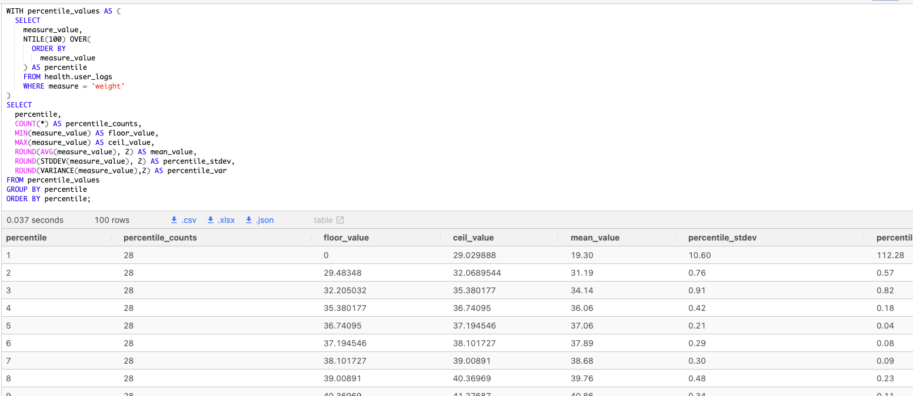

<br>

### Range Distribution
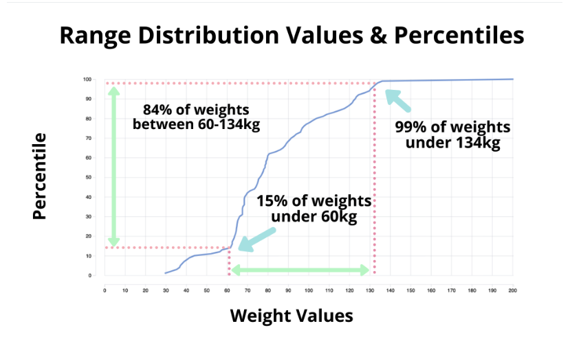

---

<br> 

## Investigate Outliers

<br>

### Large Outlier Checking
* Using 100th percentile (ceiling grouped measure_values) we can look into how the values stack up in the same percentile with the various ranking methods 
  * [`ROW_NUMBER`, `RANK`, `DENSE_RANK` ]
* **ROW_NUMBER**
    + Abritrarily picking "rank" based on how data is stored for equal values
    + See how same measure value for first two rows were given different ranks besides same measure_value being ranked by
* **RANK**
    + One rank per measure (Same measures share highest unused rank)
    + Equal ranked measures will hold subsequent ranks but be categorized as the highest unique rank
    + (Think Golf here for tied for 2nd could be held by 3 other gophers!)
    + Due to this, particular ranks can be skipped as can be seen at the bottom and top of the table image below
* **DENSE_RANK**
    + Grouped by rank should measure values be equal
    + Various equal measures can have the same rank unlike **ROW_NUMBER**
    + No ranks are skipped and count of grouped ranks has no impact on classifying (Ex : Multiple people sharing first but a second place `DENSE RANK` still existing for third measure value below)
* Using the **Variance** & **Stdev** results from the percentiles above would also allow a quick insight to the distribution for the top/bottom percentiles (see top row for 1st percentile in SS above with a much larger standard deviation)

```sql
WITH percentile_values AS (
  SELECT
    measure_value,
    NTILE(100) OVER (
      ORDER BY
        measure_value
    ) AS percentile
  FROM health.user_logs
  WHERE measure = 'weight'
)
SELECT
  measure_value,
  ROW_NUMBER() OVER (ORDER BY measure_value DESC) as row_number_order,
  RANK() OVER (ORDER BY measure_value DESC) as rank_order,
  DENSE_RANK() OVER (ORDER BY measure_value DESC) as dense_rank_order
FROM percentile_values
WHERE percentile = 100
ORDER BY measure_value DESC;
```
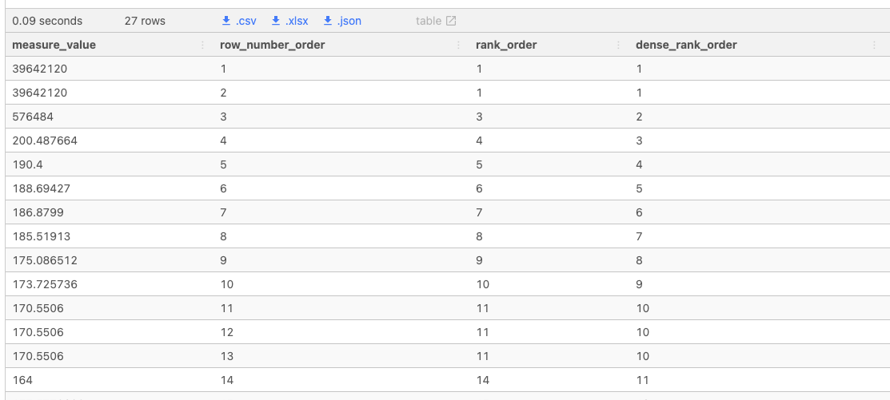


<br>

### Small Outlier Detection
* See above for related detail on ranking and review summary stats returns for particular percentiles to sniff out outliers
```sql
WITH percentile_values AS (
  SELECT
    measure_value,
    NTILE(100) OVER (
      ORDER BY
        measure_value
    ) AS percentile
  FROM health.user_logs
  WHERE measure = 'weight'
)
SELECT
  measure_value,
  ROW_NUMBER() OVER (ORDER BY measure_value) as row_number_order,
  RANK() OVER (ORDER BY measure_value) as rank_order,
  DENSE_RANK() OVER (ORDER BY measure_value) as dense_rank_order
FROM percentile_values
WHERE percentile = 1
ORDER BY measure_value;
```
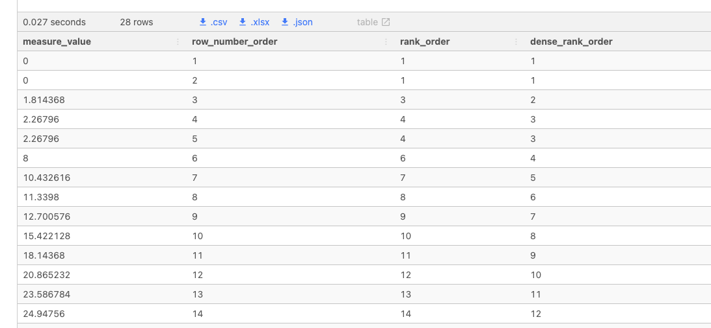

---

<br>

## Remove Outliers & Leverage (Temp Tables)
* Using the measure_value percentiles snapshot above, we can determine that the top percentile has 3 outliers above 201 that we'd like to remove from the distribution to evaluate again after removing
* The lower percentile should be double checked as there are some low values pulling that bucketed distribution variance and stdev out but not egregious like the top percentile
* Standard to drop table (may not exist and return error : not to worry!), create the temp table and then a cumulative distribution can be stored for a particular area of interest in the temp table allowing for the distribution to be assessed

```sql
DROP TABLE IF EXISTS clean_weight_logs;
CREATE TEMP TABLE clean_weight_logs AS (
  SELECT *
  FROM health.user_logs
  WHERE measure = 'weight'
    AND measure_value > 0
    AND measure_value < 201
);
WITH clean_weight_percentile AS (
  SELECT
    measure_value,
    NTILE(100) OVER (
      ORDER BY 
        measure_value
    ) AS clean_percentile
    FROM clean_weight_logs
)
-- Let's look at top percentile reference for now to ensure the outliers are gone
SELECT 
  measure_value,
  clean_percentile
FROM clean_weight_percentile
WHERE clean_percentile = 100
ORDER BY measure_value DESC
LIMIT 10;
```
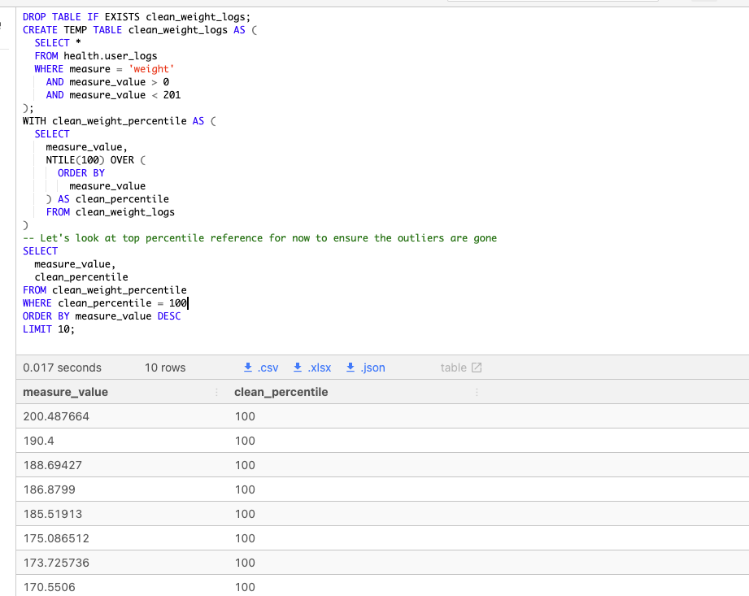

---

<br>

## Frequency Distribution
* Use of `WIDTH_BUCKET` SQL Function divides the distribution (column values) into equal width buckets
* Each bucket has an equal size/interval
  * The Frequency or count in the bucket will differ but that bucket's size of the distribution's value will be ~ equal
* The function takes 
  * The column (ex : measure_value)
  * Min of the column
  * Max of the column
  * Number of buckets
* Apply the `WIDTH_BUCKET` function to create equally spaced buckets to create the data input for a histogram chart

```sql
SELECT
  WIDTH_BUCKET(measure_value, 0, 200, 50) AS bucket,
  AVG(measure_value) AS avg_bucket_value,
  MIN(measure_value) AS min_bucket_value,
  MAX(measure_value) AS max_bucket_value,
  COUNT(*) AS frequency
FROM clean_weight_logs
GROUP BY bucket
ORDER BY bucket;
```
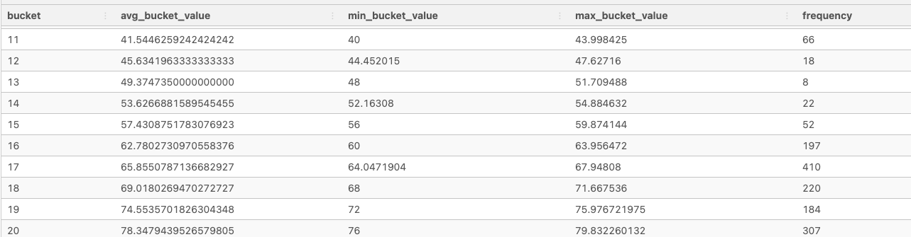

<br>

### Visualizations (Bucketing) - Thanks SQLPad!

### Configure
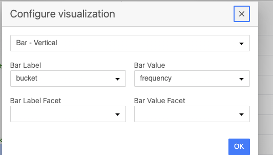
* Set Vertical Bar Viz to give x-axis to # of buckets
* Then set the outlay of histogram/count to the frequency for observed counts in that bucket
* Vizual For this config shows each bucket on the x-axis and that bucket's total count in the y frequency axis

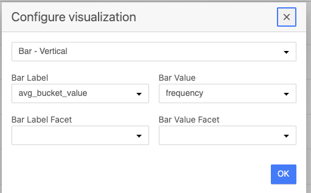
* Set Bar Label (X-axis) as Avg Bucket Value (Bucket Label lost but the value in bucket now on x-axis)
* Similar to above, set frequency to that bar value to see Count
* This will give details about the histogram's bucket avg value 

<br>

### Histograms
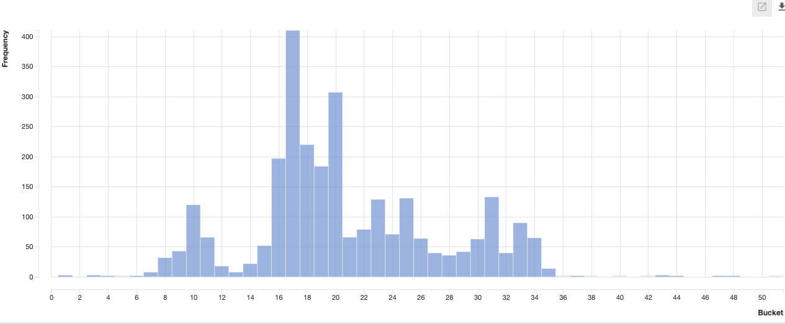
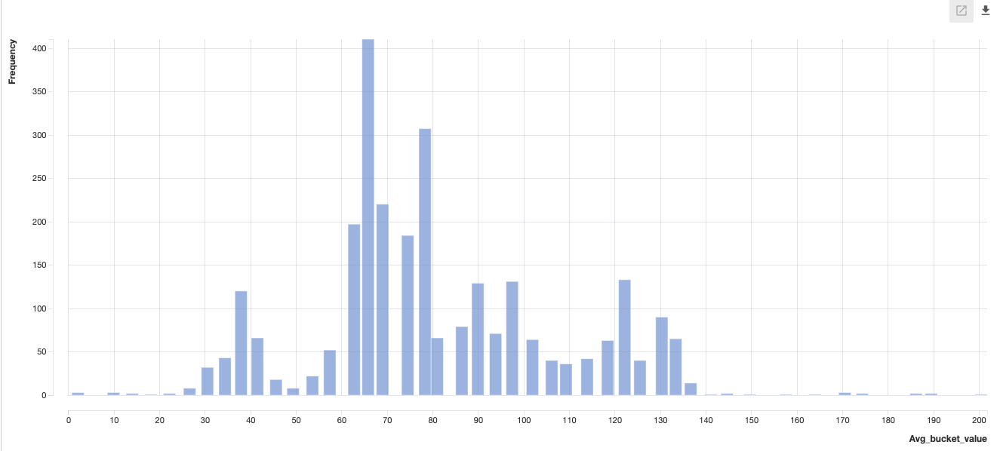
