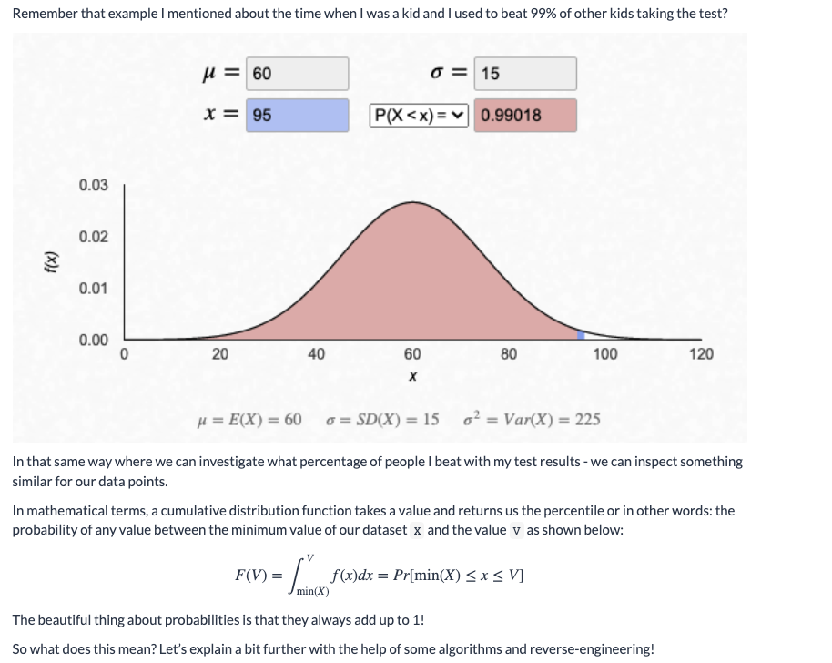
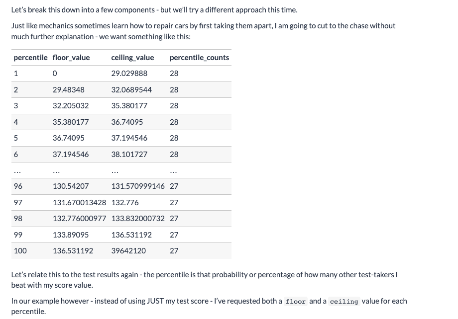
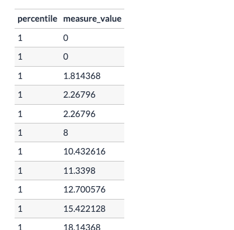
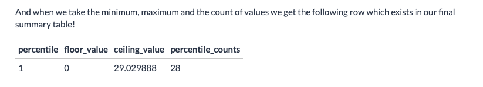
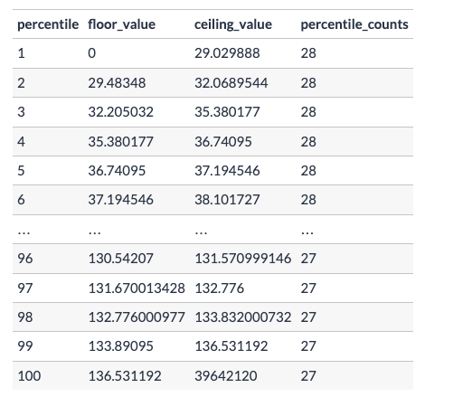

# Distribution Functions

## Beyond Summary Stats

* A quick reminder here on the Summary Statistics query evaluated at the end of the previous lesson

```sql
SELECT
  ROUND(MIN(measure_value), 2) AS minimum_value,
  ROUND(MAX(measure_value), 2) AS maximum_value,
  ROUND(AVG(measure_value), 2) AS mean_value,
  ROUND(
    -- this function actually returns a float which is incompatible with ROUND!
    -- we use this cast function to convert the output type to NUMERIC
    CAST(PERCENTILE_CONT(0.5) WITHIN GROUP (ORDER BY measure_value) AS NUMERIC),
    2
  ) AS median_value,
  ROUND(
    MODE() WITHIN GROUP (ORDER BY measure_value),
    2
  ) AS mode_value,
  ROUND(STDDEV(measure_value), 2) AS standard_deviation,
  ROUND(VARIANCE(measure_value), 2) AS variance_value
FROM health.user_logs
WHERE measure = 'weight';
```

| minimum_value | maximum_value | mean_value | median_value | mode_value | standard_deviation| variance_value
|---|----|-----|------|-----|-----|----| 
|0.00|39642120.00|28786.85|75.98|68.49|1062759.55|1129457862383.41|

<br>

### A few questions come to mind straightaway (I hope!):
*   Does it make sense to have such low minimum values and such a high value?
*   Why is the average value 28,786kg but the median is 75.98kg?
*   The standard deviation of values is WAY too large at 1,062,759kg
*   This leads us to the next question - what the heck do you do when the summary statistics is clearly telling you that something is dodgy with your data?

In this following section I am going to introduce you to your new best friend:
**cumulative distribution function**

<br>

# Cumulative You Say?
* In mathematical terms, a cumulative distribution function takes a value and returns us the percentile or in other words: the probability of any value between the minimum value of our dataset
* The beautiful thing about probabilities is that they always add up to 1!




* So what does this mean? Let’s explain a bit further with the help of some algorithms and reverse-engineering!

<br>

____

## Reverse Engineering

#### Type Distribution Sought 



<br>

    Percentile : represents a bottom (first table row is bottom 1%)
    Floor_value : represents a min type y_value
    Ceiling_value : represents a max value observed for percentile
    Percentile_counts : count of observed points in percentile


<br>

___

## Algorithmic Thinking

Now that we know the endpoint of our analysis - let’s work from the bottom up to design an algorithm to make this output happen!

1. Order all of the values from smallest to largest
    In your mind imagine all of those weight data points and line them up from smallest to largest
2. Split them into 100 equal buckets - and assign a number from 1 through to 100 for each bucket
    + We often refer to this as bucketing or to use the actual function name NTILE-ing a data input - these bucket values are also your percentiles!
    + When we split out sorted dataset into 100 buckets - we have effectively generated our new “groups” or buckets of data to continue with our algorithm.
    + If you think about this carefully - you’ll notice that each bucket should have 1% of the total number of records from the entire dataset!
    + How many records did we have again for `measure = 'weight'`? Does our 1% of values make sense in this case?
    ```sql 
        SELECT
        COUNT(*)
        FROM health.user_logs
        WHERE measure = 'weight';
    ```
    |count|
    |----|
    2782

3. For each bucket:
    + calculate the minimum value and the maximum value for the ceiling and floor values
    + count how many records there are

<br>

#### Example Percentile
* For example say we look at the smallest 1% worth of data sorted by measure value with that percentile value attached:



* Truncated a bit but see below for further detail



4. Combine all the aggregated bucket results into a final summary table



<br>

___

## SQL Implementation
So how do we do this in SQL?

We can complete all those algorithm steps in a single query because SQL is really awesome like that.

Everything below we’ve seen before except for the new `NTILE` window function and the `OVER` and `ORDER BY` components of analytical functions - this is something which we will cover in much more depth in the next case study section of Serious SQL so for now, don’t worry too much about understanding the details of these things!

* So let’s break down our algorithm steps through the SQL components:

### Order and Assign
1. Order all of the weight measurements values smallest to largest
2. Split them into 100 equal buckets - and assign a number from 1 through to 100 for each bucket

* We can actually achieve both of these algorithmic steps in a single bit of SQL functionality with the all-powerful **analytical function**
    + Window functions `OVER()` are analytical functions

Firstly the `OVER` and `ORDER BY` clauses in the following query help us re-order the dataset by the `measure_value column` - it sorts by ascending order by default


