# Distribution Functions

## Beyond Summary Stats

* A quick reminder here on the Summary Statistics query evaluated at the end of the previous lesson

```sql
SELECT
  ROUND(MIN(measure_value), 2) AS minimum_value,
  ROUND(MAX(measure_value), 2) AS maximum_value,
  ROUND(AVG(measure_value), 2) AS mean_value,
  ROUND(
    -- this function actually returns a float which is incompatible with ROUND!
    -- we use this cast function to convert the output type to NUMERIC
    CAST(PERCENTILE_CONT(0.5) WITHIN GROUP (ORDER BY measure_value) AS NUMERIC),
    2
  ) AS median_value,
  ROUND(
    MODE() WITHIN GROUP (ORDER BY measure_value),
    2
  ) AS mode_value,
  ROUND(STDDEV(measure_value), 2) AS standard_deviation,
  ROUND(VARIANCE(measure_value), 2) AS variance_value
FROM health.user_logs
WHERE measure = 'weight';
```

| minimum_value | maximum_value | mean_value | median_value | mode_value | standard_deviation| variance_value
|---|----|-----|------|-----|-----|----| 
|0.00|39642120.00|28786.85|75.98|68.49|1062759.55|1129457862383.41|

<br>

### A few questions come to mind straightaway (I hope!):
*   Does it make sense to have such low minimum values and such a high value?
*   Why is the average value 28,786kg but the median is 75.98kg?
*   The standard deviation of values is WAY too large at 1,062,759kg
*   This leads us to the next question - what the heck do you do when the summary statistics is clearly telling you that something is dodgy with your data?

In this following section I am going to introduce you to your new best friend:
**cumulative distribution function**

<br>

# Cumulative You Say?
* In mathematical terms, a cumulative distribution function takes a value and returns us the percentile or in other words: the probability of any value between the minimum value of our dataset
* The beautiful thing about probabilities is that they always add up to 1!

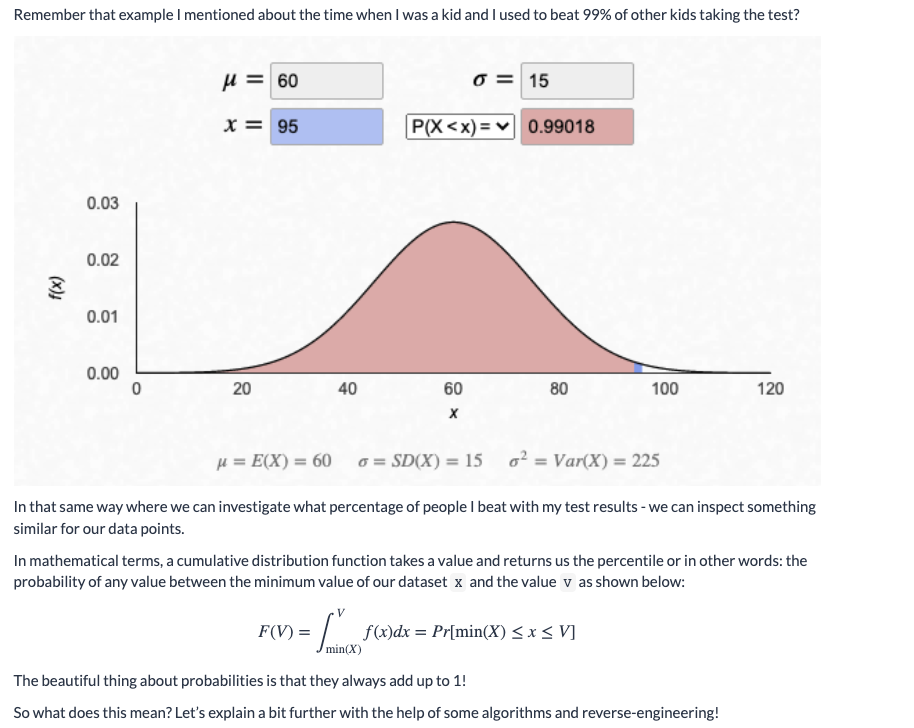


* So what does this mean? Let’s explain a bit further with the help of some algorithms and reverse-engineering!

____

<br>

## Reverse Engineering

#### Type Distribution Sought 

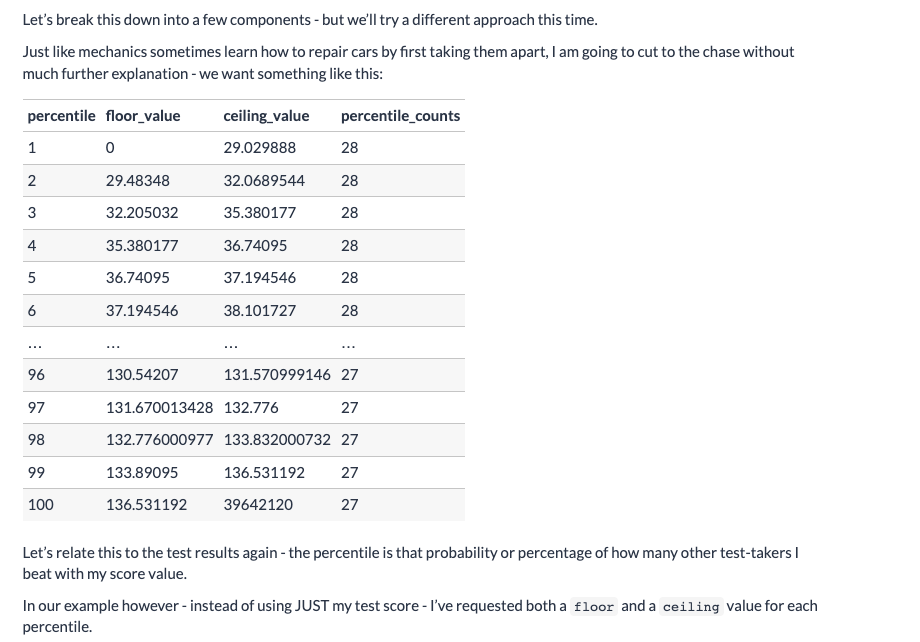

<br>

    Percentile : represents a bottom (first table row is bottom 1%)
    Floor_value : represents a min type y_value
    Ceiling_value : represents a max value observed for percentile
    Percentile_counts : count of observed points in percentile
___

<br>

## Algorithmic Thinking

Now that we know the endpoint of our analysis - let’s work from the bottom up to design an algorithm to make this output happen!

1. Order all of the values from smallest to largest
    In your mind imagine all of those weight data points and line them up from smallest to largest
2. Split them into 100 equal buckets - and assign a number from 1 through to 100 for each bucket
    + We often refer to this as bucketing or to use the actual function name NTILE-ing a data input - these bucket values are also your percentiles!
    + When we split out sorted dataset into 100 buckets - we have effectively generated our new “groups” or buckets of data to continue with our algorithm.
    + If you think about this carefully - you’ll notice that each bucket should have 1% of the total number of records from the entire dataset!
    + How many records did we have again for `measure = 'weight'`? Does our 1% of values make sense in this case?
    ```sql 
        SELECT
        COUNT(*)
        FROM health.user_logs
        WHERE measure = 'weight';
    ```
    |count|
    |----|
    2782

3. For each bucket:
    + calculate the minimum value and the maximum value for the ceiling and floor values
    + count how many records there are

<br>

#### Example Percentile
* For example say we look at the smallest 1% worth of data sorted by measure value with that percentile value attached:

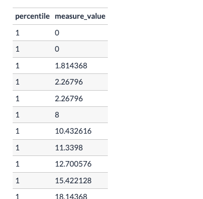

* Truncated a bit but see below for further detail

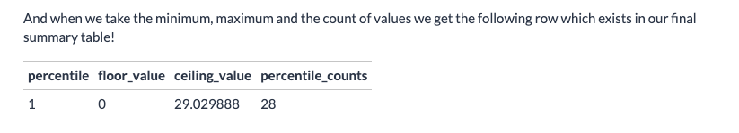

4. Combine all the aggregated bucket results into a final summary table

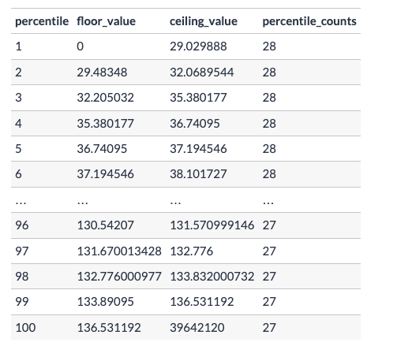

___

<br>

## SQL Implementation
So how do we do this in SQL?

We can complete all those algorithm steps in a single query because SQL is really awesome like that.

Everything below we’ve seen before except for the new `NTILE` window function and the `OVER` and `ORDER BY` components of analytical functions - this is something which we will cover in much more depth in the next case study section of Serious SQL so for now, don’t worry too much about understanding the details of these things!

* So let’s break down our algorithm steps through the SQL components:

### Order and Assign
1. Order all of the weight measurements values smallest to largest
2. Split them into 100 equal buckets - and assign a number from 1 through to 100 for each bucket

* We can actually achieve both of these algorithmic steps in a single bit of SQL functionality with the all-powerful **analytical function**
    + Window functions `OVER()` are analytical functions

**Firstly** the `OVER` and `ORDER BY` clauses in the following query help us re-order the dataset by the `measure_value` column - it sorts by ascending order by default
    + `ORDER BY` is instructing the `NTILE` function to assign a value from 1-100 for the percentile a observation **"buckets"** under for the measure_value weight cumulative distribution visualization we want to eventually perform

**Then** the `NTILE` window function is used to perform the assignment of numbers 1 through 100 for each row in the records for each measure_value

```sql
SELECT
  measure_value,
  NTILE(100) OVER (
    ORDER BY
      measure_value
  ) AS percentile
FROM health.user_logs
WHERE measure = 'weight'
```

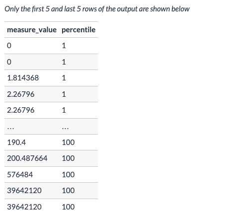

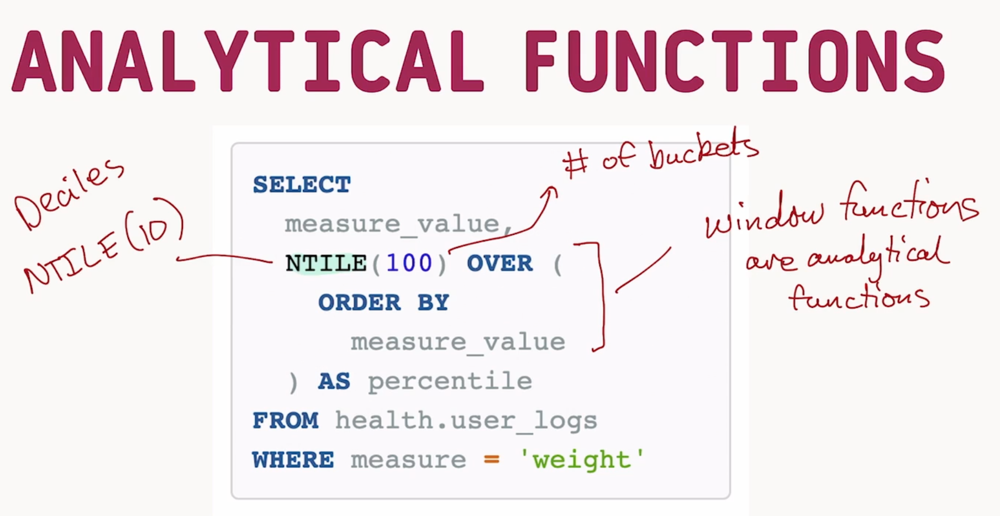

<br>

#### Individual Row Measure Percentiles to Aggregate Groups
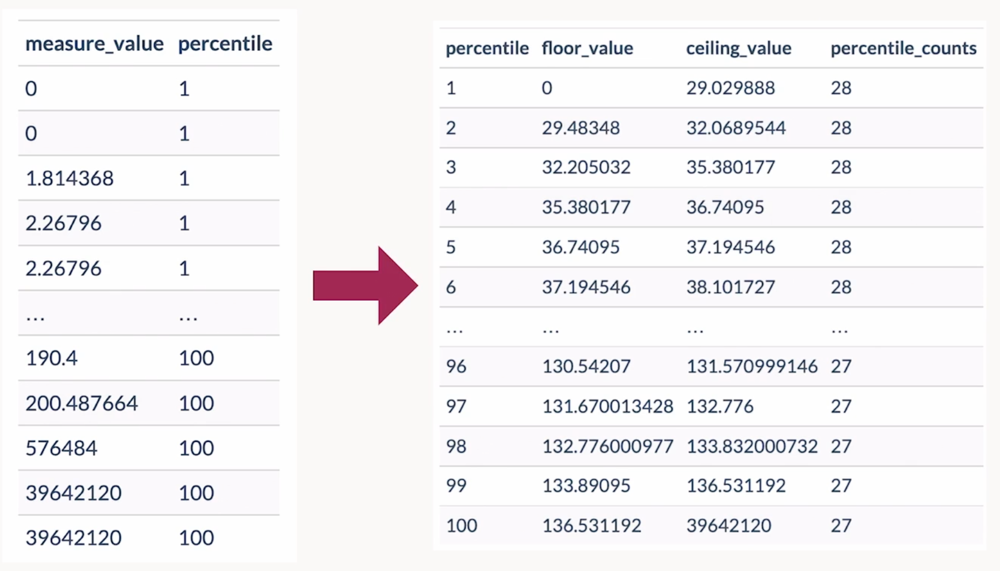

<br>

### Bucket Calculations

3. For each bucket:
    + calculate the minimum value and the maximum value for the ceiling and floor values
    + count how many records there are

Since we now have our percentile values and our dataset is split into 100 buckets - we can simply use a `GROUP BY` on the **percentile column** from the previous table to calculate our `MIN` and `MAX` measure_value ranges for each bucket and also the `COUNT` of records for the percentile_counts field.

* We can also use the previous query in a CTE so we can pull all the calculations in a single SQL query:

```sql
WITH percentiles as (
    SELECT
        measure_value,
        NTILE(100) OVER(
            ORDER BY measure_value
        ) AS percentile
    FROM health.user_logs
    WHERE measure = 'weight'
)
SELECT 
    percentile,
    MIN(measure_value) AS floor_value,
    MAX(measure_value) AS ceiling_value,
    COUNT(percentile) AS percentile_counts
FROM percentiles
GROUP BY percentile
ORDER BY percentile;
```
<br>

#### Cumulative Distribution Function Table Result from SQL Implementation

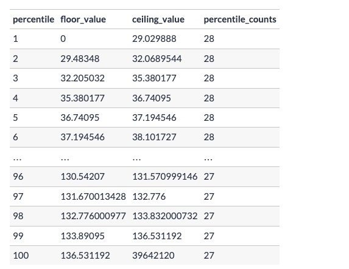

___

<br>

## What Do I Do With This?

So you’re probably asking yourself - ok cool…so what do I do with this cumulative distribution table then?
The first place to take a careful look at is the tails of the values - namely `percentile = 1` and `percentile = 100`

* What do you notice from these two rows alone?
* Min/Max (**Outliers**) is what we're looking for
* Do tail ends (1......100) contain any **outliers????** (extreme values)

|percentile|floor_value|ceiling_value|percentile_counts|
|----|-------|-----|------|
|1|0|29.02988|28|
|100|136.531192|39642120|27|

<br>

So from first glance you get the following insights right away:

1. 28 values lie between 0 and ~29KG
2. 27 values lie between 136.53KG and 39,642,120KG

Please tell me that you don’t think insight number 2 is normal - unless you’re a GIANT!

Let’s dive a little bit deeper and start thinking critically about what these insights mean.

___

<br>

## Let's Think About This

Ok - firstly we need to consider what the data point is that we’re actually using here - in this case, it is a weight value in KG units.

When we think of those small values in the 1st percentile under 29kg, a few things should come to mind:

1. Maybe there were some incorrectly measured values - leading to some 0kg weight measurements
2. Perhaps some of the low weights under 29kg were actually valid measurements from young children who were part of the customer base


* For the `100th` percentile we could consider:
    + Does that 136KG floor value make sense?
    + How many error values were there actually in the datasetet


#### Let’s first inspect that 1st and 100th percentile values carefully and inspect each value to see what happened!

<br>

## Ranking Functions
+ **ROW_NUMBER**
    + Abritrarily picking "rank" based on how data is stored for equal values
+ **RANK**
    + One rank per measure 
    + Equal ranked measures will hold subsequent ranks but be categorized as the highest unique rank
    + (Think Golf here for tied for 2nd could be held by 3 other gophers!)
+ **DENSE_RANK**
    + Grouped by rank should measure values be equal
    + Various equal measures can have the same rank unlike **RANK**

### Ranking Podium Visualization
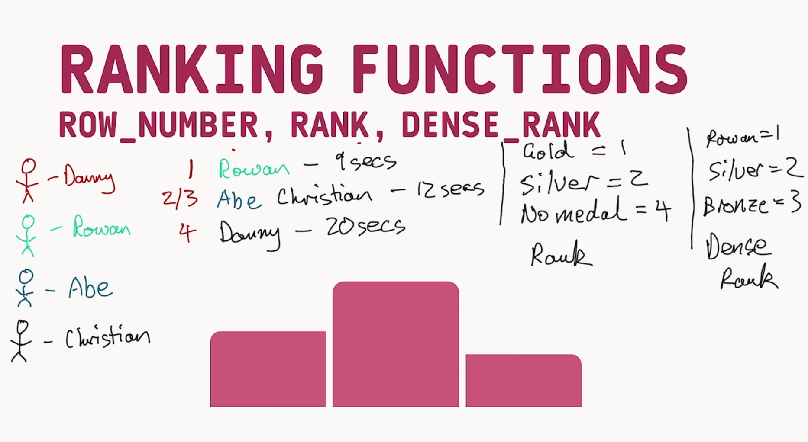
* **ROW_NUMBER** is the value in **<span style="color : #D0021B">RED</span>** next to the finishes column showing the unique rank despite equally ranked measures 
* **RANK** is the column highlighted
* **DENSE_RANK** Furthest right column showing grouped like rankings for multiple equal ranks

The key is to differentiate between what happens when there are **ties** between values - in particular for the `RANK` and `DENSE_RANK` functions

<br>

#### SQL Implementation
```sql
WITH percentile_values AS (
  SELECT
    measure_value,
    NTILE(100) OVER (
      ORDER BY
        measure_value
    ) AS percentile
  FROM health.user_logs
  WHERE measure = 'weight'
)
SELECT
  measure_value,
  -- these are examples of window functions below
  ROW_NUMBER() OVER (ORDER BY measure_value DESC) as row_number_order,
  RANK() OVER (ORDER BY measure_value DESC) as rank_order,
  DENSE_RANK() OVER (ORDER BY measure_value DESC) as dense_rank_order
FROM percentile_values
WHERE percentile = 100
ORDER BY measure_value DESC;
```

### Visual Table Ranking Differences
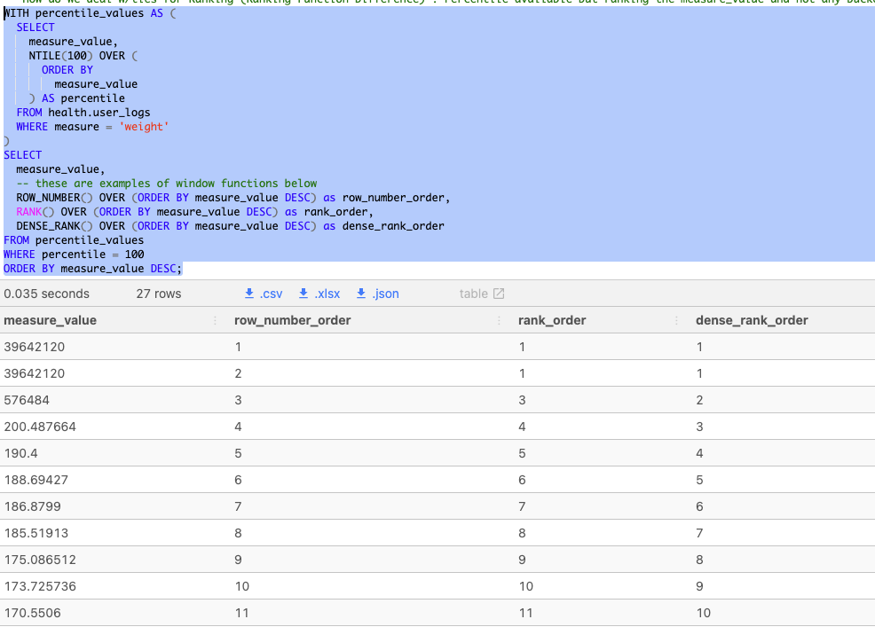

<br>

---

## Back to Outliers
### Tails
|percentile|floor_value|ceiling_value|percentile_counts|
|----|-------|-----|------|
|1|0|29.02988|28|
|100|136.531192|39642120|27|

<br>

The ceiling value rankings for the 100th percentile is .. not right. We can use a `temp table` here to see how our distribution may change without our extreme 100th percentile outliers. We can also use the result output below with the ranking to see the extreme difference between our ranked measure_values `RANK` at position 4. How would it look without these three??

### Remove Outliers
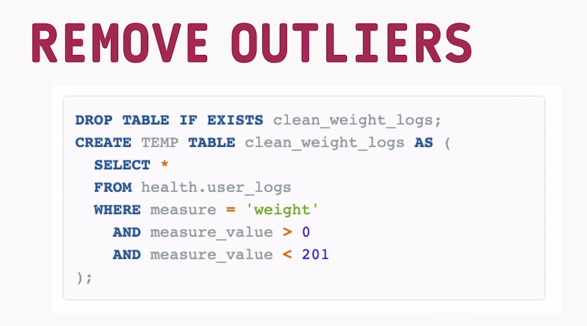

<br>

### SQL Implementation
```sql
-- We have a few sizable looking outliers. Let's see how our percentiles look now
-- Temp Table First
DROP TABLE IF EXISTS clean_weight_logs;
CREATE TEMP table clean_weight_logs AS (
  SELECT * 
  FROM health.user_logs
  WHERE measure = 'weight'
    AND measure_value BETWEEN 1 AND 201
);

-- New CTE from temp table
WITH clean_weight_percentiles AS (
  SELECT
    measure_value,
    NTILE(100) OVER (
      ORDER BY measure_value
    ) AS clean_percentile
  FROM clean_weight_logs
)
-- Updated Distribution
SELECT
  clean_percentile,
  MIN(measure_value) AS floor_value,
  MAX(measure_value) AS ceil_value,
  COUNT(clean_percentile) AS clean_percent_counts
FROM clean_weight_percentiles
GROUP BY clean_percentile
ORDER BY clean_percentile DESC;
```
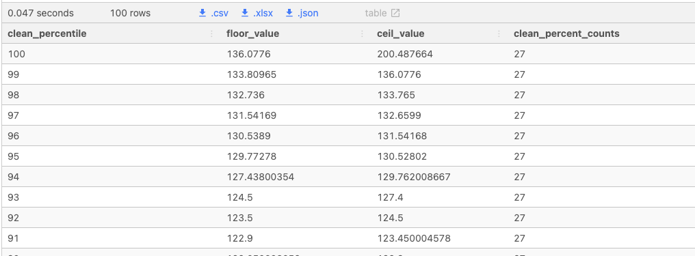

<br>

___

## Visualization(s)?
* Using SQLPad we can also make a visualization to help us predict weight values and their associated percentage to help us infer our distribution 

<br>

### 80th Percentile 
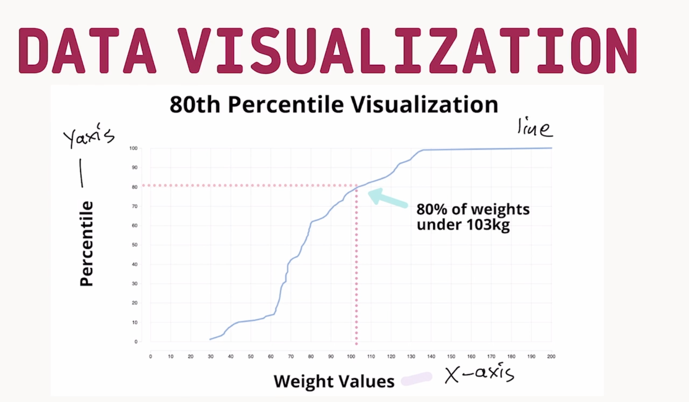

### Median 
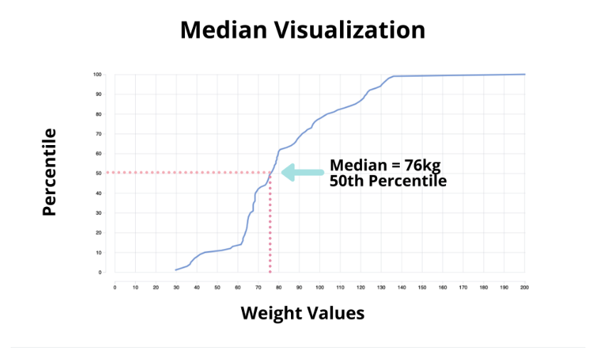

### Range Distribution
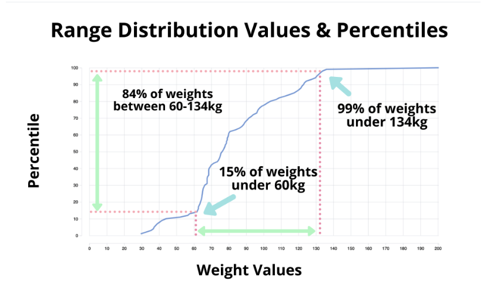

<br>

### SQLPAD Visualization

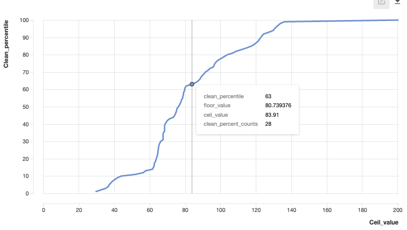

<br>


___

<br>

## Histograms .. Another Viz!

### How to Think about our Histogram/Frequency Plot
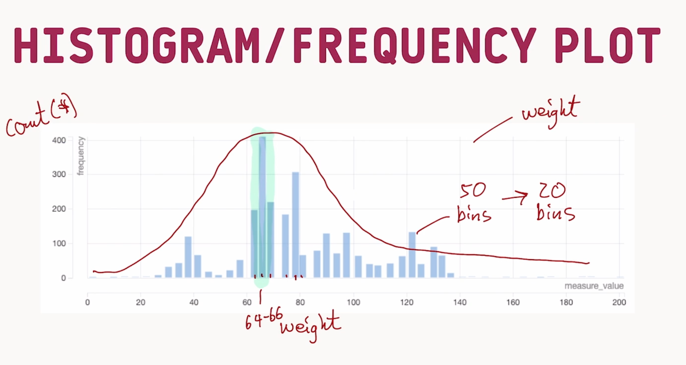

### Hist Defined
A histogram is essentially trying to mimic this bell curve but instead of having a smooth line only - we will have vertical bars that represent some range of the X-axis and the Y-value or the height of the bar will represent how many records exist in that range.

### Histogram Targets
1. Find the min, max boundary values
2. Split into N equal buckets by values
3. For each bucket:
    * Calculate the average value
    * Calculate record count

<br>

### WIDTH_BUCKET FUNCTION
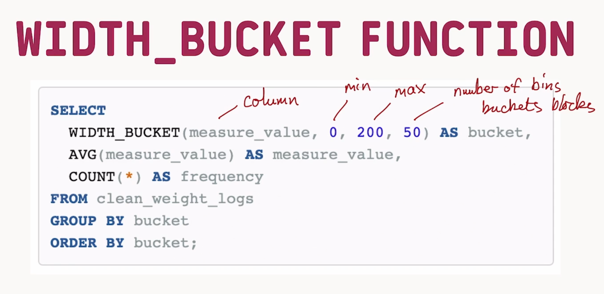

### SQL Implementation
* In PostgreSQL we have a WIDTH_BUCKET function that helps us split the range of values into a number of buckets we would like.

```sql
SELECT
  WIDTH_BUCKET(measure_value, 0, 200, 50) AS bucket,
  -- Avg measure of all weights in respective bucket : bucket mean
  AVG(measure_value) AS measure_value,
  COUNT(*) AS frequency
FROM clean_weight_logs
GROUP BY bucket
ORDER BY bucket;
```
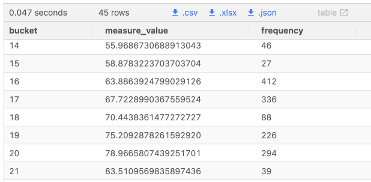
* Notice that large spike of frequencies around our observed mean for the clean weight temp table

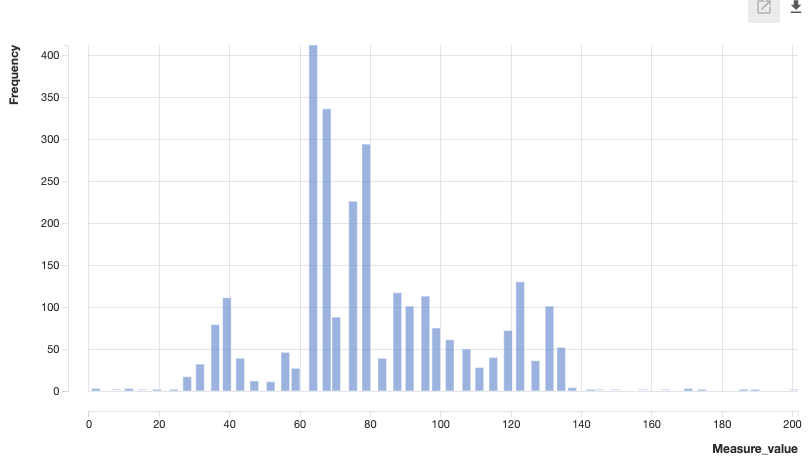
* Our observed **measure_value** "weight" is on the x-axis
* The **Frequency** is the equivalent of the COUNT(*) run on that particular buckets giving you a total observed values in that weight bucket

<br>

___

<br>

### Closing Remarks
So this has been a long tutorial and you might be wondering why we took such a long roundabout way to cover the `cumulative distributions` first before going straight to a histogram. To answer these queries - I pose a few questions of my own for you to think about as we close this session:

1. How would the histogram chart look if we didn’t remove any outliers?
2. How would you have found the outliers without inspecting the percentiles?
3. How can you determine the percentiles if you only had the frequency values from the histogram?

These two tools of `cumulative distribution functions` and the `frequency histogram` are really important for different reasons and each should be part of your data exploration toolbox!

<br>

___

<br>

### Quick Summary
* Mathematical representation of cumulative distribution functions and their SQL implementation
* Reverse engineer a table output using the `NTILE` function and generate a cumulative distribution output
* Apply critical thinking to accurately detect outliers in the upper and lower ranges of a column by inspecting the ordered top and bottom percentile values
* Inspected the difference between `ROW_NUMBER`, `RANK` and `DENSE_RANK` window functions
* Treat outliers in a dataset by applying a WHERE filter and creating a temporary table for further data analysis
* Generate new `summary statistics` and a `final cumulative distribution` function output with a treated dataset cleaned of outliers
* Learned how to use SQLPad to create quick data visualizations for cumulative distribution function outputs
* Apply the `WIDTH_BUCKET` function to create equally spaced buckets to create the data input for a histogram chart
* Analyze various insights from cumulative distribution and frequency histrogram plots