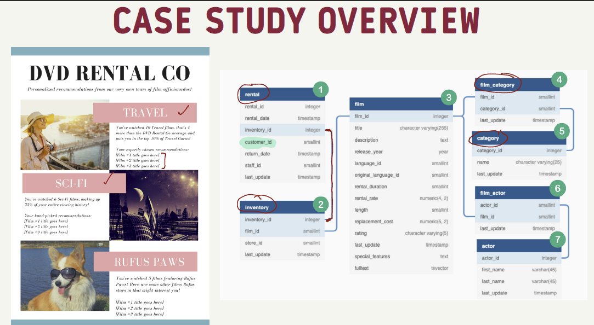
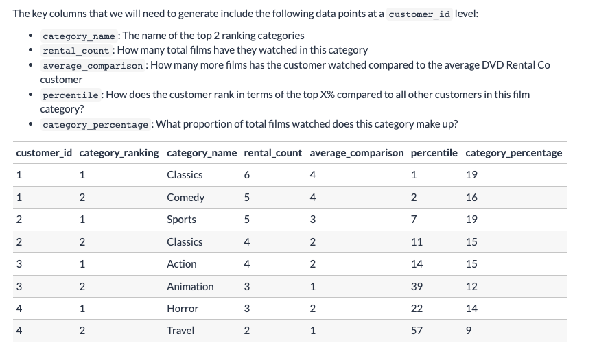
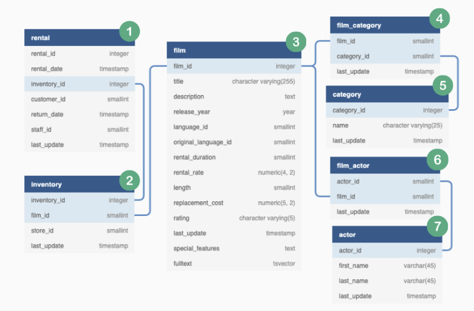
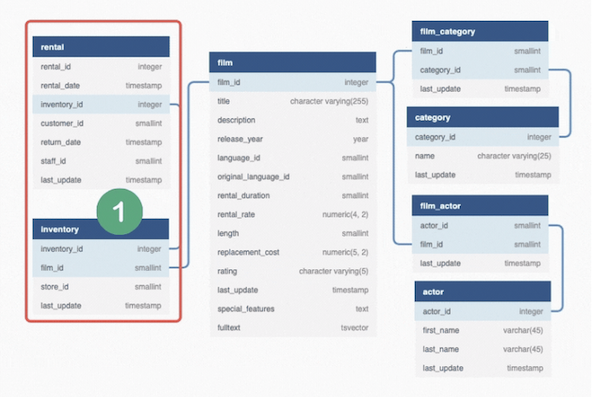
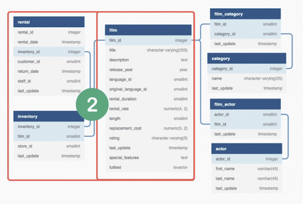
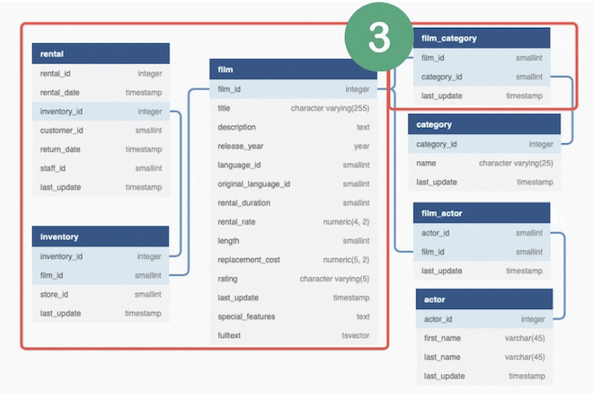
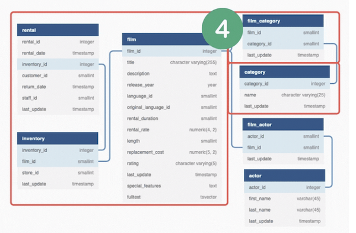
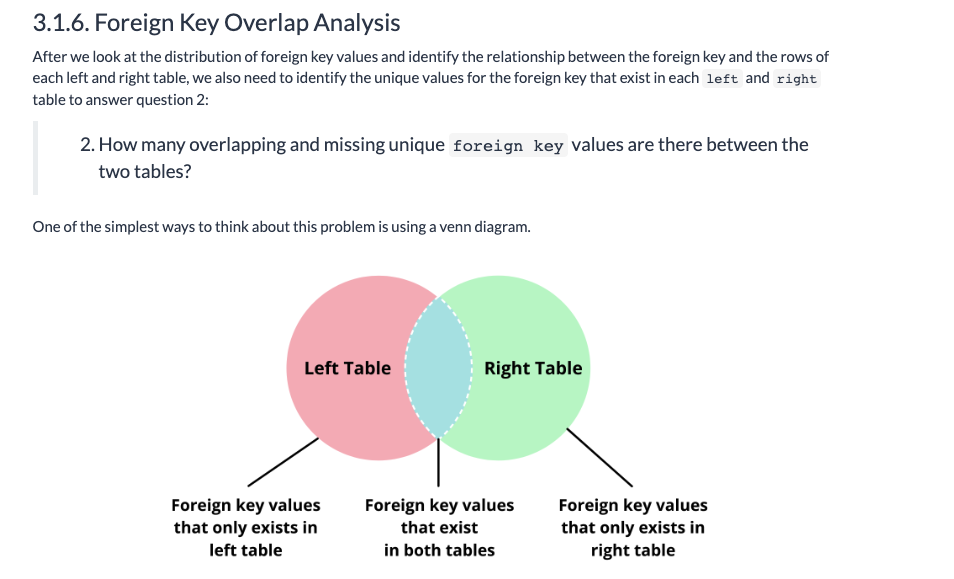
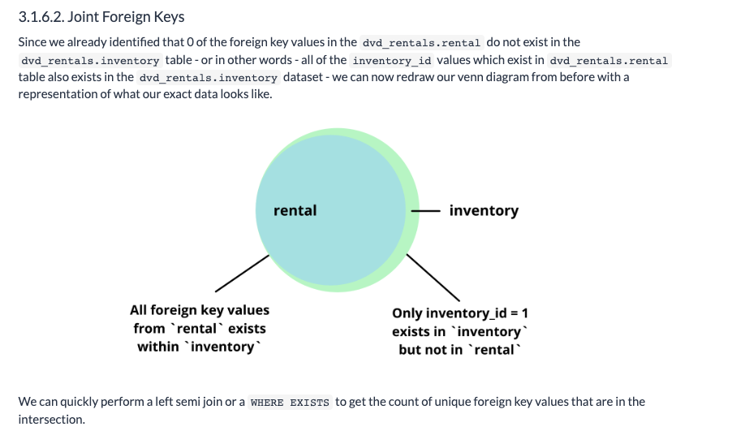
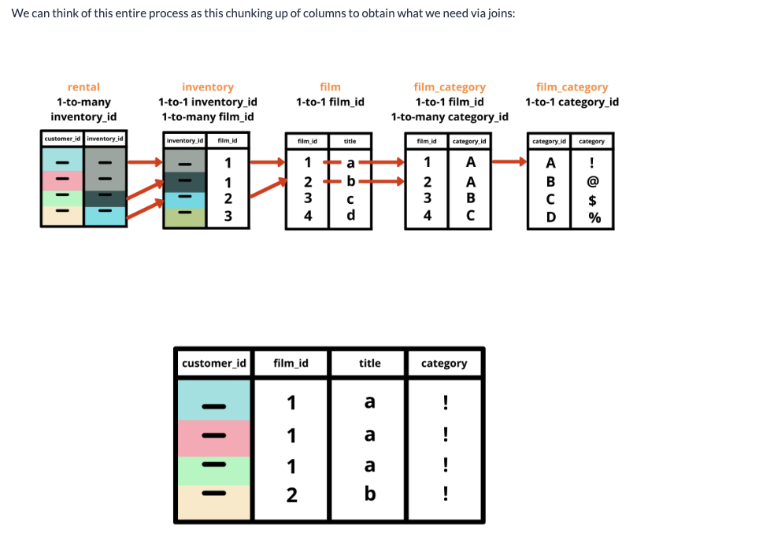

# Back to the Marketing Case Study ... 

## Case Study Overview
 

<br>

### Requirements
* Requirements lecture slides in class notes for (Week 7 PDFs)

1. Top 2 Movie Categories for each customer
2. Film Recommendations for top 2 categories
    * Max 3 Films Per Category
    * Must not have watch recommended films before
3. Individual customer Top Category insights
    * Number of films watched
    * Comparison to DVD Rental Co average
    * Top X% ranking
4. Individual customer 2nd category insights
    * Number of films watched
    * Percentage of viewing history
5. Favorite actor insights & recommendations
    * Number of films watched
    * Max 3 film recommendations
    * Previously watched & top 2 category recommendations must not be included!

<br>

---

<br>

## Design a Plan of Attack!
I’m sure you realize that we’re going to have to do some serious table joining in order to generate our data outputs for this case study.

The first thing we need to do is to design a plan of attack by systematically breaking down our required SQL outputs and inspecting exactly which columns we need from the various tables in our ERD.

To keep things simple - let’s first start off with the required SQL outputs for our top categories information.

<br>

### Define The Final State
As seen in the previous data overview tutorial, the top categories insight aims to generate the raw data points required to fill in the title and headline insights for the email template.

The key columns that we will need to generate include the following data points at a customer_id level:

* **category_name**: The name of the top 2 ranking categories
* **rental_count**: How many total films have they watched in this category
* **average_comparison**: How many more films has the customer watched compared to the   average DVD Rental Co customer
* **percentile**: How does the customer rank in terms of the top X% compared to all other customers in this film category?
* **category_percentage**: What proportion of total films watched does this category make up?




<br>

### Reverse Engineering
In the final table output - we can see that the `category_name`, `average_comparison`, `percentile` and `category_percentage` are going to need some intense SQL calculations to generate these outputs.

You might also notice that the `rental_count` value is actually used in all of the calculations:

The top 2 `category_name` values are included for each customer ID because we only sure the category rankings of 1 and 2 for each customer.

Additionally - the `average_comparison` and percentile is calculated across all customers at a category level in order to find that DVD Rental Co averagte.

And finally the `category_percentage` relates to the proportion of each top 2 category to each individual customer’s total number of films watched.

Clearly we can see this `rental_count` is going to be the key for our analysis - so let’s focus on the columns we’ll need to generate this all important value!

If we now remove all the dependent calculated columns: category_ranking, average_comparison, percentile and category_percentage - we are left with the following table (below snippet)

|customer_id|category_name|rental_count|
|-------|----------|--------|
|1|Classics|6|
|1|Comedy|5|
|2|Sports|5|
|2|Classics|4|

<br>

#### However - there is one more catch!
* Since we only have the top 2 categories for each customer in this specific table - how can we calculate those above fields which need to be compared against all customer and categories?
* In short - we need to include all of the categories for each customer otherwise we can’t make those calculations!
* Let’s take a look at all the category rental counts by customer_id and category_name for just customer_id = 1

|customer_id|category_name|rental_count|
|-------|----------|--------|
|1|Classics|6|
|1|Comedy|5|
|1|Drama|4|
|1|Sports|2|
|1|Action|2|
|1|Music|2|
|1|Animation|2|
|1|New|2|
|1|Sci-Fi|2|

<br>

Now if we take it back even one step further - you should notice that this is going to be some sort of aggregated query to generate this table - something along the lines of:

```sql
SELECT
  customer_id,
  category_name,
  COUNT(*) AS rental_count
FROM the_next_level_down
GROUP BY
  customer_id,
  category_name
```

<br>

... And Now if we were to go one level down and dream up what that granular table might look like - we should have which films a customer has watched and the `category_name` for each rental record: (snippet)

|customer_id|title|category_name|
|-------|----------|--------|
|1	|MINDS TRUMAN|	Action|
|1	|WOMEN DORADO|	Action|
|1	|DOORS PRESIDENT|	Animation|
|1	|BIKINI BORROWERS|	Animation|
|1	|PATIENT SISTER|	Classics|
|1	|MUSKETEERS WAIT|	Classics|
|1	|DETECTIVE VISION|	Classics|
|1	|FROST HEAD|	Classics|
|1	|JEEPERS WEDDING|	Classics|
|1	|PATIENT SISTER|	Classics|
|1	|FIREBALL PHILADELPHIA|	Comedy|
|1	|CLOSER BANG|	Comedy|
|1	|FIREBALL PHILADELPHIA|	Comedy|

<br>

#### Reminder
* This is just for customer_id = 1 but if we generate this same dataset for each customer - we should be ok to generate all of the previously reverse engineered steps further up in this tutorial!

<br>

### Identify Key Columns and Start & End Points
So if we need to generate the reverse engineered datasets required to calculate this `rental_count` at a `customer_id` level - or simply put the number of films that a customer has watched in a specific category - we might need the following information for our analysis:

* `customer_id`
* `category_name`

The first mental leap we have to make is to realise that we will need to start at the `dvd_rentals.rental table`.

“Why is this the case?” you might be thinking…

The **dvd_rentals.rental** table is the only place where our `customer_id` field exists - it’s the only place where we can identify how many films a customer has watched.

However there is a catch - how can link the records in the **dvd_rentals.rental** table to get the `category_name` we need for our analysis?

Focusing in on that `category_name` field - the only table which we can get that data point is the **dvd_rentals.category** table.

With this information alone - we now have our start and end points of our data joining journey - now let’s figure out how to combine our data to get these two fields together in the same SQL table output!

<br>

### Map the Joining Journey

Starting with our `dvd_rentals.rental` table we can see that we do indeed have the `customer_id` as well as addition columns - but there is no `category_name` in sight, in fact we are very far away!

After inspecting the ERD - we need to get from `dvd_rentals.rental` labeled as number 1 all the way through to table number 5 - `dvd_rentals.category`

Note: you might have realised that the actor tables are not part of this current scenario - don’t worry! The actor tables labeled 6 and 7 will be used later in the case study!

When we travel through our `ERD` from tables 1 through to 5 though we can see that there is indeed a linear journey that we need to take and even further to this - we can use those blue lines to identify the foreign keys (or routes if we want to continue with our metaphor!) that we need to use for our table joining journey!

So here is the final version of our 4 part table joining journey itinerary:

|Join Journey Part|	Start|	End|	Foreign Key|
|-------|------|------|-----|
|Part 1|	rental|	inventory|	inventory_id|
|Part 2|	inventory|	film|	film_id|
|Part 3|	film|	film_category|	film_id|
|Part 4|	film_category|	category|	category_id|

### Join Journey Visualized






* Let’s now start analyzing each start and end point in depth so we can proceed on our joining journey with confidence - but first onto the most important part of this tutorial!

<br>

---

<br>

## Deciding Which Type of Table Joins to Use
If you literally forgot every other thing from this entire tutorial and just remembered this section - I would be ok with it!

To answer this one question “What type of table join should we use?” we actually need to answer 3 additional questions! (crazy right…)

1. What is the purpose of joining these two tables?
2. What is the distribution of foreign keys within each table?
3. How many unique foreign key values exist in each table?

Failing to answer any of these 3 questions before you embark on a SQL table joining journey will harpoon your chances of actually getting the job done!

I found that jumping into joins too early without additional thought and context is THE MOST COMMON ERROR I’ve seen made by SQL developers throughout my career.

To make things even worse - these joining errors are almost always the most impactful error because getting your joining strategy wrong can cause all sorts of downstream problems when your data is all messed up!

To avoid these errors - we need to first focus on having a clear purpose.

<br>

### Joining Journey Considerations - Path

For part 1 of our table joining journey - we can see that we need to start with the rental table and end at the inventory table using the foreign key `inventory_id` - however does this really tell us anything about the purpose?

We need to fly higher and view our journey from a real bird’s eye view - what are we actually trying to achieve with these series of table joins?

Perhaps it’s been lost in all this talk about purpose and journeys - so let’s go over our first required output shall we?
* We need to generate the `rental_count` calculation
    * the number of films that a customer has watched in a specific category.

<br>

So now if we dive back down to our table joining journey again - we have the `rental` table which consists of the important `customer_id` data point BUT we also know that this rental table also has the actual number of films that each customer has watched.

However there is a catch with our **dvd_rentals.rental** table - all the table records are not yet tracked at the `film_id` level - they only have the `inventory_id` which is recorded for each customer’s rental record.

When we look through the other tables in the ERD - we can notice the **inventory** table which can be used to help us get the `film_id` column for each rental.

We can think of the deeper purpose of this join between the two tables in the following way:

* We need to keep **all** of the customer rental records from dvd_rentals.rental and match up each record with its equivalent film_id value from the dvd_rentals.inventory table.
    * Good idea what type of join may be needed by keyword like above which might be a `left` type join

<br>

### Left Join or Inner Join?
So once we are clear with the purpose of our join - we need to figure out how we want to implement it using SQL code.

For our first purpose - it looks like we will want to retain all of the data points in the rental table and make sure that there are valid film_id records for each row that is returned from the resulting table join.

Do you remember the various types of table joins we described in our last tutorial - which join do you think would best suit this scenario or purpose?

Straightaway - your mind should intuitively think about performing either a `LEFT` or an `INNER` join in this scenario. 

Whenever we need to retain all of the records and match on additional data from a `“right”` lookup table - these 2 joins should be front of mind.

However - there is one more question. Which join should we use? Should we use the `LEFT` or `INNER` join in our specific scenario?

<br>

### Key Analytical Questions
Now here is where things could get tricky, as there are a few unknowns that we need to address as we are matching the `inventory_id` foreign key between the `rental` and `inventory` tables.

* How many records exist per `inventory_id` value in `rental` or `inventory` tables?
* How many overlapping and missing unique foreign key values are there between the two tables?

The same questions can be used for all scenarios and is not just limited to this specific table join!
1. How many records exist per foreign key value in left and right tables?
2. How many overlapping and missing unique foreign key values are there between the two tables?

<br>

### The 2 Phase Approach
The best way to answer these follow up questions is usually in 2 separate phases.

Firstly you should think about the actual problem and datasets in terms of what they mean in real life.

Whilst thinking through the problem - we want to generate some hypotheses or assumptions about the data. (Yeah sorta like data science…)


#### Data Hypotheses
Since we know that the `rental` table contains every single rental for each customer - it makes sense logically that each valid rental record in the rental table should have a relevant `inventory_id` record as people need to physically hire some item in the store.

Additionally - it also makes sense that a specific item might be rented out by multiple customers at different times as customers return the DVD as shown by the return_date column in the dataset.

Now when we think about the inventory table - it should follow that every item should have a unique `inventory_id` but there may also be multiple copies of a specific film.

From these 2 key pieces of real life insight - we can generate some hypotheses about our 2 datasets.

1. The number of unique `inventory_id` records will be equal in both `dvd_rentals.rental` and `dvd_rentals.inventory` tables
2. There will be a multiple records per unique `inventory_id` in the `dvd_rentals.rental` table
3. There will be multiple `inventory_id` records per unique `film_id` value in the `dvd_rentals.inventory` table

<br>

### Validating Hypotheses with Data

#### Hypothesis 1
* The number of unique `inventory_id` records will be equal in both `dvd_rentals.rental` and `dvd_rentals.inventory` tables
```sql
SELECT COUNT(DISTINCT(inventory_id)) FROM dvd_rentals.rental; -- 4,580
SELECT COUNT(DISTINCT(inventory_id)) FROM dvd_rentals.inventory; --4,581
```
**Findings**: 
There seems to be 1 additional `inventory_id` value in the dvd_rentals.inventory table compared to the dvd_rentals.rental table

This warrants further investigation but it seems to invalidate our first hypothesis - which is exactly what we are after!

<br>

#### Hypothesis 2
* There will be a multiple records per unique `inventory_id` in the `dvd_rentals.rental` table
```sql
SELECT
  inventory_id,
  COUNT(*) as inventory_rentals
  FROM dvd_rentals.rental
  GROUP BY inventory_id;
```
|inventory_id|inventory_rentals|
|------|------|
|1489|5|
|273|5|
|3936|4|
|2574|5|
|951|3|
|4326|4|
|2614|3|
* Expand and get counts of ids with x amount of rentals
* Whilst this above table is somewhat useful when inspecting the top ranking inventory_id values or the max number of rows that an inventory_id might appear - we can’t really glean much more insight from this cut of the data.
    * Another way to view this information would be to further aggregate this output by counting the unique `inventory_id` values whilst performing a a group by on that newly generated `row_counts` column. Row counts in this context in our hypotheses translates to unique rentals seen for that inventory item
```sql
-- first generate group by counts on the target_column_values column
WITH counts_base AS (
SELECT
  inventory_id AS target_column_values,
  COUNT(*) AS row_counts
FROM dvd_rentals.rental
GROUP BY target_column_values
)
-- summarize the group by counts above by grouping again on the row_counts from counts_base CTE part (group by is on numeric value - all inventory_id (target_column) == the same count will be counted)
-- output is total counts of inventory_ids' rental rows/instances (so 1489 (inv_id) has 5 row counts in the rental table) - x amount of inventory_ids also have that many rentals)
SELECT
  row_counts,
  COUNT(target_column_values) as count_of_target_values
FROM counts_base
GROUP BY row_counts
ORDER BY row_counts;
```
|row_counts|count_of_target_values|
|------|------|
|1|4|
|2|1126|
|3|1151|
|4|1160|
|5|1139|

**Findings**: We can indeed confirm that there are multiple rows per `inventory_id` value in our `dvd_rentals.rental` table.

<br>

#### Hypothesis 3
* There will be multiple `inventory_id` records per unique `film_id` value in the `dvd_rentals.inventory` table

```sql
-- Quick check of distinct counts for film_ids versus total row counts for table for startest
SELECT
  COUNT(DISTINCT(film_id))
  FROM dvd_rentals.inventory; -- 958

SELECT COUNT(*)
FROM dvd_rentals.inventory; -- 4581
```

* We can use this same approach as hypothesis 2 but instead of groupinng on the `inventory_id` - we will instead group on the `film_id` column and perform a count distinct on the inventory_id before summarizing the outputs

```sql
-- first generate group by counts on the target_column_values column
WITH counts_base AS (
SELECT
  film_id AS target_column_values,
  COUNT(DISTINCT inventory_id) AS unique_record_counts
FROM dvd_rentals.inventory
GROUP BY target_column_values
)
-- summarize the group by counts above by grouping again on the row_counts from counts_base CTE part
SELECT
  unique_record_counts,
  COUNT(target_column_values) as count_of_target_values
FROM counts_base
GROUP BY unique_record_counts
ORDER BY unique_record_counts;
```
|unique_record_counts|count_of_target_values|
|------|------|
|2|133|
|3|131|
|4|183|
|5|136|
|6|187|
|7|116|
|8|72|

**Findings**: We can confirm that there are indeed multiple unique `inventory_id` per `film_id` value in the `dvd_rentals.inventory` table. For example 133 films have 2 inventory ids or unique record counts.

<br>

### Returning to the 2 Key Questions
As we inspect the two tables in question to validate our hunches or hypotheses about the data - we can also cover those 2 key questions that we need answers to for every table join.

Do you remember the 2 questions that we need to answer when we are joining tables together?
1. How many records exist per inventory_id value in rental or inventory tables?
2. How many overlapping and missing unique foreign key values are there between the two tables?

One of the first places to start inspecting our datasets is to look at the distribution of foreign key values in each `rental` and `inventory` table used for our join.

The distribution and relationship within the table by the foreign keys is super important because it helps us inspect what our table joining inputs consist of and also determines what sort of outputs we should expect after joining.

<br>


* `rental` distribution analysis on `inventory_id` foreign key
    * This is the same query looking at how many times the foreign key inventory_id is within rentals
    * This drills down and groups the counts of inventory_ids and their respective rentals or counts_of_foreign_keys
```sql
-- first generate group by counts on the foreign_key_values column
WITH counts_base AS (
SELECT
  inventory_id AS foreign_key_values,
  COUNT(*) AS row_counts
FROM dvd_rentals.rental
GROUP BY foreign_key_values
)
-- summarize the group by counts above by grouping again on the row_counts from counts_base CTE part
SELECT
  row_counts,
  COUNT(foreign_key_values) as count_of_foreign_keys
FROM counts_base
GROUP BY row_counts
ORDER BY row_counts;
```
|row_counts|count_of_foreign_keys|
|----|-----|
|1|4|
|2|1126|
|3|1151|
|4|1160|
|5|1139|

<br>

* `inventory` distribution analysis on `inventory_id` foreign key
    * This is showing how many times an inventory_id may be repeated
    * This essentially says that for every single unique inventory_id value in the inventory table - there exists only 1 table row record - this is the exact definition of a 1-to-1 relationship (also used in the previous tutorials!) (See output)
```sql
WITH counts_base AS (
SELECT
  inventory_id AS foreign_key_values,
  COUNT(*) AS row_counts
FROM dvd_rentals.inventory
GROUP BY foreign_key_values
)
SELECT
  row_counts,
  COUNT(foreign_key_values) as count_of_foreign_keys
FROM counts_base
GROUP BY row_counts
ORDER BY row_counts;
```
|row_counts|count_of_foreign_keys|
|----|-----|
|1|4581|

<br>

**Findings**

We can see in the `rental table` - there exists different multiple row counts for some values of the foreign keys - this is not unexpected, in fact we did exactly the same analysis previously to validate our first data hypothesis!
* again the foreign key here just means the `inventory_id` 

To break it down - we can see that 4 of our foreign key values (the inventory_id in this case) will have only a single row in the rental_table.

Additionally in the rental table - there are 1,126 inventory_id values which exist in 2 different rows and 1,151 in 3 different rows and so on.

This can also be referred to as a a 1-to-many relationship for the inventory_id in this rental table, or in other words - there may exist 1 or more record for each unique inventory_id value in this table.
* Inventory just being rented more than once!

<br>

**First Question** : How many records exist per inventory_id value in rental or inventory tables?

Lastly, We can indeed confirm this is the case when we simply perform the simple group by count on inventory_id with a descending order by to confirm that the largest row count is 1.

```sql
SELECT
  inventory_id,
  COUNT(*) as record_count
FROM dvd_rentals.inventory
GROUP BY inventory_id
ORDER BY record_count DESC
LIMIT 5;
```
|inventory_id|	record_count|
|-------|-----|
|1489|	1|
|273|	1|
|3936|	1|
|2574|	1|
|951|	1|

* Above is a quick query to see how many times an inventory_id may be seen in the table and the DESC call shows there isn't an inventory with more than 1 record_count in our inventory. A 1 to 1! 

<br>

You may remember that I used this term frequently when we covered the marketing analytics case study data overview a few tutorials back - hopefully this makes things crystal clear now!

<br>

Now onto the **second question**: How many overlapping and missing unique foreign key values are there between the two tables?

* After we look at the distribution of foreign key values and identify the relationship between the foreign key and the rows of each left and right table, we also need to identify the unique values for the foreign key that exist in each left and right table to answer question 2:


Let’s first try to find the foreign keys which only exist in our left table or the dvd_rentals.rental table in our case.

So just a refresher we should revisit - just why do we think of this as our left table and not the dvd_rentals.inventory table?

Since the dvd_rentals.rental table is the only table in our ERD which has customer_id as a column - we would like to keep all of the records from this table. This is usually referred to as the “base” table which is commonly used as the left side of a join operation as a typical LEFT join keeps all of the data from the base table!

I know it sounds confusing with terms like left and right tables and left join etc - but just bear with me! These are very common terms we use all the time at work and being exposed to it early is invaluable!

<br>

#### Left & Right Only Foreign Keys
We will employ the `anti join` or a `WHERE NOT EXISTS` to obtain the following foreign key details:

1. Which foreign keys only exist in the left table?
2. Which foreign keys only exist in the right table?

Firstly - let’s count how many unique keys are in both (1) and (2):
```sql
-- how many foreign keys only exist in the left table and not in the right?
-- how many unique inventory values (or foreign keys) live in the rental table and not inventory
SELECT
  COUNT(DISTINCT rental.inventory_id)
FROM dvd_rentals.rental
WHERE NOT EXISTS (
  SELECT inventory_id
  FROM dvd_rentals.inventory
  WHERE rental.inventory_id = inventory.inventory_id
);
```
|count|
|---|
|0|

* Great we can confirm that there are no `inventory_id` records which appear in the `dvd_rentals.rental` table which does not appear in the `dvd_rentals.inventory` table. It would be odd if we were renting something that wasn't a known quantity! 

<br>

Now onto the right side table:
```sql
-- how many foreign keys only exist in the right table and not in the left?
-- note the table reference changes
-- any inventory distinctly in inventory and not in rentals?
SELECT
  COUNT(DISTINCT inventory.inventory_id)
FROM dvd_rentals.inventory
WHERE NOT EXISTS (
  SELECT inventory_id
  FROM dvd_rentals.rental
  WHERE rental.inventory_id = inventory.inventory_id
);
```
|count|
|---|
|1|

* This single record might seem off at first - but let’s revisit what the inventory data actually represents.
    * It is linked to a specific film record which could be rented out by a customer. One such reason for this odd record could be that this specific rental inventory unit was never rented out by a customer. In a real world problem - we would try to validate this hunch by talking with other business stakeholders or team members to confirm this is the case

<br>

Let’s now focus on the intersection of the foreign keys for the left and right tables.

* To save the computation from including columns or a regular `INNER JOIN` we can use a `LEFT SEMI JOIN`
* We can quickly perform a left semi join or a `WHERE EXISTS` to get the count of unique foreign key values that are in the **intersection**.
```sql
SELECT
  COUNT(DISTINCT rental.inventory_id)
FROM dvd_rentals.rental
WHERE EXISTS (
  SELECT inventory_id
  FROM dvd_rentals.inventory
  WHERE rental.inventory_id = inventory.inventory_id
);
```
|count|
|---|
|4580|

* Interpreting this count is that 4580 dvd have been rented. So our inventory is being rent except for the one solitary inventory_id that was not in rentals


<br>

### Implementing the Join(s)
After performing this analysis we can conclude there is in fact no difference between running a `LEFT JOIN` or an `INNER JOIN` in our example!

We can finally implement our joins and prove this is the case by inspecting the raw row counts from the resulting join outputs.

Let’s also confirm that the unique inventory_id records are the same too.

```sql
-- We are pulling all rental data and matching with the inventory id we evaluated above for any independence (only one inventory id not present in rental that was in inventory)
DROP TABLE IF EXISTS left_rental_join;
CREATE TEMP TABLE left_rental_join AS
SELECT
  rental.customer_id,
  rental.inventory_id,
  inventory.film_id
FROM dvd_rentals.rental
LEFT JOIN dvd_rentals.inventory
  ON rental.inventory_id = inventory.inventory_id;

-- Similarly an Inner Join could be performed here as well in which the various inventory_id matches in rental would return multiple times for the same output as all the rentals captured above
DROP TABLE IF EXISTS inner_rental_join;
CREATE TEMP TABLE inner_rental_join AS
SELECT
  rental.customer_id,
  rental.inventory_id,
  inventory.film_id
FROM dvd_rentals.rental
INNER JOIN dvd_rentals.inventory
  ON rental.inventory_id = inventory.inventory_id;

-- check the counts for each output (bonus UNION usage)
-- note that these parantheses are not really required but it makes
-- the code look and read a bit nicer!
(
  SELECT
    'left join' AS join_type,
    COUNT(*) AS record_count,
    COUNT(DISTINCT inventory_id) AS unique_key_values
  FROM left_rental_join
)
UNION
(
  SELECT
    'inner join' AS join_type,
    COUNT(*) AS record_count,
    COUNT(DISTINCT inventory_id) AS unique_key_values
  FROM inner_rental_join
);
```
|join_type|record_count|unique_key_values|
|----|------|---------|
|inner join|16044|4580|
|left join|16044|4580|

* As expected our counts (row returns) for either or a `LEFT` OR `INNER` join here gives us the full details bout the rental data and its' foreign key `inventory_id`

<br>

### Joining Part 1 & 2
```sql
DROP TABLE IF EXISTS join_parts_1_and_2;
CREATE TEMP TABLE join_parts_1_and_2 AS
SELECT
  rental.customer_id,
  inventory.film_id,
  film.title
FROM dvd_rentals.rental
INNER JOIN dvd_rentals.inventory
  ON rental.inventory_id = inventory.inventory_id
INNER JOIN dvd_rentals.film
  ON inventory.film_id = film.film_id;

SELECT * FROM join_parts_1_and_2 limit 10;
```
|customer_id|film_id|title|
|-----|------|------|
|130|80|BLANKET BEVERLY|
|459|333|FREAKY POCUS|
|408|373|GRADUATE LORD|
|333|535|LOVE SUICIDES|
|222|450|IDOLS SNATCHERS|
|549|613|MYSTIC TRUMAN|
|269|870|SWARM GOLD|
|239|510|LAWLESS VISION|
|126|565|MATRIX SNOWMAN|
|399|396|HANGING DEEP|

### Joining Part 3 & 4
```sql
DROP TABLE IF EXISTS complete_joint_dataset;
CREATE TEMP TABLE complete_joint_dataset AS
SELECT
  rental.customer_id,
  inventory.film_id,
  film.title,
  film_category.category_id,
  category.name AS category_name
FROM dvd_rentals.rental
INNER JOIN dvd_rentals.inventory
  ON rental.inventory_id = inventory.inventory_id
INNER JOIN dvd_rentals.film
  ON inventory.film_id = film.film_id
INNER JOIN dvd_rentals.film_category
  ON film.film_id = film_category.film_id
INNER JOIN dvd_rentals.category
  ON film_category.category_id = category.category_id;

SELECT * FROM complete_joint_dataset limit 10;
```
|customer_id|	film_id|	title|	category_id|	category|
|------|-------|------|------|-------|
|130|	80|	BLANKET BEVERLY|	8|	Family|
|459	|333	|FREAKY POCUS|	12	|Music|
|408	|373	|GRADUATE LORD|	3|	Children|
|333	|535	|LOVE SUICIDES|	11	|Horror|
|222	|450	|IDOLS SNATCHERS|	3	|Children|
|549	|613	|MYSTIC TRUMAN|	5	|Comedy|
|269	|870	|SWARM GOLD|	11	|Horror|
|239	|510	|LAWLESS VISION|	2	|Animation|
|126	|565	|MATRIX SNOWMAN|	9	|Foreign|
|399	|396	|HANGING DEEP	|7	|Drama|

<br>

#### Compare to Inner Join?
```sql
DROP TABLE IF EXISTS complete_left_join_dataset;
CREATE TEMP TABLE complete_left_join_dataset AS
SELECT
  rental.customer_id,
  inventory.film_id,
  film.title,
  category.name AS category_name
FROM dvd_rentals.rental
LEFT JOIN dvd_rentals.inventory
  ON rental.inventory_id = inventory.inventory_id
LEFT JOIN dvd_rentals.film
  ON inventory.film_id = film.film_id
LEFT JOIN dvd_rentals.film_category
  ON film.film_id = film_category.film_id
LEFT JOIN dvd_rentals.category
  ON film_category.category_id = category.category_id;

SELECT
  'left join' AS join_type,
  COUNT(*) AS final_record_count
FROM complete_left_join_dataset
UNION
SELECT
  'inner join' AS join_type,
  COUNT(*) AS final_record_count
FROM complete_joint_dataset;
```
|join_type|	final_record_count|
|-------|--------|
|inner join|	16044|
|left join|	16044|

<br>

As we can see - in our example - there is no difference! But why???

We can see from the order of the tables that we joined and their respective relationships with the foreign keys of the downstream tables.

* First we took the `dvd_rentals.rental` table and performed a join onto the `dvd_rentals.inventory` dataset.

* We know that all of the foreign keys from the base table `dvd_rentals.rental` also exist in the right join table `dvd_rentals.inventory`.

This means that we should expect all of the rows from the dvd_rentals.rental table to remain as is - just with the additional film_id column being populated by the dvd_rentals.inventory table.

* Next when we inspect the following left join onto the `dvd_rentals.film` table - we can see that this table is joined onto the `dvd_rentals.inventory` table - since we also know that all of the `inventory_id` values from the `dvd_rentals.inventory` exist in the `dvd_rentals.film` table - we can also expect all of the records to remain as is with only the additional title field being added to the resulting dataset.

* Finally we do the same for the `category_id` and `name` columns from the `dvd_rentals.film_category` and `dvd_rentals.category` tables respectively.

<br>

This might seem like a redundant fact - but it is really important to understand this additive approach to multiple table joins for SQL.

<br>

### Summary


<br>

---

<br>

## Conclusion
Ok - so this multiple table joining tutorial is very long, so let’s end things here!

To summarise what we covered in this session:

1. More reverse engineering to identify the key columns we needed in our SQL output for our customer insight and recommendation calculations
2. Mapped out our table journey by linking the tables with our key columns via the foreign keys in the ERD
3. Introduced a framework for analyzing table joining operations
4. Implemented table joins between two tables, comparing expected outputs for LEFT JOIN vs INNER JOIN operations
5. Joined multiple tables in a single query

The framework for analyzing table joins:

1. What is the purpose of joining these two tables?
    * What contextual hypotheses do we have about the data?
    * How can we validate these assumptions?
2. What is the distribution of foreign keys within each table?
3. How many unique foreign key values exist in each table?

Performing multiple table joins is very very common and hopefully this framework and approach will help you when you need to extract data from multiple tables!

<br>

---

<br>

## Appendix
A few additional thoughts and points about multiple table joins and EFFICIENCY.

Often when we are dealing with table joins - it is SUPER important to ensure that you are joining on index or primary key columns wherever possible.

The SQL optimizer works best with indexed columns and is the most efficiently during the matching phase of the joins (that ON condition) - outside of smaller tables where a sequential scan is just as fast if not faster than keeping a separate index locked in!

Some tips when working with this stuff in reality (especially with HUGE tables) is to create `TEMP tables` with only the required columns from a table, applying `WHERE` filters where relevant and also making sure to create a `PRIMARY KEY` or `INDEX` on the columns which you will be joining on in downstream sections of your script.

In PostgreSQL - you need to also run an `ANALYZE TABLE`  step before using the temporary table in future joins otherwise the table statistics and indexes will not be collected for use by the optimizer!

