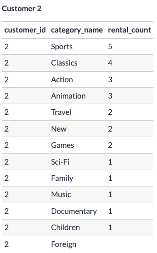

# SQL Data Problem Solving

* Now that we’ve combined all of our different datasets together into a single base table which we can use for our insights - let’s revise our email template and that base table that we now use for many of our downstream components.
* This base table was a temporary table that performed the below type joins to link each table of interest with the data point of interest 

<br>


## Email Template


---

<br>


## SQL Base Table
* Recall the Left Style Join or Inner Join Produced the Same Table Results

```sql
DROP TABLE IF EXISTS complete_joint_dataset;
CREATE TEMP TABLE complete_joint_dataset AS
SELECT
  rental.customer_id,
  inventory.film_id,
  film.title,
  rental.rental_date,
  category.name AS category_name
FROM dvd_rentals.rental
INNER JOIN dvd_rentals.inventory
  ON rental.inventory_id = inventory.inventory_id
INNER JOIN dvd_rentals.film
  ON inventory.film_id = film.film_id
INNER JOIN dvd_rentals.film_category
  ON film.film_id = film_category.film_id
INNER JOIN dvd_rentals.category
  ON film_category.category_id = category.category_id;

SELECT * FROM complete_joint_dataset limit 10;
```
|customer_id|film_id|title|rental_date|category_name|
|-----|-----|-----|-----|------|
|130|80|BLANKET BEVERLY|2005-05-24 22:53:30.000|Family|
|459|333|FREAKY POCUS|2005-05-24 22:54:33.000|Music|
|408|373|GRADUATE LORD|2005-05-24 23:03:39.000|Children|
|333|535|LOVE SUICIDES|2005-05-24 23:04:41.000|Horror|
|222|450|IDOLS SNATCHERS|2005-05-24 23:05:21.000|Children|
|549|613|MYSTIC TRUMAN|2005-05-24 23:08:07.000|Comedy|
|269|870|SWARM GOLD|2005-05-24 23:11:53.000|Horror|
|239|510|LAWLESS VISION|2005-05-24 23:31:46.000|Animation|
|126|565|MATRIX SNOWMAN|2005-05-25 00:00:40.000|Foreign|
|399|396|HANGING DEEP|2005-05-25 00:02:21.000|Drama|

---

<br>

## Data Next Steps
We will use this base table as our starting point as we work towards the customer level insights and the film recommendations.

In this tutorial we will aim to cover those core calculated fields which we broke down in our first reverse engineering section of this case study.

Let’s also revisit some of these calculations we need to perform again to jog our memory:

<br>

## Core Calculated Fields
* **category_name**: The name of the top 2 ranking categories
* **rental_count**: How many total films have they watched in this category
* **average_comparison**: How many more films has the customer watched compared to the average DVD Rental Co customer
* **percentile**: How does the customer rank in terms of the top X% compared to all other customers in this film category?
* **category_percentage**: What proportion of total films watched does this category make up?

We will need these calculated fields to help us arrive at the various interim table outputs to reach our final required outputs for this case study.


* We mentioned earlier in the Multiple Table Joining tutorial that we would need to keep all of the rental category counts for each customer - just like it’s shown in the sample output above - however we might run into issues if we only keep those top 2 ranking categories as we perform some of these calculations.

* When we look at these core calculated metrics - the final 3 metrics average_comparison, percentile and category_percentage are actually dependent on all of the category counts and not just the top 2 ranked categories.

We will definitely need those top 2 category_name and rental_count values for every customer - but how can we compute those 3 calculations if we only want to keep those top 2 values?

---

<br>

### Sample Illustrated Example
Let’s paint an imaginary scenario where we only have 3 customers in our entire database - we can do this using our existing data example and taking only customer_id values of 1, 2 and 3.

We can generate each customers’ aggregated rental_count values for every category_name value from our complete_joint_dataset temporary table also.

* Let’s also sort the output by `customer_id` and show the `rental_count` from largest to smallest for each customer: 

```sql
-- Let’s also sort the output by customer_id and show the rental_count from largest to smallest for each customer (1,2,3)
SELECT
  customer_id,
  category_name,
  COUNT(*) AS category_film_rent_count
  FROM complete_joint_dataset
  WHERE customer_id in (1, 2, 3)
  GROUP BY customer_id, category_name
  ORDER BY customer_id ASC, category_film_rent_count DESC;
```





---

<br>

### Top 2 Category Per Customer
Let’s now imagine that we just go full speed ahead and trim our dataset keeping only the top 2 categories for each customer - we would get the following results below.

Let’s just say we visually inspected our customer records because we will need to cover some window function magic before we can implement this ranking and filtering:


* `Customer 3` is an edge case where it just so happens that both Sci-Fi and Animation categories have a `rental_count` value of 3 - let’s dive into this a bit more.

<br>

### Dealing With Ties
We refer to this matching occurence as `“ties”` in regular conversation, usually you’ll hear things said in meetings and such like - “How are we going to deal with ties?”

There are multiple ways you can deal with these `“equal”` ranking row ties:
* Sort the values further by an additional condition or criteria
* Randomly select a single row

<br>

####  Do Not Select Randomly
* In most cases - you do not want to randomly select single rows as this is not `reproducible` 
    * meaning that often the behaviour will change each time you run the SQL query.

* This is a really important concept when it comes to `data science` in practice as we will often need to prove that we can **repeatedly** generate the same data points, even if some script or process is ran at different times.

So that leaves us with only option 1 - we will need to figure out what we should be sorting by as an additional criterion for our example.

<br>

#### Additional Sorting Criteria
Often times when we think about these additional sorting or ranking conditions - we should aim to choose something which 
makes the most sense in terms of a business or customer perspective or something which is low cost and simple to execute.

For example - a super simple method to execute might be to just sort the `category_name` fields alphabetically - it might not be the “best” solution for our customer experience, but it might just work when we need to do something really quickly without needing to acquire additional data!

<br>

#### Customer 3 categories sorted by rental count descending and alphabetical order
|customer_id|category_name|rental_count|
|-----|------|-------|
|3	|Action|	4|
|3	|Animation|	3|
|3	|Sci-Fi|	3|

<br>

However, for our email example (and in general) we should consider how a customer might respond as a result of certain decisions like this.

* One really common sorting method is to look at the most recent purchase or rental and sort by some recency metric based on when the last purchase was made.

* We could propose that we investigate when the latest rental was completed for each category - if we had this `rental_date` value for each individual rental record, we could easily find the `MAX(rental_date)` value for each `customer_id` and `category_name` combination.

* If we wanted to do this `rental_date` tracking - we must acquire this data point in our base temporary table for use in our queries.

However, luckily for us - it is not difficult to incorporate this additional rental_date field for our new calculations. You can check the query in the section below if you want to see how to do it:

The query below adds an additional filter for only `customer_id = 3` instead of customer_id IN (1,2,3) as our 3rd customer is the one with the ranking issue!

```sql
-- Finally perform group by aggregations on category_name and customer_id
-- ORDER BY serves as tie breaker so an equal rental_count ORDER BY declaration if equal will look next to the latest_rental date which is the MAX rental date for that grouped category for the customer
SELECT
  customer_id,
  category_name,
  COUNT(*) AS rental_count,
  MAX(rental_date) AS latest_rental_date
FROM complete_joint_dataset
-- note the different filter here!
WHERE customer_id = 3
GROUP BY
  customer_id,
  category_name
ORDER BY
  rental_count DESC,
  latest_rental_date DESC;
```


* Great - now we can see that Customer 3 most recent rental was from the Sci-Fi category - so we can use this additional criteria to sort the output and select the 2nd ranking category!

<br>

#### Additional Thoughts on Sorting and Testing
Keep in mind that this specific criteria we’ve used to sort is all theoretical - we can’t quite understand real customer preferences with the data we currently have!

Usually in these scenarios - we would perform some sort of split testing or other customer experiments to see what works. We might also send out some customer surveys and ask customers about what type of recommendations they would like to receive.

In general - these types of tests are often referred to as A/B tests or “champion vs challenger” tests and are super common in digital marketing, marketing analytics and even through to more complicated experimentation design with machine learning models!

Experimentation is a very broad topic and this simple example of us simply sorting our customer categories is nowhere near enough to cover even a fraction of the challenges and thinking behind this!

<br>

### Calculate Averages on Top 2 Categories
So now that we have all of our customers top 2 categories - let’s see what happens when we try to calculate the average on only just the top 2 categories dataset:

* Top 2 categories for all 3 customers

|customer_id|	category_name|	rental_count|
|--------|-------|-------|
|1	|Classics|	6|
|1	|Comedy|	5|
|2	|Sports|	5|
|2	|Classics|	4|
|3	|Action|	4|
|3	|Sci-Fi|	3|

* To demonstrate what happens - let’s manually generate this dataset using our trusted `CTE` and `VALUES` method we’ve seen multiple time before 

```sql
DROP TABLE IF EXISTS top_2_category_rental_count
CREATE TEMP TABLE top_2_category_rental_count AS
WITH input_data (customer_id, category_name, rental_count) AS (
    VALUES
    (1, 'Classics', 6),
    (1, 'Comedy', 5),
    (2, 'Sports', 5),
    (2, 'Classics', 4),
    (3, 'Action', 4),
    (3, 'Sci-Fi', 3)
)
SELECT * FROM input_data;

-- Check Output
SELECT * FROM top_2_category_rental_count;
```
* Produces same table as above

<br>

### CTE Average Rental Counts Customer Snippet
It should seem pretty clear that we have already experienced some sort of “data loss” - all of the Classics category films that customer 3 has watched are no longer in this existing dataset, and the same can be said about all of the other non top 2 category rental_count values for all of the other categories in the top_2_category_rental_count dataset.

If we were to calculate the average of all customer’s Classics films - there is actually no record for customer 3 and now the average is heavily skewed to only customers who have Classics as one of their top 2 categories - this is a bit of a no no!

So let’s back up a bit here and compare our averages with the original aggregated rental_count values for all of our categories - we’ll use that initial GROUP BY query as a CTE so we can keep everything in a single SQL statement:

```sql
WITH aggregated_rental_count AS (
  SELECT
    customer_id,
    category_name,
    COUNT(*) AS rental_count
  FROM complete_joint_dataset
  WHERE customer_id in (1, 2, 3)
  GROUP BY
    customer_id,
    category_name
  /* -- we remove this order by because we don't need it here!
     ORDER BY
     customer_id,
     rental_count DESC
  */
)
SELECT
  category_name,
  -- round out large decimals to just 1 decimal point
  ROUND(AVG(rental_count), 1) AS avg_rental_count
FROM aggregated_rental_count
GROUP BY
  category_name
-- this will sort our output in alphabetical order
ORDER BY
  category_name;
```
* `AVG(rental_count)` here is a bit odd (well to me) in how it calculates. It appears to just be taking the sum of the rental_count for the category and dividing by the total rows found for the category regardless of the total customers and is instead just doing the `SUM(rental_count) / rows returned` for the category from the aggregated_rental_count CTE
  * If you look at the Comedy `avg_rental_count` return in the below image (along with the other categories) you can see how the avg is being calculated below from the query and its' output below.


#### Here is the total Category Rental Count for each category for the three users


<br>

* Now let’s try calculating the same average rental count values for the top_2_category_rental_count dataset so we can compare them with the same values for the entire dataset.

```sql
SELECT
  category_name,
  -- round out large decimals to just 1 decimal point
  ROUND(AVG(rental_count), 1) AS avg_rental_count
FROM top_2_category_rental_count
GROUP BY
  category_name
-- this will sort our output in alphabetical order
ORDER BY
  category_name;
```

|category_name|avg_rental_count|
|------|-------|
|Action|	4.0|
|Classics|	5.0|
|Comedy|	5.0|
|Sci-Fi|	3.0|
|Sports|	5.0|

<br>

### Combined CTE For Top 2 Categorical Look
```sql
WITH aggregated_rental_count AS (
  SELECT
    customer_id,
    category_name,
    COUNT(*) AS rental_count
  FROM complete_joint_dataset
  WHERE customer_id in (1, 2, 3)
  GROUP BY
    customer_id,
    category_name
),
all_categories AS (
  SELECT
    category_name,
    -- round out large decimals to just 1 decimal point
    ROUND(AVG(rental_count), 1) AS all_category_average
  FROM aggregated_rental_count
  GROUP BY
    category_name
),
-- use a new CTE here with raw data entries just for completeness
top_2_category_rental_count (customer_id, category_name, rental_count) AS (
 VALUES
 (1, 'Classics', 6),
 (1, 'Comedy', 5),
 (2, 'Sports', 5),
 (2, 'Classics', 4),
 (3, 'Action', 4),
 (3, 'Sci-Fi', 3)
),
top_2_categories AS (
SELECT
  category_name,
  -- round out large decimals to just 1 decimal point
  ROUND(AVG(rental_count), 1) AS top_2_average
FROM top_2_category_rental_count
GROUP BY
  category_name
-- this will sort our output in alphabetical order
ORDER BY
  category_name
)
-- final select statement for output
SELECT
  top_2_categories.category_name,
  top_2_categories.top_2_average,
  all_categories.all_category_average
FROM top_2_categories
LEFT JOIN all_categories
  ON top_2_categories.category_name = all_categories.category_name
ORDER BY
  top_2_categories.category_name;
```

|category_name|top_2_average|all_category_average|
|-------|--------|-------|
|Action|4.0|3.0|
|Classics|5.0|3.7|
|Comedy|5.0|3.5|
|Sci-Fi|3.0|2.0|
|Sports|5.0|3.0|

<br>

### Alterantive / Categorical Review
So now that we know that there are going to be some serious differences when we look at those average values across each of the categories - we need to figure out an alternative solution instead of just picking the top 2 catgories and naively applying those aggregate functions.

This same issue will definitely impact the percentile value - how can we compare a specific customer’s ranking percentage compared to other customers if we don’t have the rental count for other customers for a specific category?

And finally the `category_percentage` calculation is actually only relative to a single customer’s rental behaviour - but how can we count the total rentals if we only have the top 2 categories?

Luckily there is a simple solution - we can just use the entire dataset for some of these calculations BEFORE we isolate the first 2 categories for our final output.

Let’s now try this whole process using the entire dataset instead of just `customer_id` of 1, 2 and 3!

---

<br>

## Data Aggregation on Whole Dataset
Just like we did before with our simple illustrated example - we will need to aggregate the `rental_count` values for each of our customers and categoy values, however this time - we will do our aggregations on the whole `complete_joint_dataset` temporary table we created earlier.

For the following few sections - we will split up each part of our various aggregations and calculations into separate temporary tables. See if you can figure out exactly why I’m doing this by the time we reach the end of this tutorial!

I’m not going to let you in on the exact reason now - but I will say that this breaking up into multiple tables will help us a lot when we need to finally compile an entire SQL script to generate our case study solution!

<br>

### 1) Customer Rental Count
Let’s first aggregate that `rental_count` value first - however let’s also use the version of the `joint dataset` that also had the `rental_date `for each record too so we can generate an additional `latest_rental_date` field for use with our sorting and ordering step, just like in our simple illustrated example.

```sql
DROP TABLE IF EXISTS category_rental_counts;
CREATE TEMP TABLE category_rental_counts AS
SELECT
  customer_id,
  category_name,
  COUNT(*) AS rental_count,
  MAX(rental_date) AS latest_rental_date
FROM complete_joint_dataset
GROUP BY
  customer_id,
  category_name;

-- profile just customer_id = 1 values sorted by desc rental_count
SELECT *
FROM category_rental_counts
WHERE customer_id = 1
ORDER BY
  rental_count DESC;
```
* Using Joined Temp Table  for all Customer Data


<br>

### 2) Total Customer Rentals
In order to generate the `category_percentage` calculation we will need to get the total rentals per customer. This is a piece of cake using a simple `GROUP BY` and `SUM`

    category_percentage: What proportion of each customer’s total films watched does this count make?

```sql
DROP TABLE IF EXISTS customer_total_rentals;
CREATE TEMP TABLE customer_total_rentals AS
SELECT
  customer_id,
  SUM(rental_count) AS total_rental_count
FROM category_rental_counts
GROUP BY customer_id;

-- show output for first 5 customer_id values
SELECT *
FROM customer_total_rentals
WHERE customer_id <= 5
ORDER BY customer_id;
```
* Using the created temp table `category_rental_counts` created in the first step, a temporary `total_rental` counts per customer can be performed by aggregating the sum of the rental counts after grouping by each `customer_id`


<br>

### 3) Average Category Rental Counts 
* Finally we can also use the AVG function with all of our category records for all customers to calculate the true average rental count for each category.

```sql
DROP TABLE IF EXISTS average_category_rental_counts;
CREATE TEMP TABLE average_category_rental_counts AS
SELECT
  category_name,
  AVG(rental_count) AS avg_rental_count
FROM category_rental_counts
GROUP BY
  category_name;

-- output the entire table by desc avg_rental_count
SELECT *
FROM average_category_rental_counts
ORDER BY
  avg_rental_count DESC;
```


* For my sanity I did a spot check here to confirm the Averages (Spot Check `Animation`)

```sql
SELECT 
  SUM(rental_count) AS total_rentals,
  (SELECT SUM(rental_count) AS anime_sum FROM category_rental_counts WHERE category_name = 'Animation'),
  (SELECT COUNT(*) AS total_animation_cat_rows FROM category_rental_counts WHERE category_name = 'Animation'),
  (SELECT SUM(rental_count) AS anime_sum FROM category_rental_counts WHERE category_name = 'Animation') / (SELECT COUNT(*) AS total_animation_cat_rows FROM category_rental_counts WHERE category_name = 'Animation') AS anime_avg
  FROM category_rental_counts;
```


|total_rentals|anime_sum|total_animation_cat_rows|anime_avg|
|-----|-------|-------|------|
|16044|1166|500|2.3320000000000000|

* They match!
* Using a subquery and the `category_rental_counts` temp table, the average generated for each category is generated through the sum of each categorical count against the total rows for each category
    * Each found row for the categorical search (Animation example above) would have varying numbers for the grouped by total for that category per customer

<br>

### 4) Update Table Values
Since it might seem a bit weird to be telling customers that they watched 1.346 more films than the average customer - let’s make an executive decision and just take the `FLOOR` value of the decimal to give our customers a bit of a feel-good boost that they watch more films (as opposed to if we rounded the number to the nearest integer!)

We can do this directly with that temp table we created by running an `UPDATE` command.

If you need to update multiple columns at one time, you can use a comma to separate each set of column and new value pairs.

We can also set a `WHERE` clause to only update specific rows that meet some condition we want.

Additionally - we can return the rows which were adjusted by specifying a `RETURNING * at the end of the query.

Just to demonstrate all of this functionality - let’s create an exact copy of our `average_category_rental_counts` temporary table and call it `testing_average_category_rental_counts` and we will try to update a few things for films that start with the letter 'C'

Let’s try adding 100 to our average rental count value and also adding an extra string ‘Category’ to the end of our `category_name` field:

```sql
-- first create a copy of average_category_rental_counts
DROP TABLE IF EXISTS testing_average_category_rental_counts;
CREATE TEMP TABLE testing_average_category_rental_counts AS
  TABLE average_category_rental_counts;

-- now update all the things!
UPDATE testing_average_category_rental_counts
SET
  avg_rental_count = avg_rental_count + 10,
  category_name = category_name || ' Category'
WHERE
  -- first character of category_name is 'C'
  LEFT(category_name, 1) = 'C'
-- show all updated rows as the query output
RETURNING *;
```

The above query returns the following output:

|category_name|	avg_rental_count|
|------|-------|
|Classics Category|	12.0064102564102564|
|Comedy Category|	11.9010101010101010|
|Children Category|	11.9605809128630705|

And we can finally check that the underlying values in the `testing_average_category_rental_counts` table has indeed changed:

```sql
SELECT *
FROM testing_average_category_rental_counts
ORDER BY category_name;
```


* Ok - now that we’ve tested out all the different bits for the `UPDATE` statement - let’s now update our table for real. We will still use the `RETURNING *` to show what has changed in the process:

```sql
UPDATE average_category_rental_counts
SET avg_rental_count = FLOOR(avg_rental_count)
RETURNING *;
```


<br>

### 5) Percentile Values
After that quick whirlwind tour of using `UPDATE` let’s continue with our final calculated field we’ll need to tackle - the percentile field:

* `percentile`: How does the customer rank in terms of the top X% compared to all other customers in this film category?


<br>

### 6) Percent Rank Window Function
We can use the `PERCENT_RANK` window function to easily generate our percentile calculated field - however it only generates decimal percentages from 0 to 1!

All window functions must have an `OVER` clause - and in the case of `PERCENT_RANK` which is actually an ordered analytical function - it must also have an `ORDER BY` clause at the minimum - but a `PARTITION BY` clause can also be used with this window function - which we will demonstrate how to use for our current problem!

For now - you can think of the `PARTITION BY` as a similar version of `GROUP BY` which helps split our dataset into specific “groups” or “window frames” to perform further calculations. For this `percentile` field - we actually need to partition on the `category_name` values as we will be trying to get all of the percentile metrics within each unique category

The `ORDER BY` clause is very similar to how it’s used when we want to sort SQL outputs in a specific order - however the ordering is not only required for our `PERCENT_RANK` window function - it is critical!

For our example - we will want to order by the `rental_count` in descending order in order to return us the expected top N% result that we need for our case study.

Don’t worry if all these terms seem a bit confusing - we will cover them in much more depth in the very next tutorial.

We can use our aggregated `rental_count` values at a `customer_id` and `category_level` in the `category_rental_counts` temp table we created earlier to generate the required output like so - let’s first inspect the results for customer_id = 1 for all of their records:

```sql
SELECT
  customer_id,
  category_name,
  rental_count,
  PERCENT_RANK() OVER (
    PARTITION BY category_name
    ORDER BY rental_count DESC
  ) AS percentile
FROM category_rental_counts
ORDER BY customer_id, rental_count DESC
LIMIT 14;
```


Notice how the percentile values are very low for the `Classics` category - the top ranking record for our customer.

Firstly we will need to multiply the `PERCENT_RANK` output by 100 to make it go from a decimal between 0 and 1 to an actual percentage number between 0 and 100.

However - even if we rounded that new percentile metric to the nearest integer for the Classics record - it would still show the value 0 - which might look a bit weird when we generate our customer insight for the email template!

To compile our actual top category insight for `customer_id = 1` for the Classics category - let’s also inspect what the average rental_count value was from our `average_category_rental_counts` table.

```sql
SELECT *
FROM average_category_rental_counts
WHERE category_name = 'Classics';
```
|category_name|avg_rental_count|
|------|--------|
|Classics|2|

<br>

So based off our top category for our first customer - we might get the following insight if we simply rounded our percentile field:

    You’ve watched 6 Classics films, that’s 4 more than the DVD Rental Co average and puts you in the top 0% of Classics gurus!

Weird right…so instead of rounding - let’s just use the `CEILING` function to take the upper integer for each of those percentile metrics after we multiply by 100 to bring our decimal value between 0 and 1 to a new value between 0 and 100!

```sql
SELECT
customer_id,
category_name,
rental_count,
CEILING(
  100 * PERCENT_RANK() OVER (
    PARTITION by category_name
    ORDER BY rental_count DESC
  ) AS percentile
)
FROM category_rental_counts
ORDER BY customer_id, rental_count DESC
LIMIT 2;
```
|customer_id|category_name|rental_count|percentile|
|------|--------|-----|----------|
|1|Classics|6|1|
|1|Comedy|5|1|

<br>

* Below is an example of what we could tell this particuclar customer regards in terms of their percentile viewing

#### You’ve watched 6 Classics films, that’s 4 more than the DVD Rental Co average and puts you in the top 1% of Classics gurus!

<br>

Let’s pop our transformation into a separate temporary table just like all the other components - we can also remove that rental_count column from the table as we will already have the information from our category_rental_counts table for use in our next step.

```sql
DROP TABLE IF EXISTS customer_category_percentiles;
CREATE TEMP TABLE customer_category_percentiles AS
SELECT
  customer_id,
  category_name,
  -- use ceiling to round up to nearest integer after multiplying by 100
  CEILING(
    100 * PERCENT_RANK() OVER (
      PARTITION BY category_name
      ORDER BY rental_count DESC
    )
  ) AS percentile
FROM category_rental_counts;

-- inspect top 2 records for customer_id = 1 sorted by ascending percentile
SELECT *
FROM customer_category_percentiles
WHERE customer_id = 1
-- Remember it's top percentile so not DESC here for percentile sorting
ORDER BY percentile
LIMIT 2;
```
|customer_id|category_name|percentile|
|------|--------|-----|
|1|Classics|1|
|1|Comedy|1|

<br>

#### Quick Snapshot of the CEIL vs non CEIL type percentiles (1-100)
```sql
DROP TABLE IF EXISTS customer_category_percentiles;
CREATE TEMP TABLE customer_category_percentiles AS
SELECT
  customer_id,
  category_name,
  -- use ceiling to round up to nearest integer after multiplying by 100
  CEILING(
    100 * PERCENT_RANK() OVER (
      PARTITION BY category_name
      ORDER BY rental_count DESC
    )
  ) AS percentile,
  100 * PERCENT_RANK() OVER(
    PARTITION BY category_name
    ORDER BY rental_count DESC
  ) AS perentile_non_ceil
FROM category_rental_counts;

SELECT * FROM customer_category_percentiles WHERE customer_id in (1, 2, 3) ORDER BY category_name ASC;
```


<br>

---

<br>

## Using Our Temporary Tables

Let's take a quick refresh on our temporary tables available

* ### Table 1 - category_rental_counts
  * Using our initial temp table from the joining path to connect each table, this table will provide a table showing the count of rentals for each category per customer along with their most recent rental date for that particular category in the row returned for each category
```sql
DROP TABLE IF EXISTS category_rental_counts;
CREATE TEMP TABLE category_rental_counts AS
SELECT
  customer_id,
  category_name,
  COUNT(*) AS rental_count,
  MAX(rental_date) AS latest_rental_date
FROM complete_joint_dataset_with_rental_date
GROUP BY
  customer_id,
  category_name;
```

```sql
SELECT *
FROM category_rental_counts
WHERE customer_id = 1
ORDER BY rental_count DESC 
LIMIT 5;
```
|customer_id|category_name|rental_count|latest_rental_date|
|---------|--------|---------|---------|
|1|Classics|6|2005-08-19 09:55:16.000|
|1|Comedy|5|2005-08-22 19:41:37.000|
|1|Drama|4|2005-08-18 03:57:29.000|
|1|Music|2|2005-07-09 16:38:01.000|
|1|Sports|2|2005-07-08 07:33:56.000|

<br>

* ### Table 2 - customer_total_rentals
  * Using category_rental_counts temp table above to get a sum of total rentals from the customers overall category rentals. Not as specific but a good way to see a total sum for each customer
```sql
DROP TABLE IF EXISTS customer_total_rentals;
CREATE TEMP TABLE customer_total_rentals AS
SELECT
  customer_id,
  SUM(rental_count) AS total_rental_count
FROM category_rental_counts
GROUP BY customer_id;
```
```sql
SELECT *
FROM customer_total_rentals
ORDER BY customer_id 
LIMIT 5;
```
|customer_id|total_rental_count|
|------|-------|
|1|32|
|2|27|
|3|26|
|4|22|
|5|38|

<br>

* ### Table 3 - Average Category Rental Counts
  * Using the `category_rental_counts` table 1 above, this temp table was updated to provided a `FLOOR` value for the alias avg_rental_counts
  * Again here the `AVG()` function using the total rows as the `n` for Avg calculation against the sum of rental_counts for each customer to have been found to rent a film in that category (see below for spot check)

```sql
DROP TABLE IF EXISTS average_category_rental_counts;
CREATE TEMP TABLE average_category_rental_counts AS
SELECT
  category_name,
  AVG(rental_count) AS avg_rental_count
FROM category_rental_counts
GROUP BY
  category_name;

-- Update Call here to return a single int digit and not a float type value
UPDATE average_category_rental_counts
SET avg_rental_count = FLOOR(avg_rental_count)
RETURNING *;

-- Look at first few rows from temp table
SELECT *
FROM average_category_rental_counts
LIMIT 5;
```
|category_name|avg_rental_count|
|-----|-------|
|Sports|2|
|Classics|2|
|New|2|
|Family|2|
|Comedy|1|

* Below is a quick sanity/spot check for how the `FLOOR` and `avg` are being calculated 
```sql
-- Let's spot check Classics (sum(rental_counts) for category / by total rows from category_rental_counts for the particular category)
SELECT category_name, FLOOR(SUM(rental_count)/COUNT(*)) AS avg_rental_count_floor, SUM(rental_count)/COUNT(*) AS avg_rental_count_nonfloor,
COUNT(*) AS category_total_rows_customers, SUM(rental_count) AS customer_category_total_rentals
FROM category_rental_counts
WHERE category_name in ('Sports', 'Classics', 'New', 'Family', 'Comedy')
GROUP BY category_name;
```
|category_name|avg_rental_count_floor|avg_rental_count_nonfloor|category_total_rows_customers|customer_category_total_rentals|
|-----|-----|------|-----|-----|
|Sports|2|2.2716763005780347|519|1179|
|Classics|2|2.0064102564102564|468|939|
|New|2|2.0085470085470085|468|940|
|Family|2|2.1876247504990020|501|1096|
|Comedy|1|1.9010101010101010|495|941|

<br>

* ### Table 4 - Customer Category Percentiles
  * This table used the `PERCENT_RANK` function along with the `OVER` window frame clause `PARTITIONED` by category to provide the `top` {x} type percentile that customer ranks in category rentals across our dataset
  * `CEILING` was used in this temp table to round up to the nearest whole percentile (between 1-100) so as to not represent a type string of a 'Customer is in the top 3.763 percentile' for action movies watched or the like

```sql
DROP TABLE IF EXISTS customer_category_percentiles;
CREATE TEMP TABLE customer_category_percentiles AS
SELECT
  customer_id,
  category_name,
  -- use ceiling to round up to nearest integer after multiplying by 100
  CEILING(
    100 * PERCENT_RANK() OVER (
      PARTITION BY category_name
      ORDER BY rental_count DESC
    )
  ) AS percentile,
  100 * PERCENT_RANK() OVER(
    PARTITION BY category_name
    ORDER BY rental_count DESC
  ) AS perentile_non_ceil
FROM category_rental_counts;
```

```sql
SELECT *
FROM customer_category_percentiles
WHERE customer_id = 1
ORDER BY percentile
LIMIT 5;
```
|customer_id|category_name|percentile|perentile_non_ceil|
|------|------|------|------|
|1|Comedy|1|0.6072874493927125|
|1|Classics|1|0.21413276231263384|
|1|Drama|3|3|
|1|Music|21|20.40358744394619|
|1|New|27|26.76659528907923|

<br>

#### We'll now be Joining Those Temporary Tables to Forge On!

<br>

## Joining Temporary Tables
This approach to splitting out datasets - performing calculations and aggregations at different granularities by using different `GROUP BY` column inputs or using window functions is a very common technique to split up our various logical components into separate blocks.

This is especially the case for our case study problem as we needed to perform our calculations on the entire dataset before we remove all rows except the top 2 categories for each customer!

We can now easily combine all of the temporary tables together using that same approach we defined in the Joining Multiple Tables tutorial.

Since we would like to keep all of the `rental_count records` - we can safely use table 1 `category_rental_counts` as our starting base table for our table joins.

For this example - let’s use the appearance order style of table aliasing just to mix things up a little bit!

Since we know for sure - all of the keys for the following tables also exist in the `category_rental_counts base` - we can safely use inner joins without the fear of accidentally wiping out values which are not present in left and right tables for each join!

The only thing we need to keep an eye on is the columns which we use as the `join keys` for each of our inner joins - also notice how tables 2, 3 and 4 are joined onto table 1 category_rental_counts

Additionally - we will see that table 4 `customer_category_percentiles` will join onto `category_rental_counts` on 2 columns.

Remember to always reference where specific columns are coming from by referencing the alias or table name in the `SELECT` statement!

```sql
DROP TABLE IF EXISTS customer_category_joint_table;
CREATE TEMP TABLE customer_category_joint_table AS
SELECT
  t1.customer_id,
  t1.category_name,
  t1.rental_count,
  t2.total_rental_count,
  t3.avg_rental_count,
  t4.percentile
FROM category_rental_counts AS t1
INNER JOIN customer_total_rentals AS t2
  ON t1.customer_id = t2.customer_id
INNER JOIN average_category_rental_counts AS t3
  ON t1.category_name = t3.category_name
INNER JOIN customer_category_percentiles AS t4
  ON t1.customer_id = t4.customer_id
  AND t1.category_name = t4.category_name;

-- inspect customer_id = 1 rows sorted by percentile
SELECT *
FROM customer_category_joint_table
WHERE customer_id = 1
ORDER BY percentile;
```

|customer_id|category_name|rental_count|total_rental_count|avg_rental_count|percentile|
|-----|------|------|------|-----|-----|
|1|Classics|6|32|2|1|
|1|Comedy|5|32|1|1|
|1|Drama|4|32|2|3|

* A bit hard to see the screenshot so here is 3 rows for customer 1 
  * Avg_rental count column is again a count of only customers who have rented from that category and if so, how many avg_rentals for that category a customer interested in that genre has 
  * For instance `Drama` category shows that the customers 4 rentals in the category is 2 greater than a customer generally averages if renting from the category
  * Since were ordering by the percentile we see the customers top categories percentile rankings for their entire rental history

<br>

* Ok we are getting closer to our target output table - now let’s add in those final calculations to this table.

<br>

### Adding in Calculated Fields
* `average_comparison`: How many more films has the customer watched compared to the average DVD Rental Co customer?

* `category_percentage`: What proportion of each customer’s total films watched does this count make?

To spice this example up a little further - let’s drop the temporary table we just created `customer_category_joint_table` and recreate it with these 2 calculations included:

```sql
DROP TABLE IF EXISTS customer_category_joint_table;
CREATE TEMP TABLE customer_category_joint_table AS
SELECT
  t1.customer_id,
  t1.category_name,
  t1.rental_count,
  t1.latest_rental_date,
  t2.total_rental_count,
  t3.avg_rental_count,
  t4.percentile,
  t1.rental_count - t3.avg_rental_count AS average_comparison,
  -- round to nearest integer for percentage after multiplying by 100
  ROUND(100 * t1.rental_count / t2.total_rental_count) AS category_percentage
FROM category_rental_counts AS t1
INNER JOIN customer_total_rentals AS t2
  ON t1.customer_id = t2.customer_id
INNER JOIN average_category_rental_counts AS t3
  ON t1.category_name = t3.category_name
INNER JOIN customer_category_percentiles AS t4
  ON t1.customer_id = t4.customer_id
  AND t1.category_name = t4.category_name;

-- inspect customer_id = 1 top 5 rows sorted by percentile
SELECT *
FROM customer_category_joint_table
WHERE customer_id = 1
ORDER BY percentile
limit 5;
```
|customer_id|category_name|rental_count|latest_rental_date|total_rental_count|avg_rental_count|percentile|average_comparison|category_percentage|
|-----|-----|------|-------|-----|-----|-------|------|-----|
|1	|Comedy|	5	|2005-08-22T19:41:37.000Z|	32	|1	|1	|4	|16|
|1	|Classics|	6	|2005-08-19T09:55:16.000Z|	32	|2	|1	|4	|19|
|1	|Drama|	4	|2005-08-18T03:57:29.000Z	|32	|2	|3	|2	|13|
|1	|Music|	2	|2005-07-09T16:38:01.000Z|	32	|1	|21|	1|	6|
|1	|New	|2	|2005-08-19T13:56:54.000Z	|32	|2	|27|	0	|6|

Note how we have a division field here - normally we would be applying some sort of casting of either the numerator or denominator to a NUMERIC data type to avoid the dreaded integer floor division which we talked about in the Data Exploration section of this course.

However - we are lucky in this example as that total_rental_count value just so happens to be a NUMERIC type already as it is the output from a SUM function.

So I can already imagine you asking - how do we know the data types?

<br>

### Checking Data Types Using the information_schema.columns Table
To check the data types of columns in specific tables you can use the following query and hit the `information_schema.columns` reference table within PostgreSQL - just note that different SQL flavours will have different ways to inspect the data types of columns and inspect tables further.

This snippet will be really useful anytime you need to inspect data types!

```sql
SELECT
  table_name,
  column_name,
  data_type
FROM information_schema.columns
WHERE table_name in ('customer_total_rentals', 'category_rental_counts');
```
|table_name|column_name|data_type|
|------|--------|-------|
|category_rental_counts|customer_id|smallint|
|category_rental_counts|category_name|character varying|
|category_rental_counts|rental_count|bigint|
|category_rental_counts|latest_rental_date|timestamp without time zone|
|customer_total_rentals|customer_id|smallint|
|customer_total_rentals|total_rental_count|numeric|


There are additional columns which are really useful in the information_schema.columns table including:

* `schema_name`: which database schema is this table from?
* `is_nullable`: can this column contain null values?
* `ordinal_position`: what position is this column inside the table?
* `column_default`: is there a default value for this column?
* `character_maximum_length`: what is the maximum character length of a CHAR or VARCHAR data type column
In the past I actually used these schema tables to perform a ton of data validation and exploration - for example, I would use this query a ton to find all tables in all schemas that consisted of a specific column that I was looking for:

```sql
SELECT
  schema_name,
  table_name,
  column_name
FROM information_schema.columns
WHERE column_name ILIKE '%<column_name>%
```

Then I would start inspecting each table one by one to see if it had other columns which I might want:

```sql
SELECT
  schema_name,
  table_name,
  column_name
FROM information_schema.columns
WHERE table_name = 'some-table-from-the-query-above';
```

There are plenty more things you can do with this such as mapping a few shortcuts to your favourite languages or SQL editors and development tools so this is just scratching the surface of what is possible in the world of SQL exploration!

Ok let’s return to the final piece of the puzzle - how can we extract the top 2 rows for each customer?

---

<br>

## Ordering and Filtering Rows with ROW_NUMBER
Ok great - we now have all of our various calculations but we also have all of our categories for every customer, however we only need the top 2 categories.

We can use another ordered analytical function `ROW_NUMBER` to do this in another window function!

We’ve seen this briefly in a past tutorial but the `ROW_NUMBER` is used with an `OVER` clause and adds row numbers for records according to some `ORDER BY` condition within each “window frame” or “group” of rows assigned by the `PARTITION BY` clause.

Once the records within each window frame, partition or group are all numbered - the row number simply restarts at 1 for the next group and continues until all of the groups and rows are sorted and numbered.

For our example - we will aim to sort our records within each set of rows with the same `customer_id`, ordering the rows by `rental_count` from largest to smallest and also using that `latest_rental_date` field for each customer’s category as an additional sorting criteria to “deal with ties” (we covered this earlier above!)

We will preference the category with the most recent `latest_rental_date` so we will also need to use a `DESC` with this second input to the `ORDER BY` clause.

We can perform this window function within a `CTE` and then apply a simple filter to only keep row number records which are less than or equal to 2 only.

Let’s create a final temporary table called `top_categories_information` with the output from this operation

```sql
DROP TABLE IF EXISTS top_categories_information;

-- Note that you need an extra pair of (brackets) when you create tables
-- with CTEs inside the SQL statement!
CREATE TEMP TABLE top_categories_information AS (
-- use a CTE with the ROW_NUMBER() window function implemented
WITH ordered_customer_category_joint_table AS (
  SELECT
    customer_id,
    ROW_NUMBER() OVER (
      PARTITION BY customer_id
      ORDER BY rental_count DESC, latest_rental_date DESC
    ) AS category_ranking,
    category_name,
    rental_count,
    average_comparison,
    percentile,
    category_percentage
  FROM customer_category_joint_table
)
-- filter out top 2 rows from the CTE for final output
SELECT *
FROM ordered_customer_category_joint_table
WHERE category_ranking <= 2
);
```
* Note that the final SELECT statement is needed to filter from the created CTE `ordered_customer_category_joint_table` for just the two top rows (aliased as category_ranking) from the Window Function `ROW_NUMBER`
* The closing parentheses and final SELECT statement is encapsulated so that future queries to the created `CTE` will only return the top category (2) that was partitioned for the customer with any ties in the `rental_count` column being broken by the category that was rented most recently 


```sql
SELECT *
FROM top_categories_information
WHERE customer_id in (1, 2, 3)
ORDER BY customer_id, category_ranking;
```
|customer_id|category_ranking|category_name|rental_count|average_comparison|percentile|category_percentage|
|------|------|------|------|------|------|-----|
|1	|1	|Classics|	6|	4|	1|	19|
|1|	2|	Comedy|	5|	4|	1|	16|
|2	|1	|Sports	|5	|3	|3	|19|
|2|	2|	Classics|	4|	2|	2|	15|
|3	|1	|Action	|4	|2	|5	|15|
|3|	2|	Sci-Fi|	3|	1|	15|	12|

#### Column Reminders
* `customer_id`: customer rental id (unique)
* `category_ranking`: individual category ranking for each partitioned customer ranked by `ROW_NUMBER` that uses the rental_count value for the category to rank with any ties for total category rental_counts subsequently ranked by the most recent rental_date for the category 
* `category_name`: Genre for films watched
* `rental_count`: Sum of the rental_count for that category by customer
* `average_comparison`: how many more films watched for category than average customer who had rented from this category (rental_count for category - avg_rental_count for category) should it exist for the customer
* `percentile` : `CEILING` value calcualed on the `PERCENT_RANK` return (which was multiplied by 100 to represent a 1-100 percentile rather than 0-1 which the method does). Ceiling taken on returned rank value to have a single int type percentile out of 100 for the listing rather than 0-1
* `category_percentage`: ROUND(100 * t1.rental_count / t2.total_rental_count) AS category_percentage - this value uses the category_rental_count and divides by the total films rented by the customer to detail what percentage that category represents for a total rental history for the customer

* **Awesome** - this matches not only our illustrated example but it also matches exactly what we need for one of the first output tables for our case study!

---

<br>

## Conclusion
This now brings us to the conclusion of this tutorial - in the next one we will be diving into a whirlwind tour of window functions to better understand what we did with those percentile and category_ranking fields (and more!)

In this tutorial we covered the following concepts as we continued our SQL problem solving exercise:

* Apply a split, aggregate and join strategy to combine multiple calculated fields into a single table via multiple table joins
* How to “deal with ties” for row sorting and ordering, and why randomly selecting rows is not a great idea
* Thinking through customer experience when we make technical decisions that might negatively impact a message or insight
* Using multiple CTEs in a single SQL statement
* How to use UPDATE to adjust column values in an existing table, including how to target only specific rows which meet certain criteria
* Quick overview on the usage of PERCENT_RANK and ROW_NUMBER window functions
* How to identify column data types and quickly explore database tables to search for columns or table names using information_schema.columns

