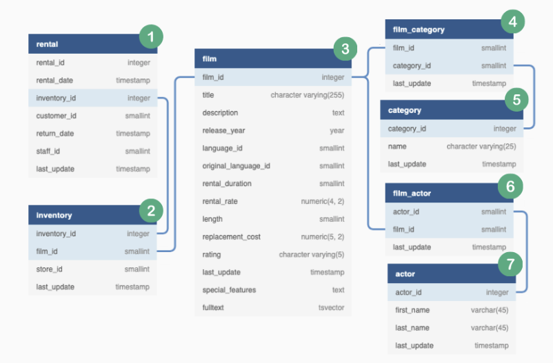

# Marketing Analytics
This tutorial will model how to approach a project and document the task and ultimate path through SQL to the analytical solution for the provided business problem.

How to look at business reports/outputs/question answering for a report write up (hence the markdown) would be delivered. 

Firstly let’s introduce a rough structure for this case study solution - this is a new thing I’ve created myself, so hopefully this fun acronym can help you with your future projects!

<br>

### PEAR Template
This is something that I came up with recently to try and structure these data case study solutions - I also had the realisation that it might be useful to share the structure before we dive straight into the case study solution itself.

In the same way that we have the structure of `STAR `technique for behavioural interview questions **(Situation, Task, Action, Result)** - `PEAR` is my solution for framing up any data case study which you’d like to showcase as part of your personal portfolio!

#### `P - Problem`
What is the business problem and what sort of value can we generate by solving it?

#### `E - Exploration`
What available resources do we have and what initial data exploration can we perform to better understand our data?

#### `A - Analysis`
This is where we start showing off our arsenal of data analysis techniques in a very structured and systematic manner.

#### `R - Report`
Once we’ve finished our analysis we want to package up our various code snippets into a single process and generate the final outputs we need to solve our business problem.

---

<br>

### Problem - Business (Request)
We have been tasked by the DVD Rental Co marketing team to help them generate the analytical inputs required to drive their very first customer email campaign.

The marketing team expects their personalised emails to drive increased sales and engagement from the DVD Rental Co customer base.

The main initiative is to share insights about each customer’s viewing behaviour to demonstrate DVD Rental Co’s relentless focus on customer experience.

The insights requested by the marketing team include key statistics for the **customer's**
* Top 2 categories
* Favorite Actor
* 3 Personalized Recommendations
---

<br>

## Email Template
The email template has been provided and consists of the following data analytics and customer insight components numbered and detailed below


### Category Insights (Requirements)
* `Top Category`
1. What was the top category watched by total rental count?
2. How many total films have they watched in their top category and how does it compare to the DVD Rental Co customer base?
    * How many more films has the customer watched compared to the average DVD Rental Co customer?
    * How does the customer rank in terms of the top X% compared to all other customers in this film category?
3. What are the top 3 film recommendations in the top category ranked by total customer rental count which the customer has not seen before?


* `Second Category`
4. What is the second ranking category by total rental count?
5. What proportion of each customer’s total films watched does this count make? 
6. What are top 3 recommendations for the second category which the customer has not yet seen before?

* `Actor Insights`
7. Which actor has featured in the customer’s rental history the most?
8. How many films featuring this actor has been watched by the customer?
9. What are the top 3 recommendations featuring this same actor which have not been watched by the customer?
---

<br>

## ERD Revisited / Exploration
* Now with an idea of what we want, where is it and do we have a like document to see where all the tables are to start on our tasks?



### Table Join Analysis


* Review MutlipleTableJoins (markdown in same repo folder) for considerations when starting to join tables, in particular the unique counts and anti-join, join type logic to review result of type joins performed
    * Good reminders in there about potential wonky returns from joins when just initially starting to join data from one table to another

#### Refresher
* Unique foreign key check and distinct count between two similar tables like `inventory` `rental` before a default join to see if unique foreign key count may be differnet

```sql
-- how many foreign keys only exist in the left table and not in the right?
SELECT
  COUNT(DISTINCT inventory_id)
FROM dvd_rentals.rental
WHERE NOT EXISTS (
  SELECT inventory_id
  FROM dvd_rentals.inventory
  WHERE rental.inventory_id = inventory.inventory_id
);

-- how many foreign keys only exist in the left table and in the right?
SELECT
  COUNT(DISTINCT inventory_id)
FROM dvd_rentals.rental
WHERE EXISTS (
  SELECT inventory_id
  FROM dvd_rentals.inventory
  WHERE rental.inventory_id = inventory.inventory_id
);

-- Similar type Check (A little more familiar with sql terms) - Can use subquery just to check in the table w/o where clause
SELECT COUNT(DISTINCT inventory_id) AS join_total_foreign_keys, (SELECT COUNT(DISTINCT inventory_id) FROM dvd_rentals.rental) AS rental_unique_count
FROM dvd_rentals.rental
WHERE inventory_id IN (
  SELECT DISTINCT inventory_id
  FROM dvd_rentals.inventory
);
```
#### Resepective Table outputs from queries above

|count|
|----|
|0|

<br>

|count|
|----|
|4580|

<br>

|join_total_foreign_keys|rental_unique_count|
|-----|----|
|4580|4580|


<br>

* Now check the right side table using the same process: dvd_rentals.inventory
```sql
-- how many foreign keys only exist in the right table and not in the left?
-- note the table reference changes
SELECT
  COUNT(DISTINCT inventory.inventory_id)
FROM dvd_rentals.inventory
WHERE NOT EXISTS (
  SELECT inventory_id
  FROM dvd_rentals.rental
  WHERE rental.inventory_id = inventory.inventory_id
);
```
|count|
|----|
|1|

* There seems to be a single value which is not showing up - let’s investigate which film it is:

```sql
SELECT *
FROM dvd_rentals.inventory
WHERE NOT EXISTS (
  SELECT inventory_id
  FROM dvd_rentals.rental
  WHERE rental.inventory_id = inventory.inventory_id
);
```
|inventory_id|film_id|store_id|last_update|
|-----|------|-----|----|
|5|1|2|2006-02-15 05:09:17|

* `Conclusion`: although there is a single inventory_id record which is missing from the dvd_rentals.rental table - there might be no issues with this discrepancy as it seems that some inventory might just never be rented out to customers at the retail rental stores.


<br>

#### `Finally` 
- let’s confirm that both left and inner joins do not differ at all when we look at the resulting row counts from the joint tables:
```sql
DROP TABLE IF EXISTS left_rental_join;
CREATE TEMP TABLE left_rental_join AS
SELECT
  rental.customer_id,
  rental.inventory_id,
  inventory.film_id
FROM dvd_rentals.rental
LEFT JOIN dvd_rentals.inventory
  ON rental.inventory_id = inventory.inventory_id;

DROP TABLE IF EXISTS inner_rental_join;
CREATE TEMP TABLE inner_rental_join AS
SELECT
  rental.customer_id,
  rental.inventory_id,
  inventory.film_id
FROM dvd_rentals.rental
INNER JOIN dvd_rentals.inventory
  ON rental.inventory_id = inventory.inventory_id;

-- Output SQL
(
  SELECT
    'left join' AS join_type,
    COUNT(*) AS record_count,
    COUNT(DISTINCT inventory_id) AS unique_key_values
  FROM left_rental_join
)
UNION
(
  SELECT
    'inner join' AS join_type,
    COUNT(*) AS record_count,
    COUNT(DISTINCT inventory_id) AS unique_key_values
  FROM inner_rental_join
);
```
|join_type|record_count|unique_key_values|
|----|-----|----|
|inner join|16044|4580|
|left join|16044|4580|

<br>

#### Join Column Analysis Example 2
We also need to investigate the relationships between the `actor_id` and `film_id` columns within the `dvd_rentals.film_actor` table.

Intuitively - we can hypothesise that one single actor might show up in multiple films and one film can have multiple actors. This is known as a `many-to-many` relationship.

Let’s perform some analysis on the data tables to see if our hunch is on point:

```sql
-- Aggregate - how many films an actors has been in, then get a count of how many film
WITH actor_film_counts AS (
  -- Total film counts for each actor
  SELECT
    actor_id,
    COUNT(DISTINCT film_id) AS film_count
  FROM dvd_rentals.film_actor
  GROUP BY actor_id
)
-- We can now see see how many actors have the most/least amount of appearances
SELECT
  film_count AS total_appearances,
  COUNT(*) AS total_actors_w_appearances
FROM actor_film_counts
GROUP BY film_count
ORDER BY film_count
LIMIT 5;
```
|total_appearances|total_actors_w_appearances|
|----|----|
|14|1|
|15|2|
|16|1|
|18|2|
|19|4|

* We're aggregating and aggregate with the CTE to ultimately see initially how many movies an actor has been in and then use that `count` aggregate to see how many actors share that many appearances
* Below we can conclude that `14 - total min appearances by any actor` is the minimum number of films that one actor stars in - these actors are absolute stars with their prolific filmography!


```sql
-- My query for just how I initially thought they were going after things
SELECT 
  actor_id,
  COUNT(*) AS actor_id_total_counts,
  COUNT(DISTINCT(film_id)) AS actor_id_unique_films
FROM dvd_rentals.film_actor
GROUP BY actor_id
ORDER BY actor_id_unique_films DESC
LIMIT 5;

|actor_id|actor_id_total_counts|actor_id_unique_films|
|---|----|-----|
|107|42|42|
|102|41|41|
|198|40|40|
|181|39|39|
|23|37|37|
```

* For `film_actor` table, the actor_id doesn't appear to have any duplicate values for their total counts for distinct films or total times counted, never listed twice which we'd assume but it could happen!

* The above output of the initial table show that this is a `one to many` relationship with the minimum number of times an actor was seen for total films was 14


* Let’s also confirm that there are multiple actors per film also (although this should be pretty obvious!):

```sql
-- Let’s also confirm that there are multiple actors per film also (although this should be pretty obvious!):
WITH total_actors_per_film AS (
  SELECT
    film_id,
    COUNT(*) AS total_actors_in_film
    FROM dvd_rentals.film_actor
    GROUP BY film_id
)
-- total_films_with_x_actors (first agg value of total_actors_in_film) - desc order by most total_actors_in any film
SELECT
  total_actors_in_film,
  COUNT(*) AS film_count_with_xtotal_actors
FROM total_actors_per_film
GROUP BY total_actors_in_film
ORDER BY total_actors_in_film DESC;
```
|total_actors_in_film|film_count_with_xtotal_actors|
|----|----|
|15|1|
|13|6|
|12|6|
|11|14|
|10|21|
|9|49|
|8|90|
|7|119|
|6|150|
|5|195|
|4|137|
|3|119|
|2|69|
|1|21|

* Well - what do you know? Some films only consist of a single actor! Good thing we checked after all!

* In conclusion - we can see that there is indeed a many to many relationship of the `film_id` and the `actor_id` columns within the `dvd_rentals.film_actor` table so we must take extreme care when we are joining these 2 tables as part of our analysis in the next section of this project!

---

<br>

## Analysis
Now that we’ve identified the key columns and highlighted some things we need to keep in mind when performing some table joins for our data analysis - we need to formalise our plan of attack.

Before we dive into the actual SQL implementation of the final solution, let’s list out all of the steps we will take without any code so we can keep a track of our thought process as we go through the following SQL solution.

At a high level - we will tackle the category insights first before turning our attention to the actor level insights and recommendations.

<br>

### Solution Plan

#### Category Insights - Objectives
1. Create a base dataset and join all relevant tables
    * complete_joint_dataset
2. Calculate customer rental counts for each category
    * category_counts
3. Aggregate all customer total films watched
    * total_counts
4. Identify the top 2 categories for each customer
    * top_categories
5. Calculate each category’s aggregated average rental count
    * average_category_count
6. Calculate the percentile metric for each customer’s top category film count
    * top_category_percentile
7. Generate our first top category insights table using all previously generated tables
    * top_category_insights
8. Generate the 2nd category insights
    * second_category_insights

#### Category Recommendations
1. Generate a summarised film count table with the category included, we will use this table to rank the films by popularity
    * film_counts
2. Create a previously watched films for the top 2 categories to exclude for each customer
    * category_film_exclusions
3. Finally perform an anti join from the relevant category films on the exclusions and use window functions to keep the top 3 from each category by popularity - be sure to split out the recommendations by category ranking
    * category_recommendations

#### Actor Insights
1. Create a new base dataset which has a focus on the actor instead of category
    * actor_joint_table
2. Identify the top actor and their respective rental count for each customer based off the ranked rental counts
    * top_actor_counts

#### Actor Recommendations
1. Generate total actor rental counts to use for film popularity ranking in later steps
    * actor_film_counts
2. Create an updated film exclusions table which includes the previously watched films like we had for the category recommendations - but this time we need to also add in the films which were previously recommended
    * actor_film_exclusions
3. Apply the same ANTI JOIN technique and use a window function to identify the 3 valid film recommendations for our customers
    * actor_recommendations

---

<br>

## Create our Datasets and Bones of FULL SQL Script

<br>

### Category Insights
#### `Create Base Dataset`
We first created a complete_joint_dataset which joins multiple tables together after analysing the relationships between each table to confirm if there was a one-to-many, many-to-one or a many-to-many relationship for each of the join columns.

We also included the rental_date column to help us split ties for rankings which had the same count of rentals at a customer level - this helps us prioritise film categories which were more recently viewed.

```sql
DROP TABLE IF EXISTS complete_joint_dataset;
CREATE TEMP TABLE complete_joint_dataset AS
SELECT
  rental.customer_id,
  inventory.film_id,
  film.title,
  category.name AS category_name,
  -- also included rental_date for sorting purposes
  rental.rental_date
FROM dvd_rentals.rental
INNER JOIN dvd_rentals.inventory
  ON rental.inventory_id = inventory.inventory_id
INNER JOIN dvd_rentals.film
  ON inventory.film_id = film.film_id
INNER JOIN dvd_rentals.film_category
  ON film.film_id = film_category.film_id
INNER JOIN dvd_rentals.category
  ON film_category.category_id = category.category_id;

SELECT * FROM complete_joint_dataset limit 10;
```
* the check for unique keys when previously joining this dataset revealed an `INNER JOIN` would be returning unieque data for the inventory

|customer_id|film_id|title|category_id|category_name|
|----|-----|------|-----|-----|
|130|80|BLANKET BEVERLY|8|Family|
|459|333|FREAKY POCUS|12|Music|
|408|373|GRADUATE LORD|3|Children|
|333|535|LOVE SUICIDES|11|Horror|
|222|450|IDOLS SNATCHERS|3|Children|
|549|613|MYSTIC TRUMAN|5|Comedy|
|269|870|SWARM GOLD|11|Horror|
|239|510|LAWLESS VISION|2|Animation|
|126|565|MATRIX SNOWMAN|9|Foreign|
|399|396|HANGING DEEP|7|Drama|

#### `Category Counts`
We then created a follow-up table which uses the `complete_joint_dataset to` aggregate our data and generate a `rental_count` and the `latest rental_date` for our ranking purposes downstream.
```sql
DROP TABLE IF EXISTS category_counts;
CREATE TEMP TABLE category_counts AS
SELECT
  customer_id,
  category_name,
  COUNT(*) AS rental_count,
  MAX(rental_date) AS latest_rental_date
FROM complete_joint_dataset
GROUP BY
  customer_id,
  category_name;
```
|customer_id|category_name|rental_count|latest_rental_date|
|-----|-----|-----|-----|
|538|Comedy|1|2005-08-22 21:01:25.000|
|314|Comedy|3|2005-08-23 21:37:59.000|
|286|Travel|1|2005-08-18 18:58:35.000|

#### `Total Counts`
We will then use this `category_counts` table to generate our `total_counts` table.

```sql
DROP TABLE IF EXISTS total_counts;
CREATE TEMP TABLE total_counts AS
SELECT
  customer_id,
  SUM(rental_count) AS total_count
FROM category_counts
GROUP BY
  customer_id;
```
|customer_id|total_count|
|---|----|
|184|23|
|87|30|
|477|22|
|273|35|
|550|32|

#### `Top Categories`
We can also use a simple `DENSE_RANK` window function to generate a ranking of categories for each customer.

We will also split arbitrary ties by preferencing the category which had the most recent `latest_rental_date` value we generated in the `category_counts` for this exact purpose. To further prevent any ties - we will also sort the `category_name` in alphabetical (ascending) order just in case!
```sql
DROP TABLE IF EXISTS top_categories;
CREATE TEMP TABLE top_categories AS
WITH ranked_cte AS (
  SELECT
    customer_id,
    category_name,
    rental_count,
    DENSE_RANK() OVER (
      PARTITION BY customer_id
      ORDER BY
        rental_count DESC,
        latest_rental_date DESC,
        category_name
    ) AS category_rank
  FROM category_counts
)
SELECT * FROM ranked_cte
WHERE category_rank <= 2;
```

#### `Average Category Count`
Next we will need to use the `category_counts` table to generate the average aggregated rental count for each category rounded down to the nearest integer using the `FLOOR` function

```sql
DROP TABLE IF EXISTS average_category_count;
CREATE TEMP TABLE average_category_count AS
SELECT
  category_name,
  FLOOR(AVG(rental_count)) AS category_average
FROM category_counts
GROUP BY category_name;
```

#### `Top Category Percentile`
Now we need to compare each customer’s top category rental_count to all other DVD Rental Co customers - we do this using a combination of a LEFT JOIN and a PERCENT_RANK window function ordered by descending rental count to show the required top N% customer insight.

We will also use a CASE WHEN to replace a 0 ranking value to 1 as it doesn’t make sense for the customer to be in the Top 0%!

```sql
DROP TABLE IF EXISTS top_category_percentile;
CREATE TEMP TABLE top_category_percentile AS
WITH calculated_cte AS (
SELECT
  top_categories.customer_id,
  top_categories.category_name AS top_category_name,
  top_categories.rental_count,
  category_counts.category_name,
  top_categories.category_rank,
  PERCENT_RANK() OVER (
    PARTITION BY category_counts.category_name
    ORDER BY category_counts.rental_count DESC
  ) AS raw_percentile_value
FROM category_counts
LEFT JOIN top_categories
  ON category_counts.customer_id = top_categories.customer_id
)
SELECT
  customer_id,
  category_name,
  rental_count,
  category_rank,
  CASE
    WHEN ROUND(100 * raw_percentile_value) = 0 THEN 1
    ELSE ROUND(100 * raw_percentile_value)
  END AS percentile
FROM calculated_cte
WHERE
  category_rank = 1
  AND top_category_name = category_name;
```

#### `1st Category Insights`
Let’s now compile all of our previous temporary tables into a single category_insights table with what we have so far - we will use our most recently generated top_category_percentile table as the base and LEFT JOIN our average table to generate an average_comparison column.

```sql
DROP TABLE IF EXISTS first_category_insights;
CREATE TEMP TABLE first_category_insights AS
SELECT
  base.customer_id,
  base.category_name,
  base.rental_count,
  base.rental_count - average.category_average AS average_comparison,
  base.percentile
FROM top_category_percentile AS base
LEFT JOIN average_category_count AS average
  ON base.category_name = average.category_name;
```

#### `2nd Category Insights`
Our second ranked category insight is pretty simple as we only need our top_categories table and the total_counts table to process our insights.

The only thing to note here is that we’ll need to cast one of our fraction components of our total_percentage column to avoid the dreaded integer floor division!

```sql
DROP TABLE IF EXISTS second_category_insights;
CREATE TEMP TABLE second_category_insights AS
SELECT
  top_categories.customer_id,
  top_categories.category_name,
  top_categories.rental_count,
  -- need to cast as NUMERIC to avoid INTEGER floor division!
  ROUND(
    100 * top_categories.rental_count::NUMERIC / total_counts.total_count
  ) AS total_percentage
FROM top_categories
LEFT JOIN total_counts
  ON top_categories.customer_id = total_counts.customer_id
WHERE category_rank = 2;
```

<br>

### Category Recommendations
#### `Film Counts`
We wil first generate another total rental count aggregation from our base table complete_joint_dataset - however this time we will use the film_id and title instead of the category - we still need to keep the category_name in our aggregation - so we will need to use a window function instead of a group by to perform this step.

The DISTINCT is really important for this query - if we were to omit it we would end up with duplicates in our table, which is definitely not what we want!

```sql
DROP TABLE IF EXISTS film_counts;
CREATE TEMP TABLE film_counts AS
SELECT DISTINCT
  film_id,
  title,
  category_name,
  COUNT(*) OVER (
    PARTITION BY film_id
  ) AS rental_count
FROM complete_joint_dataset;
```

#### `Category Film Exclusions`
For the next step in our recommendation analysis - we will need to generate a table with all of our customer’s previously watched films so we don’t recommend them something which they’ve already seen before.

We will use the complete_joint_dataset base table to get this information - it is pretty straightforward, the only thing to keep in mind is how we will perform an ANTI JOIN with our previous film_counts table so we need to also keep the same film_id column to use as our join column.

We also want to make sure that the DISTINCT is also applied for this table too - it is not as important as in our last step, but it would be best practice to apply it here also!

Note: we could also keep the title and category_name columns but they are redundant and we want to minimise the amount of data we need to use

```sql
DROP TABLE IF EXISTS category_film_exclusions;
CREATE TEMP TABLE category_film_exclusions AS
SELECT DISTINCT
  customer_id,
  film_id
FROM complete_joint_dataset;
```

#### `Final Category Recommendations`
Finally we have arrived at the final point of our category recommendations analysis where we need to perform an ANTI JOIN on our category_film_exclusions table using a WHERE NOT EXISTS SQL implementation for our top 2 categories found in the top_categories table we generated a few steps prior.

After this exclusion - we will then perform a window function to select the top 3 films for each of the top 2 categories per customer. To avoid random ties - we will sort by the title alphabetically in case the rental_count values are equal in the ORDER BY clause for our window function.

We also need to keep our category_rank column in our final output so we can easily identify our recommendations for each customer’s preferred categories.

This ANTI JOIN is likely to be the most complex and challenging piece to understand in this entire analysis - please do not go past this point until you understand what is going on!

```sql
DROP TABLE IF EXISTS category_recommendations;
CREATE TEMP TABLE category_recommendations AS
WITH ranked_films_cte AS (
  SELECT
    top_categories.customer_id,
    top_categories.category_name,
    top_categories.category_rank,
    -- why do we keep this `film_id` column you might ask?
    -- you will find out later on during the actor level recommendations!
    film_counts.film_id,
    film_counts.title,
    film_counts.rental_count,
    DENSE_RANK() OVER (
      PARTITION BY
        top_categories.customer_id,
        top_categories.category_rank
      ORDER BY
        film_counts.rental_count DESC,
        film_counts.title
    ) AS reco_rank
  FROM top_categories
  INNER JOIN film_counts
    ON top_categories.category_name = film_counts.category_name
  -- This is a tricky anti-join where we need to "join" on 2 different tables!
  WHERE NOT EXISTS (
    SELECT 1
    FROM category_film_exclusions
    WHERE
      category_film_exclusions.customer_id = top_categories.customer_id AND
      category_film_exclusions.film_id = film_counts.film_id
  )
)
SELECT * FROM ranked_films_cte
WHERE reco_rank <= 3;
```

<br>

### Actor Insights
#### `Actor Joint Table`
For this entire analysis on actors - we will need to create a new base table as we will need to introduce the dvd_rentals.film_actor and dvd_rentals.actor tables to extract all the required data points we need for the final output.

We should also check that the combination of rows in our final table is expected because we should see many more rows than previously used in our categories insights as there is a many-to-many relationship between film_id and actor_id as we alluded to earlier in our data exploration section of this case study.

We also included the rental_date column in this table so we can use it in case there are any ties - just like our previous analysis for the top categories piece.

```sql
-- Actor Insights and Recommendations
DROP TABLE IF EXISTS actor_joint_dataset;
CREATE TEMP TABLE actor_joint_dataset AS
SELECT
  rental.customer_id,
  rental.rental_id,
  rental.rental_date,
  film.film_id,
  film.title,
  actor.actor_id,
  actor.first_name,
  actor.last_name
FROM dvd_rentals.rental
INNER JOIN dvd_rentals.inventory
  ON rental.inventory_id = inventory.inventory_id
INNER JOIN dvd_rentals.film
  ON inventory.film_id = film.film_id
-- different to our previous base table as we know use actor tables
INNER JOIN dvd_rentals.film_actor
  ON film.film_id = film_actor.film_id
INNER JOIN dvd_rentals.actor
  ON film_actor.actor_id = actor.actor_id;
```

####  `Top Actor Counts`
We can now generate our rental counts per actor and since we are only interested in the top actor for each of our customers - we can also perform a filter step to just keep the top actor records and counts for our downstream insights.

We will break up our analysis into separate CTEs so we can see the entire process without introducing more complex window functions within the initial GROUP BY queries.

```sql
DROP TABLE IF EXISTS top_actor_counts;
CREATE TEMP TABLE top_actor_counts AS
WITH actor_counts AS (
  SELECT
    customer_id,
    actor_id,
    first_name,
    last_name,
    COUNT(*) AS rental_count,
    -- we also generate the latest_rental_date just like our category insight
    MAX(rental_date) AS latest_rental_date
  FROM actor_joint_dataset
  GROUP BY
    customer_id,
    actor_id,
    first_name,
    last_name
),
ranked_actor_counts AS (
  SELECT
    actor_counts.*,
    DENSE_RANK() OVER (
      PARTITION BY customer_id
      ORDER BY
        rental_count DESC,
        latest_rental_date DESC,
        -- just in case we have any further ties, we'll throw in the names too!
        first_name,
        last_name
    ) AS actor_rank
  FROM actor_counts
)
SELECT
  customer_id,
  actor_id,
  first_name,
  last_name,
  rental_count
FROM ranked_actor_counts
WHERE actor_rank = 1;
```

<br>

### Actor Recommendations
* Finally we are up to the last hurdle of our analysis stage!

#### `Actor Film Counts`
We need to generate aggregated total rental counts across all customers by actor_id and film_id so we can join onto our top_actor_counts table - this time it’s a little more complicated than just using our simple window function like before!

Since we have now introduced many many more rows than actual rentals - we will need to perform a split aggregation on our table and perform an additional left join back to our base table in order to obtain the right rental_count values.

The DISTINCT is really important in the final part of the CTE as it will remove duplicates which will have a huge impact on our downstream joins later!

```sql
DROP TABLE IF EXISTS actor_film_counts;
CREATE TEMP TABLE actor_film_counts AS
WITH film_counts AS (
  SELECT
    film_id,
    COUNT(DISTINCT rental_id) AS rental_count
  FROM actor_joint_dataset
  GROUP BY film_id
)
SELECT DISTINCT
  actor_joint_dataset.film_id,
  actor_joint_dataset.actor_id,
  -- why do we keep the title here? can you figure out why?
  actor_joint_dataset.title,
  film_counts.rental_count
FROM actor_joint_dataset
LEFT JOIN film_counts
  ON actor_joint_dataset.film_id = film_counts.film_id;
```

#### `Actor Film Exclusions`
We can perform the same steps we used to create the category_film_exclusions table - however we also need to UNION our exclusions with the relevant category recommendations that we have already given our customers.

The rationale behind this - customers would not want to receive a recommendation for the same film twice in the same email!

```sql
DROP TABLE IF EXISTS actor_film_exclusions;
CREATE TEMP TABLE actor_film_exclusions AS
-- repeat the first steps as per the category exclusions
-- we'll use our original complete_joint_dataset as the base here
-- can you figure out why???
(
  SELECT DISTINCT
    customer_id,
    film_id
  FROM complete_joint_dataset
)
-- we use a UNION to combine the previously watched and the recommended films!
UNION
(
  SELECT DISTINCT
    customer_id,
    film_id
  FROM category_recommendations
);
```

#### `Final Actor Recommendations`
We can now conclude our analysis phase with this final ANTI JOIN and DENSE_RANK query to perform the same operation as category insights previously - only this time we will use top_actor_counts, actor_film_counts and actor_film_exclusions tables for our analysis.

```sql
DROP TABLE IF EXISTS actor_recommendations;
CREATE TEMP TABLE actor_recommendations AS
WITH ranked_actor_films_cte AS (
  SELECT
    top_actor_counts.customer_id,
    top_actor_counts.first_name,
    top_actor_counts.last_name,
    top_actor_counts.rental_count,
    actor_film_counts.title,
    actor_film_counts.film_id,
    actor_film_counts.actor_id,
    DENSE_RANK() OVER (
      PARTITION BY
        top_actor_counts.customer_id
      ORDER BY
        actor_film_counts.rental_count DESC,
        actor_film_counts.title
    ) AS reco_rank
  FROM top_actor_counts
  INNER JOIN actor_film_counts
    -- join on actor_id instead of category_name!
    ON top_actor_counts.actor_id = actor_film_counts.actor_id
  -- This is a tricky anti-join where we need to "join" on 2 different tables!
  WHERE NOT EXISTS (
    SELECT 1
    FROM actor_film_exclusions
    WHERE
      actor_film_exclusions.customer_id = top_actor_counts.customer_id AND
      actor_film_exclusions.film_id = actor_film_counts.film_id
  )
)
SELECT * FROM ranked_actor_films_cte
WHERE reco_rank <= 3;
```
---

<br>

### Report
To package up all our analysis into a single report - we will need to perform some further transformations tofinally generate a sample table for the DVD Rental Co Marketing team to consume - there will be a few final data transformation steps included as part of the entire SQL analysis.

Let’s first generate all of our SQL outputs using a single SQL script and share a snapshot of what our outputs currently look like before these final transformations.

```sql
-- PART 1: Category Insights

/*---------------------------------------------------
1. Create a base dataset and join all relevant tables
  * `complete_joint_dataset`
----------------------------------------------------*/

DROP TABLE IF EXISTS complete_joint_dataset;
CREATE TEMP TABLE complete_joint_dataset AS
SELECT
  rental.customer_id,
  inventory.film_id,
  film.title,
  category.name AS category_name,
  -- also included rental_date for sorting purposes
  rental.rental_date
FROM dvd_rentals.rental
INNER JOIN dvd_rentals.inventory
  ON rental.inventory_id = inventory.inventory_id
INNER JOIN dvd_rentals.film
  ON inventory.film_id = film.film_id
INNER JOIN dvd_rentals.film_category
  ON film.film_id = film_category.film_id
INNER JOIN dvd_rentals.category
  ON film_category.category_id = category.category_id;


/*---------------------------------------------------
2. Calculate customer rental counts for each category
  * `category_counts`
----------------------------------------------------*/

DROP TABLE IF EXISTS category_counts;
CREATE TEMP TABLE category_counts AS
SELECT
  customer_id,
  category_name,
  COUNT(*) AS rental_count,
  MAX(rental_date) AS latest_rental_date
FROM complete_joint_dataset
GROUP BY
  customer_id,
  category_name;

/* ---------------------------------------------------
3. Aggregate all customer total films watched
  * `total_counts`
---------------------------------------------------- */

DROP TABLE IF EXISTS total_counts;
CREATE TEMP TABLE total_counts AS
SELECT
  customer_id,
  SUM(rental_count) AS total_count
FROM category_counts
GROUP BY
  customer_id;


/* ---------------------------------------------------
4. Identify the top 2 categories for each customer
  * `top_categories`
---------------------------------------------------- */

DROP TABLE IF EXISTS top_categories;
CREATE TEMP TABLE top_categories AS
WITH ranked_cte AS (
  SELECT
    customer_id,
    category_name,
    rental_count,
    DENSE_RANK() OVER (
      PARTITION BY customer_id
      ORDER BY
        rental_count DESC,
        latest_rental_date DESC,
        category_name
    ) AS category_rank
  FROM category_counts
)
SELECT * FROM ranked_cte
WHERE category_rank <= 2;


/* ---------------------------------------------------
5. Calculate each category's aggregated average rental count
  * `average_category_count`
---------------------------------------------------- */

DROP TABLE IF EXISTS average_category_count;
CREATE TEMP TABLE average_category_count AS
SELECT
  category_name,
  FLOOR(AVG(rental_count)) AS category_average
FROM category_counts
GROUP BY category_name;


/* ---------------------------------------------------
6. Calculate the percentile metric for each customer's
top category film count - be careful of where the
WHERE filter is applied!
  * `top_category_percentile`
---------------------------------------------------- */

DROP TABLE IF EXISTS top_category_percentile;
CREATE TEMP TABLE top_category_percentile AS
WITH calculated_cte AS (
SELECT
  top_categories.customer_id,
  top_categories.category_name AS top_category_name,
  top_categories.rental_count,
  category_counts.category_name,
  top_categories.category_rank,
  PERCENT_RANK() OVER (
    PARTITION BY category_counts.category_name
    ORDER BY category_counts.rental_count DESC
  ) AS raw_percentile_value
FROM category_counts
LEFT JOIN top_categories
  ON category_counts.customer_id = top_categories.customer_id
)
SELECT
  customer_id,
  category_name,
  rental_count,
  category_rank,
  CASE
    WHEN ROUND(100 * raw_percentile_value) = 0 THEN 1
    ELSE ROUND(100 * raw_percentile_value)
  END AS percentile
FROM calculated_cte
WHERE
  category_rank = 1
  AND top_category_name = category_name;


/* ---------------------------------------------------
7. Generate our first top category insights table using all previously generated tables
  * `top_category_insights`
---------------------------------------------------- */

DROP TABLE IF EXISTS first_category_insights;
CREATE TEMP TABLE first_category_insights AS
SELECT
  base.customer_id,
  base.category_name,
  base.rental_count,
  base.rental_count - average.category_average AS average_comparison,
  base.percentile
FROM top_category_percentile AS base
LEFT JOIN average_category_count AS average
  ON base.category_name = average.category_name;


/* ---------------------------------------------------
8. Generate the 2nd category insights
  * `second_category_insights`
---------------------------------------------------- */

DROP TABLE IF EXISTS second_category_insights;
CREATE TEMP TABLE second_category_insights AS
SELECT
  top_categories.customer_id,
  top_categories.category_name,
  top_categories.rental_count,
  -- need to cast as NUMERIC to avoid INTEGER floor division!
  ROUND(
    100 * top_categories.rental_count::NUMERIC / total_counts.total_count
  ) AS total_percentage
FROM top_categories
LEFT JOIN total_counts
  ON top_categories.customer_id = total_counts.customer_id
WHERE category_rank = 2;


/* -----------------------------
################################
### Category Recommendations ###
################################
--------------------------------*/


/* --------------------------------------------------------------
1. Generate a summarised film count table with the category
included, we will use this table to rank the films by popularity
  * `film_counts`
---------------------------------------------------------------- */

DROP TABLE IF EXISTS film_counts;
CREATE TEMP TABLE film_counts AS
SELECT DISTINCT
  film_id,
  title,
  category_name,
  COUNT(*) OVER (
    PARTITION BY film_id
  ) AS rental_count
FROM complete_joint_dataset;


/* ---------------------------------------------------
2. Create a previously watched films for the top 2
categories to exclude for each customer
  * `category_film_exclusions`
---------------------------------------------------- */

DROP TABLE IF EXISTS category_film_exclusions;
CREATE TEMP TABLE category_film_exclusions AS
SELECT DISTINCT
  customer_id,
  film_id
FROM complete_joint_dataset;

/* -------------------------------------------------------------------------
3. Finally perform an anti join from the relevant category films on the
exclusions and use window functions to keep the top 3 from each category
by popularity - be sure to split out the recommendations by category ranking
  * `category_recommendations`
---------------------------------------------------------------------------- */

DROP TABLE IF EXISTS category_recommendations;
CREATE TEMP TABLE category_recommendations AS
WITH ranked_films_cte AS (
  SELECT
    top_categories.customer_id,
    top_categories.category_name,
    top_categories.category_rank,
    -- we use this film_id downstream when we
    -- need to exclude new category recommendations for each customer!
    film_counts.film_id,
    film_counts.title,
    film_counts.rental_count,
    DENSE_RANK() OVER (
      PARTITION BY
        top_categories.customer_id,
        top_categories.category_rank
      ORDER BY
        film_counts.rental_count DESC,
        film_counts.title
    ) AS reco_rank
  FROM top_categories
  INNER JOIN film_counts
    ON top_categories.category_name = film_counts.category_name
  -- This is a tricky anti-join where we need to "join" on 2 different tables!
  WHERE NOT EXISTS (
    SELECT 1
    FROM category_film_exclusions
    WHERE
      category_film_exclusions.customer_id = top_categories.customer_id AND
      category_film_exclusions.film_id = film_counts.film_id
  )
)
SELECT * FROM ranked_films_cte
WHERE reco_rank <= 3;


/* -------------------
######################
### Actor Insights ###
######################
----------------------*/


/* ---------------------------------------------------
1. Create a new base dataset which has a focus on the actor instead of category
  * `actor_joint_table`
---------------------------------------------------- */

DROP TABLE IF EXISTS actor_joint_dataset;
CREATE TEMP TABLE actor_joint_dataset AS
SELECT
  rental.customer_id,
  rental.rental_id,
  rental.rental_date,
  film.film_id,
  film.title,
  actor.actor_id,
  actor.first_name,
  actor.last_name
FROM dvd_rentals.rental
INNER JOIN dvd_rentals.inventory
  ON rental.inventory_id = inventory.inventory_id
INNER JOIN dvd_rentals.film
  ON inventory.film_id = film.film_id
-- different to our previous base table as we know use actor tables
INNER JOIN dvd_rentals.film_actor
  ON film.film_id = film_actor.film_id
INNER JOIN dvd_rentals.actor
  ON film_actor.actor_id = actor.actor_id;


/* ---------------------------------------------------
2. Identify the top actor and their respective rental
count for each customer based off the ranked rental counts
  * `top_actor_counts`
---------------------------------------------------- */

DROP TABLE IF EXISTS top_actor_counts;
CREATE TEMP TABLE top_actor_counts AS
WITH actor_counts AS (
  SELECT
    customer_id,
    actor_id,
    first_name,
    last_name,
    COUNT(*) AS rental_count,
    -- we also generate the latest_rental_date just like our category insight
    MAX(rental_date) AS latest_rental_date
  FROM actor_joint_dataset
  GROUP BY
    customer_id,
    actor_id,
    first_name,
    last_name
),
ranked_actor_counts AS (
  SELECT
    actor_counts.*,
    DENSE_RANK() OVER (
      PARTITION BY customer_id
      ORDER BY
        rental_count DESC,
        latest_rental_date DESC,
        -- just in case we have any further ties, we'll throw in the names too!
        first_name,
        last_name
    ) AS actor_rank
  FROM actor_counts
)
SELECT
  customer_id,
  actor_id,
  first_name,
  last_name,
  rental_count
FROM ranked_actor_counts
WHERE actor_rank = 1;


/* --------------------------
#############################
### Actor Recommendations ###
#############################
-----------------------------*/

/* ---------------------------------------------------
1. Generate total actor rental counts to use for film
popularity ranking in later steps
  * `actor_film_counts`
---------------------------------------------------- */

DROP TABLE IF EXISTS actor_film_counts;
CREATE TEMP TABLE actor_film_counts AS
WITH film_counts AS (
  SELECT
    film_id,
    COUNT(DISTINCT rental_id) AS rental_count
  FROM actor_joint_dataset
  GROUP BY film_id
)
SELECT DISTINCT
  actor_joint_dataset.film_id,
  actor_joint_dataset.actor_id,
  -- keep title in dataset as we need it for final recommendation text
  actor_joint_dataset.title,
  film_counts.rental_count
FROM actor_joint_dataset
LEFT JOIN film_counts
  ON actor_joint_dataset.film_id = film_counts.film_id;


/* -------------------------------------------------
2. Create an updated film exclusions table which
includes the previously watched films like we had
for the category recommendations - but this time we
need to also add in the films which were previously
recommended
  * `actor_film_exclusions`
---------------------------------------------------- */

DROP TABLE IF EXISTS actor_film_exclusions;
CREATE TEMP TABLE actor_film_exclusions AS
-- repeat the first steps as per the category exclusions
(
  SELECT DISTINCT
    customer_id,
    film_id
  FROM complete_joint_dataset
)
-- we use a UNION to combine the previously watched and the recommended films!
UNION
(
  SELECT DISTINCT
    customer_id,
    film_id
  FROM category_recommendations
);


/* -------------------------------------------------
3. Apply the same `ANTI JOIN` technique and use a
window function to identify the 3 valid film
recommendations for our customers
  * `actor_recommendations`
---------------------------------------------------- */

DROP TABLE IF EXISTS actor_recommendations;
CREATE TEMP TABLE actor_recommendations AS
WITH ranked_actor_films_cte AS (
  SELECT
    top_actor_counts.customer_id,
    top_actor_counts.first_name,
    top_actor_counts.last_name,
    top_actor_counts.rental_count,
    actor_film_counts.title,
    actor_film_counts.film_id,
    actor_film_counts.actor_id,
    DENSE_RANK() OVER (
      PARTITION BY
        top_actor_counts.customer_id
      ORDER BY
        actor_film_counts.rental_count DESC,
        actor_film_counts.title
    ) AS reco_rank
  FROM top_actor_counts
  INNER JOIN actor_film_counts
    -- join on actor_id instead of category_name!
    ON top_actor_counts.actor_id = actor_film_counts.actor_id
  -- This is a tricky anti-join where we need to "join" on 2 different tables!
  WHERE NOT EXISTS (
    SELECT 1
    FROM actor_film_exclusions
    WHERE
      actor_film_exclusions.customer_id = top_actor_counts.customer_id AND
      actor_film_exclusions.film_id = actor_film_counts.film_id
  )
)
SELECT * FROM ranked_actor_films_cte
WHERE reco_rank <= 3;
```

### Final Transformations
Ideally - we will be able to generate a single lookup table for the marketing team to consume, let’s now define how we’d like this final output to look like.

To make this exercise as challenging as possible - we will want to create a single row for each customer. The following SQL script will help us join and pivot our 5 output datasets into a single consolidated asset.

We will make use of multiple CTEs to perform this transformation from long to wide for our multiple outputs. We use the CONCAT function a lot here to concatenate strings and column inputs - note that we could also use the double pipe || to perform the same operation!

```sql
DROP TABLE IF EXISTS final_data_asset;
CREATE TEMP TABLE final_data_asset AS
WITH first_category AS (
  SELECT
    customer_id,
    category_name,
    CONCAT(
      'You''ve watched ', rental_count, ' ', category_name,
      ' films, that''s ', average_comparison,
      ' more than the DVD Rental Co average and puts you in the top ',
      percentile, '% of ', category_name, ' gurus!'
    ) AS insight
  FROM first_category_insights
),
second_category AS (
  SELECT
    customer_id,
    category_name,
    CONCAT(
      'You''ve watched ', rental_count, ' ', category_name,
      ' films making up ', total_percentage,
      '% of your entire viewing history!'
    ) AS insight
  FROM second_category_insights
),
top_actor AS (
  SELECT
    customer_id,
    -- use INITCAP to transform names into Title case
    CONCAT(INITCAP(first_name), ' ', INITCAP(last_name)) AS actor_name,
    CONCAT(
      'You''ve watched ', rental_count, ' films featuring ',
      INITCAP(first_name), ' ', INITCAP(last_name),
      '! Here are some other films ', INITCAP(first_name),
      ' stars in that might interest you!'
    ) AS insight
  FROM top_actor_counts
),
adjusted_title_case_category_recommendations AS (
  SELECT
    customer_id,
    INITCAP(title) AS title,
    category_rank,
    reco_rank
  FROM category_recommendations
),
wide_category_recommendations AS (
  SELECT
    customer_id,
    MAX(CASE WHEN category_rank = 1  AND reco_rank = 1
      THEN title END) AS cat_1_reco_1,
    MAX(CASE WHEN category_rank = 1  AND reco_rank = 2
      THEN title END) AS cat_1_reco_2,
    MAX(CASE WHEN category_rank = 1  AND reco_rank = 3
      THEN title END) AS cat_1_reco_3,
    MAX(CASE WHEN category_rank = 2  AND reco_rank = 1
      THEN title END) AS cat_2_reco_1,
    MAX(CASE WHEN category_rank = 2  AND reco_rank = 2
      THEN title END) AS cat_2_reco_2,
    MAX(CASE WHEN category_rank = 2  AND reco_rank = 3
      THEN title END) AS cat_2_reco_3
  FROM adjusted_title_case_category_recommendations
  GROUP BY customer_id
),
adjusted_title_case_actor_recommendations AS (
  SELECT
    customer_id,
    INITCAP(title) AS title,
    reco_rank
  FROM actor_recommendations
),
wide_actor_recommendations AS (
  SELECT
    customer_id,
    MAX(CASE WHEN reco_rank = 1 THEN title END) AS actor_reco_1,
    MAX(CASE WHEN reco_rank = 2 THEN title END) AS actor_reco_2,
    MAX(CASE WHEN reco_rank = 3 THEN title END) AS actor_reco_3
  FROM adjusted_title_case_actor_recommendations
  GROUP BY customer_id
),
final_output AS (
  SELECT
    t1.customer_id,
    t1.category_name AS cat_1,
    t4.cat_1_reco_1,
    t4.cat_1_reco_2,
    t4.cat_1_reco_3,
    t2.category_name AS cat_2,
    t4.cat_2_reco_1,
    t4.cat_2_reco_2,
    t4.cat_2_reco_3,
    t3.actor_name AS actor,
    t5.actor_reco_1,
    t5.actor_reco_2,
    t5.actor_reco_3,
    t1.insight AS insight_cat_1,
    t2.insight AS insight_cat_2,
    t3.insight AS insight_actor
FROM first_category AS t1
INNER JOIN second_category AS t2
  ON t1.customer_id = t2.customer_id
INNER JOIN top_actor t3
  ON t1.customer_id = t3.customer_id
INNER JOIN wide_category_recommendations AS t4
  ON t1.customer_id = t4.customer_id
INNER JOIN wide_actor_recommendations AS t5
  ON t1.customer_id = t5.customer_id
)
SELECT * FROM final_output;

SELECT * FROM final_data_asset
LIMIT 5;
```

<br>

### Final Quiz Questions
The following questions are part of the final case study quiz - these are example questions the Marketing team might be interested in!

1. Which film title was the most recommended for all customers?
2. How many customers were included in the email campaign?
3. Out of all the possible films - what percentage coverage do we have in our recommendations?
4. What is the most popular top category?
5. What is the 4th most popular top category?
6. What is the average percentile ranking for each customer in their top category rounded to the nearest 2 decimal places?
7. What is the cumulative distribution of the top 5 percentile values for the top category from the first_category_insights table rounded to the nearest round percentage?
8. What is the median of the second category percentage of entire viewing history?
9. What is the 80th percentile of films watched featuring each customer’s favourite actor?
10. What was the average number of films watched by each customer?
11. What is the top combination of top 2 categories and how many customers if the order is relevant (e.g. Horror and Drama is a different combination to Drama and Horror)
12. Which actor was the most popular for all customers?
13. How many films on average had customers already seen that feature their favourite actor rounded to closest integer?
14. What is the most common top categories combination if order was irrelevant and how many customers have this combination? (e.g. Horror and Drama is a the same as Drama and Horror)

<br>

#### `Film Title Most Recommended`
* Approach here being a UNION ALL for all recommendation columns from final output with a count of the titles and then ranked for fun
```sql
WITH all_title_recs AS (
SELECT cat_1_reco_1 AS title FROM final_data_asset
UNION ALL
SELECT cat_1_reco_2 AS title FROM final_data_asset
UNION ALL
SELECT cat_1_reco_3 AS title FROM final_data_asset
UNION ALL
SELECT cat_2_reco_1 AS title FROM final_data_asset
UNION ALL
SELECT cat_2_reco_2 AS title FROM final_data_asset
UNION ALL
SELECT cat_2_reco_3 AS title FROM final_data_asset
),
title_counts AS (
SELECT 
  title,
  COUNT(*) AS film_rec_counts
FROM all_title_recs
GROUP BY title
ORDER BY film_rec_counts DESC
),
title_counts_rankings AS (
SELECT
  title,
  film_rec_counts,
  DENSE_RANK() OVER(
    ORDER BY film_rec_counts DESC
  ) AS film_rec_counts_ranking
FROM title_counts
)
SELECT * FROM title_counts_rankings ORDER BY film_rec_counts_ranking;
```
|title|film_rec_counts|film_rec_counts_ranking|
|-----|-----|-----|
|Dogma Family|102|1|
|Storm Happiness|100|2|
|Juggler Hardly|100|2|

<br>

#### `How many customers were included in the email campaign?`
```sql
SELECT COUNT(DISTINCT(customer_id)) FROM final_data_asset;
```
|count|
|----|
|599|

<br>

#### `Out of all the possible films - what percentage coverage do we have in our recommendations?`
* Few solutions - different answers from the final_output with 599 against the category recs output from another temp table

1. First Solution - Just using `final_data_asset`
```sql
WITH all_title_recs AS (
SELECT cat_1_reco_1 AS title FROM final_data_asset
UNION ALL
SELECT cat_1_reco_2 AS title FROM final_data_asset
UNION ALL
SELECT cat_1_reco_3 AS title FROM final_data_asset
UNION ALL
SELECT cat_2_reco_1 AS title FROM final_data_asset
UNION ALL
SELECT cat_2_reco_2 AS title FROM final_data_asset
UNION ALL
SELECT cat_2_reco_3 AS title FROM final_data_asset
),
distinct_rec_titles AS (
SELECT 
  COUNT(DISTINCT(title)) AS distinct_film_recs
FROM all_title_recs
)
SELECT 
  distinct_film_recs,
  (SELECT COUNT(DISTINCT(film_id)) FROM dvd_rentals.film) AS distinct_total_films,
  CONCAT(ROUND(100 * CAST(distinct_film_recs AS decimal) / 1000, 2), '%') AS coverage
FROM distinct_rec_titles;
```
|distinct_film_recs|distinct_total_films|coverage|
|-----|------|------|
|89|1000|8.90%|

2. With Other Tables
```sql
WITH all_recommendations AS (
  SELECT
    title
  FROM category_recommendations
  UNION
  SELECT
    title
  FROM actor_recommendations
),
recommendations AS (
  SELECT COUNT(DISTINCT title) AS _count FROM all_recommendations
),
all_films AS (
  SELECT COUNT(DISTINCT title) AS _count FROM dvd_rentals.film
)
SELECT
  all_films._count AS all,
  recommendations._count AS recommended,
  ROUND(
  100 * recommendations._count::NUMERIC /
    all_films._count::NUMERIC
) AS coverage_percentage
FROM recommendations
CROSS JOIN all_films;
```
|all|recommended|coverage_percentage|
|---|-----|-----|
|1000|248|25|


<br>

#### `What is the most popular top category?`
* Note here to use just the top category not the top_categoires table but rather the `first_category_insights` table 
```sql
SELECT
  category_name,
  COUNT(*) AS category_count
FROM first_category_insights
GROUP BY 1
ORDER BY 2 DESC;
```
|category_name|category_count|
|---|----|
|Sports|67|
|Action|60|
|Sci-Fi|58|

<br>

#### `What is the 4th most popular top category?`
```sql
WITH ranked_first_categories AS (
SELECT 
  category_name,
  COUNT(*) AS first_category_counts
FROM first_category_insights
GROUP BY category_name
),
rankings AS (
SELECT 
  category_name,
  first_category_counts,
  RANK() OVER(
    ORDER BY first_category_counts DESC
  ) AS top_rank_categories,
  ROW_NUMBER() OVER(
    ORDER BY first_category_counts DESC
  ) AS top_row_num_categories
FROM ranked_first_categories
)
SELECT * FROM rankings;

-- Similar query with same output - can use the agg count value to rank in one query
-- Window Row_Number would run after the GROUP BY to allow for this sequence
WITH ranked_cte AS (
  SELECT
    category_name,
    COUNT(*) AS category_count,
    ROW_NUMBER() OVER (ORDER BY COUNT(*) DESC) AS category_rank
  FROM first_category_insights
  GROUP BY 1
)
SELECT * FROM ranked_cte WHERE category_rank <= 5;

```
|category_name|first_category_counts|top_rank_categories|top_row_num_categories|
|-----|-----|------|-------|
|Sports|67|1|1|
|Action|60|2|2|
|Sci-Fi|58|3|3|
|Animation|50|4|4|
|Foreign|43|5|5|

<br>

#### `What is the average percentile ranking for each customer in their top category rounded to the nearest 2 decimal places`
```sql
SELECT 
  ROUND(AVG(percentile::numeric), 2) as avg_percentile
FROM top_category_percentile;

-- Theirs
SELECT
  ROUND(AVG(percentile::NUMERIC), 2)
FROM first_category_insights;
```
|avg_percentile|
|-----|
|5.10|

<>

#### `What is the cumulative distribution of the top 5 percentile values for the top category from the first_category_insights table rounded to the nearest round percentage?`
* Good one to revisit for Running sum or cumulative distribution
```sql
SELECT
  ROUND(percentile) AS percentile,
  COUNT(*),
  ROUND(100 * CUME_DIST() OVER (ORDER BY ROUND(percentile))) AS cumulative_distribution
FROM first_category_insights
GROUP BY 1
ORDER BY 1;
```
|percentile|count|cumulative_distribution|
|-----|-----|-----|
|1|159|4|
|2|126|9|
|3|41|13|
|4|50|17|
|5|14|22|
|6|30|26|
|7|66|30|
|8|17|35|
|10|3|39|
|11|10|43|
|12|11|48|
|13|12|52|
|14|22|57|
|15|18|61|
|18|10|65|
|20|2|70|
|24|1|74|
|27|1|78|
|29|2|83|
|32|1|87|
|33|1|91|
|35|1|96|
|39|1|100|

<br>

#### `What is the median of the second category percentage of entire viewing history?`
```sql
-- CAST(PERCENTILE_CONT(0.5) WITHIN GROUP (ORDER BY measure_value) AS NUMERIC)
SELECT 
  ROUND(CAST(PERCENTILE_CONT(0.5) WITHIN GROUP (ORDER BY total_percentage) AS numeric), 2) AS median_second_category
FROM second_category_insights;

-- Round not necessarily needed
SELECT
  PERCENTILE_CONT(0.5) WITHIN GROUP (ORDER BY total_percentage) AS median_percentage
FROM second_category_insights;
```
|median_second_category|
|---|
|13.00|

<br>

#### `What is the 80th percentile of films watched featuring each customer's favourite actor?`
```sql
SELECT
  PERCENTILE_CONT(0.8) WITHIN GROUP (ORDER BY rental_count) AS p80_rental_count
FROM top_actor_counts;
```
|p80_rental_count|
|---|
|5|

<br>

#### `What was the average number of films watched by each customer rounded to the nearest whole number?`
```sql
SELECT
  ROUND(AVG(total_count),0) AS total_customer_average_rental
FROM total_counts;
```
|total_customer_average_rental|
|----|
|27|

<br>

#### `What is the top combination of top 2 categories and how many customers if the order is relevant (e.g. Horror and Drama is a different combination to Drama and Horror)`
```sql
SELECT
  cat_1 AS first_category,
  cat_2 AS second_category,
  CONCAT(cat_1, ' & ', cat_2) AS combined_categories,
  COUNT(*) AS category_order_counts
FROM final_data_asset
GROUP BY first_category, second_category
UNION
SELECT
  cat_2 as first_category,
  cat_1 as second_category,
  CONCAT(cat_2, ' & ', cat_1) AS combined_categories,
  COUNT(*) AS category_order_counts
FROM final_data_asset
GROUP BY cat_2, cat_1
ORDER BY category_order_counts DESC;


SELECT
  cat_1,
  cat_2,
  COUNT(*) AS customer_count
FROM final_data_asset
GROUP BY
  cat_1,
  cat_2
ORDER BY 3 DESC
LIMIT 5;
```
|cat_1|cat_2|customer_count|
|----|---|-----|
|Sports|Animation|11|
|Action|Documentary|9|
|Animation|Drama|9|
|Sci-Fi|Family|8|
|Animation|Family|7|

<br>

#### `Which actor was the most popular for all customers?`
```sql
SELECT
  actor,
  COUNT(*) AS customer_count
FROM final_data_asset
GROUP BY 1
ORDER BY 2 DESC;
```

<br>

#### `How many films on average had customers already seen that feature their favourite actor rounded to closest integer?`
```sql
SELECT
  ROUND(AVG(rental_count))
FROM top_actor_counts;
```
|count|
|---|
|4|