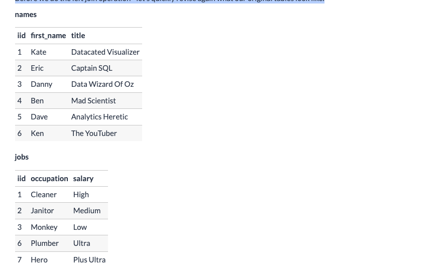
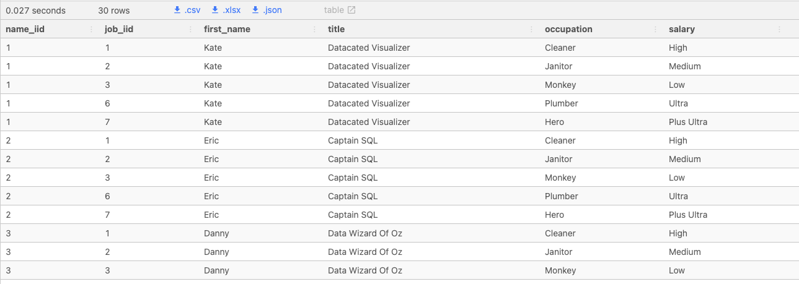
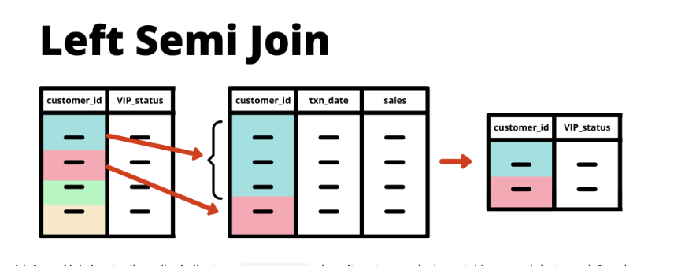
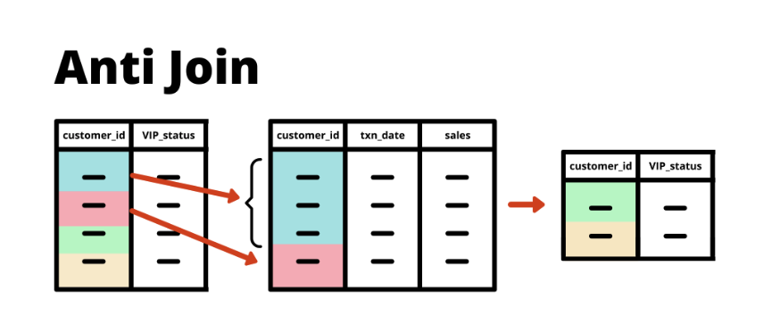
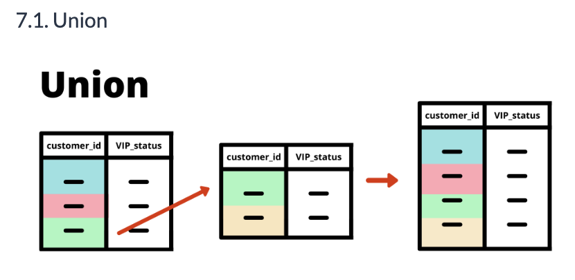
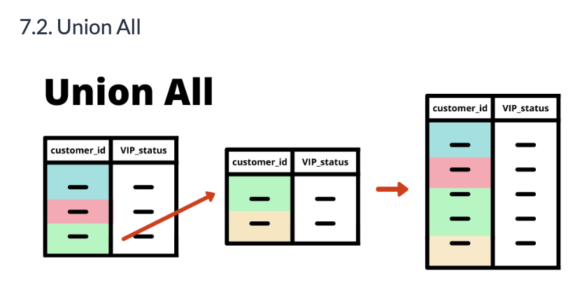
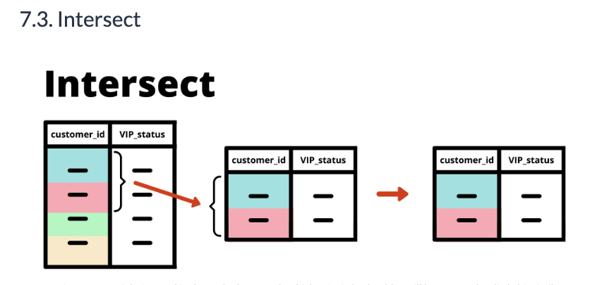
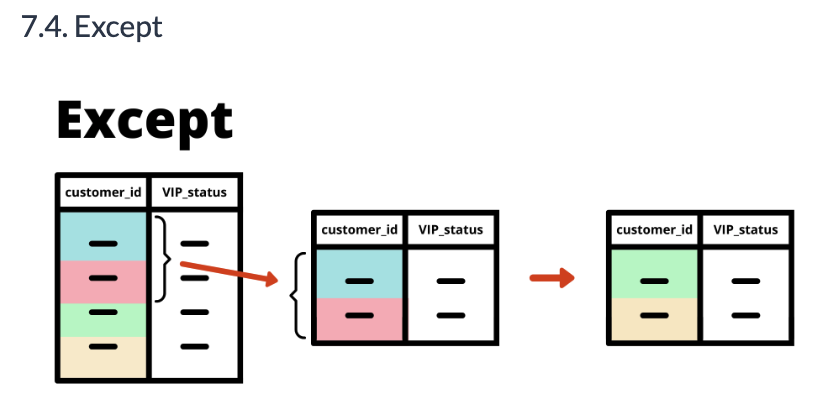
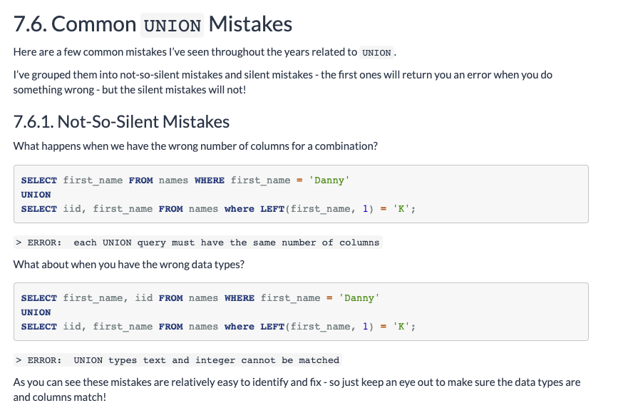
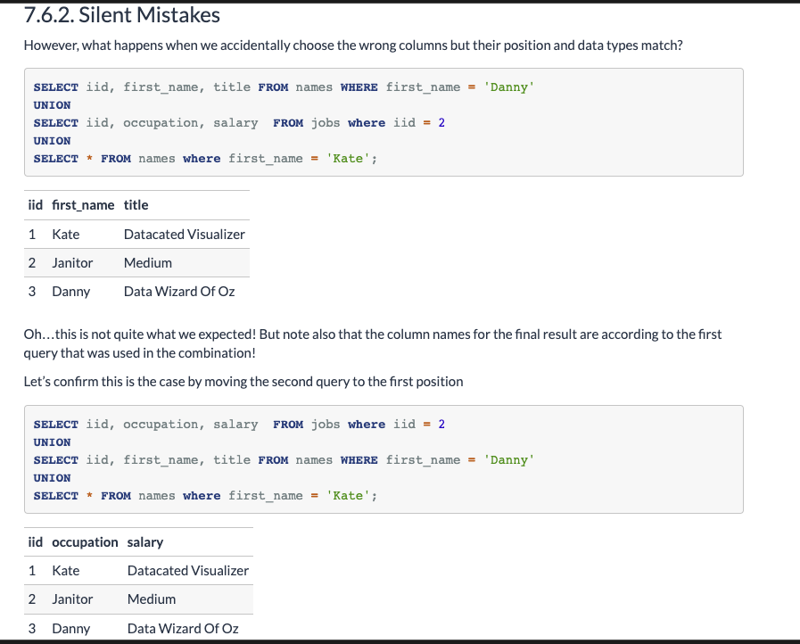

# Introduction To Table Joins

This tutorial will be my attempt to simplify all the things I wish I was shown when I first encountered joins - I really hope that this will help you!

Table joins help us access rows from multiple datasets in a single query - did you know that they are actually implementing low level relational algebra transformations?

Luckily for us, all that crazy math is abstracted away and we just need to understand the different types of joins we can use to combine different datasets.

In this following gentle introduction we will use 2 simple datasets to experiment and explore different types of joins. I’ve also created some visual representations of each type of join to help simplify the learning process as much as possible.

---

<br>

## Sample Datasets
For these following join examples let’s quickly generate some data about some popular influencers in the data world to demonstrate all of the various types of table joins we can perform.

### Table : Name
|iid|first_name|title|
|---|-----|------|
|1|Kate|Datacated Visualizer|
|2|Eric|Captain SQL|
|3|Danny|Data Wizard Of Oz|
|4|Ben|Mad Scientist|
|5|Dave|Analytics Heretic|
|6|Ken|The YouTuber|

### Table :  Jobs
|iid|occupation|salary|
|---|-----|------|
|1|Cleaner|High|
|2|Janitor|Medium|
|3|Monkey|Low|
|6|Plumber|Ultra|
|7|Hero|Plus Ultra|

<br>

You may also notice that the first column is not `id` but in fact it’s `iid` - you can think of it as standing for “Influencer ID” if you like!

I did this because I realised that the code highlighting for `id` didn’t look nice because it’s actually a `SQL keyword` - which you should technically avoid when naming columns in new tables or when you’re renaming columns using aliases!

---

<br>

### Create Sample Tables In SQL
```sql
DROP TABLE IF EXISTS names;
CREATE TEMP TABLE names AS
WITH input_data (iid, first_name, title) AS (
 VALUES
 (1, 'Kate', 'Datacated Visualizer'),
 (2, 'Eric', 'Captain SQL'),
 (3, 'Danny', 'Data Wizard Of Oz'),
 (4, 'Ben', 'Mad Scientist'),
 (5, 'Dave', 'Analytics Heretic'),
 (6, 'Ken', 'The YouTuber')
)
SELECT * FROM input_data;

DROP TABLE IF EXISTS jobs;
CREATE TEMP TABLE jobs AS
WITH input_data (iid, occupation, salary) AS (
 VALUES
 (1, 'Cleaner', 'High'),
 (2, 'Janitor', 'Medium'),
 (3, 'Monkey', 'Low'),
 (6, 'Plumber', 'Ultra'),
 (7, 'Hero', 'Plus Ultra')
)
SELECT * FROM input_data;
```
* Note here that the `SELECT` statements following the temp table creation were needed
* Querying the CTE to make the temp table available for future queries

```sql
SELECT * FROM jobs;
```
|iid|occupation|salary|
|---|-----|------|
|1|Cleaner|High|
|2|Janitor|Medium|
|3|Monkey|Low|
|6|Plumber|Ultra|
|7|Hero|Plus Ultra|

* Looks good on our temp table return!
--- 

<br>

## Basic Table Joins
This section of the tutorial will cover the most common types of joins you will likely encounter on your SQL journey.

These include:

* `INNER JOIN` or `JOIN`
* `LEFT JOIN` or `LEFT OUTER JOIN`
* `FULL JOIN` or `FULL OUTER JOIN`

We also the various types of conditions we can use for the ON clause for each of our joins.

<br>

### The Inner Join
An `INNER JOIN` or `JOIN` is used to get the intersection between two tables and return only the **matching** records.

In the following example - we join names and jobs on the iid column to get first names and occupation columns in the same query.

```sql
SELECT
  names.iid,
  names.first_name,
  names.title,
  jobs.occupation,
  jobs.salary
FROM names
INNER JOIN jobs
  ON names.iid = jobs.iid;
```
|iid|first_name|title|occupation|salary|
|----|------|-------|--------|-------|
|1|Kate|Datacated Visualizer|Cleaner|High|
|2|Eric|Captain SQL|Janitor|Medium|
|3|Danny|Data Wizard of Oz|Monkey|Low|
|6|Ken|The YouTuber|Plumber|Ultra|

<br>

Notice how only 4 records remain once we perform the `INNER JOIN` - this is essentially performing an intersection of the two datasets which meets the condition inside the `ON` clause.

When we inspect our original `names` and `jobs` tables - we can see that there are some mismatches between the missing `iid` records in the jobs table

In this case our `ON` clause or join condition is that the iid column is equal in both the names and the jobs table

<br>

### Inner Join & Join Difference
One common question we see a lot - is there any difference between `INNER JOIN` and `JOIN`?

Out in the wild - you may see the `INNER JOIN` in many SQL examples on the internet as just `JOIN` instead of the explicit `INNER JOIN` - these are actually the same thing and will execute exactly the same!

However - for readability and explicitness - it is **recommended** to always be specific about which type of join you are using so I would actually suggest to avoid using JOIN by itself and to use `INNER JOIN` instead.

An additional caveat - if the team that you are working with really wants you to use JOIN instead of INNER JOIN then it might be a good iidea to fit in and go with the flow! Change can take time for well-established habits to change sometimes!

You might also have noticed how I’ve also included the `names` and `jobs` table references in front of each column in the previous `SELECT` statement which I’ve also shown directly below this passage. This sort of referencing is considered best practice albeit it’s honestly slightly verbose!
* Aliases can be used commonly here

<br>

#### ... Aside on References
Honestly this bad habit or poor practice of skipping the table reference in front of columns or using a `SELECT table.*` without specifying exact table columns in any SQL join query is a real pet peeve of mine!

When reading other people’s code - it is actually really difficult to track down just exactly where specific output columns come from, especially when there are lots of columns from multiple table joins!

To make things worse - when you omit the table references, it also makes it really difficult for you to debug your own table joins and having explicit column references can save you lots of time and help you deliver your work faster.

These table references or aliases in front of the SELECT columns in any SQL query are critical and I implore you to always take the time and care to always add them into your queries!

It is one of the more subtle traits of highly effective SQL developers and data professionals - so be sure to focus on these little things to really improve the quality of your code.

.... Moving On!


<br>

### Left Join
The `LEFT JOIN` or `LEFT OUTER JOIN` is our second super common basic table join and it is used when you want to keep all the rows or records from the left table and return any matching records from the right table.

Note that these two terms are exactly the same but usually in practice I’ve seen it most commonly used as simply a `LEFT JOIN` but it is something to be aware of!

One of the fundamental concepts for this type of join is that the table on the left is also known as the `“base”` table where all of the rows are retained.

The `“target"` or right hand side table for the join will only return values when there is a match with records from the “base” table. When there is no match - the values for the specific “target” columns will be null for the non-matching rows.

In this following example, we will perform a left join to keep all the records from our base table: names and then add on any matching records in the target jobs table.

Before we do the left join operation - let’s quickly revise again what our original tables look like:



```sql
SELECT
  names.iid,
  names.first_name,
  names.title,
  jobs.occupation,
  jobs.salary
FROM names
LEFT JOIN jobs
  ON names.iid = jobs.iid;
```
|iid|first_name|title|occupation|salary|
|----|------|-------|--------|-------|
|1|Kate|Datacated Visualizer|Cleaner|High|
|2|Eric|Captain SQL|Janitor|Medium|
|3|Danny|Data Wizard of Oz|Monkey|Low|
|4|Ben|Mad Scientist|null|null|
|5|Dave|Analytics Heretic|null|null|
|6|Ken|The YouTuber|Plumber|Ultra|

<br>

* Note that Rows (4 & 5) in the **Names** `"Base"` table do not exist in the `"Target"` table **Jobs** and thus do not have values for the columns from the Jobs [Occupation & Salary] table that are declared in the SQL statement. 
* Any `Base` table row returned in a `LEFT JOIN` not matched in the `Target` will behave in the same manner in having a `NULL` type return in the SQL output


<br>


### Full Join or Full Outer Join
Sometimes there are occasions when you need to get the full combination of both tables to include all the rows and columns.

Sometimes you might also want the same behaviour as the previous left join but have both tables used as a “base” table where all the rows are kept from both tables.

This is where the full join or full outer join comes into play - one thing to note is that they mean exactly the same thing, similar to how the join and inner join are the same.

This is what the output looks like for a full join between names and jobs - notice the additional alias applied to names.iid and jobs.iid as well as the relationships between their raw values in the resulting output below:

```sql
SELECT
  names.iid AS name_id,
  jobs.iid AS job_id,
  names.first_name,
  names.title,
  jobs.occupation,
  jobs.salary
FROM names
FULL JOIN jobs
  ON names.iid = jobs.iid;
```
|name_id|job_id|first_name|title|occupation|salary
|----|------|-------|--------|-------|-----|
|1|1|Kate|Datacated Visualizer|Cleaner|High|
|2|2|Eric|Captain SQL|Janitor|Medium|
|3|3|Danny|Data Wizard Of Oz|Monkey|Low|
|4|null|Ben|Mad Scientist|null|null|
|5|null|Dave|Analytics Heretic|null|null|
|6|6|Ken|The YouTuber|Plumber|Ultra|
|null|7|null|null|Hero|Plus Ultra|

<br>

* The null values above in the `FULL JOIN` indicate where there isn't a matching key in both tables being joined and thus the value from that join is null as it doesn't exist in the other table 

<br>


### Cross Join
A `cross join` creates a full combination of all the rows in both tables that are being joined. This type of join is also referred to as a cartesian join which is taken from the original mathematical transformation - the cartesian product of two sets!

The cross join is not so common in practice as it is usually quite an expensive operation when joining large tables but it can be used quite effectively when you actually need all the combinations of 2 tables for specific purposes.

In our example - let’s imagine that for some reason, we wished to cross join the names and jobs table:

* Output from below cross join leaves the values from the `base` table row and takes the alterations from the other columns in the `target` column from the other rows and adds those target table column unique value sets
* Review the Datasets (tables) above and take a look at Kate's unique rows showing the other unique value sets from the target table being joined



<br>

### Alternative Inner Join Syntax
Additionally - this is actually quite a common usage to `INNER JOIN` tables implicitly using a `WHERE` filter instead of using the regular `INNER JOIN` and `ON` clauses.

However, although it is common - I would not recommend to implement your joins in this way as it is not always super clear to the reader just exactly what sort of join you are trying to implement and would recommend you to stick with the regular `INNER` and `LEFT` join implementations instead of the following example (but I thought it would be interesting to share with you the code anyway just so you can see the differences!)

```sql
SELECT
  names.iid as name_iid,
  jobs.iid as job_iid,
  names.first_name,
  names.title,
  jobs.occupation,
  jobs.salary
FROM names, jobs
WHERE
  names.iid = jobs.iid;
```

<br>

### Combining Manual Input
Sometimes cross joins can also be used in interesting ways to create combinations of manual column values like in this following CTE example:

When you’re reading the below query - the `||` characters are called **“pipes”** and are used to concatenate or combine text strings together into a single text column.

```sql
WITH favorite_things (animal_name) AS (
VALUES
  ('Purple Elephant'),
  ('Yellow Sea Cucumber'),
  ('Turquoise Gorilla'),
  ('Invisible Unicorn')
)
SELECT
  first_name || ' Likes ' || animal_name || 's!' AS text_output
FROM names, favorite_things
WHERE first_name = 'Danny';
```
|text_output|
|-----|
|Danny Likes Purple Elephants!|
|Danny Likes Yellow Sea Cucumbers!|
|Danny Likes Turquoise Gorillas!|
|Danny Likes Invisible Unicorns!|

<br>

In summary, there is a time and place for cross joins - but in general, we should rely on more explicit and readable joins like the `INNER`, `LEFT` or some of the upcoming `advanced joins`.


---

<br>


## Table Aliases For Joins
Let’s now introduce aliases into our table joining toolkit to make our SQL queries slightly less verbose.

These aliases are exactly the same as when we used aliases to rename our columns but this time we can do it with entire tables (as well as subqueries and CTEs too!)

There are a few different competing theories about how we should properly name our table aliases - so I’ll share with you a few different variations to help you decide which method you prefer most!

A word of caution though - in practice I recommend you work closely with your team members to agree upon a standard naming convention or practice so all your team’s code will look perfect and uniform.

It’s always a good discussion to have with your coworkers about coding standards as clean code is just like keeping your room clean - not everyone does it but it sure looks nice!


<br>


### First Letter Aliasing
Sometimes we’ll be recommended to use the first letter to alias tables - however I’ve found that this gets rather interesting when you have multiple tables that start with the same letter as you cannot assign the same alias more than once.

```sql
SELECT
  n.iid as name_iid,
  j.iid as job_iid,
  n.first_name,
  n.title,
  j.occupation,
  j.salary
FROM names AS n
FULL JOIN jobs AS j
  ON n.iid = j.iid;
```

#### Food for Thought
Let’s imagine that I have now aliased both names and jobs as n for fun to see what happens
```sql
SELECT
  n.iid AS name_iid,
  n.iid AS job_iid,
  n.first_name,
  n.title,
  n.occupation,
  n.salary
FROM names AS n
FULL JOIN jobs AS n
  ON n.iid = n.iid;
```
Running this query returns an error: `table name "n" specified more than once`

More forms of first letter aliasing looks like this for tables with underscores in their names - which is super common when working with enterprise databases!

So imagine we have a table called customer_sales_daily - the first letter theory means that we should alias this table using customer_sales_daily AS csd

<br>

#### And a Little More
Another example when dealing with schemas that are included in the table reference might include `financial.customer_sales_daily AS fcsd`

As you can see this starts getting really really confusing once you have massive table names - especially when you need to include all of their references in the SELECT expressions like in the example query below:

```sql
SELECT
  fcsd.user_id,
  fcnd.first_name,
  fcnd,last_name
FROM financial.customer_sales_daily AS fcsd
INNER JOIN financial.customer_name_details AS fcnd
  ON fcsd.customer_id = fcnd.customer_id
```

So is there another better way?

<br>

### Logical Aliasing
Another school of thought is to use logical names to alias tables to make it easier for the person reading the code to comprehend what’s going on. In general - this is usually a great idea although it requires a bit of mental tracking to remember which table is linked to the logical name.

In our original example with the names and jobs - as the table names are straightforward we would probably just use the same names - however for our made up financial database example - we might want to use something like this instead

```sql
SELECT
  sales.user_id,
  names.first_name,
  names.last_name
FROM financial.customer_sales_daily AS sales
INNER JOIN financial.customer_name_details AS names
  ON sales.customer_id = names.customer_id
```

* One last way

### Appearance Order Aliasing
Essentially - this method is to just pop an arbitrary letter of t in front of each table that is aliased and then just to number the tables that appear in order from 1 to the number of tables.

I’m actually not sure if there is an official recommendation for this type of aliasing - I can only share that I’ve used this many many times and I’ve found that this is often the most “logical” method for me and my mentors - especially when we had to deal with massive queries that would join 20+ tables!!!

The logic behind this aliasing is essentially a trade off between keeping an ordered list of tables whilst helping you manage the logic between joins of various tables. I’ve found that keeping the numbers only and ignoring the names of tables and their beginning letters helps me to read through code quickly as I can easily identify which table certain columns originate from and exactly where they were introduced based off the join ordering of tables.

For our example - here is what it would look like:

```sql
SELECT
  t1.iid AS name_iid,
  t2.iid AS job_iid,
  t1.first_name,
  t1.title,
  t2.occupation,
  t2.salary
FROM names AS t1
FULL JOIN jobs AS t2
  ON t1.iid = t2.iid;
```

---

<br>

## Advanced Joins
So I’ve labeled the following joins as “advanced” joins but in all honesty they are not that advanced and it’s more about how often they are used in the workplace.

Honestly most of the times where I’ve seen people use these “advanced” joins on various projects - these people were the experts and advanced practitioners who were serious about joining efficiency. And frankly - we should ALL be super serious about join efficiency as it is one of THE most sought after skills within the SQL world!

When going through these types of joins - try to compare them to the previous basic joins we discussed and understand the differences between them. This is the key for understanding these very important joins!

We will cover the following new types of joins in this section:

* LEFT SEMI JOIN or WHERE EXISTS
* ANTI JOIN or WHERE NOT EXISTS

The main purpose of using these advanced joins is to 
* remove/exclude rows from a table where specific column values based off a separate lookup table.

They also have the added benefit of helping eliminate some unexpected behaviour when there are **duplicates** in the “target” table or in join operations.

To better understand these new joins, we must first take a detour and revisit duplicates which we touched on earlier Data Exploration part of the Serious SQL course!

<br>

### Dealing w/Duplicates ... Again with Joins??
This might seem like an interesting detour - but stay with me as this section will delve deeper into how duplicates can really mess up your table joins - often without you realizing until it’s too late!

In this section of the tutorial, we will explore just exactly what this impact is and what we should keep in mind when performing any table joins.

Firstly let’s amend the jobs table by adding a few duplicates in the jobs table - let’s imagine that it’s from some data entry issues!

I’ve added an extra row for iid = 1 and iid = 3 - so although this is not a complete duplicate - it does create a duplicate record in the iid column which we are going to join on. This should throw in a bit of curve ball to our joins now!

* New Jobs Table

|iid|occupation|salary|
|----|-----|-----|
|1|Cleaner|High|
|1|Cleaner|Very High|
|2|Janitor|Medium|
|3|Monkey|Low|
|3|Monkey|Very Low|
|6|Plumber|Ultra|
|7|Hero|Plus Ultra|

```sql
CREATE TEMP TABLE new_jobs AS
WITH input_table (iid, occupation, salary) AS (
 VALUES
 (1, 'Cleaner', 'High'),
 (1, 'Cleaner', 'Very High'),
 (2, 'Janitor', 'Medium'),
 (3, 'Monkey', 'Low'),
 (3, 'Monkey', 'Very Low'),
 (6, 'Plumber', 'Ultra'),
 (7, 'Hero', 'Plus Ultra')
)
SELECT * FROM input_table;
```

All of the SQL code snippets below will be using this `new_jobs` table instead of the original jobs table to demonstrate the differences between our basic joins and the new advanced joins.

<br><br>

## Basic Joins With Duplicates

<br>

### Duplicate Inner Join
Basic joins which we covered before will be forced to return every row per matching record. This is the case for both `LEFT JOIN` and `INNER JOIN`

The presence of multiple rows per value in the joining column is **very very very common** in practice so we always need to be extra vigilant anytime we are joining anything!

Let’s see what the impact is when we join our new_jobs table onto our original names table to see what happens.

```sql
SELECT
  names.iid,
  names.first_name,
  names.title,
  new_jobs.occupation,
  new_jobs.salary
FROM names
INNER JOIN new_jobs
  ON names.iid = new_jobs.iid;
```
|iid|first_name|title|occupation|salary|
|----|------|-------|--------|-------|
|1|Kate|Datacated Visualizer|Cleaner|Very High|
|1|Kate|Datacated Visualizer|Cleaner|High|
|2|Eric|Captain SQL|Janitor|Medium|
|3|Danny|Data Wizard of Oz|Monkey|Very Low|
|3|Danny|Data Wizard of Oz|Monkey|Low|
|6|Ken|The YouTuber|Plumber|Ultra|

<br>

* We now have introduced an additional row for both `Kate` and `Danny` in our resulting inner join when we compare to our original join on the non-duplicate jobs table below:

<br>

### Original Inner Join
```sql
SELECT
  names.iid,
  names.first_name,
  names.title,
  jobs.occupation,
  jobs.salary
FROM names
INNER JOIN jobs
  ON names.iid = jobs.iid;
```
|iid|first_name|title|occupation|salary|
|----|------|-------|--------|-------|
|1|Kate|Datacated Visualizer|Cleaner|High|
|2|Eric|Captain SQL|Janitor|Medium|
|3|Danny|Data Wizard of Oz|Monkey|Low|
|6|Ken|The YouTuber|Plumber|Ultra|


<br><br>

### Duplicate Left Join
```sql
SELECT
  names.iid,
  names.first_name,
  names.title,
  new_jobs.occupation,
  new_jobs.salary
FROM names
LEFT JOIN new_jobs
  ON names.iid = new_jobs.iid;
```
|iid|first_name|title|occupation|salary|
|----|------|-------|--------|-------|
|1|Kate|Datacated Visualizer|Cleaner|Very High|
|1|Kate|Datacated Visualizer|Cleaner|High|
|2|Eric|Captain SQL|Janitor|Medium|
|3|Danny|Data Wizard of Oz|Monkey|Very Low|
|3|Danny|Data Wizard of Oz|Monkey|Low|
|4|Ben|Mad Scientist|null|null|
|5|Dave|Analytics Heretic|null|null|
|6|Ken|The YouTuber|Plumber|Ultra|

<BR>

* Last row in new_jobs doesn't come over as expected as it's the `target` table in the left join only grabbing all rows from names
* The row in which the joining key is duplicated brings in the name values twice for the two different jobs in the `new_jobs` table with the single shared id 
* We can see that the same duplicates appear for Kate and Danny just like in the `INNER JOIN` output

<BR>

These duplicates can really really mess up your analysis so what is the best way to deal with them?

This actually really depends on what you need to do with your joins - we cover this purpose driven question in the following tutorial where we delve deeper into joining multiple tables.

For now - to keep things relevant to our advanced table joins - let’s say that we only want to return the valid rows from the names table where the iid appears in the new_jobs table.

This is exactly where our `LEFT SEMI JOIN` comes in!

<br><br>

### LEFT SEMI JOIN

A left semi join is actually really similar to an `INNER JOIN` where it captures only the matching records between left and right tables **BUT** 

* it differs in one very key way: it **only** returns records from the `left table` - no columns or rows from the right table are included in the output.

The following series of SQL snippets will demonstrate the differences and similarities very clearly.

In PostgreSQL Standard SQL, this `LEFT SEMI JOIN` can be expressed using a `WHERE EXISTS` clause but in some other SQL flavours `LEFT SEMI JOIN` can be called directly also.

Take very special attention in the syntax for the query below - it actually differs quite a bit from a regular join operation with the `ON` clause.

The `WHERE` clause inside the surrounding `WHERE EXISTS` is the equivalent of the `ON` clause for a regular join syntax. 

* A handy way to think of it is as a filter for the matching key within the `target` table that exist in our base table (would be names below ... aka what's declared first)
* No values available from the `target` table and 

`WHERE EXISTS` Syntax

The following code can be ran directly in PostgreSQL:
```sql
SELECT
  names.iid,
  names.first_name
FROM names
WHERE EXISTS (
  SELECT iid
  FROM new_jobs
  WHERE names.iid = new_jobs.iid
);
```
|iid|first_name|
|---|-----|
|1|Kate|
|2|Eric|
|3|Danny|
|6|Ken|

* The key thing is that the query within the subquery part of the `WHERE EXISTS` does not actually return any data. The below would have the same output as the table above

```sql
SELECT
  names.iid,
  names.first_name
FROM names
WHERE EXISTS (
  SELECT 1
  FROM new_jobs
  WHERE names.iid = new_jobs.iid
);
```

* Some SQL practitioners will specifically use the `SELECT 1` in their `WHERE EXISTS` to make it clear that actually nothing is being returned - just make sure to add some comments in your code, just in case whoever is reading has never seen a `LEFT SEMI JOIN` before!

<br>

### Alternative Left Semi Understanding
Another way to think of this sort of join is in terms of a regular `LEFT JOIN` with a `DISTINCT` followed by a `WHERE` filter to remove all null values from the resulting joint dataset.

Note that the following query is **quite inefficient** so it is only shown here for explanation purposes - the important point is the `DISTINCT` that is in the first line below:

```sql
SELECT DISTINCT
  names.iid,
  names.first_name
FROM names
LEFT JOIN new_jobs
  ON names.iid = new_jobs.iid
WHERE new_jobs.iid IS NOT NULL;
```
|iid|first_name|
|---|-----|
|6|Ken|
|1|Kate|
|3|Danny|
|2|Eric|

<br>

... OK cool - this looks exactly the same as our previous `WHERE EXISTS` query - but what happens when we drop that `DISTINCT` from the above query?

```sql
SELECT
  names.iid,
  names.first_name
FROM names
LEFT JOIN new_jobs
  ON names.iid = new_jobs.iid
WHERE new_jobs.iid IS NOT NULL;
```
|iid|first_name|
|---|-----|
|1|Kate|
|1|Kate|
|2|Eric|
|3|Danny|
|3|Danny|
|6|Ken|

* Our duplicates are back!

<br><br>

### ANTI JOIN

An `ANTI JOIN` is the opposite of a `LEFT SEMI JOIN` where only records from the left which do not appear on the right are returned - it is expressed as a `WHERE NOT EXISTS` clause in PostgreSQL but similar to the LEFT SEMI JOIN some SQL flavours support a direct ANTI JOIN syntax also.

```sql
SELECT
  names.iid,
  names.first_name
FROM names
WHERE NOT EXISTS (
  SELECT 1
  FROM new_jobs
  WHERE names.iid = new_jobs.iid
);
```
|iid|first_name|
|---|----|
|4|Ben|
|5|Dave|

* Essentially the return here from the `names` table is the unique values within the `base` table that do not have a key in the `target` table (in this example `names`)

<br>

### Popular Alternative for Anti Joins
Here is an alternative way to represent a similar `ANTI JOIN` using a `LEFT JOIN` with a null WHERE filter - we actually see this a lot in practice too:
```sql
SELECT
  names.iid,
  names.first_name
FROM names
LEFT JOIN new_jobs
  ON names.iid = new_jobs.iid
WHERE new_jobs.iid IS NULL;
```
|iid|first_name|
|---|----|
|4|Ben|
|5|Dave|

<br>

* In essence the above `WHERE` clause is looking for a null value from the `LEFT JOIN` in which the `target` table doesn't contain the key (`on` clause match) and is thus ... NULL!

---

<br>

## Joining on Null Values
So what would happen if we try to join tables which have `null` in the joining columns?

In this episode of “Will It Join?” we will create 2 new adjusted tables to check if they will work as expected - to make this even more challenging, let’s keep in those duplicates that we just used for the previous `LEFT SEMI` and `ANTI join` section: 
```sql
DROP TABLE IF EXISTS null_names;
CREATE TEMP TABLE null_names AS
WITH input_data (iid, first_name, title) AS (
 VALUES
 (1,    'Kate',   'Datacated Visualizer'),
 (2,    'Eric',   'Captain SQL'),
 (3,    'Danny',  'Data Wizard Of Oz'),
 (4,    'Ben',    'Mad Scientist'),
 (5,    'Dave',   'Analytics Heretic'),
 (6,    'Ken',    'The YouTuber'),
 (null, 'Giorno', 'OG Data Gangster')
)
SELECT * FROM input_data;

DROP TABLE IF EXISTS null_jobs;
CREATE TEMP TABLE null_jobs AS
WITH input_table (iid, occupation, salary) AS (
 VALUES
 (1,    'Cleaner',    'High'),
 (1,    'Cleaner',    'Very High'),
 (2,    'Janitor',    'Medium'),
 (3,    'Monkey',     'Low'),
 (3,    'Monkey',     'Very Low'),
 (6,    'Plumber',    'Ultra'),
 (7,    'Hero',       'Plus Ultra'),
 (null, 'Mastermind', 'Bank')
)
SELECT * FROM input_table;
```

### Let's See What Joins!

<br>

#### Inner Join?
```sql
SELECT
  names.iid,
  names.first_name,
  names.title,
  jobs.occupation,
  jobs.salary
FROM null_names AS names
INNER JOIN null_jobs AS jobs
  ON names.iid = jobs.iid;
```
|iid|first_name|title|occupation|salary|
|----|------|-------|--------|-------|
|1|Kate|Datacated Visualizer|Cleaner|Very High|
|1|Kate|Datacated Visualizer|Cleaner|High|
|2|Eric|Captain SQL|Janitor|Medium|
|3|Danny|Data Wizard of Oz|Monkey|Very Low|
|3|Danny|Data Wizard of Oz|Monkey|Low|
|6|Ken|The YouTuber|Plumber|Ultra|

* Doesn't Join for an `INNER JOIN`

<br>

#### Left Join
* `null_names` as the base
```sql
SELECT
  names.iid,
  names.first_name,
  names.title,
  jobs.occupation,
  jobs.salary
FROM null_names AS names
LEFT JOIN null_jobs AS jobs
  ON names.iid = jobs.iid;
```
|iid|first_name|title|occupation|salary|
|----|------|-------|--------|-------|
|1|Kate|Datacated Visualizer|Cleaner|Very High|
|1|Kate|Datacated Visualizer|Cleaner|High|
|2|Eric|Captain SQL|Janitor|Medium|
|3|Danny|Data Wizard of Oz|Monkey|Very Low|
|3|Danny|Data Wizard of Oz|Monkey|Low|
|4|Ben|Mad Scientist|null|null|
|5|Dave|Analytics Heretic|null|null|
|6|Ken|The YouTuber|Plumber|Ultra|
|null|Giorno|OG Data Gangster|null|null|

* null id types don't join data but `NULL` data in base table will be visible as well as null columns from the `target` table that don't have a matching key in the `base` table

<br>

#### Left Semi Join
* Again here this the filter that only ever reveals data from the `base` table that found a matching key in the `target` table
```sql
SELECT
  null_names.*
FROM null_names
WHERE EXISTS (
  SELECT 1
  FROM null_jobs
  WHERE null_names.iid = null_jobs.iid
);
```
|iid|first_name|title|
|----|------|-------|
|1|Kate|Datacated Visualizer|
|2|Eric|Captain SQL|
|3|Danny|Data Wizard of Oz|
|6|Ken|The YouTuber|

* It does not join either

<br>

#### Anti Join
* Again this is the equivalent of `NOT IN` target table and would be unique just to the base table
```sql
SELECT
  null_names.*
FROM null_names
WHERE NOT EXISTS (
  SELECT iid
  FROM null_jobs
  WHERE null_names.iid = null_jobs.iid
);
```
|iid|first_name|title|
|----|------|-------|
|4|Ben|Mad Scientist|
|5|Dave|Analytics Heretic|
|null|Giorno|OG Data Gangster

* It does not join either
* A note, should you forget the `NOT` you would get a semi-match as the `NOT` can't evaluate the null value. That's not how to write an `ANTI JOIN` so just keep the `NOT` and no worries

<br>

### Quick Null Notes
* Prior to performing joins across your dataset it's best to address how to handle any `NULL` type value in such tables


---

<br>

## IN and NOT IN
`IN` and `NOT IN` clauses are very popular ways to filter datasets when used with a `WHERE` clause - so why don’t we rely on these logical conditions instead of joins?

Logically an `IN` is essentially doing what a `WHERE EXISTS` is doing - and `NOT IN` is equivalent to an `ANTI JOIN` - in fact the underlying execution plan created by the PostgreSQL optimizer is exactly the same under certain conditions.

However there is one **VERY IMPORTANT** thing to note and it has to do with null values!

<br>

### IN Instead of WHERE EXISTS
```sql
SELECT
  null_names.*
FROM null_names
WHERE null_names.iid IN (
  SELECT iid
  FROM null_jobs
);
```
|iid|first_name|title|
|----|------|-------|
|1|Kate|Datacated Visualizer|
|2|Eric|Captain SQL|
|3|Danny|Data Wizard of Oz|
|6|Ken|The YouTuber|

* So this `IN` does work even in the presence of nulls - let’s see if it works with `NOT IN` too
  + A handy way to think of the `IN` is similar to a join in which the matched keys (.iid) is checked for 

<br>

### NOT IN instead of WHERE NOT EXISTS
```sql
SELECT
  null_names.*
FROM null_names
WHERE null_names.iid NOT IN (
  SELECT
    iid
  FROM null_jobs
);
```
* This will not return any rows
  + But ... We have  `IDs` in names not in our `target` table!

<br>

That’s odd…it actually returns us no records!

Is it something to do with the duplicates or `null` values?

* If we were to just pass the ids in a list what would we get?
  * Ids would be from our table in the subquery

<br>

* [1, 1, 2, 3, 3, 6, 7, null] - These are our ID values that would be within the subquery above

<br>

#### NULL Out of the IN Clause
```sql
SELECT
  null_names.*
FROM null_names
WHERE null_names.iid NOT IN (
  1, 1, 2, 3, 3, 6, 7
);
```
|iid|first_name|title|
|---|-----|-----|
|4|Ben|Mad Scientist|
|5|Dave|Analytics Heretic|


* When we manually enter those values (even if they are **duplicated**!) it works!
* If we we're to add the `null` back ...

```sql
SELECT
  null_names.*
FROM null_names
WHERE null_names.iid NOT IN (
  1, 1, 2, 3, 3, 6, 7, null
);
```
* We are back to no rows
* That nulllllllll (KHAN VOICE)

<br>

#### What Gives?
Technically - a `null` value does not actually represent a value itself - rather it is an unknown value!

When we are performing this `NOT IN` - the underlying problem is how the SQL engine tries to compare this unknown null value with other non-null values.

<br>

### So ... Nulls?
* We saw that when unknown ... a `NULL` value can sure have some impact on the mechanics of a query that on it's own works (ex : above when we manually add values) when we test some of the values.
* To keep things simple and less prone to issues - try to always stick with `LEFT SEMI JOIN` and `ANTI JOIN` instead of `IN` and `NOT IN` where you do not know what exact values will appear for the `IN` subquery. 

<br>

### Just ... One Last Section 


<br>

---

## Set Operations
There are 3 distinct set operations used to combine results from 2 or more `SELECT` statements.

* UNION (& UNION ALL)
* INTERSECT
* EXCEPT

These 3 methods are pretty straightforward however as it matches directly with set notation, the only condition is that all of the `SELECT` result sets **must** have columns with the same data types - the column names have no impact.
* Types .. not Names!

Let’s examine the following sample queries:

<br>

#### Quick Table Refresher
```sql
SELECT * FROM names;
```
|iid|first_name|title|
|---|-----|-------|
|1|Kate|Datacated Visualizer|
|2|Eric|Captain SQL|
|3|Danny|Data Wizard of Oz|
|4|Ben|Mad Scientist|
|5|Dave|Analytics Heretic|
|6|Ken|The YouTuber|
|null|Giorno|OG Data Gangster|

<br>


### Union

Simply put - `UNION` will be the union between two sets or `SELECT` results.
```sql
SELECT * FROM names where first_name = 'Danny'
UNION
SELECT * FROM names where first_name = 'Kate';
```
|iid|first_name|title|
|---|-----|------|
|1|Kate|Datacated Visualizer|
|3|Danny|Data Wizard of Oz|

<br>

### Union All

So the question you must have right now is: What is the difference between `UNION` and `UNION ALL`?

Simply - `UNION` runs a **DISTINCT** on the output result whilst `UNION ALL` does not.

This means that `UNION ALL` will be more performant as it does not run a relatively expensive **DISTINCT**

The above question is a popular SQL interview questions, so please keep this in mind!

Let’s demonstrate with a simple example:

If we change the queries above to just filter on 'Danny' and try running `UNION` - what do we see?

```sql
SELECT * FROM names where first_name = 'Danny'
UNION
SELECT * FROM names where first_name = 'Danny';
```
|iid|first_name|title|
|---|-----|------|
|3|Danny|Data Wizard of Oz|

* Only returns one row
* What about with a `UNION ALL`

```sql
SELECT * FROM names where first_name = 'Danny'
UNION ALL
SELECT * FROM names where first_name = 'Danny';
```
|iid|first_name|title|
|---|-----|------|
|3|Danny|Data Wizard of Oz|
|3|Danny|Data Wizard of Oz|

<br>

#### Few **`UNION ALL`** Closing Thoughts
Now - a few things to consider when you need to combine the datasets in practice:

* Do I have duplicates in my individual results set?
* Do I have duplicates in my overall results set after UNION ALL?
* Should I refactor the query to generate distinct values or use a GROUP BY?

<br>

### Intersect

Intersect is pretty straightforward in that only the records which exist in both tables will be returned - a little bit similar to an `INNER JOIN` don’t you think?

In the following example - let’s try to find the intersection between all the records in names and a filtered dataset where only the records where the first name starts with ‘K’ are included:

```sql
SELECT * FROM names
INTERSECT
SELECT * FROM names where LEFT(first_name, 1) = 'K';
```
|iid|first_name|title|
|---|-----|------|
|1|Kate|Datacated Visualizer|
|6|Ken|The YouTuber|

<br>

### Except

Except is the equivalent of the `ANTI JOIN` in set notation. Let’s try running `EXCEPT` with the same filtered names starting with ‘K’ again to see what we get:

```sql
SELECT * FROM names
EXCEPT
SELECT * FROM names where LEFT(first_name, 1) = 'K';
```
|iid|first_name|title|
|---|-----|------|
|3|Danny|Data Wizard of Oz|
|4|Ben|Mad Scientist|
|5|Dave|Analytics Heretic|
|2|Eric|Captain SQL|
|null|Giorno|OG Data Gangster|

* Also note that `EXCEPT` has a default `DISTINCT` built in so it’s doing the same deduplication as the `UNION`

<br>

### Multiple Combinations!
We can also combine these with 2+ queries like so - just be aware that all of these set operations will be executed in order from top to bottom!

```sql
SELECT * FROM names WHERE first_name = 'Danny'
UNION
SELECT * FROM names where LEFT(first_name, 1) = 'K'
EXCEPT
SELECT * FROM names where first_name = 'Kate';
```
|iid|first_name|title|
|---|-----|------|
|3|Danny|Data Wizard of Oz|
|6|Ken|The YouTuber|

* Note how Kate is EXCEPTED 

<br><br>

### Common Union Mistakes



---

<br>

### Conclusion / Summary
If you need a TL;DR despite reaching the end of this tutorial, here it is:

* Use `LEFT JOIN` when you need to keep all rows on the left table but want to join on additional records from the right table
* Be wary of which table is on the left vs right side of the `LEFT JOIN` as all left table records will be retained regardless of the join condition
* Use `INNER JOIN` when you need the intersection of both left and right tables and you also need to access columns from the right table
* Use `FULL OUTER JOIN` or `FULL JOIN` when you need to combine both left and right tables completely (similar to a `UNION ALL` operation without deduplication)
* Use `CROSS JOIN` when you need the cartesian product or the complete combinations of left and right tables
* Be careful of duplicate join keys from left and right tables when using `LEFT` and `INNER` and `CROSS` joins
* Use `LEFT SEMI JOIN` or `WHERE EXISTS` when you only need to keep records from the left table that exist in the right table
* Use `ANTI JOIN` when you need to remove exclude records from the left table based off the right table
* Use `UNION` to get the deduplicated or distinct combination of two tables or SQL query outputs - column positions and data types must align!
* Use `UNION ALL` to get the unduplicated combination of two tables or SQL query outputs - column positions and data types must align!
* Use `INTERSECT` and `EXCEPT` for set operations between tables or SQL query outputs - column positions and data types must align!
* **=, >=, <=, >, <** or `BETWEEN` conditions can be used for the `ON` clause for table joins
* Use aliases and/or explicit references when joining tables and selecting columns to improve readability and comprehension of code, especially when joining multiple tables in one SQL statement


