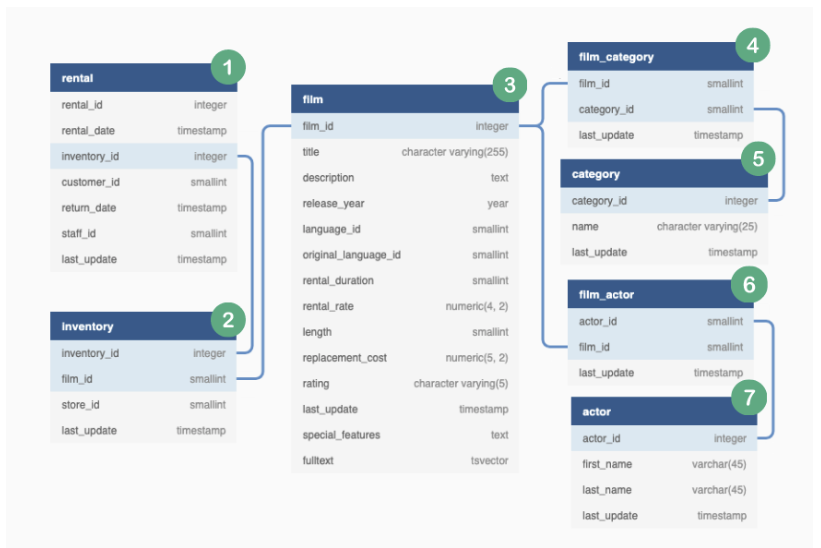

# Data Overview
It would probably be a smart idea to take a look at the data we have to play with before diving straight into solution mode for our business requirements.

Luckily for us - the Analytics team at DVD Rental Co have created an `entity-relationship diagram` (also known as an `“ERD”`) to highlight which tables in the dvd_rentals schema we should focus on.

---

<br>

## Data Exploration


<br>

### Entity-Relationship Diagrams:
* A super popular tool/visualization in the workplace and you will most definitely come across them many many times!

There are a few things to note about `ERDs`:
* All column names as well as their data type are shown for each table
* Table indexes and foreign keys are usually highlighted to show the linkages between tables

Let’s walk through these `dvd_rentals` tables together and communicate our findings in some simple terms. This style of talking about datasets and their relationships is really useful when you need to actually tackle problems in the workplace - take note of some of the wording and phrases and try to re-use them where relevant when discussing datasets and `ERDs` in your daily practice.

---

<br>

## First Table : Rental
This dataset consists of rental data points at a customer level. There is a unique sequential `rental_id` for each record in the table which corresponds to an individual `customer_id `purchasing or renting a specific item with a `inventory_id`. There is also information about the `rental_date` and `return_date` as well as which staff member served the customers.

The `last_update` field is an internal database timestamp for when the datapoints were inserted into the table.

In the **ERD** - we can see that there is a linkage between this rental table with the inventory table via the inventory_id field.

---

<br>

## Second Table : Inventory
This `inventory` dataset consists of the relationship between specific items available for rental at each store - note that there may be multiple inventory items for a specific film at a unique store.

In other words - say a specific film like “Harry Potter & The Chamber of Secrets” might have 4 copies at store #1 and an additional 4 copies in store #2 - each record in this dataset will have a separate `inventory_id` whilst the `film_id` will all be the same and the `store_id` changes according to the store number.

This `inventory` table is linked to the previous `rental` table via the `inventory_id` which is an integer datatype.

The next table we will investigate is how we will link these inventory items to a specific film via the `film` table and the `film_id` column.

---

<br>

## Third Table : Film
The third table in our **ERD** is the `film` table which helps us identify the title of films rented by DVD Rental Co customers. The film title, description as well as special features and other fields are available for further analysis.

One specific column which might be of interest is the `rental_rate` column which represents the cost of each rental - something which could be useful if we wanted to look at the sales performance of DVD Rental Co.

Note that there are a few complex data types in the last few columns of this table - you can practically ignore them for the time being but these more involved data structures do occur in real life too so it’s just something you need to be aware of.

We will use the `film_id` column to help us join onto table #4 `film_actor` to help us identify which actors appeared in each film.

____

<br>

## Fourth Table : Film_Category
The 4th table in the **ERD** is `film_category` which shows the relationship between `film_id` and `category_id`.

Multiple films will appear in each relevant `category_id` which will map one-to-one with our next table in our ERD, the `category` table.

---

<br>

## Fifth Table : Category
The 5th table in the ERD is the `category` table which simply contains a one to one mapping between `category_id` and the name of each category.

___

<br>

## Sixth Table : Film_Actor
The 6th table in our ERD is `film_actor` which shows actors who appeared in each film based off related `actor_id` and `film_id` values.

An actor can appear in multiple films and a film can feature multiple actors. This relationship between values is what we usually call a `“many-to-many”` relationship - this is really important to note especially when we are dealing with joins.

---

<br>

## Seventh Table : Actor
The `actor` table simply shows the first and last name for each actor based off their unique `actor_id` - we can trace which films a specific actor appears in by joining this table onto the previously discussed `film_actor` table on the `actor_id` column.

---

<br>

## The End Folks 
We have now covered all the raw datasets required to solve this case study as well as the relationships between the various tables by interpreting the entire entity-relationship diagram (ERD).

In the next tutorial - we will start diving into problem solving mode!


<br>

---

<br>

## Appendix
The ERD used for this tutorial was created using the amazing online tool 

You can try recreating it by copy pasting the code below. I’ve used exactly this code to create the diagram you’ve seen above.

Please feel free to use this as a base to create ERDs of your own for future projects of your own or in the workplace!

Note that there is additional information in the code chunk below regarding the indexes which are optional - but often very useful!


```SQL
Table "rental" {
  "rental_id" integer [not null]
  "rental_date" timestamp [not null]
  "inventory_id" integer [not null]
  "customer_id" smallint [not null]
  "return_date" timestamp
  "staff_id" smallint [not null]
  "last_update" timestamp [not null, default: `now()`]

Indexes {
  inventory_id [type: btree, name: "idx_fk_inventory_id"]
  (rental_date, inventory_id, customer_id) [type: btree, unique, name: "idx_unq_rental_rental_date_inventory_id_customer_id"]
}
}

Table "inventory" {
  "inventory_id" integer [not null, default: `nextval('inventory_inventory_id_seq'::regclass)`]
  "film_id" smallint [not null]
  "store_id" smallint [not null]
  "last_update" timestamp [not null, default: `now()`]

Indexes {
  (store_id, film_id) [type: btree, name: "idx_store_id_film_id"]
}
}


Table "film" {
  "film_id" integer [not null, default: `nextval('film_film_id_seq'::regclass)`]
  "title" "character varying(255)" [not null]
  "description" text
  "release_year" year
  "language_id" smallint [not null]
  "original_language_id" smallint
  "rental_duration" smallint [not null, default: 3]
  "rental_rate" "numeric(4, 2)" [not null, default: 4.99]
  "length" smallint
  "replacement_cost" "numeric(5, 2)" [not null, default: 19.99]
  "rating" "character varying(5)" [default: "G"]
  "last_update" timestamp [not null, default: `now()`]
  "special_features" text
  "fulltext" tsvector [not null]

Indexes {
  fulltext [type: btree, name: "film_fulltext_idx"]
  language_id [type: btree, name: "idx_fk_language_id"]
  original_language_id [type: btree, name: "idx_fk_original_language_id"]
  title [type: btree, name: "idx_title"]
}
}

Table "film_category" {
  "film_id" smallint [not null]
  "category_id" smallint [not null]
  "last_update" timestamp [not null, default: `now()`]
}

Table "category" {
  "category_id" integer [not null, default: `nextval('category_category_id_seq'::regclass)`]
  "name" "character varying(25)" [not null]
  "last_update" timestamp [not null, default: `now()`]
}

Table "film_actor" {
  "actor_id" smallint [not null]
  "film_id" smallint [not null]
  "last_update" timestamp [not null, default: `now()`]

Indexes {
  film_id [type: btree, name: "idx_fk_film_id"]
}
}

Table "actor" {
  "actor_id" integer [not null, default: `nextval('actor_actor_id_seq'::regclass)`]
  "first_name" varchar(45) [not null]
  "last_name" varchar(45) [not null]
  "last_update" timestamp [not null, default: `now()`]

Indexes {
  last_name [type: btree, name: "idx_actor_last_name"]
}
}

-- many to one relationship between rental & inventory
Ref: "rental"."inventory_id" > "inventory"."inventory_id"

-- many to one inventory to film
Ref: "inventory"."film_id" > "film"."film_id"

-- one to one relationship between film_category and film 
Ref: "film_category"."film_id" - "film"."film_id"

-- many to one relationship between film_category and category
Ref: "film_category"."category_id" > "category"."category_id"

-- one to many relationship between film ands film_actor
Ref: "film"."film_id" < "film_actor"."film_id"

-- many to one relationship between film_actor and actor
Ref: "film_actor"."actor_id" > "actor"."actor_id"

-- there is also an additional relationship, however we exclude it to reduce
-- any confusion!

-- many to many relationship between inventory and film_actor
-- however dbdiagram.io only lets you refer to each combination once...
-- so we only show one direction of relationship!
-- Ref: "inventory"."film_id" > "film_actor"."film_id"
```


## Embedded Interactive ERD
In this iframe included below - you can hover over each column to see more information as well as zoom in/out, pan around the space, move tables around by clicking and dragging them, and even edit them on the dbdiagram.io site!

I highly recommend trying this stuff out next time you need to make ERDs for your next data project as it is really simple and quick to generate really nice interactive outputs!

You can also embed interactive ERD diagrams directly as iframes into websites and markdown such as a project Github’s README file - which would be super impressive for prospective hiring managers ;)

For example: I used the following code chunk in a Markdown document to generate this exact iframe below - it should all go on one line really, but I split it across multiple lines to make it easier to read.

```html
<iframe height="400" width="100%"
src='https://dbdiagram.io/embed/5fe1cb6e9a6c525a03bbf839'>
</iframe>
```