# Windows Functions

In this tutorial we will look into window functions which are an absolutely critical component of our marketing analytics case study.

This guide will aim to cover almost everything you’ll need to know about all the `window` functions and how to apply them in multiple different scenarios as you encounter various problems in your data journey.

Previously we have seen some ways to use window functions multiple times throughout Serious SQL so far. We just used the `PERCENT_RANK` and `ROW_NUMBER` window functions in our last SQL problem solving tutorial, however - we are yet to really dig into the details and understand what is actually going on under the hood!

Window functions or analytical functions are used practically everywhere in the data world and they are super useful! However they are not the most simple or intuitive to understand at first - this tutorial is here to help you gain that deep level of understanding.

---

<br>

## Introduction
After failing to truly understand window functions as a junior data analyst - I realised many years later that there was a better way to frame up the learning process.

Some of the main concepts we’ll cover in this section of the tutorial include:

* The different components that make up a window function
* How window functions are different to regular group by functions
* Basic operations we can perform using window functions
* Advanced applications of window functions


**Firstly** - let’s start with some basic definitions. 

<br>

## Basics Components
Window functions are operations or calculations performed on `“window frames”` or put simply, groups of rows in a dataset.

Just a warning that some of these things I’m going to describe in the following section might not instantly make sense, but bear with it - because after the next few following sections, hopefully things will become much clearer!

Window functions consist of the following components:

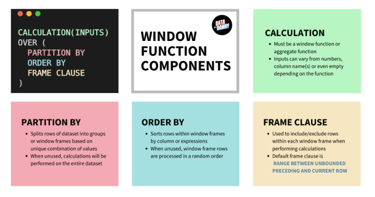

<br>

---

<br>

## Understanding Partition By

One of the easiest ways to understand the how the `PARTITION BY` component of window functions worked was to compare it to a basic `GROUP BY` query.

Let’s start with this super simple example of an aggregate group by sum and its equivalent basic sum window function.

The key things to note are the similarity of the `sum_sales` column output for each example - they are exactly the same!

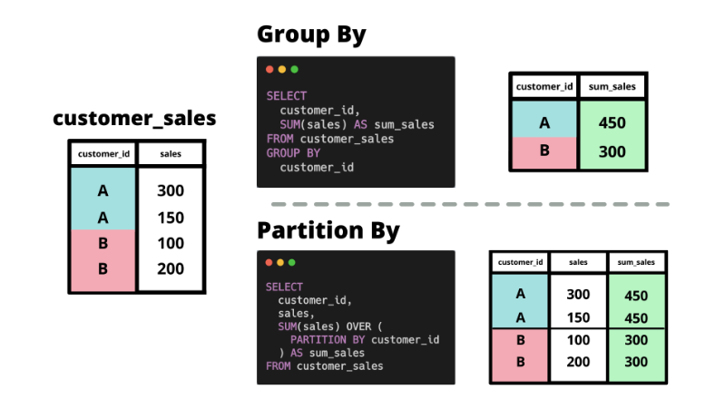

<br>

#### Basic Group By Sum - SQL Exectuion Flow
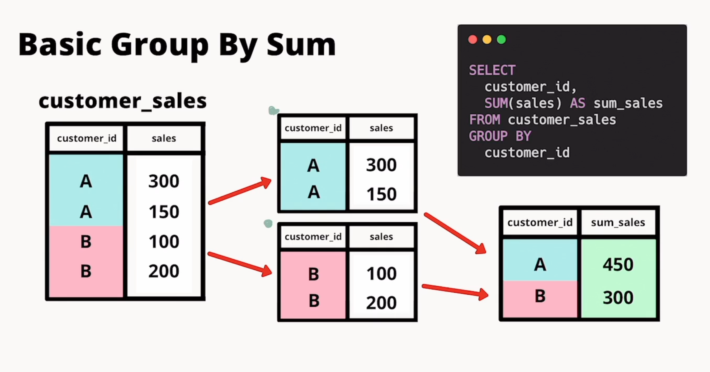

<br>

#### Basic Window Function 
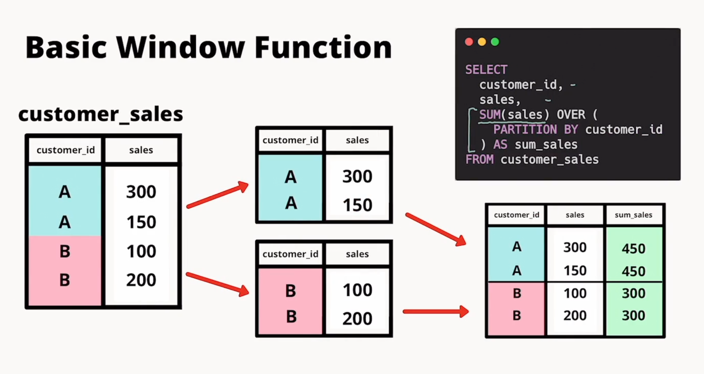

* Main difference is you can see that the while the `Group By` collapses all rows that are grouped together whereas the `Window Function` includes the rows collapsed or grouped together as well as display the `sales` column that the aggregate function is run on 

<br>

#### SQL Code
```sql
DROP TABLE IF EXISTS customer_sales;
CREATE TEMP TABLE customer_sales AS
WITH input_data (customer_id, sales) AS (
 VALUES
 ('A', 300),
 ('A', 150),
 ('B', 100),
 ('B', 200)
)
SELECT * FROM input_data;

-- Group By Sum
-- Note that the ORDER BY is only for output sorting purposes!
SELECT
  customer_id,
  SUM(sales) AS sum_sales
FROM customer_sales
GROUP BY customer_id
ORDER BY customer_id;

-- Sum Window Function
SELECT
  customer_id,
  sales,
  SUM(sales) OVER (
    PARTITION BY customer_id
  ) AS sum_sales
FROM customer_sales;
```
#### Respective Outputs
* `GroupBy`

|customer_id|sum_sales|
|-----|-------|
|A|450|
|B|300|

* `PARTITION BY`

|customer_id|sales|sum_sales|
|-----|-------|----|
|A|300|450|
|A|150|450|
|B|100|300|
|B|200|300|

<br>

### Partition By 2 Columns
We’ve already seen how a single column can be used with the `PARTITION BY` clause - let’s now inspect what happens when we partition by 2 columns.

In the visual example below - you can think of the partitioning as splitting the dataset into smaller groups based on the unique combination of column values from each input to the `PARTITION BY`

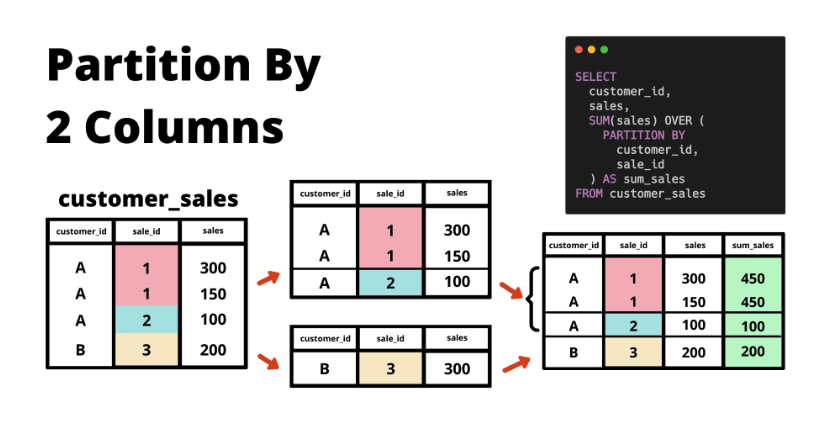

* Also note that we are not restricted to only using columns as inputs, we can use other derived expressions also, just like you would use in a regular SELECT statement.

#### SQL Code
```sql
-- we remove that existing customer_sales table first!
DROP TABLE IF EXISTS customer_sales;
CREATE TEMP TABLE customer_sales AS
WITH input_data (customer_id, sale_id, sales) AS (
 VALUES
 ('A', 1, 300),
 ('A', 1, 150),
 ('A', 2, 100),
 ('B', 3, 200)
)
SELECT * FROM input_data;

-- Sum Window Function with 2 columns in PARTITION BY
SELECT
  customer_id,
  sales,
  SUM(sales) OVER (
    PARTITION BY
      customer_id,
      sale_id
  ) AS sum_sales
FROM customer_sales;
```

|customer_id|sales|sum_sales|
|-----|-------|----|
|A|300|450|
|A|150|450|
|A|100|100|
|B|200|300|

* The `sale_id` is the key take-away here, using it as a secondary **grouping** argument within our `PARTITION BY` only groups the `customer_id` together should it also share the `sale_id`

<br>

### Multiple Level Partition By
We can also use **different levels** for **multiple window functions** in a single query - there is one very specific reason why we usually prefer to use window functions to perform multiple level aggregations in this way compared to other methods.

We also demonstrate the `empty OVER clause` in the query below to calculate the `total_sales` column for our dataset.

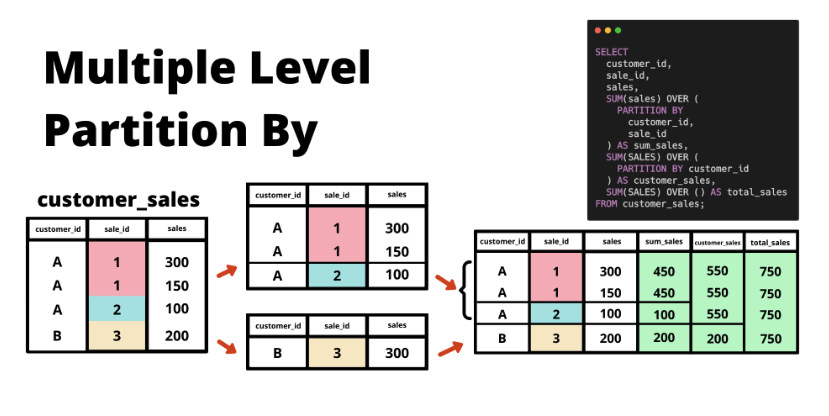

#### SQL Code
```sql
SELECT
  customer_id,
  sale_id,
  sales,
  SUM(sales) OVER (
    PARTITION BY
      customer_id,
      sale_id
  ) AS sum_sales,
  SUM(SALES) OVER (
    PARTITION BY customer_id
  ) AS customer_sales,
  SUM(SALES) OVER () AS total_sales
FROM customer_sales;
```

|customer_id|sale_id|sales|sum_sales|customer_sales|total_sales|
|-----|-------|---------|-----|-------|----|
|A|1|300|450|550|750|
|A|1|150|450|550|750|
|A|2|100|100|550|750|
|B|3|200|200|200|750|

#### Three Window functions
* `sum_sales` is using the multiple `PARTITION` for the customer and specific sale_id
* `customer_sales` is using just the single level `PARTITION` to group customer sales totals even if purchased with a different sale_id
* `total_sales` is the SUM of the entire individual sales column irrespective of the customer or sale identifier
    * empty window frame or entire dataset 

<br>

### Multiple Calculations
We can also apply multiple different window function calculations instead of just using the `SUM` function like we’ve been using for all the previous examples.

In the following example, we demonstrate how to use `AVG` and `MAX` window functions.

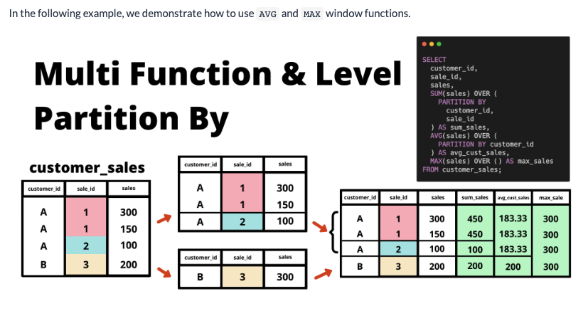
* Below is an example of using multiple aggregations on partitioned groups or over empty window frames (aka entire dataset)

```sql
SELECT
  customer_id,
  sale_id,
  sales,
  SUM(sales) OVER (
    PARTITION BY
      customer_id,
      sale_id
  ) AS sum_sales,
  ROUND(
    AVG(sales) OVER (
        PARTITION BY
         customer_id,
         sale_id
    ),
    2
  ) AS avg_customer_saleid
  -- the average customer sales is rounded to 2 decimals!
  ROUND(
    AVG(sales) OVER (
      PARTITION BY customer_id
    ),
    2
  ) AS avg_cust_sales,
  MAX(sales) OVER () AS max_sales
FROM customer_sales;
```
|customer_id|sale_id|sales|sum_sales|avg_customer_saleid|avg_cust_sales|max_sales|
|-----|-------|---------|-----|-------|----|----|
|A|1|300|450|225.00|183.33|300|
|A|1|150|450|225.00|183.33|300|
|A|2|100|100|100.00|183.33|300|
|B|3|200|200|200.00|200.00|300|

* `sum_sales` get the sum of a parituclar customer and that unique sale_id
* `avg_customer_saleid` average purchase price for a particular customer and that unique sale_id
* `avg_cust_sales` another average purchase price but only partitioned by the unique customer (running average for a customer for each purchase purchase made)
    * Customer A has $550 in our example above and divided by total rows (3) == 183.33
* `max_sales` MAX aggregate function running over the entire dataset (hence the same return for each row)


<br>

### Empty or Missing Partition By
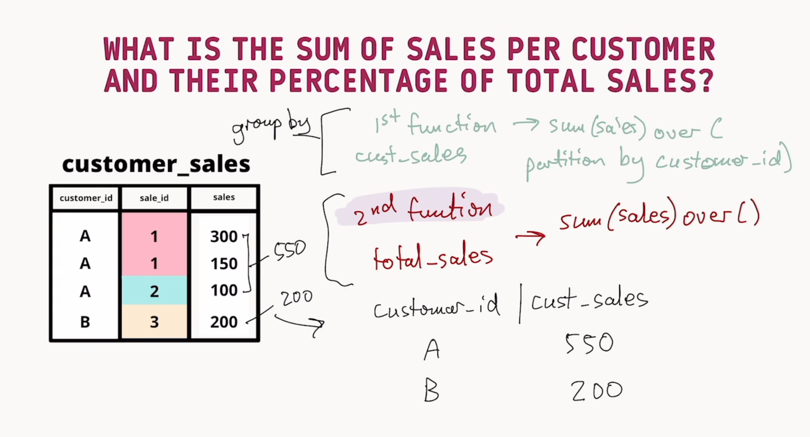
* Challenge from the above sample created sales table is to use both a `window` function and standard `GROUP BY` to achieve the following posed question above

```sql
-- Combine OVER and GROUPBY logic 
SELECT 
  customer_id,
  SUM(sales) AS customer_total_sales,
  ROUND(
    SUM(sales) / SUM(SUM(sales)) 
      OVER(), 
      2) * 100 
      AS customer_percentage_total_sales,
  SUM(SUM(sales)) OVER() AS total_windowf_sales
  FROM customer_sales
  GROUP BY customer_id;
```
|customer_id|customer_total_sales|customer_percentage_total_sales|total_windowf_sales|
|-------|-------|-------|-----|
|A|550|73.00|750|
|B|200|27.00|750|

* The `ROUND` function above quicky summed up
    * the initial `SUM(sales)` is essentialy the alias above (customer_total_sales). This column alias can't be referenced
    * next the `SUM(SUM(sales))` value is our grouped by aggregate  divided by the total SUM value of the subsequent `OVER()` window function
        * Ex : 550 customer A total sales divided by 750 for 73%
* The `OVER()` function runs after the `GROUP BY` to get the total window sales column data 

```sql
-- What is the sum of sales per customer and their percentage of total_sales (Using Groupby with corresponding window function for sum of all sales for percentage)
SELECT
  customer_id,
  SUM(sales) AS customer_sale_total,
  ROUND(
  100 * (SUM(sales) / SUM(SUM(sales)) OVER())
  , 2) AS customer_percentage,
  SUM(SUM(sales)) OVER() AS total_sales
FROM customer_sales
GROUP BY customer_id;
```
* Another similar way to approach for a combination of using the GROUP BY and Window frame total to calculate a percentage

<br>

We mentioned that the default behaviour for `PARTITION BY` when the window function has an empty `OVER` clause is to perform calculations across all the rows of the dataset - in fact, we’ve also used this exact strategy before for parts of our data exploration section earlier!

This is directly copied from the Dealing with Duplicates tutorial earlier when we were inspecting the `health.user_logs` table to calculate the percentage of values of the various measures available in the dataset.

* Let’s also inspect that measure column and take a look at the most frequent values within this column using a `GROUP BY` and `ORDER BY DESC` combo from the last tutorial - let’s also throw in that percentage column that we went through also!


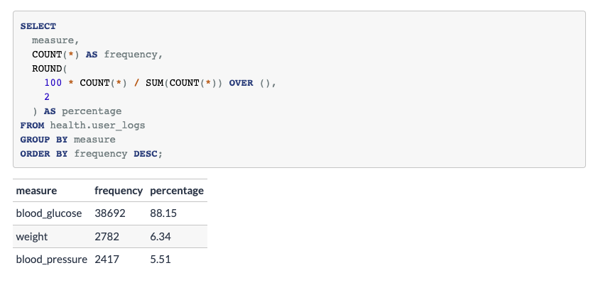

* Like above with our created temp tables, we can use a similar logic to leverage a `GROUPBY` and `OVER` query to pull a different aggregate percentage
* Similar in that the window function includes the aggregate function on the column being grouped by 
    * COUNT(*) gets total frequency counts for each measurement
    * This value is then used and divided by the SUM of all total measurements to give us the respective percentage (38692/43890 == 0.88156)

---

<br>

## SQL Logical Execution Order

In a nutshell - all SQL queries are “ran” in the following order:

1) FROM
    * WHERE filters
    * ON table join conditions
2) GROUP BY
3) SELECT aggregate function calculations
4) HAVING
5) Window functions
6) ORDER BY
7) LIMIT

Note: that the actual execution order might differ slightly from the below due to the SQL optimizer making its own decisions for performance reasons!

We can use our previous query to break this down and understand how it works - can you identify which SQL components we have below?

```sql
SELECT
  measure,
  COUNT(*) AS frequency,
  ROUND(
    100 * COUNT(*) / SUM(COUNT(*)) OVER (),
    2
  ) AS percentage
FROM health.user_logs
GROUP BY measure
ORDER BY frequency DESC;
```

* In the following parts of this tutorial - we will reconstruct our above query from the ground up to see how each component interacts with eachother to build up our understanding of the logical execution order.

<br>

### Basic SELECT statement

First let’s select the `measure` and `value` values from the `health.user_logs` table as our starting point - we’ll also limit this output to the first 10 rows:

```sql
SELECT
  measure,
  measure_value
FROM health.user_logs
LIMIT 10;
```
|measure|measure_value|
|------|-----|
|weight|46.03959|
|blood_glucose|97|
|blood_glucose|120|
|blood_glucose|232|
|blood_pressure|140|
|blood_glucose|166|
|blood_glucose|142|
|weight|129.060012817|
|blood_glucose|138|
|blood_glucose|210|

<br>

### Group By and Aggregate Count

Next let’s add the `COUNT(*)` value and the `GROUP BY` measure into our query - let’s also we’ll remove that LIMIT 10 as we will only have 3 rows in our query output:

```sql
SELECT
  measure,
  COUNT(*) AS frequency
FROM health.user_logs
GROUP BY measure;
```

|measure|frequency|
|-----|------|
|blood_glucose|38692|
|blood_pressure|2417|
|weight|2782|

<br>

### Window Function
Let’s add onto our query by implementing our denominator value for percentage column from our query as a new total column.

We combine our frequency `COUNT(*)` metric with the `SUM` window function and an empty window frame () used with the `OVER` clause.

```sql
SELECT
  measure,
  COUNT(*) AS frequency,
  SUM(COUNT(*)) OVER () AS total
FROM health.user_logs
GROUP BY measure;
```

|measure|frequency|total|
|-----|------|----|
|blood_glucose|38692|43891|
|blood_pressure|2417|43891|
|weight|2782|43891|

* **Reminder** : We can't use the alias of the `COUNT(*)` **frequency** unless we used a CTE or subquery

```sql
-- Query that would return a "column "frequency" does not exist"
SELECT
  measure,
  COUNT(*) AS frequency,
  SUM(frequency) OVER () AS total
FROM health.user_logs
GROUP BY measure;

-- CTE method to perform the operation
WITH summarised_data AS (
SELECT
  measure,
  COUNT(*) AS frequency
FROM health.user_logs
GROUP BY measure
)
SELECT
  measure,
  frequency,
  SUM(frequency) OVER () AS total
FROM summarised_data;

-- Alternative Subquery style
SELECT
  measure,
  frequency,
  SUM(frequency) OVER () AS total
FROM (
  SELECT
    measure,
    COUNT(*) AS frequency
  FROM health.user_logs
  GROUP BY measure
) AS summarised_data;
```

* Produces same table output as above SUM and WINDOW function just above the reminder above

<br>

### HAVING Clause
`HAVING` is used to filter out records based off the `GROUP BY` results - in this example the measure values. It is similar to a WHERE filter but can only be applied to the GROUP BY columns.

Let’s use HAVING measure != 'weight' to see what happens to our query output. Try answering the following question before you take a look at the result “what do you expect to happen to that total value to change?”

```sql
SELECT
  measure,
  COUNT(*) AS frequency,
  SUM(COUNT(*)) OVER () AS total
FROM health.user_logs
GROUP BY measure
HAVING measure != 'weight';
```

|measure|frequency|total|
|-----|------|-----|
|blood_glucose|38692|41109|
|blood_pressure|2417|41109|

* No surprises here (reviewing the order above the  `HAVING` clause excludes the measure not needed before then performing the WINDOW sum count for the resulting return made by `HAVING`

```sql
SELECT
  measure,
  COUNT(*) AS frequency,
  SUM(COUNT(*)) OVER () AS total
FROM health.user_logs
GROUP BY measure
HAVING frequency > 2800;
```

* **ERROR**:  column "frequency" does not exist
LINE 7: HAVING frequency > 2800;
    * Alias not available


```sql
SELECT
  measure,
  COUNT(*) AS frequency,
  SUM(COUNT(*)) OVER () AS total
FROM health.user_logs
GROUP BY measure
HAVING COUNT(*) > 2800;
```

|measure|frequency|total|
|----|-----|-----|
|blood_glucose|38692|38692|

* We can use the frequency aggregate `COUNT` called on the grouped measure to limit any fequency not over the threshold above

```sql
SELECT
  measure,
  COUNT(*) AS frequency,
  SUM(COUNT(*)) OVER () AS total
FROM health.user_logs
GROUP BY measure
HAVING total > 2800;
```
* column `"total"` does not exist
LINE 7: HAVING frequency > 2800;
    * similar when we tried to alias frequency using the resulting `WINDOW` function the HAVING clause doesn't know what to reference as it occurs first in the sequence (see order above)

```sql
SELECT
  measure,
  COUNT(*) AS frequency,
  SUM(COUNT(*)) OVER () AS total
FROM health.user_logs
GROUP BY measure
HAVING SUM(COUNT(*)) OVER () > 2800;
```
* ``ERROR``:  window functions are not allowed in HAVING LINE 7: HAVING SUM(COUNT(*)) OVER () > 2800;
* Similary when applying the same window function in the `HAVING` clause, we see the above error

<br>

So it looks like we can use all of our non-window function outputs given that they exist already in the table OR if we can perform an aggregate function inside the `GROUP BY` query!

* So after trying all of these different variations - we can see that we can only use the outputs from the `GROUP BY` query in the `HAVING` clause.

<br>

### WHERE Filters

Let’s say that we want apply that `measure_value >= 100` inside a `WHERE` filter instead of the `HAVING` clause - what do you notice about the frequency and the total values compared to before?

```sql
SELECT
  measure,
  COUNT(*) AS frequency,
  SUM(COUNT(*)) OVER () AS total
FROM health.user_logs
WHERE measure_value >= 100
GROUP BY measure;
```

|measure|frequency|total|
|----|-----|----|
|blood_glucose|34068|36399|
|blood_pressure|1725|36399|
|weight|606|36399|

Both the frequency and total values dropped - because we used that `WHERE` filter to get rid of the values - so it seems like that `WHERE` definitely occurs before the `GROUP BY`

<br>

Let’s also apply that `HAVING` clause we used to remove all weight values - HAVING measure != 'weight'. What do you notice about the new total value this time?

```sql
SELECT
  measure,
  COUNT(*) AS frequency,
  SUM(COUNT(*)) OVER () AS total
FROM health.user_logs
WHERE measure_value >= 100
GROUP BY measure
HAVING measure != 'weight';
```

|measure|frequency|total|
|-----|------|-----|
|blood_glucose|34068|35793|
|blood_pressure|1725|35793|

The total reduces by exactly the 606 records we saw from the previous query after applying the `WHERE` filter only. Here we can demonstrate that the window function definitely applies only after the `HAVING` step in our query execution order.

Here we can demonstrate how the window function only ever gets calculated after both the `WHERE` and `HAVING` clauses - something which we really need to keep in mind when we are implementing our window function calculations!

<br>

### ORDER BY and LIMIT
The `ORDER BY` and `LIMIT` are our final pieces to inspect for the execution order.

There isn’t much to mention about the `ORDER BY` apart from the fact that you should avoid using it within subqueries, CTEs or even temporary tables, unless you really need to (some ordered join examples are the only exception) - and usually it is when it’s used in conjunction with a `LIMIT` clause to only keep the top 10 records sorted by a specific column, for example.

The `LIMIT` however has some implications depending on where you want to use it within the different components.

For temporary tables - `LIMIT` acts just like it would for our regular SQL outputs, it will only keep the rows specified in the `LIMIT` clause inside the final temporary table.

However for `CTEs` and `subqueries` - the `LIMIT` step will actually be applied directly inside to reduce the number of records which will be used in the subsequent stages of the SQL query. This clearly has a huge impact on what your expected results will be!

```sql
-- CTE method
WITH summarised_data AS (
SELECT
  measure
FROM health.user_logs
LIMIT 1000
)
SELECT
  measure,
  COUNT(*) AS frequency,
  SUM(COUNT(*)) OVER () AS total
FROM summarised_data
GROUP BY measure;


-- Alternative subquery method
SELECT
  measure,
  COUNT(*) AS frequency,
  SUM(COUNT(*)) OVER () AS total
FROM (
  SELECT
    measure
  FROM health.user_logs
  LIMIT 1000
) AS summarised_data
GROUP BY measure;
```

|measure|frequency|total|
|------|------|-----|
|blood_glucose|853|1000|
|blood_pressure|68|1000|
|weight|79|1000|

* Both queries above would return the same result in which the `LIMIT` ran prio to the subsequent execution only ever showing 1000 total results from our `WINDOW` summary

<br>

#### LIMIT Implications & Random Numbers
Limiting examples from `CTEs` are actually a really great way to quickly test and debug queries without needing to run queries on large datasets entirely. However there is one super large caveat!

There is no real guarantee that the records returned after a `LIMIT` are truly representative of the true dataset that you are actually running the queries on - can you identify the reason why?

There is a more advanced method which we can use to randomly sample rows from the dataset without requiring us to use an `ORDER BY` clause on a specific column or SQL expression.

This is actually a really common technique we apply in many many data science applications as we usually down sample or take random splits of datasets to better understand behaviour of large datasets without needing to perform calculations on every single row in a 1 trillion row dataset!

We can use the `RANDOM()` function to generate us a random number and use it with a `WHERE` filter to only keep a 10% random sample for example:

```sql
-- CTE method
WITH summarised_data AS (
SELECT
  measure
FROM health.user_logs
-- RANDOM() returns 0 <= value < 1 when there are no argument inputs!
WHERE RANDOM() <= 0.1
)
SELECT
  measure,
  COUNT(*) AS frequency,
  SUM(COUNT(*)) OVER () AS total
FROM summarised_data
GROUP BY measure;
```
* `SUM(COUNT(*))` is a nested aggregation
  * `COUNT(*)` aggregated function that is grouped by measure produces the first aggregate sum for that group
  * Becuase of the `SQL Logical Order` (see below) the group by aggregate runs prior to the window function which sums the resulting aggregate count of the frequencies (and resulting count of rows )
  * This could also be written out in two CTEs

|measure|frequency|total|
|-----|-----|-----|
|blood_pressure|249|4318|
|blood_glucose|3809|4318|
|weight|260|4318|

```sql
-- CTE method
WITH summarised_data AS (
SELECT
  measure
FROM health.user_logs
-- RANDOM() returns 0 <= value < 1 when there are no argument inputs!
WHERE RANDOM() <= 0.1
),

frequency_counts AS (
SELECT
  measure,
  COUNT(*) AS frequency
FROM summarised_data
GROUP BY measure
),

summed_frequencies AS (
SELECT
  measure,
  frequency,
  (SELECT COUNT(*) FROM summarised_data) AS summed_measures
FROM frequency_counts
)

SELECT * FROM summed_frequencies;
```

<br>

### Summary of SQL Logical Order
Finally we’ve reached to the end of this logical execution order section after a few interesting detours!

1) FROM
    * WHERE filters
    * ON table join conditions
2) GROUP BY
3) SELECT statements
    * Derived column expressions
    * Aggregate functions
4) HAVING
5) Window functions
6) ORDER BY
7) LIMIT

The most important thing we need to take out of this previous section is exactly where the window functions take place - all of the joins, group by and where filters take place before. 

<br>

---

<br>

## Ordered Window Functions
In the previous window function examples - we have always been dealing with records which did not need to be ordered, we only applied the `PARTITION BY` clause to define the window frame.

In the following section we will start looking into that `ORDER BY` component of window functions and start to understand what it is doing - in a nutshell, the `ORDER BY` acts in exactly the same way as a regular `ORDER BY` clause would act in a standard SQL query.

Logically - we can think of the `ORDER BY` happening after the `PARTITION BY` clause as the sorting of records will happen within each partition or group that is separated as part of the window function.

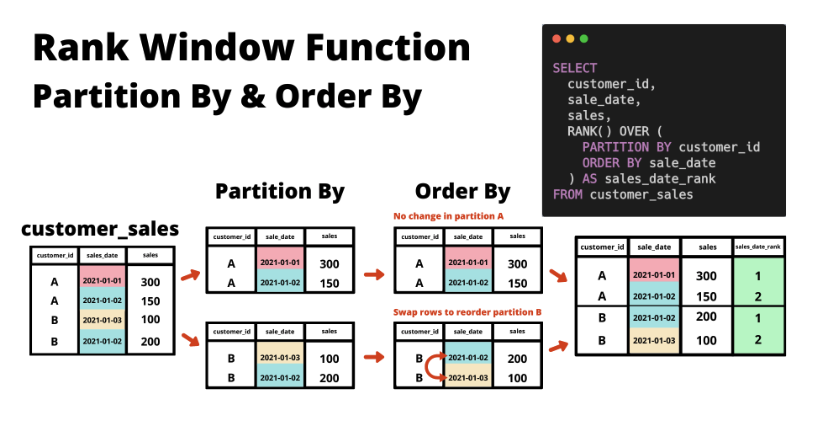

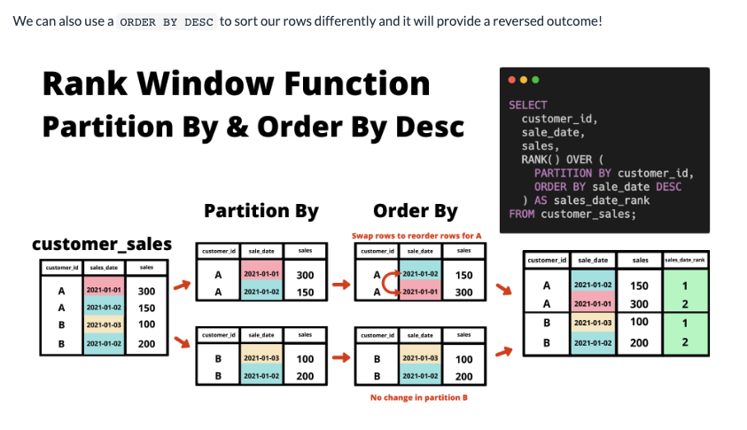

```sql
-- we remove any existing customer_sales table first!
DROP TABLE IF EXISTS customer_sales;
CREATE TEMP TABLE customer_sales AS
WITH input_data (customer_id, sales_date, sales) AS (
 VALUES
 ('A', '2021-01-01'::DATE, 300),
 ('A', '2021-01-02'::DATE, 150),
 ('B', '2021-01-03'::DATE, 100),
 ('B', '2021-01-02'::DATE, 200)
)
SELECT * FROM input_data;

-- RANK Window Function with default ORDER BY
SELECT
  customer_id,
  sales_date,
  sales,
  RANK() OVER (
    PARTITION BY customer_id
    ORDER BY sales_date
  ) AS sales_date_rank
FROM customer_sales;

-- RANK Window Function with descending ORDER BY
SELECT
  customer_id,
  sales_date,
  sales,
  RANK() OVER (
    PARTITION BY customer_id
    ORDER BY sales_date DESC
  ) AS sales_date_rank
FROM customer_sales;
```

|customer_id|sales_date|sales|sales_date_rank|
|-------|-------|-------|-------|
|A|2021-01-02|150|1|
|A|2021-01-01|300|2|
|B|2021-01-03|100|1|
|B|2021-01-02|200|2|


* No Partition Example below so no customer grouping (`RANK` assigns ties the same value)
```sql
SELECT
  customer_id,
  sales_date,
  sales,
  RANK() OVER (
    ORDER BY sales_date DESC
  ) AS sales_date_rank
FROM customer_sales;
```

|customer_id|sales_date|sales|sales_date_rank|
|-------|-------|-------|-------|
|B|2021-01-03|100|1|
|A|2021-01-02|150|2|
|B|2021-01-02|200|2|
|A|2021-01-01|300|4|

<br>

### Different Ordering Window Functions
The most popular ordered window function calculations are the following - note that all of them do not need any inputs:

These functions return integers:

* `ROW_NUMBER()`
* `RANK()`
* `DENSE_RANK()`

These following functions return numeric outputs between 0 and 1:

* `PERCENT_RANK()`
* `CUME_DIST()`

One other function we’ve seen before is the `NTILE` function which we used in the Data Exploration section.

`NTILE` is the odd one out from this set of functions as it requires a single integer input to **define the number of buckets** or end ranges from 1 to the input - for example our example uses `NTILE(100)` to assign a number between 1 and 100 for our dataset based off the distribution of each record.

Let’s revisit a slightly different version of this query so we can dig into our window functions a little bit further and understand their differences:

```sql
DROP TABLE IF EXISTS ordered_window_metrics;
CREATE TEMP TABLE ordered_window_metrics AS
SELECT
  measure_value,
  ROW_NUMBER() OVER (ORDER BY measure_value DESC) AS _row_number,
  RANK() OVER (ORDER BY measure_value DESC) AS _rank,
  DENSE_RANK() OVER (ORDER BY measure_value DESC) AS _dense_rank,
  /* ---
  To succesfully round the following metrics to 5 decimal places
  we need to explicitly cast the window function output
  from a double data type to numeric type
  --- */
  ROUND(
    (PERCENT_RANK() OVER (ORDER BY measure_value DESC))::NUMERIC,
    5
  ) AS _percent_rank,
  ROUND(
    (CUME_DIST() OVER (ORDER BY measure_value DESC))::NUMERIC,
    5
  ) AS _cume_dist,
  NTILE(100) OVER (ORDER BY measure_value DESC) AS _ntile
FROM health.user_logs
WHERE measure = 'weight';

-- Select 10 largest rows by measure_value
SELECT *
FROM ordered_window_metrics
ORDER BY measure_value DESC
LIMIT 10;
```
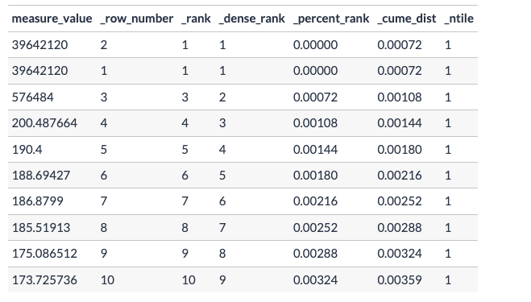

```sql
-- Select 10 smallest rows by measure_value
SELECT *
FROM ordered_window_metrics
ORDER BY measure_value
LIMIT 10;
```

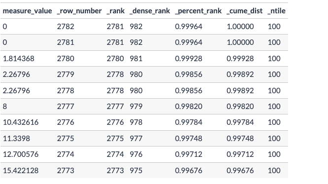

<br>

#### Add in Further Complexity with Partition By
```sql
DROP TABLE IF EXISTS ordered_window_metrics_desc;
CREATE TEMP TABLE ordered_window_metrics_desc AS
SELECT
  measure,
  measure_value,
  ROW_NUMBER() OVER (
    PARTITION BY measure
    ORDER BY measure_value DESC
  ) AS _row_number,
  RANK() OVER (
    PARTITION BY measure
    ORDER BY measure_value DESC
  ) AS _rank,
  DENSE_RANK() OVER (
    PARTITION BY measure
    ORDER BY measure_value DESC
  ) AS _dense_rank,
  /* ---
  To succesfully round the following metrics to 5 decimal places
  we need to explicitly cast the window function output
  from a double data type to numeric type
  --- */
  ROUND(
    (
      PERCENT_RANK() OVER (
        PARTITION BY measure
        ORDER BY measure_value DESC
      )
    )::NUMERIC,
    5
  ) AS _percent_rank,
  ROUND(
    (
      CUME_DIST() OVER (
        PARTITION BY measure
        ORDER BY measure_value DESC
      )
    )::NUMERIC,
    5
  ) AS _cume_dist,
  NTILE(100) OVER (
    PARTITION BY measure
    ORDER BY measure_value DESC
  ) AS _ntile
FROM health.user_logs;


SELECT *
FROM ordered_window_metrics_desc
WHERE _row_number <= 3
ORDER BY
  measure,
  measure_value DESC;
```


* Notably the `RANK` will advance n amount of numbers if a tie is seen (see how weight measure doesn't have a **2** in the _rank column)
* `DENSE RANK` will continue the sequence and not skip ahead regardless of ties seen
* `ROW NUMBER` is arbitary and just a row is picked should all ORDER BY declarations not produce a breaking of a tie scenario

<br>

Let’s say we also wanted to obtain the smallest 3 values from each measure also? 

#### Combined Ascending & Descending
```sql
DROP TABLE IF EXISTS combined_row_numbers;
CREATE TEMP TABLE combined_row_numbers AS
SELECT
  measure,
  measure_value,
  ROW_NUMBER() OVER (
    PARTITION BY measure
    ORDER BY measure_value
  ) AS ascending,
  ROW_NUMBER() OVER (
    PARTITION BY measure
    ORDER BY measure_value DESC
  ) AS descending
FROM health.user_logs;

SELECT *,
  CASE
    WHEN ascending <= 3 THEN 'Bottom 3'
    WHEN descending <= 3 THEN 'Top 3'
    END AS value_ranking
FROM combined_row_numbers
WHERE
  ascending <= 3 OR
  descending <= 3
ORDER BY
  measure,
  measure_value;
```
* See above to take the first and last 3 rows from each measure based off the `measure_valu`e records - as a bonus we will also use a `CASE WHEN` statement to generate a `value_ranking` to show which records are the Top 3 or Bottom 3:

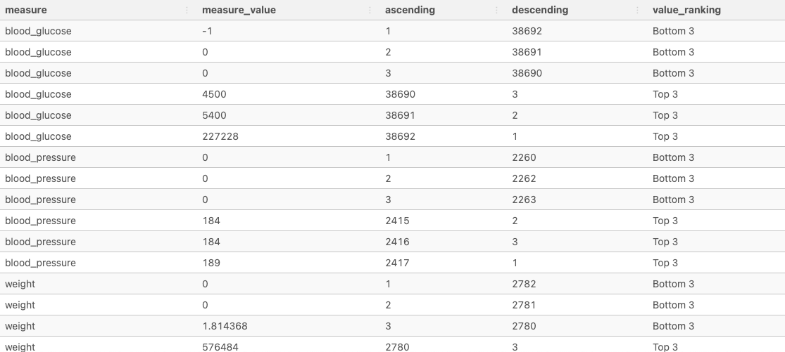

<br>

---

<br>

## Advanced Window Functions
Now that we have a solid understanding about the ordered window functions and how the execution order impacts our window function calculations - in this following section we will cover the following advanced usage of window functions:

* Lead/lag values
* Cumulative Aggregations
* Moving averages and other statistics
* Exponential weighted averages

But before we dive into these new techniques and build upon our existing knowledge - let’s first introduce our newest dataset here to make this tutorial as memorable as possible!

#### Data Exploration (trading.daily_btc)
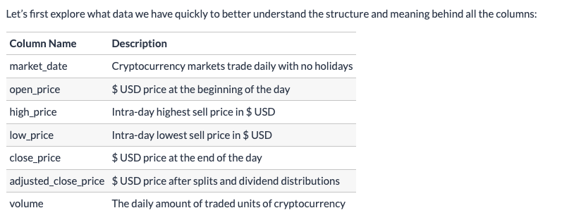

* See `BTC_DataExcs.md` for sql queries for Bitcoin table understanding and exercise solutions 

<br>

### Lag & Lead Window Functions
Lag and Lead window functions do not perform calculations on the window frame records - but rather they simply grab the value before or after the current row respectively.

Traditionally - these window functions usually used with a non-empty ORDER BY clause otherwise you will return arbitrarily ordered results - which defeats the purpose of using the lag and lead functions in the first place! (unless you have a very very specific use case…)

These 2 functions are super useful but also slightly tricky to wield because of one simple reason - they can be manipulated to do exactly the same thing!?

<br>

#### Identify Null Rows
There is actually a really elegant method to identify all rows with **any** null values in any column, so long as the columns that you need to check are `NUMERIC` types.

There is a concept called the **propogation** of null values whereby if you add null value to a number - it will simply return a null!

We can use this to filter out our `trading.daily_btc` table to hunt for those null rows of data.

```sql
SELECT *
FROM trading.daily_btc
WHERE (
  open_price + high_price + low_price +
  close_price + adjusted_close_price + volume
) IS NULL;

-- This works as well
SELECT *
FROM trading.daily_btc
WHERE
  market_date IS NULL
  OR open_price IS NULL
  OR high_price IS NULL
  OR low_price IS NULL
  OR close_price IS NULL
  OR adjusted_close_price IS NULL
  OR volume IS NULL
);
```

|market_date|open_price|high_price|low_price|close_price|adjusted_close_price|volume|
|----|------|------|------|------|------|------|
|2020-04-17|null|null|null|null|null|null|
|2020-10-09|null|null|null|null|null|null|
|2020-10-12|null|null|null|null|null|null|
|2020-10-13|null|null|null|null|null|null|


<br>

### Data Philosophy
Now before we dive in to the solution - let’s talk about a philosophical aspect of data - in particular - data that is coming from the past, present and future!

The majority of the time - when we perform analysis on datasets, they are usually historical records. This means that it is a representation of what has already happened: the past

You might have heard about real-time or streaming data - this is a view of what is currently happeneing or in other words: the present

And when we are dealing with predictions or forecasts or anything where we need to look into time periods where we do not have data: the future

One of the most common pitfalls of data analysis, data science and machine learning is this mismatch between past, present and future data.

When we look at historical data, usually we will want to analyse what has happened in the past and compare it to what is happening right now or in recent times. The next natural step is to use those insights to make assessments or predictions about the future - note that these do not need to be machine learning based predictions but they could be super simple like the following scenario:

<br>

### Filling Null Values
Remember those missing value rows we identified previously? We’ll now use both our `LAG` and `LEAD` window functions to demonstrate how we can fill these values - but we’ll also take a deeper inspection into why one method is better than the other when we are dealing with time based data!

For our Bitcoin data example - we will need to fill in the missing values from our rows of data before we continue with our analysis. Usually null values will be ignored in many functions - however we want to make sure there are no null values in our data because there really should be data for every single day!

Welcome to the world of true messy data :)

<br>

#### Lag and Lead for Example Null Row
```sql
SELECT 
  *
FROM trading.daily_btc
-- CAST as a date column to look at lag/lead time of one of our missing rows
WHERE market_date BETWEEN ('2020-04-17'::DATE - 1) AND ('2020-04-17'::DATE + 1);
```
|market_date|open_price|high_price|low_price|close_price|adjusted_close_price|volume|
|-----|------|------|-----|------|-----|-----|
|2020-04-16|6640.454102|7134.450684|6555.504395|7116.804199|7116.804199|46783242377|
|2020-04-17|null|null|null|null|null|null|
|2020-04-18|7092.291504|7269.956543|7089.247070|7257.665039|7257.665039|32447188386|

<br>

### Null Value Filling Methods
Now let’s look at our options for how we should actually fill in the null values:

1) Use the column average
2) Fill with 0

Can you identify what’s wrong with the above 2 methods? You’re probably thinking to yourself - “But Danny - these are the most common null filling methods used for machine learning!”

And yes - you are correct, these are the most common null filling methods seen everywhere on Kaggle and blogs around the internet - but we need to ask ourselves - do they make sense for our problem???

We have daily Bitcoin prices - and we want to fill in a missing day’s worth of data so we can use it for our analysis without removing any data (that’s also another option - but we’re not going to do that here!)

Filling it with the average of the entire dataset should be not be done - what did we just mention in the philosophical section above?

Filling it 0 makes zero sense too :) Unless the ENTIRE blockchain went down on a day and there was actually no trading activity that is…

So what else could we try?

3) Use the next day’s data
No. See the philosophical section to remember the past, present and future!

4) Use the previous day’s data

Bingo!!!

Well in reality - we could also do more complex things like predicting or forecasting what the missing day’s worth of data was based off even more past data, but let’s imagine that we didn’t want to do that and we want to take the simplest option!

We can imagine that the missing day’s worth of trading data was exactly the same as the day before.

It’s not a perfect representation of what might have actually happened on that day where the data is missing - but at least it’s something that we can use and won’t impact downstream calculations too much (hopefully!)

So let’s say that we will make this data manipulation happen - how can we actually do this?

Enter the `LAG` window function!

<br>

### Lag to Fill Missing Values
We can simply use the `LAG` window function `OVER` the entire dataset - but remember that we will always want to use an `ORDER BY` clause for ordered window functions and `LAG` is just one of these ordered window functions!

The `LAG` calculation **function** 
* accepts a single column name as its first function input  
* a second optional input as the `OFFSET` or number of rows to use for the calculation (more on this later!) - by default the `OFFSET` value is set to 1.
* There is also a 3rd optional input for the `LAG` and `LEAD` functions which defines the DEFAULT value - when it is not specific explicitly, the value is set to null - you will see this in action below but it essentially uses this DEFAULT value when there are no records to perform the LAG calculation (i.e. there are no rows before this current row!)

Let’s demonstrate how to implement this for just the `open_price` column below. The `LAG` function without any additional input apart from the column works by simply taking the target column’s value for the first row before it within the window frame (i.e: an offset of 1)

```sql
SELECT
  market_date,
  open_price,
  LAG(open_price, 1) OVER (ORDER BY market_date) AS lag_open_price
FROM trading.daily_btc
WHERE market_date BETWEEN ('2020-04-17'::DATE - 1) AND ('2020-04-17'::DATE + 1);
```
|market_date|open_price|lag_open_price|
|------|-------|-----|
|2020-04-16|6640.454102|null|
|2020-04-17|null|6640.454102|
|2020-04-18|7092.291504|null|

What do you notice about the output above? A few questions might come to mind:

* Why don’t I get a lag_open_price for April the 16th?

The `LAG` function looks at the row prior to the current row within the specified window frame for the target column value - since there is no rows before April 16th in our window frame it returns a null.

But wait a moment - don’t we have data for the 15th of April in our original dataset - how come it isn’t showing up in this window frame?

Can you see why the row for the 15th of April is not used for our window function? (Hint: it has something to do with the logical order of execution! (The Where clause sets the window of data to work on prior to the running of the window function))

This exact point is a perfect place to demonstrate what we meant when talked about the 3rd optional function input for the LAG and LEAD functions:

Let’s demonstrate how we can change the 3rd optional DEFAULT input in the query below to 6,000:

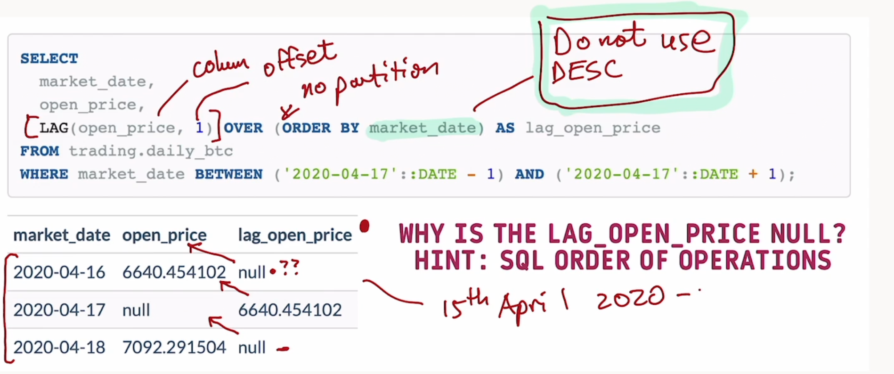

```sql
SELECT
  market_date,
  open_price,
  LAG(open_price, 1, 6000::NUMERIC) OVER (ORDER BY market_date) AS lag_open_price
FROM trading.daily_btc
WHERE market_date BETWEEN ('2020-04-17'::DATE - 1) AND ('2020-04-17'::DATE + 1);
```
|market_date|open_price|lag_open_price|
|-----|------|------|
|2020-04-16|6640.454102|6000|
|2020-04-17|null|6640.454102|
|2020-04-18|7092.291504|null|

Nice so it looks like we can replace that first row null value to 6,000 - but what about that null value in the last row for April 18th?

Because we used an `ORDER BY market_date` - the window frame is sorted such that April 17th is the row directly before April 18th - and what is the value for the open_price column?

It is also **null** - so it’s only expected that our `LAG` window function would return this value too!

Now that we’ve covered the inputs of the `LAG` function - there is the next confusing thing: we can do this exact same operation but using the `LEAD` function!

<br>

### Lead Alternate Implementation
The `LEAD` window function is exactly the same as the `LAG` window function but instead of looking at the previous row in the window frame - it looks at the following row!

We can actually perform the same null filling strategy of taking the previous day’s value for our Bitcoin dataset - by changing the order of our `ORDER BY` clause to rearrange the window frame row order!

Let’s add a new column to our previous query for the lead_open_price:

```sql
SELECT
  market_date,
  open_price,
  LAG(open_price) OVER (ORDER BY market_date) AS lag_open_price,
  LEAD(open_price) OVER (ORDER BY market_date DESC) AS lead_open_price
FROM trading.daily_btc
WHERE market_date BETWEEN ('2020-04-17'::DATE - 1) AND ('2020-04-17'::DATE + 1);
```
|market_date|open_price|lag_open_price|lead_open_price|
|-----|------|------|-----|
|2020-04-16|6640.454102|null|null|
|2020-04-17|null|6640.454102|6640.454102|
|2020-04-18|7092.291504|null|null|

* Well what do you know? They are exactly the same…or are they?!?

<br>

### Philosophy Round 2
Here is where our philosophical concept really kicks in - can you identify the issue with using a `LEAD` window function to calculate the previous day’s value in our time series example?

When we are dealing with data - the language that we use to explain what we are doing with our transformations and manipulations is really important!

Some people brush this off as just “syntax” or “verbatim” but in reality - there are multiple reasons why we should avoid this!

When reading and reviewing code - the function that is used is important!

When you see a `LEAD` window function being used - a skilled SQL developer will instantly think that you are obtaining data points from a following row.

However - as you continue to read the code and see an `ORDER BY DESC` - you need to process an additional component, adding to the mental complexity of the function - now you need to replace the “following row” concept in your mind with the “previous row” - but still stay aware of the fact that you are using a `LEAD` function and not a `LAG` function.

See - this last paragraph is confusing as heck and I’m not even reviewing any specific code!!!

Instead of doing this round-about logical acrobatics - wouldn’t it be so much simpler if you just used the right function for the right situation???

* So whenever you need to obtain a previous row with a time based or an incremental based `ORDER BY` criteria - ALWAYS use `LAG` and a default ascending `ORDER BY` clause!

* The reverse is true if you ever need a “future” value for the current row - use the `LEAD` function with a default ascending `ORDER BY` clause!

Ok - time to end my rant so we can continue with our example!

<br>

### Coalesce to Update NULL Rows
So now that we’ve learnt about the proper use of a `LAG` function (and the improper use of the `LEAD` function) - how can we use this to actually help us update the dataset so we can fill in these null values once and for all?

Enter the `COALESCE` function - let’s demonstrate how we can use this with our previous example with the 17th of April data only inside a CTE:

```sql
WITH april_17_data AS (
  SELECT
    market_date,
    open_price,
    LAG(open_price) OVER (ORDER BY market_date) AS lag_open_price
  FROM trading.daily_btc
  WHERE market_date BETWEEN ('2020-04-17'::DATE - 1) AND ('2020-04-17'::DATE + 1)
)
SELECT
  market_date,
  open_price,
  lag_open_price,
  COALESCE(open_price, lag_open_price) AS coalesce_open_price
FROM april_17_data;
```
|market_date|open_price|lag_open_price|coalesce_open_price|
|-----|-----|-------|-----|
|2020-04-16|6640.454102|null|6640.454102|
|2020-04-17|null|6640.454102|6640.454102|
|2020-04-18|7092.291504|null|7092.291504|

* This looks great - and neatly demonstrates what the `COALESCE` function does - just note the function can actually accept any number of columns or even raw values (as long as they are the data type) - 
  * the order is important as it will return the first non-null value from the inputs from left to right!

<br>

### Update Tables
Now that we’ve learnt how to use the `COALESCE` and the `LAG` function - let’s now create a new temporary table which we will use for the rest of this tutorial by updating all of the columns and null rows with what we’ve learnt - but let’s make this more difficult by forcing you to do this 2 ways!

#### Create Temp Table
```sql
DROP TABLE IF EXISTS updated_daily_btc;
CREATE TEMP TABLE updated_daily_btc AS
SELECT
  market_date,
  COALESCE(
    open_price,
    LAG(open_price) OVER (ORDER BY market_date)
  ) AS open_price,
  COALESCE(
    high_price,
    LAG(high_price) OVER (ORDER BY market_date)
  ) AS high_price,
  COALESCE(
    low_price,
    LAG(low_price) OVER (ORDER BY market_date)
  ) AS low_price,
  COALESCE(
    close_price,
    LAG(close_price) OVER (ORDER BY market_date)
  ) AS close_price,
  COALESCE(
    adjusted_close_price,
    LAG(adjusted_close_price) OVER (ORDER BY market_date)
  ) AS adjusted_close_price,
  COALESCE(
    volume,
    LAG(volume) OVER (ORDER BY market_date)
  ) AS volume
FROM trading.daily_btc;

-- test that our previously missing value dates are filled!
SELECT *
FROM updated_daily_btc
WHERE market_date IN (
  '2020-04-17',
  '2020-10-09',
  '2020-10-12',
  '2020-10-13'
);
```
|market_date|open_price|high_price|low_price|close_price|adjusted_close_price|volume|
|-----|-----|----|----|----|------|------|
|2020-04-17|6640.454102|7134.450684|6555.504395|7116.804199|7116.804199|46783242377|
|2020-10-09|10677.625000|10939.799805|10569.823242|10923.627930|10923.627930|21962121001|
|2020-10-12|11296.082031|11428.813477|11288.627930|11384.181641|11384.181641|19968627060|
|2020-10-13|null|null|null|null|null|null|


* Well - what were the values for the 12th of October in our original dataset? Oh yeah - they were also null…D’oh!

<br>

### Lag Function With Offset Input
Remember what I mentioned about the second LAG function input - the offset value? By default if we only use a column reference for the LAG function, it will use 1 as the default offset value - meaning that it will take the row directly before the current row during the window function calculation step.

We will only demonstrate the different options on just the open_price column so we don’t need to write so much code - we’ll also keep a filter on just the few days around the 13th of October below.

First - let’s also use a CASE WHEN to specify the equivalent of an IF-ELSE block in SQL - always remember to END your CASE WHEN statements - it’s a very common SQL syntax error!

```sql
SELECT
  market_date,
  open_price,
  COALESCE(
    open_price,
    CASE
      -- Default to catch this date and look 2 rows back, not the default or 1
      WHEN market_date = '2020-10-13'
        THEN LAG(open_price, 2) OVER (ORDER BY market_date)
      ELSE LAG(open_price, 1) OVER (ORDER BY market_date)
      END
  ) AS adj_open_price
FROM trading.daily_btc
WHERE market_date BETWEEN '2020-10-10'::DATE AND '2020-10-13'::DATE;
```
|market_date|open_price|adj_open_price|
|-----|-----|------|
|2020-10-10|11059.142578|11059.142578|
|2020-10-11|11296.082031|11296.082031|
|2020-10-12|null|11296.082031|
|2020-10-13|null|11296.082031|

* Also, using the logic of sequential item selection and first non-null value for `COALESCE`, the following query could work as well as the initial conditional catch can simply be the third value that would be used in the case of repeating null rows that wouldn't catch a lag value

```sql
SELECT 
  market_date,
  open_price,
  COALESCE(
    open_price,
    LAG(open_price, 1) OVER (ORDER BY market_date),
    LAG(open_price, 2) OVER (ORDER BY market_date)
  ) AS adj_open_prices
FROM trading.daily_btc
WHERE market_date BETWEEN '2020-10-10'::DATE AND '2020-10-13'::DATE
```
* Same table output as above
* Recall that `COALESCE` in this scenario takes the first non-null value from arguments provided. This would account for consecutive type null rows 

<br>

### Update Tables & Window Clause Simplification
If you find that you are repeating a certain window multiple times in the same query - you can actually use the `WINDOW` clause after the final FROM section of your SQL query and refer to a simple alias in the window function call within the select expressions in the body of the SQL query.

This is awesome because it ticks off a few boxes in terms of having nice looking code:

1) Harder to make mistakes because we only need to specify the window once
2) Sticks to the DRY principle (DO NOT REPEAT YOURSELF!)
3) Keeps the SELECT body of the SQL query very clean looking

Let’s use this new technique for our previous query - take a look at the final line of the query first to see how we can define this window!

Note that you can actually define multiple windows by using a comma separated list as shown below - you don’t even need to use them in the query - just be careful what you name your windows and do not get them mixed up with default SQL functions or any other variable/table name that you’ve created in the database session!

```sql
DROP TABLE IF EXISTS updated_daily_btc;
CREATE TEMP TABLE updated_daily_btc AS
SELECT
  market_date,
  COALESCE(
    open_price,
    LAG(open_price, 1) OVER w,
    LAG(open_price, 2) OVER w
  ) AS open_price,
  COALESCE(
    high_price,
    LAG(high_price, 1) OVER w,
    LAG(high_price, 2) OVER w
  ) AS high_price,
  COALESCE(
    low_price,
    LAG(low_price, 1) OVER w,
    LAG(low_price, 2) OVER w
  ) AS low_price,
  COALESCE(
    close_price,
    LAG(close_price, 1) OVER w,
    LAG(close_price, 2) OVER w
  ) AS close_price,
  COALESCE(
    adjusted_close_price,
    LAG(adjusted_close_price, 1) OVER w,
    LAG(adjusted_close_price, 2) OVER w
  ) AS adjusted_close_price,
  COALESCE(
    volume,
    LAG(volume, 1) OVER w,
    LAG(volume, 2) OVER w
  ) AS volume
FROM trading.daily_btc
-- NOTE: checkout the syntax where I've included an unused window below!
WINDOW
  w AS (ORDER BY market_date),
  unused_window AS (ORDER BY market_date DESC);

-- inspect a few rows of the updated dataset for October
SELECT *
FROM updated_daily_btc
WHERE market_date BETWEEN '2020-10-08'::DATE AND '2020-10-15'::DATE;
```

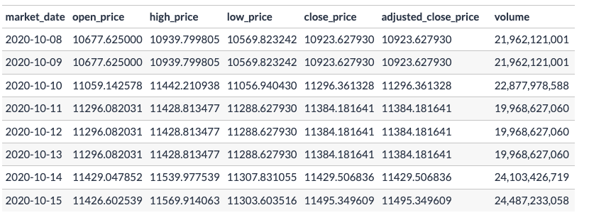

---

<br>

## Cumulative Calculations
Now that our dataset is finally cleaned up and we no longer have any null values - we can now focus on the next step of our window functions journey and explore how we can perform cumulative calculations!

To break this example down in case you haven’t come across cumulative metrics before - let’s investigate just the first 10 rows of the volume column from our updated_daily_btc dataset sorted by market_date and demonstrate what we need to do at a low level.

Take note that the volume metric is the total number of Bitcoins traded on that specific market_date!

```sql
SELECT 
  market_date,
  volume
FROM
trading.daily_btc
ORDER BY market_date
LIMIT 10
```

|market_date	|volume|
|-----|-----|
|2014-09-17	|21,056,800|
|2014-09-18	|34,483,200|
|2014-09-19	|37,919,700|
|2014-09-20	|36,863,600|
|2014-09-21	|26,580,100|
|2014-09-22	|24,127,600|
|2014-09-23	|45,099,500|
|2014-09-24	|30,627,700|
|2014-09-25	|26,814,400|
|2014-09-26	|21,460,800|

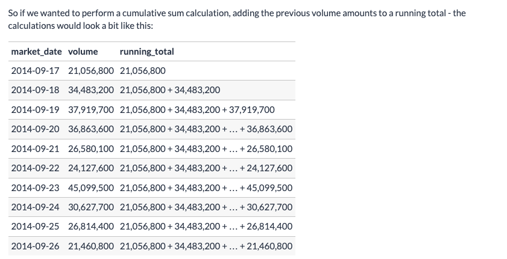

### Self Join (Not the Easiest To Read)
```sql
WITH volume_data AS (
  SELECT
    market_date,
    volume
  FROM updated_daily_btc
  ORDER BY market_date
  LIMIT 10
)
SELECT
  t1.market_date,
  t1.volume,
  SUM(t2.volume) AS running_total
FROM volume_data t1
INNER JOIN volume_data t2
  ON t1.market_date >= t2.market_date
GROUP BY 1,2
ORDER BY 1,2;
```
|market_date|volume|running_total
|-----|-----|-----|
|2014-09-17|21056800|21056800|
|2014-09-18|34483200|55540000|
|2014-09-19|37919700|93459700|
|2014-09-20|36863600|130323300|
|2014-09-21|26580100|156903400|
|2014-09-22|24127600|181031000|
|2014-09-23|45099500|226130500|
|2014-09-24|30627700|256758200|
|2014-09-25|26814400|283572600|
|2014-09-26|21460800|305033400|

<br>

### There's A Better Way!
* `Window Function CTE`
  * Easier to read and follow, quite efficient too!

```sql
WITH volume_data AS (
  SELECT
    volume,
    market_date
  FROM updated_daily_btc
  ORDER BY market_date
  LIMIT 10
)
SELECT
  market_date,
  volume,
  SUM(volume) OVER (
    ORDER BY market_date
  ) AS runnin_sum
  FROM volume_data
```
|market_date|volume|runnin_sum|
|----|------|------|
|2014-09-17|21056800|21056800|
|2014-09-18|34483200|55540000|
|2014-09-19|37919700|93459700|
|2014-09-20|36863600|130323300|
|2014-09-21|26580100|156903400|
|2014-09-22|24127600|181031000|
|2014-09-23|45099500|226130500|
|2014-09-24|30627700|256758200|
|2014-09-25|26814400|283572600|
|2014-09-26|21460800|305033400|


<br>

---

## Window Frame Clause
The `FRAME` clause is something that we’ve been implicitly using without really knowing about it up until now for our cumulative sum calculations.

The first thing to know about the `FRAME` clause is what is actually used as default when we do not explicitly specify them in our window functions.
* **RANGE BETWEEN UNBOUNDED PRECEDING AND CURRENT ROW**
```sql
SELECT
  market_date, 
  volume, 
  SUM(volume) OVER (ORDER BY market_date) AS running_sum_w_o_range,
  SUM(volume) OVER (
    ORDER BY market_date
    RANGE BETWEEN UNBOUNDED PRECEDING AND CURRENT ROW
  ) as running_sum_default_range
FROM updated_daily_btc
LIMIT 5;
```
|market_date|volume|running_sum_w_o_range|running_sum_default_range|
|------|-----|------|------|
|2014-09-17|21056800|21056800|21056800|
|2014-09-18|34483200|55540000|55540000|
|2014-09-19|37919700|93459700|93459700|
|2014-09-20|36863600|130323300|130323300|
|2014-09-21|26580100|156903400|156903400|

* Default range in first window function is range our a running `cumulative` sum the window function performs with the aggregate function on the defined sql column

<br>

### Window Frame Components
So we can confirm that the defaults are being applied for our cumulative sum window function - but what does all this mean?

The following diagram will break down the different components of our window frame clause so we can start understanding how this works and most importantly - how we can use them to generate the different outputs that we need!

There is a lot of information in the visual below but don’t worry - we will cover everything soon!


These components are difficult to explain separately as they need to interact with the other components for it to make sense.

The various combinations of window frame options are determined by the intersection of 3 components:

#### Window Frame Modes
  * RANGE vs ROWS (vs GROUPS)

#### Start and End Frames
  * PRECEDING vs FOLLOWING
  * UNBOUNDED vs OFFSET

#### Frame Exclusions
  * CURRENT ROW vs TIES vs NO OTHERS (vs GROUP)

note: GROUPS is only implemented for some specific SQL flavours including PostgreSQL and SQLite

To explain and understand these different components more deeply - let’s create a very simple dataset to illustrate the different results.

<br>

### Example Dataset
The base dataset contains only a single column called val in the following frame_example table - however we will also be adding 2 columns for the `ROW_NUMBER` and `DENSE_RANK` window calculations. You will see why we do this soon!

```sql
DROP TABLE IF EXISTS frame_example;
CREATE TEMP TABLE frame_example AS
WITH input_data (val) AS (
 VALUES
 (1),
 (1),
 (2),
 (6),
 (9),
 (9),
 (20),
 (20),
 (25)
)
SELECT
  val,
  ROW_NUMBER() OVER w AS _row_number,
  DENSE_RANK() OVER w AS _dense_rank_golf
FROM input_data
WINDOW
  w AS (ORDER BY val);

-- inspect the dataset
SELECT * FROM frame_example;
```
|val|_row_number|_dense_rank_golf|
|----|-----|-----|
|1|1|1|
|1|2|1|
|2|3|2|
|6|4|3|
|9|5|4|
|9|6|4|
|20|7|5|
|20|8|5|
|25|9|6|

<br>

### Default Cumulative Sum
Let’s revisit our basic cumulative sum example but this time using this very basic dataset.

If we were to implement a cumulative sum by simply using the SUM function with an ORDER BY without specifying the frame clause - we would be using the standard default window frame clause: `RANGE BETWEEN UNBOUNDED PRECEDING AND CURRENT ROW`

Let’s inspect what this yields us for the cumulative sum and see if it checks out with what we expect!

```sql
SELECT
  val,
  SUM(val) OVER (
    ORDER BY val
    -- you can comment out the following line to make sure it is the default!
    RANGE BETWEEN UNBOUNDED PRECEDING AND CURRENT ROW
  ) AS cum_sum,
  _row_number,
  _dense_rank_golf
FROM frame_example;
```
|val|cum_sum|_row_number|_dense_rank_golf|
|---|-----|-----|------|
|1|2|1|1|
|1|2|2|1|
|2|4|3|2|
|6|10|4|3|
|9|28|5|4|
|9|28|6|4|
|20|68|7|5|
|20|68|8|5|
|25|93|9|6|

What do you notice about this output? Does it match up with what you expected when you thought about cumulative sums?

This is where we need to dig deeper to understand the **differences** between the `window frame modes`!

<br>

### Window Frame Modes
As we mentioned above - there are 3 window frame modes which will modulate the output differently:

1. RANGE
2. ROWS
3. GROUPS Note: this is not always implemented for all SQL flavours!

We will first focus on the difference between the `RANGE` and `ROWS` as these are commonly misunderstood by SQL developers and analytics practitioners leading to many issues with their ordered aggregate window function calculations!

The `GROUPS` mode is available in PostgreSQL and SQLite at this time of writing in February 2021 but not all other SQL flavours have the same functionality so always check the base documentation for whatever type of SQL you are using, always!

Let’s compare what happens when we use the RANGE, ROWS and GROUPS for the frame mode with our previous basic dataset and also keeping our default start and end frames of UNBOUNDED PRECEDING and CURRENT ROW:

```sql
SELECT
  val,
  SUM(val) OVER (
    ORDER BY val
    RANGE BETWEEN UNBOUNDED PRECEDING AND CURRENT ROW
  ) AS _range,
  SUM(val) OVER (
    ORDER BY val
    ROWS BETWEEN UNBOUNDED PRECEDING AND CURRENT ROW
  ) AS _rows,
  SUM(val) OVER (
    ORDER BY val
    GROUPS BETWEEN UNBOUNDED PRECEDING AND CURRENT ROW
  ) AS _groups,
  _row_number,
  _dense_rank_golf
FROM frame_example;
```
|val|_range|_rows|_groups|_row_number|_dense_rank_golf|
|---|-----|----|-----|-----|------|
|1|2|1|2|1|1|
|1|2|2|2|2|1|
|2|4|4|4|3|2|
|6|10|10|10|4|3|
|9|28|19|28|5|4|
|9|28|28|28|6|4|
|20|68|48|68|7|5|
|20|68|68|68|8|5|
|25|93|93|93|9|6|

* The `_rows` column is the default intuitive way a **cumulative_sum** type window function would perform in our heads
* The `_range` and `_groups` column performs a like grouping of the valu to perform almost a lead search for the value to aggregate the running sum for that val and any rows that have the same val
  * If you look at the equal values within val column (for instance **9**) you can see the first row value for `_range` and `_groups` have the sum for each row with a val of 9 added to the running sum in a lead type fashion whereas the `_rows` aggregate is not grouping any equal or shared values and simply adding one row at a time

<br>

### Unbounded Preceding and Current Row & WFrame Differences (Above)
So far we have only been dealing with a single type of start and end frame - `UNBOUNDED PRECEDING and CURRENT ROW`

Having a start frame of `UNBOUNDED PRECEDING` means to include records from the start of the window frame.

An end frame of `CURRENT ROW` means to only include up to the current record for the window function calculation.

This particular set of start and end frame inputs also modulate with the window frame mode as we’ve seen in the example above.

The most notable feature is how the `RANGE` and `GROUPS` mode will use the **same cumulative sum value** for records **which have equal values** - whilst the `ROWS` will perform the cumulative sum in a way which we intuitively think about it as having the row values added to eachother one by one.

However deciding when we want to actually use `ROWS vs RANGE` comes down to answer the question - what do you want your output to look like?

Do you want the same sum values for duplicate row values or would you like to have each individual row with its own separate cumulative metric? The choice is yours!

Let’s continue with the comparison between `offset and unbounded` next.

<br>

### Offset and Unbounded
The differences between these 2 terms are simple in that any start or end frame with an offset will only be limited to the specified offset size within the window frame, as opposed to the full window frame unbounded.

However - the practical differences are not that straightforward as the offset values and size of the window frames will be determined by the window frame mode that is chosen!

Let’s compare the 3 separate modes and their offset values below:


As you might have noticed - they differ quite greatly across the different window frame modes!

* The `ROWS` mode gives us the most intuitive offset values as we simply increment the offset value by 1 as we move before and after relative to the current row.
  * `Offset` preceding can be seen as the offset from the Current row (how many rows back or to the left of the current row)
  * As such the `Offset` following has the same offset for how many rows to the right

<br>

* The `RANGE` mode uses the actual ordered values to generate the offset values - this has a deep implication, especially when we are dealing with window functions that use date fields in the ORDER BY within the OVER clause. We will dig into this deeper when we return to our Bitcoin data soon!
  * The range is dealing with the **values** or offset difference between the current row **9** and the value of the row to the left or right
  * Ex : The value of **3** as the first range value to the left of the current row is the difference in the `RANGE` between 6 and 9

<br>

* The `GROUPS` mode is sort of like a combination between the ROWS and the RANGE where we would essentially compare not just the actual values, but also the position of their groups relative to the current row.
  * More Similar to `ROWS` in that it is looking at an offset distance between rows but simultaneously is looking at the value of the column how many rows back
  * So with **equal values** (Ex : 1) we can see that the Groups offset value shares the same offset should subsequent rows have the same values but be shared over two rows
  * Ex : Another example is if you look forward for the `Groups` offset value, you can see that the subsequent row is seen as the same group sharing the same value of **9** and with the first offset of 1 for rows following being on the separate value of **20** that is two rows intuitively from the current row

The following are examples of how we can set the start and end frames using different offset values for our 3 window frame modes:


  * Remember this is the default window frame as we saw above (Frame is)

<br>


<br>


<br>

### Frame Exclusion
Now that we’ve investigated how to define the window frames using the different window frame modes and also the offset and unbounded preceding and following options - let’s now move onto excluding our values within the window frames.

There are 4 options for excluding records within the window frame:

* CURRENT ROW
* TIES
* GROUP
* NO OTHERS (default)

Note that you must have an explicit window frame clause inside the OVER clause otherwise the frame exclusion will cause an error!
* Not the most commonly applied logical use case in SQL (pretty advanced! and not commonly seen)

```sql
SELECT
  val,
  SUM(val) OVER (
    ORDER BY val
    RANGE BETWEEN UNBOUNDED PRECEDING AND CURRENT ROW
  ) AS _default,
  SUM(val) OVER (
    ORDER BY val
    RANGE BETWEEN UNBOUNDED PRECEDING AND CURRENT ROW
    EXCLUDE CURRENT ROW
  ) AS _excl_current_row,
  SUM(val) OVER (
    ORDER BY val
    RANGE BETWEEN UNBOUNDED PRECEDING AND CURRENT ROW
    EXCLUDE TIES
  ) AS _excl_ties,
  SUM(val) OVER (
    ORDER BY val
    RANGE BETWEEN UNBOUNDED PRECEDING AND CURRENT ROW
    EXCLUDE GROUP
  ) AS _excl_groups,
  _row_number,
  _dense_rank_golf
FROM frame_example;
```
|val|_default|_excl_current_row|_excl_ties|_excl_groups|_row_number|_dense_rank_golf|
|---|-----|-----|-----|-----|----|-----|
|1|2|1|1|null|1|1|
|1|2|1|1|null|2|1|
|2|4|2|4|2|3|2|
|6|10|4|10|4|4|3|
|9|28|19|19|10|5|4|
|9|28|19|19|10|6|4|
|20|68|48|48|28|7|5|
|20|68|48|48|28|8|5|
|25|93|68|93|68|9|6|

#### Column Notes
* `_default` : is using the **RANGE** window frame which is a running sum that aggregates the values of the column and designates the same summed should the value be shared over multiple rows (look at vals 9 & 20 for the running sum aggreaged over two shared values)
* `_excl_current_row` : The first value of 19 is instructive here for this column as the RANGE frame as the RANGE of this row's value is equal (two 9's), the summation of 9 into the running total for each is excluding the CURRENT ROW but the equals values still has one of the two values added as it's the same range 
  * A bit quirky here as it can exclude a current row that in theory has two values from the frame but 
* `_excl_ties` : Equal values for a current row are excluded in a roll-up sum for this column but the equal values are included in total sum

<br>

---

## Window Function Examples


### Average Volumes
First we need to calculate the weekly volume for the previous 7 days - we can use our `RANGE` mode in combination with the actual day range values to accomplish this.

Instead of just using integers like we were using for our previous simple dataset - we are able to use day ranges for our window function calculation also.

Following this we will generate a flag for each row comparing the actual volume to the average calculated volume.

The query below will cover points 1 and 2:

```sql
WITH window_calculations AS (
SELECT
  market_date,
  volume,
  AVG(volume) OVER (
    ORDER BY market_date
    RANGE BETWEEN '7 DAYS' PRECEDING and '1 DAY' PRECEDING
  ) AS past_weekly_avg_volume
FROM updated_daily_btc
)
SELECT
  market_date,
  volume,
  CASE
    WHEN volume > past_weekly_avg_volume THEN 1
    ELSE 0
    END AS volume_flag
FROM window_calculations
ORDER BY market_date DESC
LIMIT 10;
```

### High Volume Weeks
Next - let’s tackle the week percentage calculations for parts 3 and 4 in a single go.

We are yet to dive deeper into date calculations - but you can simply use DATE_TRUNC('week', <date-column>)::DATE to generate the prior Monday’s date.

If we then aggregate our dataset - we can then generate the distributions using the same SUM(COUNT*) OVER () trick we’ve used before to calculate proportions previously:

```sql
WITH window_calculations AS (
  SELECT
    market_date,
    volume,
    AVG(volume) OVER (
      ORDER BY market_date
      RANGE BETWEEN '7 DAYS' PRECEDING and '1 DAY' PRECEDING
    ) AS past_weekly_avg_volume
  FROM updated_daily_btc
),
-- generate the date
date_calculations AS (
  SELECT
    market_date,
    DATE_TRUNC('week', market_date)::DATE AS start_of_week,
    volume,
    CASE
      WHEN volume > past_weekly_avg_volume THEN 1
      ELSE 0
      END AS volume_flag
  FROM window_calculations
),
-- aggregate the metrics and calculate a percentage
aggregated_weeks AS (
  SELECT
    start_of_week,
    SUM(volume_flag) AS weekly_high_volume_days
  FROM date_calculations
  GROUP BY 1
)
-- finally calculate the percentage
SELECT
  weekly_high_volume_days,
  ROUND(100 * COUNT(*) / SUM(COUNT(*)) OVER (), 2) AS percentage_of_weeks
FROM aggregated_weeks
GROUP BY 1
ORDER BY 1;
```

### Breakdown By Year
When do these higher volume weeks of 5-7 days occur by year prior to 2021?

Can you provide some additional insight and/or reasons why this might be the case?

```sql
WITH window_calculations AS (
  SELECT
    market_date,
    volume,
    AVG(volume) OVER (
      ORDER BY market_date
      RANGE BETWEEN '7 DAYS' PRECEDING and '1 DAY' PRECEDING
    ) AS past_weekly_avg_volume
  FROM updated_daily_btc
),
-- generate the date
date_calculations AS (
  SELECT
    market_date,
    DATE_TRUNC('week', market_date)::DATE AS start_of_week,
    volume,
    CASE
      WHEN volume > past_weekly_avg_volume THEN 1
      ELSE 0
      END AS volume_flag
  FROM window_calculations
),
-- aggregate the metrics and calculate a percentage
aggregated_weeks AS (
  SELECT
    start_of_week,
    SUM(volume_flag) AS weekly_high_volume_days
  FROM date_calculations
  GROUP BY 1
)
-- finally calculate the percentage by year
SELECT
  -- here we demonstrate how to use EXTRACT as an alternative to DATE_TRUNC
  EXTRACT(YEAR FROM start_of_week) AS market_year,
  COUNT(*) AS high_volume_weeks,
  ROUND(100 * COUNT(*) / SUM(COUNT(*)) OVER (), 2) AS percentage_of_total
FROM aggregated_weeks
WHERE weekly_high_volume_days >= 5
AND start_of_week < '2021-01-01'::DATE
GROUP BY 1
ORDER BY 1;
```

### Moving Averages
For the next exercise - we will be calculating metrics not just a single window function but multiple in the same query.

For the following time windows: 14, 28, 60, 150 days - calculate the following metrics for the close_price column:

1. Moving average
2. Moving standard deviation
3. The maximum and minimum values

Additionally round all metrics to to the nearest whole number.

```sql
SELECT
  market_date,
  close_price,
  -- averages
  ROUND(AVG(close_price) OVER w_14) AS avg_14,
  ROUND(AVG(close_price) OVER w_28) AS avg_28,
  ROUND(AVG(close_price) OVER w_60) AS avg_60,
  ROUND(AVG(close_price) OVER w_150) AS avg_150,
  -- standard deviation
  ROUND(STDDEV(close_price) OVER w_14) AS std_14,
  ROUND(STDDEV(close_price) OVER w_28) AS std_28,
  ROUND(STDDEV(close_price) OVER w_60) AS std_60,
  ROUND(STDDEV(close_price) OVER w_150) AS std_150,
  -- max
  ROUND(MAX(close_price) OVER w_14) AS max_14,
  ROUND(MAX(close_price) OVER w_28) AS max_28,
  ROUND(MAX(close_price) OVER w_60) AS max_60,
  ROUND(MAX(close_price) OVER w_150) AS max_150,
  -- min
  ROUND(MIN(close_price) OVER w_14) AS min_14,
  ROUND(MIN(close_price) OVER w_28) AS min_28,
  ROUND(MIN(close_price) OVER w_60) AS min_60,
  ROUND(MIN(close_price) OVER w_150) AS min_150
FROM updated_daily_btc
WINDOW
  w_14 AS (ORDER BY MARKET_DATE RANGE BETWEEN '14 DAYS' PRECEDING AND '1 DAY' PRECEDING),
  w_28 AS (ORDER BY MARKET_DATE RANGE BETWEEN '28 DAYS' PRECEDING AND '1 DAY' PRECEDING),
  w_60 AS (ORDER BY MARKET_DATE RANGE BETWEEN '60 DAYS' PRECEDING AND '1 DAY' PRECEDING),
  w_150 AS (ORDER BY MARKET_DATE RANGE BETWEEN '150 DAYS' PRECEDING AND '1 DAY' PRECEDING)
ORDER BY market_date DESC
LIMIT 10;
```