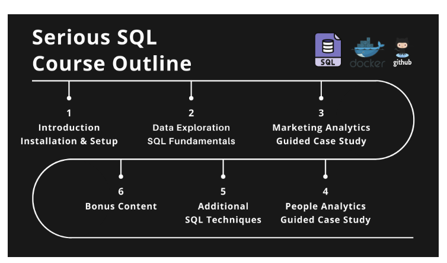

<h1 style="text-align: center;">Serious SQL</h1>

**Data with Danny** offers a robust path to learning, understanding and most importantly using `SQL` to display its' utility in any data career seeker journey! Below is a quick guide to the repository details and paths within the repository. A huge thank you to Danny for this truly magnificient class and challenging case studies for revealing the value in databases and what SQL can extract!

---

## Repository Contents 🗄️
* **[Data Exploration Section](/Data%20Exploration)**
    - Within this section of the repository you can find common SQL techniques and a mini case study in which we get to put them to work
    - `Techniques` 🤹‍♂️ 
        * Select & Sort, Summary Statistics, Record Counts & Distinct Values
        * Distribution Functions, Duplicate Identification & Handling
    - `Health Analytics Case Study` 🥼
        * [Health Analytics Case Study](/Data%20Exploration/HealthAnalytics_CaseStudy_Mini)
    - `Section Summary` 🖇️
        * [Section Summary](/Data%20Exploration/Summary_Notes/First_Section_Review.md)

 

* **[Marketing Analytics Section](/Marketing_Analytics_CaseStudy/)**
    - This second section of the course turns to a sample business request and how the path to understanding and using our data can be leveraged to accomplish this sample business request.
    - The final solution was crafted with the following `techniques` 🤹‍♂️ 
        * Window Functions, Practical Application of Different Types of Table Joins, Case Statements for Data Transformation/Manipulation, Table Creation
    - `Data Overview`
        * Review Schema and **ERD** for Tables used in final solution development
        * [Data & ERD Overview](/Marketing_Analytics_CaseStudy/Understanding_Data.md)
    - `Case Study Overview, Business Request & Table Join Analysis`
        * Using the ERD this markdown file highlights the Objective of the Case Study as well as the framework for analyzing table joins
        * [Overview, Request & Join Analysis](/Marketing_Analytics_CaseStudy/MultipleTableJoins_CStudyReview.md)
    - `Case Study Solution - Deliverable SQL Script`
        * Within the report section of the markdown file you can find the sql script that would be used to create the table for data insights 
        * [Case Study Solution](/Marketing_Analytics_CaseStudy/Sql_ScriptingSol.md)

 

* **[People Analytics Case Study](/People_Analytics)**
    - The second complete SQL case study mocks us assisting **HR Analytica** to construct datasets to answer basic reporting questions and also feed their bespoke People Analytics dashboards.
    - A heavry emphasis on creating **reusable data assets** mostly achieved through **VIEWS**
    - `Case Study Overview and Initial Data Exploration`
        * [Overview & Explore](/People_Analytics/CaseStudy_Intro.md)
    - `Reusable Data Assets & Views`
        * [Data Assets & Views](/People_Analytics/DataAssets_Views.md)
    - `Historical Data & SCD`
        * Idea of better understanding slowly changing dimensions
        * [Historical Data / SCD](/People_Analytics/SnapShot_HistoricData.md)
    - `Case Study Solution`
        * [Cumulative Solution Markdown & Test Questions](/People_Analytics)