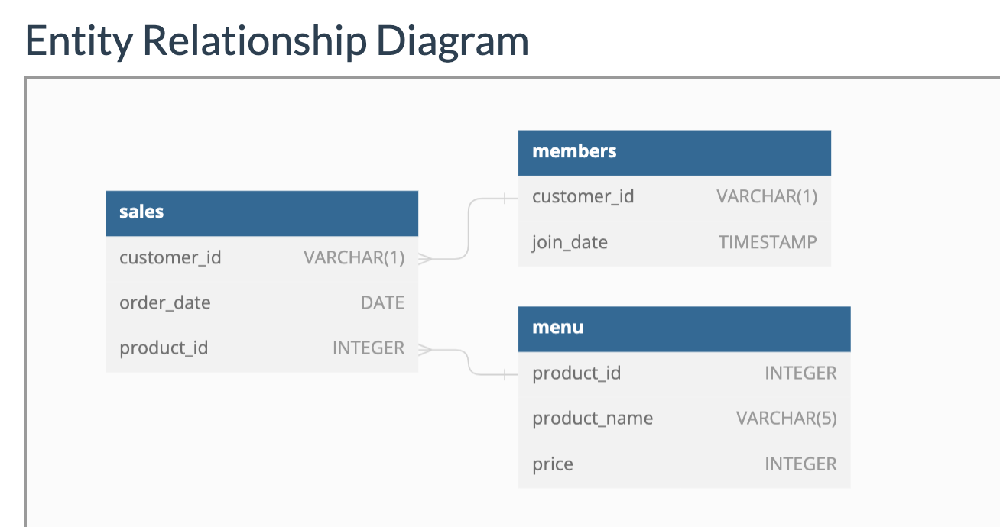

# Danny's Diner

## Context
Danny seriously loves Japanese food so in the beginning of 2021, he decides to embark upon a risky venture and opens up a cute little restaurant that sells his 3 favourite foods: sushi, curry and ramen.

Danny’s Diner is in need of your assistance to help the restaurant stay afloat - the restaurant has captured some very basic data from their few months of operation but have no idea how to use their data to help them run the business.

<br>

## Problem Statement
Danny wants to use the data to answer a few simple questions about his customers, especially about their visiting patterns, how much money they’ve spent and also which menu items are their favourite. Having this deeper connection with his customers will help him deliver a better and more personalised experience for his loyal customers.

He plans on using these insights to help him decide whether he should expand the existing customer loyalty program - additionally he needs help to generate some basic datasets so his team can easily inspect the data without needing to use SQL.

<br>

### `Example Datasets`
Danny has provided you with a sample of his overall customer data due to privacy issues - but he hopes that these examples are enough for you to write fully functioning SQL queries to help him answer his questions!

Danny has shared with you 3 key datasets for this case study:

* sales
* menu
* members



<br>

### **Table Review**

#### `Sales`
* Sales table caputres all `customer_id` level purchases with a corresponding `order_date` and `product_id`

```sql
SELECT *
FROM dannys_diner.sales
LIMIT 5;
```
|customer_id|order_date|product_id|
|----|-----|-----|
|A|2021-01-01|1|
|A|2021-01-01|2|
|A|2021-01-07|2|
|A|2021-01-10|3|
|A|2021-01-11|3|

<br>

#### `Menu`
* The menu table maps the `product_id` to the actual `product_name` and price of each menu item.
```sql
SELECT *
FROM dannys_diner.menu
LIMIT 5;
```
|product_id|product_name|price|
|----|---|----|
|1|sushi|10|
|2|curry|15|
|3|ramen|12|

<br>

#### `Members`
* The final `members` table captures the `join_date` when a `customer_id` joined the beta version of the Danny’s Diner loyalty program.
```sql
SELECT *
FROM dannys_diner.members
LIMIT 5;
```
|customer_id|join_date|
|----|----|
|A|2021-01-07|
|B|2021-01-09|

---

<br>

### **Case Study Questions**
Each of the following case study questions can be answered using a single SQL statement:

1. What is the total amount each customer spent at the restaurant?
```sql
-- Multiple Window Functions here to get an idea of daily/total value
SELECT
  s.customer_id,
  s.order_date,
  s.product_id,
  SUM(price) OVER (
    PARTITION BY s.customer_id, s.order_date
    ORDER BY s.order_date
  ) AS customer_order_date_sum,
  SUM(price) OVER(
    PARTITION BY s.customer_id
  ) AS customer_total_sum
FROM dannys_diner.sales AS s 
INNER JOIN dannys_diner.menu AS m
  USING(product_id)
```
|customer_id|order_date|product_id|customer_order_date_sum|customer_total_sum|
|-----|-----|------|------|-------|
|A|2021-01-01|2|25|76|
|A|2021-01-01|1|25|76|
|A|2021-01-07|2|15|76|
|A|2021-01-10|3|12|76|
|A|2021-01-11|3|24|76|
|A|2021-01-11|3|24|76|
|B|2021-01-01|2|15|74|
|B|2021-01-02|2|15|74|
|B|2021-01-04|1|10|74|
|B|2021-01-11|1|10|74|
|B|2021-01-16|3|12|74|
|B|2021-02-01|3|12|74|
|C|2021-01-01|3|24|36|
|C|2021-01-01|3|24|36|
|C|2021-01-07|3|12|36|

```sql
SELECT
  s.customer_id,
  SUM(m.price) AS customer_total_sum
FROM dannys_diner.sales AS s 
INNER JOIN dannys_diner.menu AS m
  USING(product_id)
GROUP BY s.customer_id
ORDER BY customer_total_sum DESC;
```
|customer_id|customer_total_sum|
|-----|-----|
|A|76|
|B|74|
|C|36|

<br>

2. How many days has each customer visited the restaurant?
```sql
-- How many days has each customer visited the restaurant?
SELECT
  s.customer_id,
  COUNT(DISTINCT order_date) AS customer_total_visits
FROM dannys_diner.sales AS s
GROUP BY s.customer_id
ORDER BY customer_total_visits DESC;
```
|customer_id|customer_total_visits|
|----|-----|
|B|6|
|A|4|
|C|2|

<br>

3. What was the first item from the menu purchased by each customer?
```sql
-- What was the first item from the menu purchased by each customer?
-- DENSE RANK for any products purchased on same day (ranked the same)
WITH first_menu_item_customer_purchase AS (
SELECT
  s.customer_id,
  s.order_date,
  s.product_id,
  m.product_name,
  DENSE_RANK() OVER (
    PARTITION BY customer_id
    ORDER BY order_date
  ) AS item_purchase_rank_by_date
FROM dannys_diner.sales s 
INNER JOIN dannys_diner.menu m 
  USING(product_id)
)
SELECT *
FROM first_menu_item_customer_purchase
WHERE item_purchase_rank_by_date = 1;
```
|customer_id|order_date|product_id|product_name|item_purchase_rank_by_date|
|-----|------|-----|-----|------|
|A|2021-01-01|2|curry|1|
|A|2021-01-01|1|sushi|1|
|B|2021-01-01|2|curry|1|
|C|2021-01-01|3|ramen|1|
|C|2021-01-01|3|ramen|1|

<br>

4. What is the most purchased item on the menu and how many times was it purchased by all customers?
```sql
-- What is the most purchased item on the menu and how many times was it purchased by all customers?
WITH most_purchased_item AS (
SELECT 
  s.product_id,
  m.product_name,
  COUNT(*) AS menu_product_sales_count
FROM dannys_diner.sales AS s 
INNER JOIN dannys_diner.menu AS m
  USING(product_id)
GROUP BY s.product_id, m.product_name
ORDER BY menu_product_sales_count DESC
-- JUST WANT THE Top Item
LIMIT 1
)
SELECT
  s.customer_id,
  s.product_id,
  m.product_name,
  COUNT(*) AS customer_top_menu_item_purchases
FROM dannys_diner.sales s
INNER JOIN dannys_diner.menu m
  USING(product_id)
WHERE s.product_id = (SELECT product_id FROM most_purchased_item)
GROUP BY s.customer_id, s.product_id, m.product_name
ORDER BY customer_top_menu_item_purchases DESC;
```
|customer_id|product_id|product_name|customer_top_menu_item_purchases|
|----|-----|-----|-----|
|A|3|ramen|3|
|C|3|ramen|3|
|B|3|ramen|2|

<br>

* If using a basic `COUNT` and simply looking for total customer purchases and not broken down by each particular customer (aka total count of the most popular item for all customers)

```sql
SELECT 
  m.product_name AS product,
  COUNT(*) AS total_product_purchases
FROM dannys_diner.sales s 
INNER JOIN dannys_diner.menu m
  USING(product_id)
GROUP BY product 
ORDER BY total_product_purchases DESC;
```
|product|total_product_purchases|
|----|----|
|ramen|8|
|curry|4|
|sushi|3|

<br>

5. Which item was the most popular for each customer?
```sql
SELECT
  s.customer_id,
  s.product_id,
  m.product_name,
  DENSE_RANK() OVER (
    PARTITION BY customer_id
    ORDER BY COUNT(*) DESC
  ) AS customer_menu_item_rankings
FROM dannys_diner.sales s 
INNER JOIN dannys_diner.menu m 
  USING(product_id)
GROUP BY customer_id, product_id, product_name
ORDER BY customer_id
```
|customer_id|product_id|product_name|customer_menu_item_rankings|
|-----|----|-----|------|
|A|3|ramen|1|
|A|2|curry|2|
|A|1|sushi|3|
|B|1|sushi|1|
|B|3|ramen|1|
|B|2|curry|1|
|C|3|ramen|1|

* The `GROUP BY` was needed for the dense ranking function which is running the window function after grouping the customer purchases

```sql
WITH most_purchased_item_per_customer AS (
SELECT
  s.customer_id,
  s.product_id,
  m.product_name,
  DENSE_RANK() OVER (
    PARTITION BY customer_id
    ORDER BY COUNT(*) DESC
  ) AS customer_menu_item_rankings,
  COUNT(*) AS customer_item_purchase_count
FROM dannys_diner.sales s 
INNER JOIN dannys_diner.menu m 
  USING(product_id)
GROUP BY customer_id, product_id, product_name
ORDER BY customer_id
)
SELECT *
FROM most_purchased_item_per_customer
WHERE customer_menu_item_rankings = 1
ORDER BY customer_id;
```
|customer_id|product_id|product_name|customer_menu_item_rankings|customer_item_purchase_count|
|----|-----|-----|-----|-----|
|A|3|ramen|1|3|
|B|1|sushi|1|2|
|B|3|ramen|1|2|
|B|2|curry|1|2|
|C|3|ramen|1|3|

<br>

* Note here on provided answer (similar to mine just a bit less clutter)
```sql
WITH customer_cte AS (
  SELECT
    sales.customer_id,
    menu.product_name,
    COUNT(sales.*) AS item_quantity,
    -- you may want to check this!
    DENSE_RANK() OVER (
      PARTITION BY sales.customer_id
      ORDER BY COUNT(*) DESC
    ) AS item_rank
  FROM dannys_diner.sales
  INNER JOIN dannys_diner.menu
  USING(product_id)
  GROUP BY
    sales.customer_id, menu.product_name
)
SELECT
  customer_id,
  product_name,
  item_quantity
FROM customer_cte
WHERE item_rank = 1;
```
|customer_id|product_name|item_quantity|
|-----|-----|-----|
|A|ramen|3|
|B|sushi|2|
|B|curry|2|
|B|ramen|2|
|C|ramen|3|

<br>

6. Which item was purchased first by the customer after they became a member?
```sql
SELECT
  s.customer_id,
  m.join_date AS member_join_date,
  s.order_date,
  s.product_id,
  mn.product_name,
  DENSE_RANK() OVER (
    PARTITION BY s.customer_id
    ORDER BY s.order_date
  ) AS new_member_purchase_rankings
FROM dannys_diner.members AS m
INNER JOIN dannys_diner.sales AS s 
  ON m.customer_id = s.customer_id
INNER JOIN dannys_diner.menu AS mn 
  USING(product_id)
WHERE m.join_date <= s.order_date
ORDER BY m.customer_id
```
|customer_id|member_join_date|order_date|product_id|product_name|new_member_purchase_rankings|
|-----|-----|----|---|----|-----|
|A|2021-01-07|2021-01-07|2|curry|1|
|A|2021-01-07|2021-01-10|3|ramen|2|
|A|2021-01-07|2021-01-11|3|ramen|3|
|A|2021-01-07|2021-01-11|3|ramen|3|
|B|2021-01-09|2021-01-11|1|sushi|1|
|B|2021-01-09|2021-01-16|3|ramen|2|
|B|2021-01-09|2021-02-01|3|ramen|3|

```sql
-- Which item was purchased first by the customer after they became a member?
WITH new_member_purchase_rankings AS (
SELECT
  s.customer_id,
  m.join_date AS member_join_date,
  s.order_date,
  s.product_id,
  mn.product_name,
  DENSE_RANK() OVER (
    PARTITION BY s.customer_id
    ORDER BY s.order_date
  ) AS new_member_purchase_rankings
FROM dannys_diner.members AS m
INNER JOIN dannys_diner.sales AS s 
  ON m.customer_id = s.customer_id
INNER JOIN dannys_diner.menu AS mn 
  USING(product_id)
WHERE m.join_date <= s.order_date
ORDER BY m.customer_id
)
SELECT * 
FROM new_member_purchase_rankings
WHERE new_member_purchase_rankings = 1;
```
|customer_id|member_join_date|order_date|product_id|product_name|new_member_purchase_rankings|
|---|----|---|----|-----|-----|
|A|2021-01-07|2021-01-07|2|curry|1|
|B|2021-01-09|2021-01-11|1|sushi|1|

<br>

* Another approach
```sql
WITH member_sales_cte AS (
  SELECT
    sales.customer_id,
    sales.order_date,
    menu.product_name,
    RANK() OVER (
      PARTITION BY sales.customer_id
      ORDER BY sales.order_date
    ) AS order__rank
  FROM dannys_diner.sales
  INNER JOIN dannys_diner.menu
    ON sales.product_id = menu.product_id
  INNER JOIN dannys_diner.members
    ON sales.customer_id = members.customer_id
  WHERE
    sales.order_date >= members.join_date::DATE
)
SELECT DISTINCT
  customer_id,
  order_date,
  product_name
FROM member_sales_cte
WHERE order__rank = 1
```
|customer_id|order_date|product_name|
|-----|-----|-----|
|A|2021-01-07|curry|
|B|2021-01-11|sushi|

<br>

7. Which item was purchased just before the customer became a member?
```sql
-- Which item was purchased just before the customer became a member
WITH pre_member_purchase_rankings AS (
SELECT
  s.customer_id,
  m.join_date AS member_join_date,
  s.order_date,
  s.product_id,
  mn.product_name,
  DENSE_RANK() OVER (
    PARTITION BY s.customer_id
    -- with where below we want to order by most recent leading up to the join date as a member
    ORDER BY s.order_date DESC
  ) AS pre_member_purchase_ranking
FROM dannys_diner.members AS m
INNER JOIN dannys_diner.sales AS s 
  ON m.customer_id = s.customer_id
INNER JOIN dannys_diner.menu AS mn 
  USING(product_id)
WHERE m.join_date > s.order_date
ORDER BY m.customer_id
)
SELECT * 
FROM pre_member_purchase_rankings
WHERE pre_member_purchase_ranking = 1;
```
|customer_id|member_join_date|order_date|product_id|product_name|pre_member_purchase_ranking|
|---|----|-----|----|-----|----|
|A|2021-01-07|2021-01-01|1|sushi|1|
|A|2021-01-07|2021-01-01|2|curry|1|
|B|2021-01-09|2021-01-04|1|sushi|1|

<br>

8. What is the total items and amount spent for each member before they became a member?
```sql
SELECT
  customer_id,
  COUNT(*) AS total_items_pre_member_join_date,
  SUM(mn.price) AS sales_total_pre_member_join_date
FROM dannys_diner.sales AS s 
INNER JOIN dannys_diner.members AS m 
  USING(customer_id)
INNER JOIN dannys_diner.menu AS mn 
  USING(product_id)
WHERE m.join_date < s.order_date
GROUP BY customer_id
ORDER BY sales_total_pre_member_join_date DESC;
```
|customer_id|total_items_pre_member_join_date|sales_total_pre_member_join_date|
|-----|-----|------|
|A|3|36|
|B|3|34|

<br>

* Here is the adjusted question for `Question #8`
  - What is the number of unique menu items and total amount spent for each member before they became a member?

```sql
-- What is the number of unique menu items and total amount spent for each member before they became a member?
SELECT 
  customer_id,
  COUNT(DISTINCT product_name),
  SUM(price)
FROM dannys_diner.sales sl 
  INNER JOIN dannys_diner.menu mn 
  USING(product_id)
  INNER JOIN dannys_diner.members mb 
  USING(customer_id)
WHERE sl.order_date < mb.join_date
GROUP BY customer_id
ORDER BY customer_id;
```
|customer_id|count|sum|
|----|----|-----|
|A|2|25|
|B|2|40|

<br>

9. If each $1 spent equates to 10 points and sushi has a 2x points multiplier - how many points would each customer have?
```sql
WITH sales_purchase_points AS (
SELECT 
  s.customer_id,
  mn.product_name,
  mn.price,
  CASE 
    WHEN mn.product_name != 'sushi'
      THEN mn.price * 10
    WHEN mn.product_name = 'sushi'
      THEN (mn.price * 10) * 2
  END AS sale_purchase_points
FROM dannys_diner.sales AS s 
INNER JOIN dannys_diner.menu AS mn 
  USING(product_id)
)
SELECT 
FROM sales_purchase_points
WHERE customer_id = 'A';
```
|customer_id|product_name|price|sale_purchase_points|
|----|-----|-----|------|
|A|sushi|10|200|
|A|curry|15|150|
|A|curry|15|150|
|A|ramen|12|120|
|A|ramen|12|120|
|A|ramen|12|120|

* Quick snapshot of how the `CASE WHEN` statement is generating the points per sales item per customer 

```sql
WITH sales_purchase_points AS (
SELECT 
  s.customer_id AS customer_id,
  mn.product_name,
  mn.price,
  CASE 
    WHEN mn.product_name != 'sushi'
      THEN mn.price * 10
    WHEN mn.product_name = 'sushi'
      THEN (mn.price * 10) * 2
  END AS sale_purchase_points
FROM dannys_diner.sales AS s 
INNER JOIN dannys_diner.menu AS mn 
  USING(product_id)
)
SELECT
  customer_id,
  SUM(sale_purchase_points) AS customer_total_sales_points
FROM sales_purchase_points
GROUP BY customer_id
ORDER BY customer_total_sales_points DESC;
```
|customer_id|customer_total_sales_points|
|----|-----|
|B|940|
|A|860|
|C|360|

<br>

* Consolidate the `CASE` statement to have the sum included

```sql
-- If each $1 spent equates to 10 points and sushi has a 2x points multiplier - how many points would each customer have?
SELECT
  sales.customer_id,
  -- Captrue SUM of points grouped by customer with different product types
  SUM(
    CASE
      WHEN menu.product_name = 'sushi' 
        THEN 2 * (10 * menu.price)
      ELSE 10 * menu.price
    END
  )
  AS points
FROM dannys_diner.sales
LEFT JOIN dannys_diner.menu
  ON sales.product_id = menu.product_id
GROUP BY customer_id
ORDER BY points DESC;
```
|customer_id|points|
|-----|-----|
|B|940|
|A|860|
|C|360|

<br>

10. In the first week after a customer joins the program (including their join date) they earn 2x points on all items, not just sushi - how many points do customer A and B have at the end of January?

```sql
-- In the first week after a customer joins the program (including their join date) they earn 2x points on all items,
-- not just sushi - how many points do customer A and B have at the end of January?
WITH member_join_date_diff AS (
SELECT 
  s.customer_id AS customer_id,
  s.order_date AS order_date,
  mn.product_name,
  mn.price,
  m.join_date,
  s.order_date - m.join_date AS date_diff
FROM dannys_diner.sales AS s 
INNER JOIN dannys_diner.members AS m 
  USING(customer_id)
INNER JOIN dannys_diner.menu AS mn 
  USING(product_id)
WHERE order_date <= '2021-01-31'
ORDER BY s.customer_id, s.order_date
),
-- BETWEEN is inclusive for each end of the provided range
member_end_jan_points AS (
SELECT 
  customer_id,
  order_date,
  join_date,
  product_name,
  price,
  CASE
    WHEN date_diff BETWEEN 0 AND 7
      THEN (price * 10) * 2
    WHEN date_diff > 7
      AND product_name != 'sushi'
      THEN price * 10
    WHEN date_diff > 7
      AND product_name = 'sushi'
      THEN (price * 10) * 2
    ELSE 0
    END AS member_purchase_points
FROM member_join_date_diff 
)
SELECT *
FROM member_end_jan_points;
```
|customer_id|order_date|join_date|product_name|price|member_purchase_points|
|----|----|-----|-----|-----|-----|
|A|2021-01-01|2021-01-07|sushi|10|0|
|A|2021-01-01|2021-01-07|curry|15|0|
|A|2021-01-07|2021-01-07|curry|15|300|
|A|2021-01-10|2021-01-07|ramen|12|240|
|A|2021-01-11|2021-01-07|ramen|12|240|
|A|2021-01-11|2021-01-07|ramen|12|240|
|B|2021-01-01|2021-01-09|curry|15|0|
|B|2021-01-02|2021-01-09|curry|15|0|
|B|2021-01-04|2021-01-09|sushi|10|0|
|B|2021-01-11|2021-01-09|sushi|10|200|
|B|2021-01-16|2021-01-09|ramen|12|240|

* Now we can aggregate on the customer 

```sql
WITH member_join_date_diff AS (
SELECT 
  s.customer_id AS customer_id,
  s.order_date AS order_date,
  mn.product_name,
  mn.price,
  m.join_date,
  s.order_date - m.join_date AS date_diff
FROM dannys_diner.sales AS s 
INNER JOIN dannys_diner.members AS m 
  USING(customer_id)
INNER JOIN dannys_diner.menu AS mn 
  USING(product_id)
WHERE order_date <= '2021-01-31'
ORDER BY s.customer_id, s.order_date
),
-- BETWEEN is inclusive for each end of the provided range
member_end_jan_points AS (
SELECT 
  customer_id,
  order_date,
  join_date,
  product_name,
  price,
  CASE
    WHEN date_diff BETWEEN 0 AND 7
      THEN (price * 10) * 2
    WHEN date_diff > 7
      AND product_name != 'sushi'
      THEN price * 10
    WHEN date_diff > 7
      AND product_name = 'sushi'
      THEN (price * 10) * 2
    ELSE 0
    END AS member_purchase_points
FROM member_join_date_diff 
)
SELECT 
  customer_id,
  SUM(member_purchase_points) AS member_points_end_jan
FROM member_end_jan_points
GROUP BY customer_id
ORDER BY member_points_end_jan DESC;
```
|customer_id|member_points_end_jan|
|----|----|
|A|1020|
|B|440|

<br>

#### `Bonus Questions`
1. Recreate the following table output using the available data:

|customer_id|order_date|product_name|price|member|
|-----|-----|----|-----|-----|
|A|2021-01-01|curry|15|N|
|A|2021-01-01|sushi|10|N|
|A|2021-01-07|curry|15|Y|
|A|2021-01-10|ramen|12|Y|
|A|2021-01-11|ramen|12|Y|
|A|2021-01-11|ramen|12|Y|
|B|2021-01-01|curry|15|N|
|B|2021-01-02|curry|15|N|
|B|2021-01-04|sushi|10|N|
|B|2021-01-11|sushi|10|Y|
|B|2021-01-16|ramen|12|Y|
|B|2021-02-01|ramen|12|Y|
|C|2021-01-01|ramen|12|N|
|C|2021-01-01|ramen|12|N|
|C|2021-01-07|ramen|12|N|

```sql
-- Table Recreation (Bonus : 1)
WITH customer_sales_member_join AS (
SELECT 
  sl.customer_id AS customer_id,
  sl.order_date AS order_date,
  mn.product_name AS product_name,
  mn.price AS price,
  memb.join_date AS join_date
FROM dannys_diner.sales AS sl 
INNER JOIN dannys_diner.menu AS mn
  USING(product_id)
LEFT JOIN dannys_diner.members AS memb 
  ON sl.customer_id = memb.customer_id
ORDER BY customer_id, order_date
)
SELECT
  customer_id,
  order_date,
  product_name,
  price,
  CASE 
    WHEN join_date IS NULL
      THEN 'N'
    WHEN join_date > order_date
      THEN 'N'
    WHEN join_date <= order_date
      THEN 'Y'
  END AS member 
FROM customer_sales_member_join
ORDER BY customer_id, order_date, product_name;
```
|customer_id|order_date|product_name|price|member|
|----|-----|-----|-----|-----|
|A|2021-01-01|curry|15|N|
|A|2021-01-01|sushi|10|N|
|A|2021-01-07|curry|15|Y|
|A|2021-01-10|ramen|12|Y|
|A|2021-01-11|ramen|12|Y|
|A|2021-01-11|ramen|12|Y|
|B|2021-01-01|curry|15|N|
|B|2021-01-02|curry|15|N|
|B|2021-01-04|sushi|10|N|
|B|2021-01-11|sushi|10|Y|
|B|2021-01-16|ramen|12|Y|
|B|2021-02-01|ramen|12|Y|
|C|2021-01-01|ramen|12|N|
|C|2021-01-01|ramen|12|N|
|C|2021-01-07|ramen|12|N|

<br>

* Quicker approach
```sql
SELECT
  sales.customer_id,
  sales.order_date,
  members.join_date,
  menu.product_name,
  menu.price,
  CASE WHEN sales.order_date >= members.join_date::DATE THEN 'Y'
    ELSE 'N'
  END AS member
FROM dannys_diner.sales
INNER JOIN dannys_diner.menu
  ON sales.product_id = menu.product_id
-- still need customer c even though not a member
LEFT JOIN dannys_diner.members
  ON sales.customer_id = members.customer_id
ORDER BY
  sales.customer_id, sales.order_date;
```

<br>

**Rank All The Things**

2. Danny also requires further information about the `ranking` of customer products, but he purposely does not need the ranking for non-member purchases so he expects null ranking values for the records when customers are not yet part of the loyalty program.

* Expected Table Output

|customer_id|order_date|product_name|price|member|ranking|
|----|-----|----|-----|-----|----|
|A|2021-01-01|curry|15|N|null|
|A|2021-01-01|sushi|10|N|null|
|A|2021-01-07|curry|15|Y|1|
|A|2021-01-10|ramen|12|Y|2|
|A|2021-01-11|ramen|12|Y|3|
|A|2021-01-11|ramen|12|Y|3|
|B|2021-01-01|curry|15|N|null|
|B|2021-01-02|curry|15|N|null|
|B|2021-01-04|sushi|10|N|null|
|B|2021-01-11|sushi|10|Y|1|
|B|2021-01-16|ramen|12|Y|2|
|B|2021-02-01|ramen|12|Y|3|
|C|2021-01-01|ramen|12|N|null|
|C|2021-01-01|ramen|12|N|null|
|C|2021-01-07|ramen|12|N|null|

```sql
-- Table Recreation (Bonus : 2)
WITH customer_sales_member_join AS (
SELECT 
  sl.customer_id AS customer_id,
  sl.order_date AS order_date,
  mn.product_name AS product_name,
  mn.price AS price,
  memb.join_date AS join_date
FROM dannys_diner.sales AS sl 
INNER JOIN dannys_diner.menu AS mn
  USING(product_id)
LEFT JOIN dannys_diner.members AS memb 
  ON sl.customer_id = memb.customer_id
ORDER BY customer_id, order_date
),
member_date AS (
SELECT
  customer_id,
  order_date,
  product_name,
  price,
  CASE 
    WHEN join_date IS NULL
      THEN 'N'
    WHEN join_date > order_date
      THEN 'N'
    WHEN join_date <= order_date
      THEN 'Y'
  END AS member 
FROM customer_sales_member_join
ORDER BY customer_id, order_date, product_name
)
SELECT
  customer_id,
  order_date,
  product_name,
  price,
  member,
  CASE
    WHEN member = 'N'
      THEN null
    WHEN member = 'Y'
      THEN 
      DENSE_RANK() OVER(
        PARTITION BY customer_id, member
        ORDER BY order_date
      )
  END AS ranking
FROM member_date
ORDER BY customer_id, order_date, product_name;
```
|customer_id|order_date|product_name|price|member|ranking|
|-----|-----|------|------|------|-----|
|A|2021-01-01|curry|15|N|null|
|A|2021-01-01|sushi|10|N|null|
|A|2021-01-07|curry|15|Y|1|
|A|2021-01-10|ramen|12|Y|2|
|A|2021-01-11|ramen|12|Y|3|
|A|2021-01-11|ramen|12|Y|3|
|B|2021-01-01|curry|15|N|null|
|B|2021-01-02|curry|15|N|null|
|B|2021-01-04|sushi|10|N|null|
|B|2021-01-11|sushi|10|Y|1|
|B|2021-01-16|ramen|12|Y|2|
|B|2021-02-01|ramen|12|Y|3|
|C|2021-01-01|ramen|12|N|null|
|C|2021-01-01|ramen|12|N|null|
|C|2021-01-07|ramen|12|N|null|

* Most important note here is the secondary argument for the PARTITION by here when the ranking function runs for a member

<br>

## `End of Case Study` 🏁

