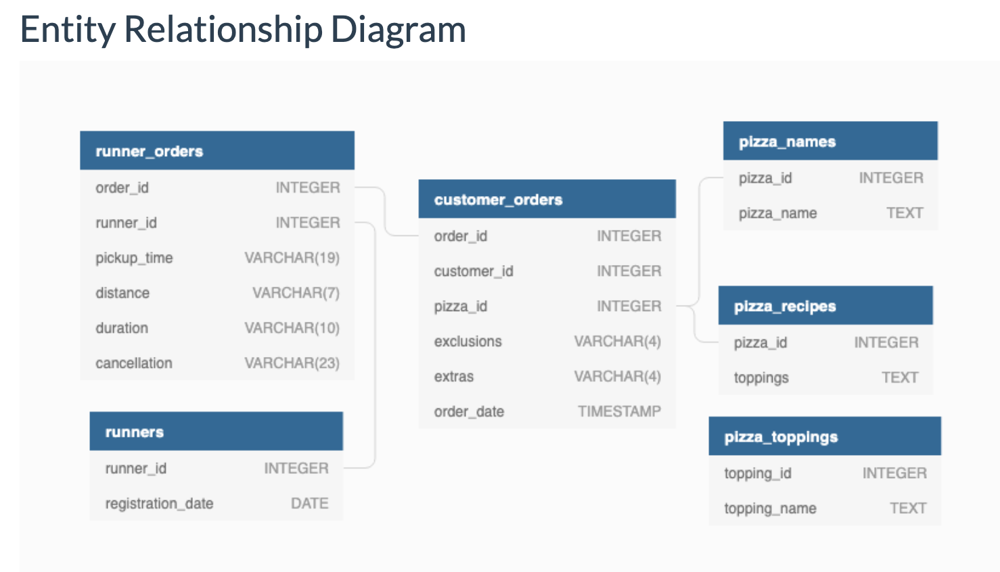

## Intro
Did you know that over 115 million kilograms of pizza is consumed daily worldwide??? (Well according to Wikipedia anyway…)

Danny was scrolling through his Instagram feed when something really caught his eye - “80s Retro Styling and Pizza Is The Future!”

Danny was sold on the idea, but he knew that pizza alone was not going to help him get seed funding to expand his new Pizza Empire - so he had one more genius idea to combine with it - he was going to Uberize it - and so Pizza Runner was launched!

Danny started by recruiting “runners” to deliver fresh pizza from Pizza Runner Headquarters (otherwise known as Danny’s house) and also maxed out his credit card to pay freelance developers to build a mobile app to accept orders from customers.

<br>

### **Available Data** 
Because Danny had a few years of experience as a data scientist - he was very aware that data collection was going to be critical for his business’ growth.

He has prepared for us an entity relationship diagram of his database design but requires further assistance to clean his data and apply some basic calculations so he can better direct his runners and optimise Pizza Runner’s operations.



--- 

<br>

## `Datasets` (Tables)

### **Table 1: Runners**
The `runners` table shows the `registration_date` for each new runner
```sql
SELECT *
FROM pizza_runner.runners
LIMIT 5;
```
|runner_id|registration_date|
|----|----|
|1|2021-01-01|
|2|2021-01-03|
|3|2021-01-08|
|4|2021-01-15|

<br>

### **Table 2: customer_orders**
Customer pizza orders are captured in the customer_orders table with 1 row for each individual pizza that is part of the order.

The `pizza_id` relates to the type of pizza which was ordered whilst the exclusions are the `ingredient_id` values which should be removed from the pizza and the extras are the ingredient_id values which need to be added to the pizza.

Note that customers can order multiple pizzas in a single order with varying exclusions and extras values even if the pizza is the same type!

The `exclusions` and `extras` columns will need to be cleaned up before using them in your queries.

|order_id|customer_id|pizza_id|exclusions|extras|order_time|
|----|----|----|----|-----|-----|
|1|101|1|||2021-01-01 18:05:02.000|
|2|101|1|||2021-01-01 19:00:52.000|
|3|102|1|||2021-01-02 23:51:23.000|
|3|102|2||null|2021-01-02 23:51:23.000|
|4|103|1|4||2021-01-04 13:23:46.000|

<br>

### **Table 3: runner_orders**
After each orders are received through the system - they are assigned to a runner - however not all orders are fully completed and can be cancelled by the restaurant or the customer.

The `pickup_time` is the timestamp at which the runner arrives at the Pizza Runner headquarters to pick up the freshly cooked pizzas. The distance and duration fields are related to how far and long the runner had to travel to deliver the order to the respective customer.

There are some known data issues with this table so be careful when using this in your queries - make sure to check the data types for each column in the ERD!

```sql
SELECT *
FROM pizza_runner.runner_orders
LIMIT 5;
```
|order_id|runner_id|pickup_time|distance|duration|cancellation|
|---|----|-----|-----|----|-----|
|1|1|2021-01-01 18:15:34|20km|32 minutes||
|2|1|2021-01-01 19:10:54|20km|27 minutes||
|3|1|2021-01-03 00:12:37|13.4km|20 mins|null|
|4|2|2021-01-04 13:53:03|23.4|40|null|
|5|3|2021-01-08 21:10:57|10|15|null|

<br>

### **Table 4: pizza_names**
At the moment - Pizza Runner only has 2 pizzas available the Meat Lovers or Vegetarian!
```sql
SELECT *
FROM pizza_runner.pizza_names
LIMIT 5;
```
|pizza_id|pizza_name|
|----|-----|
|1|Meatlovers|
|2|Vegetarian|

* Confirmed only two rows in this table 

<br>

### **Table 5: pizza_recipes**
Each `pizza_id` has a standard set of toppings which are used as part of the pizza recipe.
```sql
SELECT *
FROM pizza_runner.pizza_recipes
LIMIT 5;
```
|pizza_id|toppings|
|----|----|
|1|1, 2, 3, 4, 5, 6, 8, 10|
|2|4, 6, 7, 9, 11, 12|

<br>

## **Table 6: pizza_toppings**
This table contains all of the `topping_name` values with their corresponding `topping_id` value

```sql
SELECT
  COUNT(*)
FROM pizza_runner.pizza_toppings;
```
|count|
|----|
|12|


```sql
SELECT *
FROM pizza_runner.pizza_toppings
LIMIT 12;
```
|topping_id|topping_name|
|-----|-----|
|1|Bacon|
|2|BBQ Sauce|
|3|Beef|
|4|Cheese|
|5|Chicken|
|6|Mushrooms|
|7|Onions|
|8|Pepperoni|
|9|Peppers|
|10|Salami|
|11|Tomatoes|
|12|Tomato Sauce|

---

<br>

### `Case Study Questions`
This case study has LOTS of questions - they are broken up by area of focus including: 
* Pizza Metrics 
* Runner and Customer Experience 
* Ingredient Optimisation 
* Pricing and Ratings 
* **Bonus DML Challenges** 

Each of the following case study questions can be answered using a single SQL statement.

Again, there are many questions in this case study - please feel free to pick and choose which ones you’d like to try!

Before you start writing your SQL queries however - you might want to investigate the data, you may want to do something with some of those null values and data types in the `customer_orders` and `runner_orders` tables!

<br>

#### `A - Pizza Metrics` 


**1.** How many pizzas were ordered?
```sql
-- How many pizzas were ordered?
SELECT COUNT(pizza_id) AS total_pizza_count
FROM pizza_runner.customer_orders;
```
|total_pizza_count|
|----|
|14|

<br>

**2.** How many unique customer orders were made?
```sql
SELECT COUNT(DISTINCT order_id) AS unique_customer_orders
FROM pizza_runner.customer_orders;
```
|unique_customer_orders|
|----|
|10|

<br>

**3.** How many successful orders were delivered by each runner?
* Was seeing some odd returns with LIKE type character returns so need to either use a CTE or maybe a temp table for easier querying
```sql
SELECT
  order_id,
  pickup_time,
  LENGTH(pickup_time),
  cancellation,
  LENGTH(cancellation)
FROM pizza_runner.runner_orders
ORDER BY order_id;
```
|order_id|pickup_time|cancellation|length|
|-----|-----|-----|-----|
|1|2021-01-01 18:15:34||0|
|2|2021-01-01 19:10:54||0|
|3|2021-01-03 00:12:37|null|null|
|4|2021-01-04 13:53:03|null|null|
|5|2021-01-08 21:10:57|null|null|
|6|null|Restaurant Cancellation|23|
|7|2021-01-08 21:30:45|null|4|
|8|2021-01-10 00:15:02|null|4|
|9|null|Customer Cancellation|21|
|10|2021-01-11 18:50:20|null|4|

* Alright .. so we can see that the **LENGTH** readout exposes that the `cancellation` column has some unique vaues of actual **null** (or no length values) and strings that say **null** but actually are a string, in order to determine a successful order, need to standardize how we define cancellation.
* Seeing that the cancellation varies but is based on the pickup time existing, we can get the successful orders as so

```sql
-- Like the Idea of using the pickup time length (4 if null so still a value to standardize cancellation)
DROP TABLE IF EXISTS successful_orders;
CREATE TEMP TABLE successful_orders AS 
SELECT * 
FROM pizza_runner.runner_orders
WHERE pickup_time NOT ILIKE '%null%';

-- UPDATE TABLE to set consistent cancellation value
UPDATE successful_orders
SET cancellation = NULL;
```

* Now we can get the counts pretty straightforward
```sql
SELECT 
  runner_id,
  COUNT(DISTINCT order_id) AS successful_orders_per_runner
FROM successful_orders
GROUP BY runner_id
ORDER BY successful_orders_per_runner DESC;
```
|runner_id|successful_orders_per_runner|
|----|-----|
|1|4|
|2|3|
|3|1|

<br>

* ... Could also just do something like this for #3
```sql
SELECT
  runner_id,
  COUNT(DISTINCT order_id) AS successful_orders
FROM pizza_runner.runner_orders
WHERE cancellation IS NULL
  OR cancellation NOT IN ('Restaurant Cancellation', 'Customer Cancellation')
GROUP BY runner_id
ORDER BY successful_orders DESC;
```

4. How many of each type of pizza was delivered?
* We'd still wanna use the `successful_orders` temp_table here as it holds all unique order_ids that were **delivered**
* A `LEFT SEMI JOIN` can only return columns from the left-hand table, and yields one of each record from the left-hand table where there is one or more matches in the right-hand table (regardless of the number of matches). It's equivalent to (in standard SQL):
```sql
WITH successful_pizza_orders AS (
SELECT 
  so.order_id,
  co.pizza_id,
  pn.pizza_name
FROM successful_orders so 
-- get the pizza ids of successful orders (we want inner for all )
INNER JOIN pizza_runner.customer_orders co 
  USING(order_id)
INNER JOIN pizza_runner.pizza_names pn 
  ON co.pizza_id = pn.pizza_id
)
SELECT 
  pizza_name,
  COUNT(*) AS pizza_delivery_count
FROM successful_pizza_orders
GROUP BY pizza_name
ORDER BY pizza_delivery_count DESC
```
|pizza_name|pizza_delivery_count|
|----|-----|
|Meatlovers|9|
|Vegetarian|3|

<br>

* Quicker approach w/o CTE
```sql
SELECT
  pn.pizza_name AS pizza,
  COUNT(*) AS delivered_pizzas_count
FROM pizza_runner.runner_orders ro 
INNER JOIN pizza_runner.customer_orders co 
  USING(order_id)
INNER JOIN pizza_runner.pizza_names pn 
  USING(pizza_id)
WHERE ro.cancellation IS NULL
  OR ro.cancellation NOT IN ('Restaurant Cancellation', 'Customer Cancellation')
GROUP BY pizza
ORDER BY delivered_pizzas_count DESC;
```
|pizza|delivered_pizzas_count|
|-----|-----|
|Meatlovers|9|
|Vegetarian|3|

* See alternative approach as well

<br>


**5.** How many Vegetarian and Meatlovers were ordered by each customer?
* Since this question doesn’t quite have the successful delivery criteria - we do not need to look at the cancellations!
```sql
SELECT 
  co.customer_id AS customer,
  pn.pizza_name AS pizza_type,
  COUNT(*) AS customer_pizza_counts
FROM pizza_runner.customer_orders co 
INNER JOIN pizza_runner.pizza_names pn 
  ON co.pizza_id = pn.pizza_id
GROUP BY customer, pizza_type
ORDER BY customer,  customer_pizza_counts DESC;
```
|customer|pizza_type|customer_pizza_counts|
|----|----|----|
|101|Meatlovers|2|
|101|Vegetarian|1|
|102|Meatlovers|2|
|102|Vegetarian|1|
|103|Meatlovers|3|
|103|Vegetarian|1|
|104|Meatlovers|3|
|105|Vegetarian|1|

<br>

**6.** What was the maximum number of pizzas delivered in a single order?
* Note delivered included in the `WHERE` statement to limit how many rows to perform aggregate count on
```sql
-- What was the maximum number of pizzas "delivered" in a single order?
SELECT 
  co.order_id,
  COUNT(*) AS customer_order_pizza_count
FROM pizza_runner.customer_orders co 
INNER JOIN pizza_runner.runner_orders ro 
  ON co.order_id = ro.order_id
WHERE
-- clause to filter joined table where the order was cancelled (aka - not delivered )
  (ro.cancellation IS NULL OR ro.cancellation NOT IN ('Restaurant Cancellation', 'Customer Cancellation'))
GROUP BY co.order_id
ORDER BY customer_order_pizza_count DESC;
```
|order_id|customer_order_pizza_count|
|-----|-----|
|4|3|
|10|2|
|3|2|
|7|1|
|1|1|
|8|1|
|5|1|
|2|1|

* Maximum number would be three or just the first result of an included LIMIT in the above query

```sql
SELECT 
  co.order_id AS unique_order,
  -- Can use count as each order in co will be a single ordered pizza (multiple pizzas per unique order is its' own row)
  COUNT(*) AS pizzas_delivered,
  RANK() OVER (
    -- over pizzas_delivered (successfully)
    ORDER BY COUNT(*) DESC
  ) AS pizzas_delivered_rankings
FROM pizza_runner.runner_orders ro 
INNER JOIN pizza_runner.customer_orders co 
  USING(order_id)
WHERE ro.cancellation IS NULL
  OR ro.cancellation NOT IN ('Restaurant Cancellation', 'Customer Cancellation')
GROUP BY unique_order
```
|unique_order|pizzas_delivered|
|-----|-----|
|4|3|
|10|2|
|3|2|
|7|1|
|1|1|
|8|1|
|5|1|
|2|1|

<br>

**7.** For each customer, how many delivered pizzas had at least 1 change and how many had no changes?
* `Note`: a non-change for either extras or exclusions can either be a **blank string - length = 0**, a **null value**, or a **value of null with a length of 4**
```sql
-- SUM CASE WHEN type statement
SELECT 
  co.customer_id,
  -- Be careful here with the null values that actually have a length of 4 and aren't a null length (what would be expected for a null value)
  SUM(
    CASE 
      WHEN 
        (LENGTH(co.exclusions) >= 1 AND co.exclusions NOT LIKE '%null%')
      OR 
        (LENGTH(co.extras) >= 1 AND co.extras NOT LIKE '%null%')
      THEN 1
      ELSE 0
    END
  ) AS customer_pizza_alterations,
  SUM(
    CASE 
      WHEN 
        ((co.exclusions IS null OR LENGTH(co.exclusions) = 0) OR (LENGTH(co.exclusions) >= 1 AND co.exclusions LIKE '%null%'))
      AND 
        ((co.extras IS null OR LENGTH(co.extras) = 0) OR (LENGTH(co.extras) >= 1 AND co.extras LIKE '%null%'))
      THEN 1
      ELSE 0
    END
  ) AS no_customer_pizza_alterations
FROM pizza_runner.runner_orders ro 
INNER JOIN pizza_runner.customer_orders co 
  USING(order_id)
WHERE ro.cancellation IS NULL
  OR ro.cancellation NOT IN ('Restaurant Cancellation', 'Customer Cancellation')
GROUP BY co.customer_id
ORDER BY co.customer_id;
```
|customer_id|customer_pizza_alterations|no_customer_pizza_alterations|
|-----|-----|-----|
|101|0|2|
|102|0|3|
|103|3|0|
|104|2|1|
|105|1|0|

<br>

8. How many pizzas were delivered that had both exclusions and extras?
* First part of CTE - simply take column value for exclusions or extra if not an empty string of the string of null
```sql
 SELECT
    order_id,
    customer_id,
    pizza_id,
    CASE WHEN exclusions IN ('null', '') THEN NULL ELSE exclusions END AS exclusions,
    CASE WHEN extras IN ('null', '') THEN NULL ELSE extras END AS extras,
    order_time
  FROM pizza_runner.customer_orders
```
|order_id|customer_id|pizza_id|exclusions|extras|order_time|
|----|-----|----|-----|-----|-----|
|1|101|1|null|null|2021-01-01 18:05:02.000|
|2|101|1|null|null|2021-01-01 19:00:52.000|
|3|102|1|null|null|2021-01-02 23:51:23.000|
|3|102|2|null|null|2021-01-02 23:51:23.000|
|4|103|1|4|null|2021-01-04 13:23:46.000|

* Full CTE then with a Conditional `count`
```sql
WITH extras_exclusions_count AS (
   SELECT
    order_id,
    customer_id,
    pizza_id,
    CASE WHEN exclusions IN ('null', '') THEN NULL ELSE exclusions END AS exclusions,
    CASE WHEN extras IN ('null', '') THEN NULL ELSE extras END AS extras,
    order_time
  FROM pizza_runner.customer_orders
)
SELECT
  COUNT(*) AS exclusions_extras_total_pizzas_count
FROM extras_exclusions_count
WHERE exclusions IS NOT NULL AND extras IS NOT NULL;
```
|exclusions_extras_total_pizzas_count|
|-----|
|2|

<br>

**9.** What was the total volume of pizzas ordered for each hour of the day?
* Since orders do not necessarily mean delivered, can use the `order_time`
```sql
SELECT 
  DATE_PART('hour', order_time) AS order_hour,
  COUNT(order_id) AS hour_total_orders
FROM pizza_runner.customer_orders
GROUP BY order_hour
ORDER BY hour_total_orders DESC;
```
|order_hour|hour_total_orders|
|-----|-----|
|18|3|
|23|3|
|21|3|
|13|3|
|11|1|
|19|1|

<br>

10. What was the volume of orders for each day of the week?
```SQL
-- What was the volume of orders for each day of the week?
SELECT
-- TO_CHAR method very helpful here to group by
  INITCAP(TO_CHAR(order_time, 'day')) AS order_day,
  COUNT(order_id) AS DAY_total_orders
FROM pizza_runner.customer_orders
GROUP BY order_day
ORDER BY order_day DESC;
```
|order_day|day_total_orders|
|-----|----|
|Sunday|1|
|Saturday|3|
|Monday|5|
|Friday|5|

* Slightly different approach but does order a bit better
```sql
SELECT
  TO_CHAR(order_time, 'Day') AS day_of_week,
  COUNT(order_id) AS pizza_count
FROM pizza_runner.customer_orders
GROUP BY day_of_week, DATE_PART('dow', order_time)
ORDER BY DATE_PART('dow', order_time);
```
|day_of_week|pizza_count|
|---|----|
|Sunday|1|
|Monday|5|
|Friday|5|
|Saturday|3|

<br>

`A. Pizza Metrics` - Alternative approaches

**4.** How many of each type of pizza was delivered?
* WHERE EXISTS is filtering for the the orders not deemed as cancelled.
```sql
SELECT
  t2.pizza_name,
  COUNT(t1.*) AS delivered_pizza_count
FROM pizza_runner.customer_orders AS t1
INNER JOIN pizza_runner.pizza_names AS t2
  ON t1.pizza_id = t2.pizza_id
WHERE EXISTS (
  SELECT 1 FROM pizza_runner.runner_orders AS t3
  WHERE t1.order_id = t3.order_id
  AND (
    t3.cancellation IS NULL
    OR t3.cancellation NOT IN ('Restaurant Cancellation', 'Customer Cancellation')
  )
)
GROUP BY t2.pizza_name
ORDER BY delivered_pizza_count DESC;
```
|pizza_name|delivered_pizza_count|
|---|----|
|Meatlovers|9|
|Vegetarian|3|

<br>

**5.** How many of each pizza type for each customer
```sql
SELECT
  customer_id,
  SUM(CASE WHEN pizza_id = 1 THEN 1 ELSE 0 END) AS meatlovers,
  SUM(CASE WHEN pizza_id = 2 THEN 1 ELSE 0 END) AS vegetarian
FROM pizza_runner.customer_orders
GROUP BY customer_id
ORDER BY customer_id;
```
|customer_id|meatlovers|vegetarian|
|-----|-----|-----|
|101|2|1|
|102|2|1|
|103|3|1|
|104|3|0|
|105|0|1|


<br>

**6.**  What was the maximum number of pizzas delivered in a single order? (back to order criteria - successfully ordered)
```sql
WITH cte_ranked_orders AS (
  SELECT
    order_id,
    COUNT(*) AS pizza_count,
    RANK() OVER (
      ORDER BY COUNT(*) DESC
    ) AS count_rank
  FROM pizza_runner.customer_orders AS t1
  WHERE EXISTS (
    SELECT 1 FROM pizza_runner.runner_orders AS t2
    WHERE t1.order_id = t2.order_id
    AND (
      t2.cancellation IS NULL
      OR t2.cancellation NOT IN ('Restaurant Cancellation', 'Cstomer Cancellation')
    )
  )
  GROUP BY order_id
)
SELECT pizza_count FROM cte_ranked_orders WHERE count_rank = 1;
```
|pizza_count|
|----|
|3|

<br>

---

<br>

#### `B - Runner and Customer Experience`

**1.** How many runners signed up for each 1 week period? (i.e. week starts 2021-01-01)
```sql
-- Week Start 2021-01-01 (New Year)
SELECT 
  DATE_TRUNC('WEEK', registration_date::date) + INTERVAL '4 DAYS' AS runner_sign_up_wstart,
  COUNT(*)
FROM pizza_runner.runners
GROUP BY runner_sign_up_wstart
ORDER BY runner_sign_up_wstart;
-- EITHER HERE WORKS
SELECT
  DATE_TRUNC('week', registration_date)::DATE + 4 AS registration_week,
  COUNT(*) AS runners
FROM pizza_runner.runners
GROUP BY registration_week
ORDER BY registration_week;
```
|registration_week|runners|
|-----|-----|
|2021-01-01|2|
|2021-01-08|1|
|2021-01-15|1|

<br>

**2.** What was the average time in minutes it took for each runner to arrive at the Pizza Runner HQ to pickup the order?
* One more thing to be aware of is how we will be joining our customer and runner order tables - how will we deal with the duplicates from the customer table?
```sql
SELECT
  DISTINCT ro_1.order_id,
  ro_1.pickup_time,
  co_2.order_time,
  ro_1.pickup_time::timestamp - co_2.order_time AS pickup_time_diff,
  AGE(ro_1.pickup_time::timestamp, co_2.order_time) AS age_func_return,
  DATE_PART('minutes', AGE(ro_1.pickup_time::timestamp, co_2.order_time))::INTEGER
FROM pizza_runner.runner_orders ro_1
INNER JOIN pizza_runner.customer_orders co_2
  USING(order_id)
WHERE 
  ro_1.pickup_time != 'null' OR ro_1.pickup_time IS NULL
ORDER BY order_id;
```
|order_id|pickup_time|order_time|pickup_time_diff|age_func_return|date_part|
|----|-----|-----|------|-----|-----|
|1|2021-01-01 18:15:34|2021-01-01 18:05:02.000|{ "minutes": 10, "seconds": 32 }|{ "minutes": 10, "seconds": 32 }|10|
|2|2021-01-01 19:10:54|2021-01-01 19:00:52.000|{ "minutes": 10, "seconds": 2 }|{ "minutes": 10, "seconds": 2 }||10|
|3|2021-01-03 00:12:37|2021-01-02 23:51:23.000|{ "minutes": 21, "seconds": 14 }|{ "minutes": 21, "seconds": 14 }|21|
|4|2021-01-04 13:53:03|2021-01-04 13:23:46.000|{ "minutes": 29, "seconds": 17 }|{ "minutes": 29, "seconds": 17 }|29|
|5|2021-01-08 21:10:57|2021-01-08 21:00:29.000|{ "minutes": 10, "seconds": 28 }|{ "minutes": 10, "seconds": 28 }|10|
|7|2021-01-08 21:30:45|2021-01-08 21:20:29.000|{ "minutes": 10, "seconds": 16 }|{ "minutes": 10, "seconds": 16 }|10|
|8|2021-01-10 00:15:02|2021-01-09 23:54:33.000|{ "minutes": 20, "seconds": 29 }|{ "minutes": 20, "seconds": 29 }|20|
|10|2021-01-11 18:50:20|2021-01-11 18:34:49.000|{ "minutes": 15, "seconds": 31 }|{ "minutes": 15, "seconds": 31 }|15|

* We can see that the string `pickup_time` needs to be cast to a timestamp as the value is a string with the WHERE condition
* Next we'll need to use the `DATE_PART` function with the return from either the `AGE` function or direct interval returned from the subtraction

```sql
-- What was the average time in "minutes" it took for each runner to arrive at the Pizza Runner HQ to pickup the order?
WITH runner_avg_pickup_times AS (
SELECT
  DISTINCT ro_1.order_id,
  ro_1.pickup_time,
  co_2.order_time,
  ro_1.pickup_time::timestamp - co_2.order_time AS pickup_time_diff,
  AGE(ro_1.pickup_time::timestamp, co_2.order_time) AS age_func_return,
  DATE_PART('minutes', AGE(ro_1.pickup_time::timestamp, co_2.order_time))::INTEGER AS minutes
FROM pizza_runner.runner_orders ro_1
INNER JOIN pizza_runner.customer_orders co_2
  USING(order_id)
WHERE 
  ro_1.pickup_time != 'null' OR ro_1.pickup_time IS NULL
)

SELECT 
  AVG(minutes)::FLOAT AS avg_minutes_pickup_for_runner_from_order
FROM runner_avg_pickup_times;
```
|avg_minutes_pickup_for_runner_from_order|
|----|
|15.625|

<br>

**3.** Is there any relationship between the number of pizzas and how long the order takes to prepare?
* Desired output table would contain the order_id, the minutes before the pizza(s) was picked up for an order and how many pizzas were in the order

|order_id|pickup_mins|pizza_count|
|----|----|-----|
|1|10|1|
|3|21|2|
|4|29|3|

```sql
SELECT
  DISTINCT ro_1.order_id,
  DATE_PART('minutes', AGE(ro_1.pickup_time::timestamp, co_2.order_time))::INTEGER AS pickup_minutes,
  -- despite just getting 1 row for any orders with multiple rows we can still count the total orders from our joined customer orders table
  COUNT(co_2.order_id) AS pizza_count
FROM pizza_runner.runner_orders ro_1
INNER JOIN pizza_runner.customer_orders co_2
  USING(order_id)
WHERE 
  ro_1.pickup_time != 'null' OR ro_1.pickup_time IS NULL
GROUP BY order_id, pickup_minutes
ORDER BY pickup_minutes;
```
|order_id|pickup_minutes|pizza_count|
|----|-----|-----|
|1|10|1|
|2|10|1|
|5|10|1|
|7|10|1|
|10|15|2|
|8|20|1|
|3|21|2|
|4|29|3|

<br>

**4.** What was the average distance travelled for each customer?
* The distance field is a string and we need to use the `UNNEST` function along with a `REGEXP_MATCH` to extract any digits from the column to then CAST as an INT/FLOAT to get a numerical average
```sql
-- What was the average distance travelled for each customer?
WITH pickup_details AS (
SELECT 
  DISTINCT ro.order_id,
  ro.runner_id,
  ro.pickup_time,
  co.customer_id,
  ro.distance,
  ro.duration
FROM pizza_runner.runner_orders ro
INNER JOIN pizza_runner.customer_orders co 
  USING(order_id)
WHERE ro.pickup_time != 'null' OR ro.pickup_time IS NULL
ORDER BY order_id
)
SELECT
  customer_id,
  distance,
  -- Match with regexp for start of distance "^" followed by 1 or more digits, capture group of a .  with * zero or more times followed by 0 or more digits
  UNNEST(regexp_match(distance, '^\d+[.]*\d*'))::FLOAT
FROM pickup_details
```
|customer_id|distance|unnest|
|----|----|-----|
|101|20km|20|
|101|20km|20|
|102|13.4km|13.4|
|103|23.4|23.4|
|104|10|10|
|105|25km|25|
|102|23.4 km|23.4|
|104|10km|10|

* Now to perform (can set the value of the numeric distance in the CTE)
```sql
WITH pickup_details AS (
SELECT 
  DISTINCT ro.order_id,
  ro.runner_id,
  ro.pickup_time,
  co.customer_id,
  ro.distance,
  UNNEST(regexp_match(distance, '^\d+[.]*\d*'))::FLOAT AS numeric_distance,
  UNNEST(REGEXP_MATCH(ro.distance, '(^[0-9,.]+)'))::NUMERIC AS distance_rgp,
  ro.duration
FROM pizza_runner.runner_orders ro
INNER JOIN pizza_runner.customer_orders co 
  USING(order_id)
WHERE ro.pickup_time != 'null' OR ro.pickup_time IS NULL
ORDER BY order_id
)
SELECT
  customer_id,
  AVG(numeric_distance) as cust_avg_distance_travelled,
  ROUND(AVG(distance_rgp), 1) as cust_avg_rgxp_provided
FROM pickup_details
GROUP BY customer_id
ORDER BY customer_id;
```
|customer_id|cust_avg_distance_travelled|cust_avg_rgxp_provided|
|-----|-----|-----|
|101|20|20.0|
|102|18.4|18.4|
|103|23.4|23.4|
|104|10|10.0|
|105|25|25.0|

<br>

**5.** What was the difference between the longest and shortest delivery times for all orders?
* Think a quick RANK function with a CTE should get us there 
```sql
-- What was the difference between the longest and shortest delivery times for all orders? -- can just filter out a null pickup_time 
WITH delivery_times_ranked AS (
SELECT 
  UNNEST(REGEXP_MATCH(duration, '^[0-9]+'))::INTEGER AS duration_num,
  duration,
  RANK() OVER (
    ORDER BY UNNEST(REGEXP_MATCH(duration, '^[0-9]+'))::INTEGER DESC
  ) AS deliverly_length_rankings
FROM pizza_runner.runner_orders
WHERE pickup_time != 'null' OR pickup_time IS null
)
SELECT * FROM delivery_times_ranked;
```
|duration_num|duration|deliverly_length_rankings|
|----|----|----|
|40|40|1|
|32|32 minutes|2|
|27|27 minutes|3|
|25|25mins|4|
|20|20 mins|5|
|15|15|6|
|15|15 minute|6|
|10|10minutes|8|

* Now this is a bit unnecessary but would be a nice template for ranking a value for its' **numeric** values that is in a string/varchar type fields that is extracted with the regexp_match

```sql
WITH delivery_times_ranked AS (
SELECT 
  UNNEST(REGEXP_MATCH(duration, '^[0-9]+'))::INTEGER AS duration_num,
  duration,
  RANK() OVER (
    ORDER BY UNNEST(REGEXP_MATCH(duration, '^[0-9]+'))::INTEGER DESC
  ) AS deliverly_length_rankings
FROM pizza_runner.runner_orders
WHERE pickup_time != 'null' OR pickup_time IS null
)
SELECT 
  MAX(duration_num) - MIN(duration_num) AS max_delivery_difference
FROM delivery_times_ranked;
```
|max_delivery_difference|
|-----|
|30|

<br>

**6.** What was the average speed for each runner for each delivery and do you notice any trend for these values?
```sql
WITH pickup_details AS (
SELECT
  runner_id,
  order_id,
  EXTRACT('hour' FROM pickup_time::timestamp) AS hour_pickup,
  pickup_time,
  distance,
  UNNEST(REGEXP_MATCH(distance, '^[0-9, .]*'))::NUMERIC AS numeric_distance,
  duration,
  UNNEST(REGEXP_MATCH(duration, '^\d+'))::NUMERIC AS duration_mins
FROM pizza_runner.runner_orders
WHERE pickup_time != 'null'
)
SELECT
  runner_id,
  order_id,
  hour_pickup,
  numeric_distance,
  ROUND(60 / duration_mins::decimal, 1) AS distance_multiplier,
  -- Double precision type returned, must cast to a numeric after performing operation prior to round accepting
  ROUND((numeric_distance * (60 / duration_mins::DECIMAL))::NUMERIC, 1) AS avg_speed,
  CONCAT(ROUND((numeric_distance * (60 / duration_mins::DECIMAL))::NUMERIC, 1), ' km/hour') AS avg_speed_delivery
FROM pickup_details;
```
|runner_id|order_id|hour_pickup|numeric_distance|distance_multiplier|avg_speed|avg_speed_delivery|
|-----|-----|-----|-----|----|-----|-----|
|1|1|18|20|1.9|37.5|37.5 km/hour|
|1|2|19|20|2.2|44.4|44.4 km/hour|
|1|3|0|13.4|3.0|40.2|40.2 km/hour|
|2|4|13|23.4|1.5|35.1|35.1 km/hour|
|3|5|21|10|4.0|40.0|40.0 km/hour|
|2|7|21|25|2.4|60.0|60.0 km/hour|
|2|8|0|23.4|4.0|93.6|93.6 km/hour|
|1|10|18|10|6.0|60.0|60.0 km/hour|

<br>

**7.** What is the successful delivery percentage for each runner?
* Another SUM based on the CASE for a successful delivery against all deliveries
```sql
-- What is the successful delivery percentage for each runner?
WITH runner_delivery_counts AS (
SELECT 
  runner_id,
  SUM(
  CASE 
    WHEN pickup_time != 'null'
    THEN 1 
    ELSE 0 
  END) AS successful_deliveries,
  COUNT(*) AS total_runner_orders
FROM pizza_runner.runner_orders
GROUP BY runner_id
)
-- Select all from CTE and perform successful percentage
SELECT 
  *,
  ROUND(100 * (successful_deliveries::NUMERIC / total_runner_orders), 1) AS success_percentage
FROM runner_delivery_counts;
```
|runner_id|successful_deliveries|total_runner_orders|success_percentage|
|-----|-----|-----|-----|
|3|1|2|50.0|
|2|3|4|75.0|
|1|4|4|100.0|

* If looking to consolidate and not use a CTE
```sql
SELECT
  runner_id,
  ROUND(
    100 * SUM(CASE WHEN pickup_time != 'null' THEN 1 ELSE 0 END) /
    COUNT(*)
  ,0) AS success_percentage
FROM pizza_runner.runner_orders
GROUP BY runner_id
ORDER BY runner_id;
```

---

<br>

#### `C. Ingredient Optimization`

**1.** What are the standard ingredients for each pizza?
```sql
SELECT
  pizza_id,
  REGEXP_SPLIT_TO_TABLE(toppings, '[,\s]+')::INTEGER AS topping_id
FROM pizza_runner.pizza_recipes
```
|pizza_id|topping_id|
|----|---|
|1|1|
|1|2|
|1|3|
|1|4|
|1|5|
|1|6|
|1|8|
|1|10|
|2|4|
|2|6|
|2|7|
|2|9|
|2|11|
|2|1|

* Using `REGEXP_SPLIT_TO_TABLE`, we can take the `toppings` column values (see below and) assign to a table used to aggregate a string for the toppings
* Following the table assignment for each topping to pizza_id, we can join on the `toppings` table which has the name of the toppings. Will just need to group by the pizza_id and use the `STRING_AGG` to combine all topping names into one returned table row

|pizza_id|toppings|
|----|----|
|1|1, 2, 3, 4, 5, 6, 8, 10|
|2|4, 6, 7, 9, 11, 12|


```sql
WITH cte_split_pizza_names AS (
SELECT
  pizza_id,
  -- cast as integer in order to join on the pizza_toppings to get the topping_name
  REGEXP_SPLIT_TO_TABLE(toppings, '[,\s]+')::INTEGER AS topping_id
FROM pizza_runner.pizza_recipes
)
SELECT
  pizza_id,
  STRING_AGG(pizza_text_toppings.topping_name::TEXT, ', ')
FROM cte_split_pizza_names AS pizza_numeric_toppings
INNER JOIN pizza_runner.pizza_toppings AS pizza_text_toppings 
  USING(topping_id)
GROUP BY pizza_id
ORDER BY pizza_id
-- 4, 6, 7, 9, 11, 12
```
|pizza_id|string_agg|
|-----|-----|
|1|Bacon, BBQ Sauce, Beef, Cheese, Chicken, Mushrooms, Pepperoni, Salami|
|2|Cheese, Mushrooms, Onions, Peppers, Tomatoes, Tomato Sauce|

<br>

**2.** What was the most commonly added extra?
```sql
-- What was the most commonly added extra?
WITH order_extras AS (
SELECT 
  order_id,
  REGEXP_SPLIT_TO_TABLE(extras, '[, \s]+')::INTEGER AS order_extras
FROM pizza_runner.customer_orders
WHERE LENGTH(extras) >= 1 AND extras != 'null'
), 
extras_order_count AS (
SELECT
  order_extras,
  COUNT(*) AS extra_order_count
FROM order_extras
GROUP BY order_extras
)
SELECT 
  pt.topping_name,
  pt.topping_id,
  eoc.extra_order_count
FROM extras_order_count eoc 
INNER JOIN pizza_runner.pizza_toppings pt 
  ON eoc.order_extras = pt.topping_id
ORDER BY eoc.extra_order_count DESC
```
|topping_name|topping_id|extra_order_count|
|-----|-----|-----|
|Bacon|1|4|
|Cheese|4|1|
|Chicken|5|1|

<br>

**3.** What was the most common exclusion?
```sql
-- Most Common exclusions
WITH cte_exclusions AS (
SELECT
  REGEXP_SPLIT_TO_TABLE(exclusions, '[,\s]+')::INTEGER AS topping_id
FROM pizza_runner.customer_orders
WHERE exclusions IS NOT NULL AND exclusions NOT IN ('null', '')
)
SELECT
  topping_name,
  COUNT(*) AS exclusions_count
FROM cte_exclusions
INNER JOIN pizza_runner.pizza_toppings
  ON cte_exclusions.topping_id = pizza_toppings.topping_id
GROUP BY topping_name
ORDER BY exclusions_count DESC;
```
|topping_name|exclusions_count|
|----|-----|
|Cheese|4|
|Mushrooms|1|
|BBQ Sauce|1|

<br>

**4.** Generate an order item for each record in the customers_orders table in the format of one of the following: + Meat Lovers + Meat Lovers - Exclude Beef + Meat Lovers - Extra Bacon + Meat Lovers - Exclude Cheese, Bacon - Extra Mushroom, Peppers

* Here's an initial stab using a WITH statement in a CASE WHEN block to generate the text for extras or exclusions for a customer order
```sql
WITH pizza_order_names AS (
SELECT
  co.order_id,
  co.customer_id,
  co.pizza_id,
  co.order_time AS order_time,
  pn.pizza_name,
  co.exclusions,
  co.extras
FROM pizza_runner.customer_orders AS co
INNER JOIN pizza_runner.pizza_names AS pn 
USING(pizza_id)
WHERE order_id = 9
ORDER BY order_id
), 
exclusions_extras AS (
SELECT *,
  CASE 
    WHEN LENGTH(exclusions) >= 1 AND exclusions != 'null'
      THEN (
      WITH exclusion_toppings AS (
        SELECT 
        REGEXP_SPLIT_TO_TABLE(exclusions, '[,\s]+')::INTEGER AS exclusions_int
      FROM pizza_order_names
      )
    SELECT 
      STRING_AGG(pt.topping_name, ', ') AS exclusions
    FROM exclusion_toppings et 
    INNER JOIN pizza_runner.pizza_toppings pt 
      ON et.exclusions_int = pt.topping_id
    )
    ELSE ''
  END AS exclusion_text,
  CASE 
    WHEN LENGTH(extras) >= 1 AND extras != 'null'
      THEN (
      WITH extras_toppings AS (
        SELECT 
        REGEXP_SPLIT_TO_TABLE(extras, '[,\s]+')::INTEGER AS extras_int
      FROM pizza_order_names
      )
    SELECT 
      STRING_AGG(pt.topping_name, ', ') AS extras_txt
    FROM extras_toppings et 
    INNER JOIN pizza_runner.pizza_toppings pt 
      ON et.extras_int = pt.topping_id
    )
    ELSE ''
  END AS extras_text
FROM pizza_order_names
)
SELECT * FROM exclusions_extras;
```
|order_id|customer_id|pizza_id|order_time|pizza_name|exclusions|extras|exclusion_text|extras_text|
|----|-----|-----|----|----|----|----|----|-----|
|9|103|1|2021-01-10 11:22:59.000|Meatlovers|4|1, 5|Cheese|Bacon, Chicken|

<br>

* Here is the complete answer in another fashion
  - cte_cleaned_customer_orders cleans the orders and uses a row_number for later grouping and not aggregating the same ingredients (extras or exclusions)
  - next cte we set to union two subsets as the function used only will capture non-null records
  - next the table can be joined and use a string_agg function with our subsequent left style joins (won't always need the toppings but if extras or exclusions are null)
  - then two final CTEs too generate the concatenation and conditional setting of the final string output
  - Lastly we use the original row_number to re-orient our orders to resemble all the customer orders table and total order/pizza count
```sql
WITH cte_cleaned_customer_orders AS (
  SELECT
    order_id,
    customer_id,
    pizza_id,
    CASE
      WHEN exclusions IN ('', 'null') 
        THEN NULL
      ELSE exclusions
    END AS exclusions,
    CASE
      WHEN extras IN ('', 'null') 
        THEN NULL
      ELSE extras
    END AS extras,
    order_time,
    ROW_NUMBER() OVER () AS original_row_number
  FROM pizza_runner.customer_orders
),
-- when using the regexp_split_to_table function only records where there are
-- non-null records remain so we will need to union them back in!
cte_extras_exclusions AS (
    SELECT
      order_id,
      customer_id,
      pizza_id,
      REGEXP_SPLIT_TO_TABLE(exclusions, '[,\s]+')::INTEGER AS exclusions_topping_id,
      REGEXP_SPLIT_TO_TABLE(extras, '[,\s]+')::INTEGER AS extras_topping_id,
      order_time,
      original_row_number
    FROM cte_cleaned_customer_orders
  -- here we add back in the null extra/exclusion rows
  -- does it make any difference if we use UNION or UNION ALL?
  UNION
    SELECT
      order_id,
      customer_id,
      pizza_id,
      NULL AS exclusions_topping_id,
      NULL AS extras_topping_id,
      order_time,
      original_row_number
    FROM cte_cleaned_customer_orders
    WHERE exclusions IS NULL AND extras IS NULL
),
cte_complete_dataset AS (
  SELECT
    base.order_id,
    base.customer_id,
    base.pizza_id,
    names.pizza_name,
    base.order_time,
    base.original_row_number,
    STRING_AGG(exclusions.topping_name, ', ') AS exclusions,
    STRING_AGG(extras.topping_name, ', ') AS extras
  FROM cte_extras_exclusions AS base
  INNER JOIN pizza_runner.pizza_names AS names
    ON base.pizza_id = names.pizza_id
  LEFT JOIN pizza_runner.pizza_toppings AS exclusions
    ON base.exclusions_topping_id = exclusions.topping_id
  LEFT JOIN pizza_runner.pizza_toppings AS extras
    ON base.extras_topping_id = extras.topping_id
  GROUP BY
    base.order_id,
    base.customer_id,
    base.pizza_id,
    names.pizza_name,
    base.order_time,
    base.original_row_number
),
cte_parsed_string_outputs AS (
SELECT
  order_id,
  customer_id,
  pizza_id,
  order_time,
  original_row_number,
  pizza_name,
  CASE WHEN exclusions IS NULL THEN '' ELSE ' - Exclude ' || exclusions END AS exclusions,
  CASE WHEN extras IS NULL THEN '' ELSE ' - Extra ' || exclusions END AS extras
FROM cte_complete_dataset
),
final_output AS (
  SELECT
    order_id,
    customer_id,
    pizza_id,
    order_time,
    original_row_number,
    pizza_name || exclusions || extras AS order_item
  FROM cte_parsed_string_outputs
)
SELECT
  order_id,
  customer_id,
  pizza_id,
  order_time,
  order_item
FROM final_output
ORDER BY original_row_number;
```
|order_id|customer_id|pizza_id|order_time|order_item|
|----|-----|----|----|-----|
|1|101|1|2021-01-01 18:05:02.000|Meatlovers|
|2|101|1|2021-01-01 19:00:52.000|Meatlovers|
|3|102|1|2021-01-02 23:51:23.000|Meatlovers|
|3|102|2|2021-01-02 23:51:23.000|Vegetarian|
|4|103|1|2021-01-04 13:23:46.000|Meatlovers - Exclude Cheese|
|4|103|1|2021-01-04 13:23:46.000|Meatlovers - Exclude Cheese|
|4|103|2|2021-01-04 13:23:46.000|Vegetarian - Exclude Cheese|
|5|104|1|2021-01-08 21:00:29.000|Meatlovers|
|6|101|2|2021-01-08 21:03:13.000|Vegetarian|
|7|105|2|2021-01-08 21:20:29.000|Vegetarian|
|8|102|1|2021-01-09 23:54:33.000|Meatlovers|
|9|103|1|2021-01-10 11:22:59.000|Meatlovers - Exclude Cheese - Extra Cheese|
|10|104|1|2021-01-11 18:34:49.000|Meatlovers|
|10|104|1|2021-01-11 18:34:49.000|Meatlovers - Exclude BBQ Sauce, Mushrooms - Extra BBQ Sauce, Mushrooms|

<br>

**5.** - What is the total quantity of each ingredient used in all delivered pizzas sorted by most frequent first?
```sql
WITH cte_cleaned_customer_orders AS (
  SELECT
    order_id,
    customer_id,
    pizza_id,
    CASE
      WHEN exclusions IN ('', 'null') THEN NULL
      ELSE exclusions
    END AS exclusions,
    CASE
      WHEN extras IN ('', 'null') THEN NULL
      ELSE extras
    END AS extras,
    order_time,
    ROW_NUMBER() OVER () AS original_row_number
  FROM pizza_runner.customer_orders
),
-- split the toppings using our previous solution
cte_regular_toppings AS (
SELECT
  pizza_id,
  REGEXP_SPLIT_TO_TABLE(toppings, '[,\s]+')::INTEGER AS topping_id
FROM pizza_runner.pizza_recipes
),
-- now we can should left join our regular toppings with all pizzas orders
cte_base_toppings AS (
  SELECT
    cte_cleaned_customer_orders.order_id,
    cte_cleaned_customer_orders.customer_id,
    cte_cleaned_customer_orders.pizza_id,
    cte_cleaned_customer_orders.order_time,
    cte_cleaned_customer_orders.original_row_number,
    cte_regular_toppings.topping_id
  FROM cte_cleaned_customer_orders
  LEFT JOIN cte_regular_toppings
    ON cte_cleaned_customer_orders.pizza_id = cte_regular_toppings.pizza_id
),
-- now we can generate CTEs for exclusions and extras by the original row number
cte_exclusions AS (
  SELECT
    order_id,
    customer_id,
    pizza_id,
    order_time,
    original_row_number,
    REGEXP_SPLIT_TO_TABLE(exclusions, '[,\s]+')::INTEGER AS topping_id
  FROM cte_cleaned_customer_orders
  WHERE exclusions IS NOT NULL
),
-- check this one!
cte_extras AS (
  SELECT
    order_id,
    customer_id,
    pizza_id,
    order_time,
    original_row_number,
    REGEXP_SPLIT_TO_TABLE(extras, '[,\s]+')::INTEGER AS topping_id
  FROM cte_cleaned_customer_orders
  WHERE extras IS NOT NULL
),
-- now we can perform an except and a union all on the respective CTEs
-- also check this one!
cte_combined_orders AS (
  SELECT * FROM cte_base_toppings
  EXCEPT
  SELECT * FROM cte_exclusions
  UNION ALL
  SELECT * FROM cte_extras
)
-- perform aggregation on topping_id and join to get topping names
SELECT
  t2.topping_name,
  COUNT(*) AS topping_count
FROM cte_combined_orders AS t1
INNER JOIN pizza_runner.pizza_toppings AS t2
  ON t1.topping_id = t2.topping_id
GROUP BY t2.topping_name
ORDER BY topping_count DESC;
```
|topping_name|topping_count|
|-----|-----|
|Bacon|14
|Mushrooms|13|
|Chicken|11|
|Cheese|11|
|Pepperoni|10|
|Salami|10|
|Beef|10|
|BBQ Sauce|9|
|Tomato Sauce|4|
|Onions|4|
|Tomatoes|4|
|Peppers|4|

---

<br>

### `Pricing and Ratings`
**1.** If a Meat Lovers pizza costs $12 and Vegetarian costs $10 and there were no charges for changes - how much money has Pizza Runner made so far if there are no delivery fees?
```sql
WITH pizza_names AS (
SELECT 
  co.order_id,
  pn.pizza_id,
  pn.pizza_name
FROM pizza_runner.customer_orders co 
INNER JOIN pizza_runner.pizza_names pn 
  USING(pizza_id)
ORDER BY order_id
)
SELECT 
  pizza_name,
  SUM(
    CASE 
      WHEN pizza_name = 'Meatlovers'
        THEN 12
      ELSE 10
    END 
  ) AS pizza_total_revenue
FROM pizza_names
GROUP BY pizza_name
ORDER BY pizza_total_revenue DESC;
```
|pizza_name|pizza_total_revenue|
|-----|----|
|Meatlovers|120|
|Vegetarian|40|

* If quickly looking for a non group by aggregate
```sql
SELECT
  SUM(
    CASE
      WHEN pizza_id = 2 THEN 10
      WHEN pizza_id = 1 THEN 12
      END
  ) AS revenue
FROM pizza_runner.customer_orders;
```
|revenue|
|----|
|160|

<br>

**2.**  What if there was an additional $1 charge for any pizza extras? + Add cheese is $1 extra
* No Cancelled Orders
  - Initially here is the idea of how we are counting extras and excluding cancelled orders
```sql
-- 1 is Meat and 2 is Vegetarian
WITH pizza_n_extras AS (
SELECT 
  order_id,
  runner_id,
  pizza_id,
  extras,
  REGEXP_SPLIT_TO_ARRAY(extras, '[,\s]+') AS extras_lst
FROM pizza_runner.runner_orders ro
-- remove cancelled orders
INNER JOIN pizza_runner.customer_orders co 
  USING(order_id)
WHERE ro.cancellation NOT IN ('Restaurant Cancellation', 'Customer Cancellation') OR  ro.cancellation IS NULL
),
extras_count AS (
SELECT *,
  CASE 
  -- index starts at 1 for conditional checks we don't want to count
    WHEN extras_lst[1] = '' OR extras_lst[1] = 'null' OR extras_lst IS NULL
      THEN 0
    ELSE
    -- cardinality allows you to count everything in the list 
      cardinality(extras_lst)
  END AS total_order_extras
FROM pizza_n_extras
)
SELECT * FROM extras_count
```
|order_id|runner_id|pizza_id|extras|extras_lst|total_order_extras|
|-----|----|----|----|-----|----|
|1|1|1||[ "" ]|0|
|2|1|1||[ "" ]|0|
|3|1|1||[ "" ]|0|
|3|1|2|null|null|0|
|4|2|1||[ "" ]|0|
|4|2|1||[ "" ]|0|
|4|2|2||[ "" ]|0|
|5|3|1|1|[ "1" ]|1|
|7|2|2|1|[ "1" ]|1|
|8|2|1|null|[ "null" ]|0|
|10|1|1|null|[ "null" ]|0|
|10|1|1|1, 4|[ "1", "4" ]|2|

* My Solution
```sql
-- 1 is Meat ($12) and 2 is Vegetarian ($10)
WITH pizza_n_extras AS (
SELECT 
  order_id,
  runner_id,
  pizza_id,
  extras,
  REGEXP_SPLIT_TO_ARRAY(extras, '[,\s]+') AS extras_lst
FROM pizza_runner.runner_orders ro
-- remove cancelled orders
INNER JOIN pizza_runner.customer_orders co 
  USING(order_id)
WHERE ro.cancellation NOT IN ('Restaurant Cancellation', 'Customer Cancellation') OR  ro.cancellation IS NULL
),
extras_count AS (
SELECT *,
  CASE 
  -- index starts at 1 for conditional checks we don't want to count
    WHEN extras_lst[1] = '' OR extras_lst[1] = 'null' OR extras_lst IS NULL
      THEN 0
    ELSE
    -- cardinality allows you to count everything in the list 
      cardinality(extras_lst)
  END AS total_order_extras
FROM pizza_n_extras
),
pizza_totals AS (
SELECT
  order_id,
  pizza_id,
  extras,
  extras_lst,
  CASE 
    WHEN pizza_id = 1 AND total_order_extras >= 1
      THEN 12 + (total_order_extras * 1)
    WHEN pizza_id = 1 AND total_order_extras = 0
      THEN 12
    WHEN pizza_id = 2 AND total_order_extras >= 1
      THEN 10 + (total_order_extras * 1)
    WHEN pizza_id = 2 AND total_order_extras = 0
      THEN 10
  END AS pizza_total
FROM extras_count
)
SELECT *, SUM(pizza_total) OVER() AS total_order_sum FROM pizza_totals
```
|order_id|pizza_id|extras_lst|pizza_total|total_order_sum|
|-----|-----|----|----|------|
|1|1|[ "" ]|12|142|
|2|1|[ "" ]|12|142|
|3|1|[ "" ]|12|142|
|3|2|null|10|142|
|4|1|[ "" ]|12|142|
|4|1|[ "" ]|12|142|
|4|2|[ "" ]|10|142|
|5|1|[ "1" ]|13|142|
|7|2|[ "1" ]|11|142|
|8|1|[ "null" ]|12|142|
|10|1|[ "null" ]|12|142|
|10|1|[ "1", "4" ]|14|142|

* Another approach
  - the WHERE EXISTS filtering only returns runner orders that were picked up
  - Nex the SUM call needed a change for the operation to add the total value from the COALESCE statement which is the 4 extras we're after
```sql
WITH cte_cleaned_customer_orders AS (
  SELECT
    order_id,
    customer_id,
    pizza_id,
    CASE
      WHEN exclusions IN ('', 'null') THEN NULL
      ELSE exclusions
    END AS exclusions,
    CASE
      WHEN extras IN ('', 'null') THEN NULL
      ELSE extras
    END AS extras,
    order_time,
    ROW_NUMBER() OVER () AS original_row_number
  FROM pizza_runner.customer_orders
  WHERE EXISTS (
    SELECT 1 FROM pizza_runner.runner_orders
    WHERE customer_orders.order_id = runner_orders.order_id
      AND runner_orders.pickup_time != 'null'
  )
)
SELECT
  SUM(
    CASE
      WHEN pizza_id = 1 THEN 12
      WHEN pizza_id = 2 THEN 10
      END +
    -- we can use CARDINALITY to find the length of array of extras
    COALESCE(
      CARDINALITY(REGEXP_SPLIT_TO_ARRAY(extras, '[,\s]+')),
      0
    )
  ) AS cost
FROM cte_cleaned_customer_orders;
```

<br>

**3.** The Pizza Runner team now wants to add an additional ratings system that allows customers to rate their runner, how would you design an additional table for this new dataset - generate a schema for this new table and insert your own data for ratings for each successful customer order between 1 to 5.

```sql
SELECT SETSEED(1);

-- Drop table if in pizza_runner.schema
DROP TABLE IF EXISTS pizza_runner.ratings;
CREATE TABLE pizza_runner.ratings (
  "order_id" INTEGER,
  "rating" INTEGER
);

INSERT INTO pizza_runner.ratings
SELECT
  order_id,
  FLOOR(1 + 5 * RANDOM()) AS rating
FROM pizza_runner.runner_orders
WHERE pickup_time != 'null';

SELECT * FROM pizza_runner.ratings;
```
|order_id|rating|
|-----|----|
|1|3|
|2|4|
|3|4|
|4|3|
|5|3|
|7|2|
|8|2|
|10|3|

<br>

**4.** Using your newly generated table - can you join all of the information together to form a table which has the following information for successful deliveries?
- customer_id
- order_id
- runner_id
- rating
- order_time
- pickup_time
- Time between order and pickup
- Delivery duration
- Average speed
- Total number of pizzas

```sql
WITH ratings_pickups_stats AS (
SELECT
  rt.order_id,
  ro.runner_id,
  rt.rating,
  co.order_time,
  ro.pickup_time::timestamp,
  -- must cast pickup_time varchar to timestamp
  ro.pickup_time::timestamp - co.order_time AS order_pickup_duration,
  DATE_PART('minutes', AGE(ro.pickup_time::timestamp, co.order_time))::INTEGER AS order_pickup_minutes,
  UNNEST(REGEXP_MATCH(ro.distance, '^[0-9, .]*'))::NUMERIC AS numeric_distance_km,
  UNNEST(REGEXP_MATCH(ro.duration, '^\d+'))::NUMERIC AS duration_mins
FROM pizza_runner.ratings rt 
INNER JOIN pizza_runner.customer_orders co 
  ON rt.order_id = co.order_id
INNER JOIN pizza_runner.runner_orders ro 
  ON co.order_id = ro.order_id
),
ratings_avg_duration AS (
SELECT *,
  ROUND((numeric_distance_km * (60 / duration_mins::DECIMAL))::NUMERIC, 1) AS avg_speed,
  CONCAT(ROUND((numeric_distance_km * (60 / duration_mins::DECIMAL))::NUMERIC, 1), ' km/hour') AS avg_speed_delivery
FROM ratings_pickups_stats
)
SELECT 
  order_id,
  runner_id,
  rating,
  order_time,
  pickup_time,
  -- using DATE_PART to get the minutes between the pickup and order time, most recent time first similar to how the subtraction returns the object for minutes/seconds
  order_pickup_minutes,
  avg_speed,
  avg_speed_delivery,
  COUNT(order_id) AS pizza_count
FROM ratings_avg_duration
GROUP BY order_id, runner_id, rating, order_time, pickup_time, order_pickup_minutes, avg_speed, avg_speed_delivery
ORDER BY order_id;
```
|order_id|runner_id|rating|order_time|pickup_time|order_pickup_minutes|avg_speed|avg_speed_delivery|pizza_count|
|----|----|----|-----|----|----|----|----|-----|
|1|1|3|2021-01-01 18:05:02.000|2021-01-01 18:15:34.000|10|37.5|37.5 km/hour|1|
|2|1|4|2021-01-01 19:00:52.000|2021-01-01 19:10:54.000|10|44.4|44.4 km/hour|1|
|3|1|4|2021-01-02 23:51:23.000|2021-01-03 00:12:37.000|21|40.2|40.2 km/hour|2|
|4|2|3|2021-01-04 13:23:46.000|2021-01-04 13:53:03.000|29|35.1|35.1 km/hour|3|
|5|3|3|2021-01-08 21:00:29.000|2021-01-08 21:10:57.000|10|40.0|40.0 km/hour|1|
|7|2|2|2021-01-08 21:20:29.000|2021-01-08 21:30:45.000|10|60.0|60.0 km/hour|1|
|8|2|2|2021-01-09 23:54:33.000|2021-01-10 00:15:02.000|20|93.6|93.6 km/hour|1|
|10|1|3|2021-01-11 18:34:49.000|2021-01-11 18:50:20.000|15|60.0|60.0 km/hour|2|

* Another way at it 
```sql
WITH cte_adjusted_runner_orders AS (
  SELECT
    t1.order_id,
    t1.runner_id,
    t2.order_time,
    t3.rating,
    t1.pickup_time::TIMESTAMP AS pickup_time,
    UNNEST(REGEXP_MATCH(duration, '(^[0-9]+)'))::NUMERIC AS duration,
    UNNEST(REGEXP_MATCH(distance, '(^[0-9,.]+)'))::NUMERIC AS distance,
    COUNT(t2.*) AS pizza_count
  FROM pizza_runner.runner_orders AS t1
  INNER JOIN pizza_runner.customer_orders AS t2
    ON t1.order_id = t1.order_id
  LEFT JOIN pizza_runner.ratings AS t3
    ON t3.order_id = t3.order_id
  -- WHERE t1.pickup_time != 'null'
  GROUP BY
    t1.order_id,
    t1.runner_id,
    t3.rating,
    t2.order_time,
    t1.pickup_time,
    t1.duration,
    t1.distance
)
SELECT
  order_id,
  runner_id,
  rating,
  order_time,
  pickup_time,
  DATE_PART('min', AGE(pickup_time::TIMESTAMP, order_time))::INTEGER AS pickup_minutes,
  ROUND(distance / (duration / 60), 1) AS avg_speed,
  pizza_count
FROM cte_adjusted_runner_orders;
```

<br>

**5.** If a Meat Lovers pizza was $12 and Vegetarian $10 fixed prices with no cost for extras and each runner is paid $0.30 per kilometre traveled - how much money does Pizza Runner have left over after these deliveries?
```sql
-- First let's get our fields
-- Will use a sum/case by for a WINDOW function to get the total pizza_sum for the store
SELECT 
  ro.order_id,
  co.pizza_id, 
  ro.pickup_time,
  UNNEST(REGEXP_MATCH(ro.distance, '^[0-9, .]*'))::NUMERIC AS numeric_distance_km,
  SUM (
    CASE 
      WHEN pizza_id = 1 THEN 12
      WHEN pizza_id = 2 THEN 10
    END
  ) OVER (
    PARTITION BY order_id
  ) AS order_pizza_sum
FROM pizza_runner.runner_orders ro
INNER JOIN pizza_runner.customer_orders co 
  USING(order_id)
WHERE ro.pickup_time != 'null';
```
|order_id|pizza_id|pickup_time|numeric_distance_km|order_pizza_sum|
|----|-----|-----|----|----|
|1|1|2021-01-01 18:15:34|20|12|
|2|1|2021-01-01 19:10:54|20|12|
|3|1|2021-01-03 00:12:37|13.4|22|
|3|2|2021-01-03 00:12:37|13.4|22|
|4|1|2021-01-04 13:53:03|23.4|34|
|4|1|2021-01-04 13:53:03|23.4|34|
|4|2|2021-01-04 13:53:03|23.4|34|
|5|1|2021-01-08 21:10:57|10|12|
|7|2|2021-01-08 21:30:45|25|10|
|8|1|2021-01-10 00:15:02|23.4|12|
|10|1|2021-01-11 18:50:20|10|24|
|10|1|2021-01-11 18:50:20|10|24|

* How we're getting there
```sql
WITH pizza_runner_profit AS (
SELECT 
  ro.order_id,
  co.pizza_id, 
  ro.pickup_time,
  UNNEST(REGEXP_MATCH(ro.distance, '^[0-9, .]*'))::NUMERIC AS numeric_distance_km
FROM pizza_runner.runner_orders ro
INNER JOIN pizza_runner.customer_orders co 
  USING(order_id)
WHERE ro.pickup_time != 'null'
),
order_pizza_sum AS (
SELECT
  order_id,
  numeric_distance_km,
  SUM (
    CASE 
      WHEN pizza_id = 1 THEN 12
      WHEN pizza_id = 2 THEN 10
    END
  ) AS order_pizza_store_total
FROM pizza_runner_profit
GROUP BY order_id, numeric_distance_km
ORDER BY order_id
),
delivery_driver_cost AS (
SELECT 
  order_id,
  order_pizza_store_total,
  numeric_distance_km::NUMERIC * 0.3 AS driver_expense,
  order_pizza_store_total - (numeric_distance_km::NUMERIC * 0.3)::FLOAT AS store_order_takehome
FROM order_pizza_sum
)
SELECT * FROM delivery_driver_cost;
```
|order_id|order_pizza_store_total|driver_expense|store_order_takehome|
|----|-----|-----|----|
|1|12|6.0|6|
|2|12|6.0|6|
|3|22|4.02|17.98|
|4|34|7.02|26.98|
|5|12|3.0|9|
|7|10|7.5|2.5|
|8|12|7.02|4.98|
|10|24|3.0|21|

* Now for it all
```sql
WITH pizza_runner_profit AS (
SELECT 
  ro.order_id,
  co.pizza_id, 
  ro.pickup_time,
  UNNEST(REGEXP_MATCH(ro.distance, '^[0-9, .]*'))::NUMERIC AS numeric_distance_km
FROM pizza_runner.runner_orders ro
INNER JOIN pizza_runner.customer_orders co 
  USING(order_id)
WHERE ro.pickup_time != 'null'
),
order_pizza_sum AS (
SELECT
  order_id,
  numeric_distance_km,
  SUM (
    CASE 
      WHEN pizza_id = 1 THEN 12
      WHEN pizza_id = 2 THEN 10
    END
  ) AS order_pizza_store_total
FROM pizza_runner_profit
GROUP BY order_id, numeric_distance_km
ORDER BY order_id
),
delivery_driver_cost AS (
SELECT 
  order_id,
  order_pizza_store_total,
  numeric_distance_km::NUMERIC * 0.3 AS driver_expense,
  order_pizza_store_total - (numeric_distance_km * 0.3) AS store_order_takehome
FROM order_pizza_sum
)
-- USING LIMIT here doesn't impact the window that needs to be summed for each order_takehome, just limits the same value repeating for all rows from each order_delivery below
SELECT 
  SUM(store_order_takehome) OVER() AS take_home_revenue
FROM delivery_driver_cost
LIMIT 1;
```
|take_home_revenue|
|----|
|94.44|


* Another approach
```sql
WITH cte_adjusted_runner_orders AS (
  SELECT
    t1.order_id,
    t1.runner_id,
    t2.order_time,
    t3.rating,
    t1.pickup_time::TIMESTAMP AS pickup_time,
    UNNEST(REGEXP_MATCH(duration, '(^[0-9]+)'))::NUMERIC AS duration,
    UNNEST(REGEXP_MATCH(distance, '(^[0-9,.]+)'))::NUMERIC AS distance,
    SUM(CASE WHEN t2.pizza_id = 1 THEN 1 ELSE 0 END) AS meatlovers_count,
    SUM(CASE WHEN t2.pizza_id = 2 THEN 1 ELSE 0 END) AS vegetarian_count
  FROM pizza_runner.runner_orders AS t1
  INNER JOIN pizza_runner.customer_orders AS t2
    ON t1.order_id = t2.order_id
  LEFT JOIN pizza_runner.ratings AS t3
    ON t2.order_id = t3.order_id
  WHERE t1.pickup_time != 'null'
  GROUP BY
    t1.order_id,
    t1.runner_id,
    t3.rating,
    t2.order_time,
    t1.pickup_time,
    t1.duration,
    t1.distance
)
SELECT
  SUM(
    (12 * meatlovers_count  + 10 * vegetarian_count) - (0.3 * distance)
  ) AS leftover_revenue
FROM cte_adjusted_runner_orders;
```
|leftover_revenue|
|----|
|94.44|