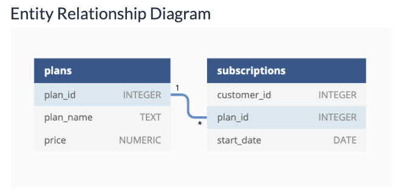
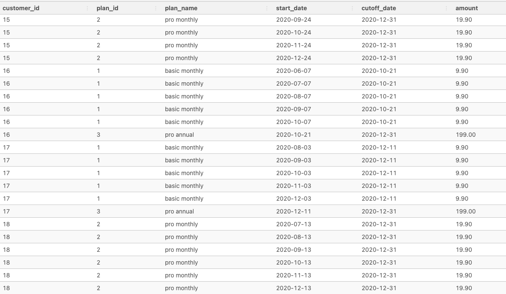
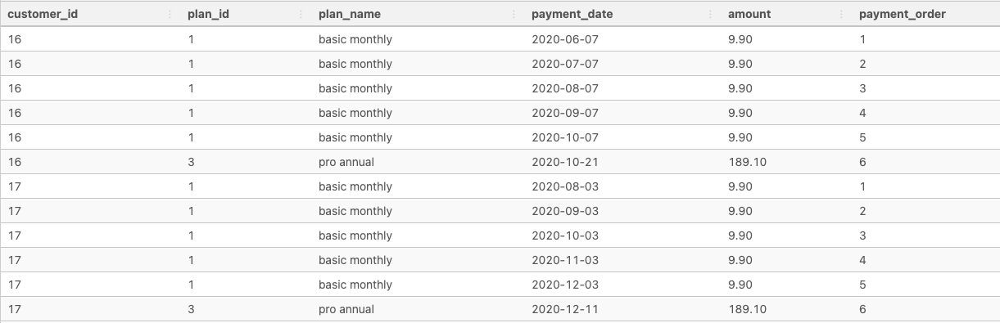

## Foodie - Fi 


### Introduction
Subscription based businesses are super popular and Danny realised that there was a large gap in the market - he wanted to create a new streaming service that only had food related content - something like Netflix but with only cooking shows!

Danny finds a few smart friends to launch his new startup Foodie-Fi in 2020 and started selling monthly and annual subscriptions, giving their customers unlimited on-demand access to exclusive food videos from around the world!

Danny created Foodie-Fi with a data driven mindset and wanted to ensure all future investment decisions and new features were decided using data. This case study focuses on using subscription style digital data to answer important business questions.

<br>

### ERD



<br>

### Table Details
#### `Table 1: plans`

Customers can choose which plans to join Foodie-Fi when they first sign up.

Basic plan customers have limited access and can only stream their videos and is only available monthly at $9.90

Pro plan customers have no watch time limits and are able to download videos for offline viewing. Pro plans start at $19.90 a month or $199 for an annual subscription.

Customers can sign up to an initial 7 day free trial will automatically continue with the pro monthly subscription plan unless they cancel, downgrade to basic or upgrade to an annual pro plan at any point during the trial.

When customers cancel their Foodie-Fi service - they will have a churn plan record with a null price but their plan will continue until the end of the billing period.

```sql
SELECT *
FROM foodie_fi.plans;
```
|plan_id|plan_name|price|
|----|----|----|
|0|trial|0.00|
|1|basic monthly|9.90|
|2|pro monthly|19.90|
|3|pro annual|199.00|
|4|churn|null|

<br>

#### `Table 2: subscriptions`
Customer subscriptions show the exact date where their specific plan_id starts.

If customers downgrade from a pro plan or cancel their subscription - the higher plan will remain in place until the period is over - the start_date in the subscriptions table will reflect the date that the actual plan changes.

When customers upgrade their account from a basic plan to a pro or annual pro plan - the higher plan will take effect straightaway.

When customers churn - they will keep their access until the end of their current billing period but the start_date will be technically the day they decided to cancel their service.

```sql
SELECT *
FROM foodie_fi.subscriptions
LIMIT 5;
```
|customer_id|plan_id|start_date|
|-----|-----|-----|
|1|0|2020-08-01|
|1|1|2020-08-08|
|2|0|2020-09-20|
|2|3|2020-09-27|
|3|0|2020-01-13|

---

<br>

### Case Study Questions
This case study is split into an initial data understanding question before diving straight into data analysis questions before finishing with 1 single extension challenge.

`A. Customer Journey`

Based off the 8 sample customers provided in the sample from the subscriptions table, write a brief description about each customer’s onboarding journey.

Try to keep it as short as possible - you may also want to run some sort of join to make your explanations a bit easier!

```sql
SELECT *
FROM foodie_fi.plans fp
INNER JOIN foodie_fi.subscriptions sb
  USING(plan_id)
-- sample 8 customer_ids of interest (1,2,11,13,15,16,18,19)
WHERE sb.customer_id in (1,2,11,13,15,16,18,19)
ORDER BY customer_id, start_date;
```
|plan_id|plan_name|price|customer_id|start_date|
|----|-----|----|----|----|
|0|trial|0.00|1|2020-08-01|
|1|basic monthly|9.90|1|2020-08-08|
|0|trial|0.00|2|2020-09-20|
|3|pro annual|199.00|2|2020-09-27|
|0|trial|0.00|11|2020-11-19|
|4|churn|null|11|2020-11-26|
|0|trial|0.00|13|2020-12-15|
|1|basic monthly|9.90|13|2020-12-22|
|2|pro monthly|19.90|13|2021-03-29|
|0|trial|0.00|15|2020-03-17|
|2|pro monthly|19.90|15|2020-03-24|
|4|churn|null|15|2020-04-29|
|0|trial|0.00|16|2020-05-31|
|1|basic monthly|9.90|16|2020-06-07|
|3|pro annual|199.00|16|2020-10-21|
|0|trial|0.00|18|2020-07-06|
|2|pro monthly|19.90|18|2020-07-13|
|0|trial|0.00|19|2020-06-22|
|2|pro monthly|19.90|19|2020-06-29|
|3|pro annual|199.00|19|2020-08-29|

<br>

`B. Data Analysis Questions`

**1**. How many customers has Foodie-Fi ever had?
```sql
SELECT 
COUNT(DISTINCT customer_id)
FROM foodie_fi.subscriptions;
```
|count|
|---|
|1000|

<br>

**2**. What is the monthly distribution of trial plan start_date values for our dataset - use the start of the month as the group by value
```sql
SELECT
  DATA_TYPE, column_name,is_nullable
FROM INFORMATION_SCHEMA.COLUMNS
WHERE table_name = 'subscriptions';
```
|data_type|column_name|is_nullable|
|----|-----|-----|
|integer|customer_id|YES|
|integer|plan_id|YES|
|date|start_date|YES|

* First item of note, when peeking into this request we want to ensure to either `CAST` or validate we can use a date function .. which we can!

```sql
-- Can aggregate on a particular truncated value from a date data_type, default is the beginning of the month
SELECT 
  DATE_TRUNC('month', start_date) AS month,
  COUNT(*) AS trial_plan_subscribers
FROM foodie_fi.subscriptions
WHERE plan_id = 0
GROUP BY month
ORDER BY month;
```
|month|trial_plan_subscribers|
|----|----|
|2020-01-01|88|
|2020-02-01|68|
|2020-03-01|94|
|2020-04-01|81|
|2020-05-01|88|
|2020-06-01|79|
|2020-07-01|89|
|2020-08-01|88|
|2020-09-01|87|
|2020-10-01|79|
|2020-11-01|75|
|2020-12-01|84|

<br>

3. What plan start_date values occur after the year 2020 for our dataset? Show the breakdown by count of events for each plan_name
```sql
SELECT 
  sub.plan_id AS plan_id,
  pl.plan_name AS plan,
  COUNT(*) AS post_2020_plan_start_dates
FROM foodie_fi.subscriptions sub 
INNER JOIN foodie_fi.plans pl 
  USING(plan_id)
WHERE EXTRACT(YEAR FROM sub.start_date) > 2020
-- WHERE sub.start_date > '2020-12-31'
GROUP BY plan_id, plan 
ORDER BY plan_id;
```
|plan_id|plan|post_2020_plan_start_dates|
|----|-----|-----|
|1|basic monthly|8|
|2|pro monthly|60|
|3|pro annual|63|
|4|churn|71|

<br>


4. What is the customer count and percentage of customers who have churned rounded to 1 decimal place?
```sql
WITH churn_total_subs AS (
SELECT 
  COUNT(DISTINCT customer_id) AS total_unq_custs,
  -- Need a Subquery for conditional plan check for churn count
  (SELECT COUNT(DISTINCT customer_id) FROM foodie_fi.subscriptions WHERE plan_id = 4) AS total_unq_churn_custs
FROM foodie_fi.subscriptions
)
SELECT *, 
  ROUND(100 * (total_unq_churn_custs::NUMERIC/total_unq_custs), 1) AS churn_perc
FROM churn_total_subs;
```
|total_unq_custs|total_unq_churn_custs|churn_perc|
|-----|-----|-----|
|1000|307|30.7|

* Another flavor
```sql
SELECT
  SUM(CASE WHEN plan_id = 4 THEN 1 ELSE 0 END) AS churn_customers,
  ROUND(
    100 * SUM(CASE WHEN plan_id = 4 THEN 1 ELSE 0 END) /
      COUNT(DISTINCT customer_id)::NUMERIC
  , 1) AS percentage -- Recall floor division (cast one value as numeric)
FROM foodie_fi.subscriptions;
```
|churn_customers|percentage|
|---|---|
|307|30.7|

* Out of curiousity ... have any customers churned ... then came back?? We could rank/partition by the customer and the date values we have to rank the customer_events by oldest to most recent
```sql
SELECT
  sb.customer_id,
  pl.plan_id,
  pl.plan_name,
  sb.start_date,
  RANK() OVER (
    PARTITION BY sb.customer_id
    ORDER BY sb.start_date
  ) AS customer_event_ranking
FROM foodie_fi.plans pl 
INNER JOIN foodie_fi.subscriptions sb
  USING(plan_id)
ORDER BY sb.customer_id
LIMIT 20;
```
|customer_id|plan_id|plan_name|start_date|customer_event_ranking|
|-----|----|-----|-----|-----|
|1|0|trial|2020-08-01|1|
|1|1|basic monthly|2020-08-08|2|
|2|0|trial|2020-09-20|1|
|2|3|pro annual|2020-09-27|2|
|3|0|trial|2020-01-13|1|
|3|1|basic monthly|2020-01-20|2|
|4|0|trial|2020-01-17|1|
|4|1|basic monthly|2020-01-24|2|
|4|4|churn|2020-04-21|3|


<br>

* Confirms Count is equal to 307 (aggregating for customer)
```sql
WITH customer_event_rankings AS (
SELECT
  sb.customer_id,
  pl.plan_id,
  pl.plan_name,
  sb.start_date,
  RANK() OVER (
    PARTITION BY sb.customer_id
    ORDER BY sb.start_date
  ) AS customer_event_ranking
FROM foodie_fi.plans pl 
INNER JOIN foodie_fi.subscriptions sb
  USING(plan_id)
ORDER BY sb.customer_id
),
plan_ranking_cust_agg AS (
SELECT 
  customer_id,
  array_agg(plan_id) AS plan_id_values,
  array_agg(customer_event_ranking) AS ranking_values
FROM customer_event_rankings
GROUP BY customer_id
ORDER BY customer_id
)
SELECT COUNT(*)
FROM plan_ranking_cust_agg
WHERE 4 = ANY(plan_id_values)
LIMIT 10
```
|customer_id|plan_id_values|ranking_values|
|-----|-----|------|
|4|[ 0, 1, 4 ]|[ "1", "2", "3" ]|
|6|[ 0, 1, 4 ]|[ "1", "2", "3" ]|
|11|[ 0, 4 ]|[ "1", "2" ]|
|15|[ 0, 2, 4 ]|[ "1", "2", "3" ]|
|21|[ 0, 1, 2, 4 ]|[ "1", "2", "3", "4" ]|
|33|[ 0, 2, 4 ]|[ "1", "2", "3" ]|
|39|[ 0, 1, 2, 4 ]|[ "1", "2", "3", "4" ]|
|48|[ 0, 1, 4 ]|[ "1", "2", "3" ]|
|51|[ 0, 1, 3, 4 ]|[ "1", "2", "3", "4" ]|
|52|[ 0, 1, 4 ]|[ "1", "2", "3" ]|

* Alright we can see here that `array_agg` has allowed us to group and consolidate the event_ranking and plan_id, we would now want to see if the last value in the plan_id wasn't a 4 which would represent the churn not being the last customer action

```sql
WITH customer_event_rankings AS (
SELECT
  sb.customer_id,
  pl.plan_id,
  pl.plan_name,
  sb.start_date,
  RANK() OVER (
    PARTITION BY sb.customer_id
    ORDER BY sb.start_date
  ) AS customer_event_ranking
FROM foodie_fi.plans pl 
INNER JOIN foodie_fi.subscriptions sb
  USING(plan_id)
ORDER BY sb.customer_id
),
plan_ranking_cust_agg AS (
SELECT 
  customer_id,
  array_agg(plan_id) AS plan_id_values,
  array_agg(customer_event_ranking) AS ranking_values
FROM customer_event_rankings
GROUP BY customer_id
ORDER BY customer_id
),
churned_customer_history AS (
SELECT 
  *,
  plan_id_values[array_upper(plan_id_values, 1)] AS last_ranked_plan -- pulls the last value from the plan_id_values
FROM plan_ranking_cust_agg
WHERE 4 = ANY(plan_id_values)
)
SELECT * FROM churned_customer_history LIMIT 5;
```
|customer_id|plan_id_values|ranking_values|last_ranked_plan|
|----|-----|-----|-----|
|4|[ 0, 1, 4 ]|[ "1", "2", "3" ]|4|
|6|[ 0, 1, 4 ]|[ "1", "2", "3" ]|4|
|11|[ 0, 4 ]|[ "1", "2" ]|4|
|15|[ 0, 2, 4 ]|[ "1", "2", "3" ]|4|
|21|[ 0, 1, 2, 4 ]|[ "1", "2", "3", "4" ]|4|

* After getting the churned customer history we can now do a simple `WHERE` check to see if any last_ranked_plan is not equal to 4 of the `churn` plan. Handy that the array_agg is maintaining the sequenced order of the `plan_id_values` and `customer_event_ranking`
```sql
WITH customer_event_rankings AS (
SELECT
  sb.customer_id,
  pl.plan_id,
  pl.plan_name,
  sb.start_date,
  RANK() OVER (
    PARTITION BY sb.customer_id
    ORDER BY sb.start_date
  ) AS customer_event_ranking
FROM foodie_fi.plans pl 
INNER JOIN foodie_fi.subscriptions sb
  USING(plan_id)
ORDER BY sb.customer_id
),
plan_ranking_cust_agg AS (
SELECT 
  customer_id,
  array_agg(plan_id) AS plan_id_values,
  array_agg(customer_event_ranking) AS ranking_values
FROM customer_event_rankings
GROUP BY customer_id
ORDER BY customer_id, ranking_values -- orderby requires the ranking values to be ordered by for correct array_agg by the looks (sequentially put the most recent plan as last for any customer)
),
churned_customer_history AS (
SELECT 
  *,
  plan_id_values[array_upper(plan_id_values, 1)] AS last_ranked_plan -- pulls the last value from the plan_id_values
FROM plan_ranking_cust_agg
WHERE 4 = ANY(plan_id_values)
)
SELECT
  last_ranked_plan,
  COUNT(*)
FROM churned_customer_history
GROUP BY last_ranked_plan;
```
|last_ranked_plan|count|
|----|----|
|4|307|

* Check the type of a column for a with CTE return
```sql
SELECT pg_typeof(last_ranked_plan), last_ranked_plan, customer_id FROM churned_customer_history;
```
|pg_typeof|last_ranked_plan|customer_id|
|----|-----|----|
|integer|4|4|
|integer|4|6|
|integer|4|11|

<br>

5. How many customers have churned straight after their initial free trial - what percentage is this rounded to the nearest whole number?
```sql
-- How many customers have churned straight after their initial free trial - what percentage is this rounded to the nearest whole number?
WITH customer_event_ranking as (
SELECT
  pl.plan_id,
  pl.plan_name,
  sb.customer_id,
  sb.start_date,
  RANK() OVER (
    PARTITION BY customer_id
    ORDER BY sb.start_date
  ) AS customer_plan_history
FROM foodie_fi.plans pl 
INNER JOIN foodie_fi.subscriptions sb 
  USING(plan_id)
),
customer_plan_history AS (
SELECT 
  customer_id,
  array_agg(plan_id) AS plan_id_values,
  array_agg(customer_plan_history) AS ranking_values
FROM customer_event_ranking
GROUP BY customer_id
ORDER BY customer_id, ranking_values
),
churned_customer_history AS (
SELECT
  customer_id,
  plan_id_values,
  ranking_values
FROM customer_plan_history
WHERE 4 = any(plan_id_values)
)
-- SELECT *, plan_id_values[1] AS first_plan, plan_id_values[2] AS second_plan FROM churned_customer_history
SELECT 
  COUNT(*) AS total_direct_churns_from_trial,
  ROUND(100 * (COUNT(*)::NUMERIC / (SELECT COUNT(DISTINCT customer_id) FROM foodie_fi.subscriptions)), 1) AS direct_churn_percentage_all_customers,
  ROUND(100 * (COUNT(*)::NUMERIC / (SELECT COUNT(DISTINCT customer_id) FROM churned_customer_history)), 1) AS direct_churn_percentage_churn_customers
FROM churned_customer_history WHERE plan_id_values[2] = 4 AND plan_id_values[1] = 0; 
```
|total_direct_churns_from_trial|direct_churn_percentage_all_customers|direct_churn_percentage_churn_customers|
|-----|----|----|
|92|9.2|30.0|

* Another quicker way
```sql
WITH ranked_plans AS (
SELECT
  customer_id,
  plan_id,
  RANK() OVER (
    PARTITION BY customer_id
    ORDER BY start_date 
  ) AS customer_event_rankings
FROM foodie_fi.subscriptions
)
SELECT
  SUM(CASE WHEN plan_id = 4 THEN 1 ELSE 0 END) AS churned_customers,
  ROUND(100 * (SUM(CASE WHEN plan_id = 4 THEN 1 ELSE 0 END)::NUMERIC / COUNT(DISTINCT customer_id)), 1) AS overall_perc
FROM ranked_plans
WHERE customer_event_rankings = 2
```
|churned_customers|overall_perc|
|----|----|
|92|9.2|

<br>

6. What is the number and percentage of customer plans after their initial free trial?
```sql
WITH customer_plan_rank AS (
SELECT
  customer_id,
  plan_id,
  RANK() OVER(
    PARTITION BY customer_id
    ORDER BY start_date
  ) AS plan_history_rank
FROM foodie_fi.subscriptions
), 
customer_plan_history AS (
SELECT 
  customer_id,
  array_agg(plan_id) AS plan_id_values,
  array_agg(plan_history_rank) AS ranking_values
FROM customer_plan_rank
GROUP BY customer_id
ORDER BY customer_id, ranking_values
),
second_plan_counts AS (
SELECT 
  plan_id_values[2] AS second_customer_plan,
  COUNT(*) AS second_plan_counts
FROM customer_plan_history
WHERE plan_id_values[1] = 0 -- Validate initial plan was free trial
GROUP BY second_customer_plan
ORDER BY second_plan_counts DESC
)
-- Finally can use a left join to just get the plan_name associated to the plan_counts with the counts for the id generated above
SELECT 
  spc.second_customer_plan,
  spc.second_plan_counts,
  ROUND(100 * (spc.second_plan_counts::numeric / (SELECT COUNT(DISTINCT customer_id) FROM foodie_fi.subscriptions)), 2) AS second_plan_percentages, -- Now need the percentages
  pl.plan_name
FROM second_plan_counts spc
LEFT JOIN foodie_fi.plans pl
  ON second_customer_plan = pl.plan_id;

-- Another variety
WITH ranked_plans AS (
  SELECT
    customer_id,
    plan_id,
    ROW_NUMBER() OVER (
      PARTITION BY customer_id
      ORDER BY start_date 
    ) AS plan_rank
  FROM foodie_fi.subscriptions
)
SELECT
  plans.plan_id,
  plans.plan_name,
  COUNT(*) AS customer_count,
  -- Recall that SUM(COUNT(*)) for the window function is taking the above customer_count grouped by total for each plan_id & plan_name and get the sum of the total grouped counts (1-4)
  ROUND(100 * COUNT(*) / SUM(COUNT(*)) OVER ()) AS percentage
FROM ranked_plans
INNER JOIN foodie_fi.plans
  ON ranked_plans.plan_id = plans.plan_id
WHERE plan_rank = 2
GROUP BY plans.plan_id, plans.plan_name
ORDER BY plans.plan_id;

```
|second_customer_plan|second_plan_counts|second_plan_percentages|plan_name|
|-----|-----|-----|-----|
|1|546|54.60|basic monthly|
|2|325|32.50|pro monthly|
|3|37|3.70|pro annual|
|4|92|9.20|churn|


<br>

7. What is the customer count and percentage breakdown of all 5 plan_name values at 2020-12-31?
```sql
WITH customer_plan_history AS (
SELECT 
  customer_id,
  plan_id,
  RANK() OVER (
    PARTITION BY customer_id
    ORDER BY start_date
  ) AS customer_plan_rank,
  start_date
FROM foodie_fi.subscriptions
WHERE start_date::timestamp <= '2020-12-31'
),
customer_plan_order AS (
SELECT 
  customer_id,
  array_agg(plan_id ORDER BY customer_plan_rank) AS ordered_plan_history -- array_agg can be ordered by a subsequent field (rank here to get the right sequential order for each plan)
FROM customer_plan_history
GROUP BY customer_id
ORDER BY customer_id
),
last_plan_values AS (
SELECT 
  ordered_plan_history[array_upper(ordered_plan_history, 1)] AS last_plan_value, -- handy array_upper to pull the last value after ordering in chronological order using the rank alias customer_plan_rank
  COUNT(*) AS plan_counts_pre_2021
FROM customer_plan_order
GROUP BY last_plan_value
ORDER BY last_plan_value
)
SELECT 
  lpv.last_plan_value AS plan_id,
  pl.plan_name,
  lpv.plan_counts_pre_2021,
  ROUND(100 * (lpv.plan_counts_pre_2021::numeric / SUM(lpv.plan_counts_pre_2021) OVER()), 1) AS plan_percentage -- total value of unique customers SUM(plan_counts_pre_2021) OVER()
FROM last_plan_values lpv
LEFT JOIN foodie_fi.plans pl 
  ON last_plan_value = pl.plan_id
ORDER BY plan_id
```
|plan_id|plan_name|plan_counts_pre_2021|plan_percentage|
|-----|-----|-----|-----|
|0|trial|19|1.9|
|1|basic monthly|224|22.4|
|2|pro monthly|326|32.6|
|3|pro annual|195|19.5|
|4|churn|236|23.6|

<br>

**8**. How many customers have upgraded to an annual plan in 2020?

This question is not difficult in terms of the SQL - but rather it is about understanding what the actual metric is.

You might be thinking about customers who upgraded and remained on an annual plan (that would be more difficult!) - or you might remove customers who churned perhaps? What if a customer upgrades and downgrades and upgrades again - do we count them twice?

All of these suggestions are not strictly correct as the question is not about what happens before or after an upgrade event!
```sql
SELECT
  plan_id,
  COUNT(DISTINCT customer_id)
FROM foodie_fi.subscriptions
WHERE plan_id = 3 AND start_date <= '2020-12-31'
GROUP BY plan_id;

-- Another flavor (Same count for the plan)
SELECT
  COUNT(DISTINCT customer_id) AS annual_customers
FROM foodie_fi.subscriptions
WHERE plan_id = 3
  AND start_date BETWEEN '2020-12-31' AND '2020-01-01';
```
|plan_id|count|
|----|----|
|3|195|

<br>

**9.** How many days on average does it take for a customer to an annual plan from the day they join Foodie-Fi?
```sql
-- How many days on average does it take for a customer to register as an annual plan from the day they join Foodie-Fi?
WITH annual_customer_history AS (
SELECT 
  *,
  RANK() OVER (
    PARTITION BY customer_id
    ORDER BY start_date
  ) AS customer_event_rank
FROM foodie_fi.subscriptions
WHERE customer_id in (
  -- Can isolate the customers who at some point have had an anuual plan w/subquery
  SELECT DISTINCT customer_id FROM foodie_fi.subscriptions WHERE plan_id = 3
) 
ORDER BY customer_id, start_date
),
start_annual_dates AS (
SELECT
  customer_id,
  array_agg(start_date ORDER BY customer_event_rank) AS initial_annual_dates
FROM annual_customer_history
WHERE customer_event_rank = 1 OR plan_id = 3 -- capture first event and date of annual plan 
GROUP BY customer_id
),
age_difference AS (
SELECT 
  *,
  initial_annual_dates[2]::date - initial_annual_dates[1]::date AS total_between_days
FROM start_annual_dates 
)
SELECT ROUND(AVG(total_between_days)) AS avg_days_initial_annual
FROM age_difference;
```
|avg_days_initial_annual|
|----|
|105|

<br>

**10.** Can you further breakdown this average value into 30 day periods (i.e. 0-30 days, 31-60 days etc)
```sql
-- How many days on average does it take for a customer to register as an annual plan from the day they join Foodie-Fi?
WITH annual_customer_history AS (
SELECT 
  *,
  RANK() OVER (
    PARTITION BY customer_id
    ORDER BY start_date
  ) AS customer_event_rank
FROM foodie_fi.subscriptions
WHERE customer_id in (
  -- Can isolate the customers who at some point have had an anuual plan w/subquery
  SELECT DISTINCT customer_id FROM foodie_fi.subscriptions WHERE plan_id = 3
) 
ORDER BY customer_id, start_date
),
start_annual_dates AS (
SELECT
  customer_id,
  array_agg(start_date ORDER BY customer_event_rank) AS initial_annual_dates
FROM annual_customer_history
WHERE customer_event_rank = 1 OR plan_id = 3 -- capture first event and date of annual plan 
GROUP BY customer_id
),
age_difference AS (
SELECT 
  *,
  initial_annual_dates[2]::date - initial_annual_dates[1]::date AS total_between_days
FROM start_annual_dates 
),
-- Can you further breakdown this average value into 30 day periods (i.e. 0-30 days, 31-60 days etc)
bins AS (
SELECT
  *,
  -- WIDTH_BUCKET takes the values, the spread or range (were looking from 0 - 360) and number of buckets to 
  WIDTH_BUCKET(initial_annual_dates[2]::date - initial_annual_dates[1], 0, 360, 12) AS bin_number
FROM age_difference
)
SELECT * FROM bins;
```
|customer_id|initial_annual_dates|total_between_days|avg_days_to_upgrade|
|----|-----|-----|-----|
|2|[ "2020-09-20T00:00:00.000Z", "2020-09-27T00:00:00.000Z" ]|7|1|
|9|[ "2020-12-07T00:00:00.000Z", "2020-12-14T00:00:00.000Z" ]|7|1|
|16|[ "2020-05-31T00:00:00.000Z", "2020-10-21T00:00:00.000Z" ]|143|5|

* We can see each row now has a binned value which we can use to sequence into 30 day periods for the 12 respective bins

```sql
WITH annual_customer_history AS (
SELECT 
  *,
  RANK() OVER (
    PARTITION BY customer_id
    ORDER BY start_date
  ) AS customer_event_rank
FROM foodie_fi.subscriptions
WHERE customer_id in (
  -- Can isolate the customers who at some point have had an anuual plan w/subquery
  SELECT DISTINCT customer_id FROM foodie_fi.subscriptions WHERE plan_id = 3
) 
ORDER BY customer_id, start_date
),
start_annual_dates AS (
SELECT
  customer_id,
  array_agg(start_date ORDER BY customer_event_rank) AS initial_annual_dates
FROM annual_customer_history
WHERE customer_event_rank = 1 OR plan_id = 3 -- capture first event and date of annual plan 
GROUP BY customer_id
),
age_difference AS (
SELECT 
  *,
  initial_annual_dates[2]::date - initial_annual_dates[1]::date AS total_between_days
FROM start_annual_dates 
),
-- Can you further breakdown this average value into 30 day periods (i.e. 0-30 days, 31-60 days etc)
bins AS (
SELECT
  *,
  -- WIDTH_BUCKET takes the values, the spread or range (were looking from 0 - 360) and number of buckets to 
  WIDTH_BUCKET(initial_annual_dates[2]::date - initial_annual_dates[1], 0, 360, 12) AS bin_number
FROM age_difference
)
-- Set lower threshold by simply subtracting one then multiplying by our total equaly days in each bin or 360/12 = 30
SELECT 
  (bin_number - 1) * 30 || ' - ' || bin_number * 30 || ' days' AS breakdown_period,
  COUNT(*) AS customers
FROM bins 
GROUP BY bin_number
ORDER BY bin_number;
```
|breakdown_period|customers|
|-----|-----|
|0 - 30 days|48|
|30 - 60 days|25|
|60 - 90 days|33|
|90 - 120 days|35|
|120 - 150 days|43|
|150 - 180 days|35|
|180 - 210 days|27|
|210 - 240 days|4|
|240 - 270 days|5|
|270 - 300 days|1|
|300 - 330 days|1|
|330 - 360 days|1|

* Noice, we can concatenate the 30 day period into our aggregate group by seamlessly with this handy concatenation!

**11.** How many customers downgraded from a pro monthly to a basic monthly plan in 2020?
```sql
WITH customer_history_lag AS (
SELECT
  customer_id,
  plan_id,
  start_date,
  LAG(plan_id) OVER (
    PARTITION BY customer_id
    ORDER BY start_date 
  ) AS prev_plan
FROM foodie_fi.subscriptions
WHERE EXTRACT(year FROM start_date) = 2020
ORDER BY customer_id, start_date
)
SELECT *
FROM customer_history_lag
LIMIT 10;
```
|customer_id|plan_id|start_date|prev_plan|
|----|----|-----|-----|
|1|0|2020-08-01|null|
|1|1|2020-08-08|0|
|2|0|2020-09-20|null|
|2|3|2020-09-27|0|
|3|0|2020-01-13|null|
|3|1|2020-01-20|0|
|4|0|2020-01-17|null|
|4|1|2020-01-24|0|
|4|4|2020-04-21|1|
|5|0|2020-08-03|null|

* We just need to know the `plan_id` (pro_monthly = 2, basic_monthly = 1)

```sql
-- How many customers downgraded from a pro monthly to a basic monthly plan in 2020? - Here we want to order by 
WITH customer_history_lag AS (
SELECT
  customer_id,
  plan_id,
  start_date,
  LAG(plan_id) OVER (
    PARTITION BY customer_id
    ORDER BY start_date 
  ) AS prev_plan
FROM foodie_fi.subscriptions
WHERE EXTRACT(year FROM start_date) = 2020
ORDER BY customer_id, start_date
)
-- We can then simply look for the plan id for the basic monthly 1 and if that row item has a previous value of the monthly_annual of 2
-- Only item here to maybe also consider if a "downgrade" is not a sequential event and happened for the customer but not as a direct next action which LAG would only look back 1 for
SELECT 
  COUNT(*) AS customer_count
FROM customer_history_lag
WHERE plan_id = 1 AND prev_plan = 2;
```
|customer_count|
|----|
|0|

---

<br>

### `C. Challenge Payment Question`
The Foodie-Fi team wants you to create a new payments table for the year 2020 that includes amounts paid by each customer in the subscriptions table with the following requirements:

* monthly payments always occur on the same day of month as the original start_date of any monthly paid plan
* upgrades from basic to monthly or pro plans are reduced by the current paid amount in that month and start immediately
* upgrades from pro monthly to pro annual are paid at the end of the current billing period and also starts at the end of the month period
* once a customer churns they will no longer make payments

Example outputs for this table might look like the following:

|customer_id|plan_id|plan_name|payment_date|amount|payment_order|
|-----|-----|------|-----|-----|-----|
|1|1|basic monthly|2020-08-08|9.90|1|
|1|1|basic monthly|2020-09-08|9.90|2|
|1|1|basic monthly|2020-10-08|9.90|3|
|1|1|basic monthly|2020-11-08|9.90|4|
|1|1|basic monthly|2020-12-08|9.90|5|
|2|3|pro annual|2020-09-27|199.00|1|

<br>

#### **Path**
* `Part 1`
```sql
SELECT 
  customer_id, 
  plan_id, 
  plan_name, 
  start_date, 
  price,
  LEAD(start_date, 1) OVER (
    PARTITION BY customer_id 
    ORDER BY start_date, plan_id
  ) AS cutoff_date
FROM foodie_fi.subscriptions
JOIN foodie_fi.plans
USING (plan_id)
WHERE plan_name NOT IN('trial', 'churn') AND 
  start_date BETWEEN '2020-01-01' AND '2020-12-31'
```
|customer_id|plan_id|plan_name|start_date|price|cutoff_date|
|-----|-----|-----|-----|----|-----|
|1|1|basic monthly|2020-08-08|9.90|null|
|2|3|pro annual|2020-09-27|199.00|null|
|3|1|basic monthly|2020-01-20|9.90|null|
|4|1|basic monthly|2020-01-24|9.90|null|
|5|1|basic monthly|2020-08-10|9.90|null|
|6|1|basic monthly|2020-12-30|9.90|null|
|7|1|basic monthly|2020-02-12|9.90|2020-05-22|
|7|2|pro monthly|2020-05-22|19.90|null|
|8|1|basic monthly|2020-06-18|9.90|2020-08-03|
|8|2|pro monthly|2020-08-03|19.90|null|

<br>

* Here we use a `LEAD` to see if any non **churn** or **trial** plan would be a subsequent cutoff date and if it's not will pull forward the next subscription date for the customer. As the customer plan we find may be the last and return a **null** we can subsequently set any null value as the end of the year to indicate any row for the customer found as such would be their last subscription data for the year of interest

<br>

```sql
WITH cutoff_date AS (
SELECT 
  sb.customer_id AS customer_id, 
  pl.plan_id AS plan_id, 
  pl.plan_name AS plan_name , 
  sb.start_date AS start_date, 
  pl.price AS price,
  LEAD(start_date, 1) OVER (
    PARTITION BY sb.customer_id 
    ORDER BY sb.start_date, sb.plan_id
  ) AS cutoff_date,
  pl.price AS amount
FROM foodie_fi.subscriptions AS sb
JOIN foodie_fi.plans AS pl
USING (plan_id)
WHERE plan_name NOT IN('trial', 'churn') AND 
  start_date BETWEEN '2020-01-01' AND '2020-12-31'
),
-- coalesce (set null value)
end_of_year AS (
SELECT
  customer_id,
  plan_id, 
  plan_name,
  start_date,
  COALESCE(cutoff_date, '2020-12-31') AS cutoff_date,
  amount
FROM cutoff_date
)
SELECT * FROM end_of_year LIMIT 10;
```
|customer_id|plan_id|plan_name|start_date|cutoff_date|amount|
|-----|----|-----|----|----|----|
|1|1|basic monthly|2020-08-08|2020-12-31|9.90|
|2|3|pro annual|2020-09-27|2020-12-31|199.00|
|3|1|basic monthly|2020-01-20|2020-12-31|9.90|
|4|1|basic monthly|2020-01-24|2020-12-31|9.90|
|5|1|basic monthly|2020-08-10|2020-12-31|9.90|
|6|1|basic monthly|2020-12-30|2020-12-31|9.90|
|7|1|basic monthly|2020-02-12|2020-05-22|9.90|
|7|2|pro monthly|2020-05-22|2020-12-31|19.90|
|8|1|basic monthly|2020-06-18|2020-08-03|9.90|
|8|2|pro monthly|2020-08-03|2020-12-31|19.90|

<br>

`Part 2`
* Now we need to look at the plan types to indicate how many times they paid (monthly plans) or if a annual plan is needed for non monthly-type recurring payments

```sql
WITH RECURSIVE cutoff_date AS (
SELECT 
  sb.customer_id AS customer_id, 
  pl.plan_id AS plan_id, 
  pl.plan_name AS plan_name , 
  sb.start_date AS start_date, 
  pl.price AS price,
  LEAD(start_date, 1) OVER (
    PARTITION BY sb.customer_id 
    ORDER BY sb.start_date, sb.plan_id
  ) AS cutoff_date,
  pl.price AS amount
FROM foodie_fi.subscriptions AS sb
JOIN foodie_fi.plans AS pl
USING (plan_id)
WHERE plan_name NOT IN('trial', 'churn') AND 
  start_date BETWEEN '2020-01-01' AND '2020-12-31'
),
-- coalesce (set null value)
end_of_year AS (
SELECT
  customer_id,
  plan_id, 
  plan_name,
  start_date,
  COALESCE(cutoff_date, '2020-12-31') AS cutoff_date,
  amount
FROM cutoff_date
),
recursive_date_cte AS (
SELECT
  customer_id, plan_id, plan_name, start_date, cutoff_date, amount
FROM end_of_year
UNION ALL
SELECT
  customer_id, plan_id, plan_name,
  DATE((start_date + INTERVAL '1 month')) AS start_date,
  cutoff_date,
  amount
FROM recursive_date_cte
-- create table to union based on cutoff_date
WHERE cutoff_date > DATE((start_date + INTERVAL '1 month'))
  AND plan_name != 'pro annual'
)
SELECT *
FROM recursive_date_cte
ORDER BY customer_id, start_date
```
* This recursive CTE does require the keyword before with 
* Looking at customer_ids like 16 & 17 illustrate how the recursive cte is generating a unioned output from each row generated with the subsequent month creation



<br>

`Part 3` - Payment Adjustments
```sql
CREATE TABLE payments_2020 AS
WITH RECURSIVE cutoff_date AS (
SELECT 
  sb.customer_id AS customer_id, 
  pl.plan_id AS plan_id, 
  pl.plan_name AS plan_name , 
  sb.start_date AS start_date, 
  pl.price AS price,
  LEAD(start_date, 1) OVER (
    PARTITION BY sb.customer_id 
    ORDER BY sb.start_date, sb.plan_id
  ) AS cutoff_date,
  pl.price AS amount
FROM foodie_fi.subscriptions AS sb
JOIN foodie_fi.plans AS pl
USING (plan_id)
WHERE plan_name NOT IN('trial', 'churn') AND 
  start_date BETWEEN '2020-01-01' AND '2020-12-31'
),
-- coalesce (set null value)
end_of_year AS (
SELECT
  customer_id,
  plan_id, 
  plan_name,
  start_date,
  COALESCE(cutoff_date, '2020-12-31') AS cutoff_date,
  amount
FROM cutoff_date
),
recursive_date_cte AS (
SELECT
  customer_id, plan_id, plan_name, start_date, cutoff_date, amount
FROM end_of_year
UNION ALL
SELECT
  customer_id, plan_id, plan_name,
  DATE((start_date + INTERVAL '1 month')) AS start_date,
  cutoff_date,
  amount
FROM recursive_date_cte
-- create table to union based on cutoff_date
WHERE cutoff_date > DATE((start_date + INTERVAL '1 month'))
  AND plan_name != 'pro annual'
),
-- however, need to look at the price value and adjust the "yearly value" if monthly plans already existed
annual_pay_adjustments AS (
SELECT 
  *,
  LAG(plan_id, 1) OVER (
    PARTITION BY customer_id
    ORDER BY start_date
  ) AS last_payment_plan,
  LAG(amount, 1) OVER (
    PARTITION BY customer_id
    ORDER BY start_date
  ) AS last_amount_paid,
  RANK() OVER (
    PARTITION BY customer_id
    ORDER BY start_date
  ) AS payment_order
  FROM recursive_date_cte
  ORDER BY customer_id, start_date
)
SELECT
  customer_id, plan_id, plan_name, start_date AS payment_date,
  CASE
    WHEN plan_id in (2, 3) AND last_payment_plan = 1
      THEN amount - last_amount_paid
    ELSE amount
  END AS amount,
  payment_order
FROM annual_pay_adjustments;

SELECT * FROM payments_2020;
```

