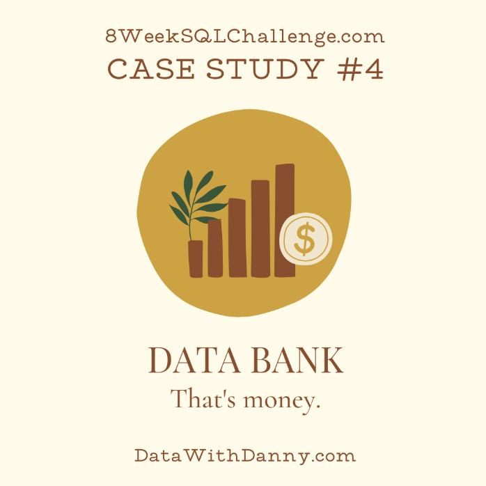
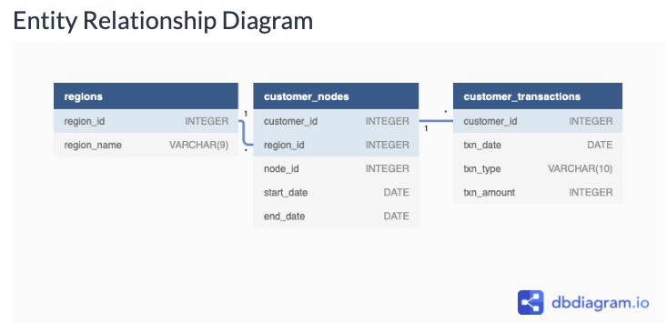

## Data Bank


### **Introduction**
There is a new innovation in the financial industry called `Neo-Banks`: new aged digital only banks without physical branches.

Danny thought that there should be some sort of intersection between these new age banks, cryptocurrency and the data world…so he decides to launch a new initiative - **Data Bank**!

Data Bank runs just like any other digital bank - but it isn’t only for banking activities, they also have the world’s most secure distributed data storage platform!

Customers are allocated cloud data storage limits which are directly linked to how much money they have in their accounts. There are a few interesting caveats that go with this business model, and this is where the Data Bank team need your help!

The management team at Data Bank want to increase their total customer base - but also need some help tracking just how much data storage their customers will need.

* This case study is all about calculating metrics, growth and helping the business analyse their data in a smart way to better forecast and plan for their future developments!

<br>

### `Available Data`
The Data Bank team have prepared a data model for this case study as well as a few example rows from the complete dataset below to get you familiar with their tables.

#### **ERD**


`Table 1: Regions`

Just like popular cryptocurrency platforms - Data Bank is also run off a network of nodes where both money and data is stored across the globe. In a traditional banking sense - you can think of these nodes as bank branches or stores that exist around the world.

This **regions** table contains the `region_id` and their respective `region_name` values
```sql
SELECT *
FROM data_bank.regions
LIMIT 5;
```
|region_id|region_name|
|----|----|
|1|Australia|
|2|America|
|3|Africa|
|4|Asia|
|5|Europe|

<br>

`Table 2: Customer Nodes`

Customers are randomly distributed across the nodes according to their region - this also specifies exactly which node contains both their cash and data.

This random distribution changes frequently to reduce the risk of hackers getting into Data Bank’s system and stealing customer’s money and data!

Below is a sample of the top 5 rows of the `data_bank.customer_nodes`
```sql
SELECT *
FROM data_bank.customer_nodes
LIMIT 5;
```
|customer_id|region_id|node_id|start_date|end_date|
|----|----|----|----|----|
|1|3|4|2020-01-02|2020-01-03|
|2|3|5|2020-01-03|2020-01-17|
|3|5|4|2020-01-27|2020-02-18|
|4|5|4|2020-01-07|2020-01-19|
|5|3|3|2020-01-15|2020-01-23|

<br>

`Table 3: Customer Transactions`

This table stores all customer deposits, withdrawals and purchases made using their Data Bank debit card.
```sql
SELECT *
FROM data_bank.customer_transactions
LIMIT 5;
```
|customer_id|txn_date|txn_type|txn_amount|
|-----|-----|-----|-----|
|429|2020-01-21|deposit|82|
|155|2020-01-10|deposit|712|
|398|2020-01-01|deposit|196|
|255|2020-01-14|deposit|563|
|185|2020-01-29|deposit|626|

---

<br>

### **Case Study Questions** 
The following case study questions include some general data exploration analysis for the nodes and transactions before diving right into the core business questions and finishes with a challenging final request!

#### `A. Customer Nodes Exploration`
1. How many unique nodes are there on the Data Bank system?
```sql
SELECT COUNT(DISTINCT node_id)
FROM data_bank.customer_nodes;

-- either works
WITH combinations AS (
SELECT DISTINCT
  node_id
FROM data_bank.customer_nodes
)
SELECT COUNT(node_id) FROM combinations;
```
|count|
|----|
|5|

<br>

**2.** What is the number of nodes per region?
    * Taking an initial look at the region, region_id grouping
```sql
SELECT 
  COUNT(*) AS region_id_name_count,
  region_id,
  region_name
FROM data_bank.regions
GROUP BY region_id, region_name
ORDER BY region_id_name_count DESC;
```
|region_id_name_count|region_id|region_name|
|-----|-----|-----|
|1|1|Australia|
|1|2|America|
|1|5|Europe|
|1|4|Asia|
|1|3|Africa|

```sql
-- Nodes per region (all in customer_nodes - can left/inner join)
SELECT
  cn.region_id,
  r.region_name,
  COUNT(DISTINCT node_id) AS region_unique_nodes,
  COUNT(node_id) AS region_total_nodes
FROM data_bank.customer_nodes AS cn
LEFT JOIN data_bank.regions AS r 
USING(region_id)
GROUP BY region_id, region_name
ORDER BY region_total_nodes DESC;
```
|region_id|region_name|region_unique_nodes|region_total_nodes|
|------|-----|-----|------|
|1|Australia|5|770|
|2|America|5|735|
|3|Africa|5|714|
|4|Asia|5|665|
|5|Europe|5|616|

<br>

**3**. How many customers are allocated to each region?
```sql
-- How many customers are allocated to each region?
SELECT
  cn.region_id,
  r.region_name,
  COUNT(DISTINCT cn.customer_id) AS unique_customer_region_allocation
FROM data_bank.customer_nodes AS cn
LEFT JOIN data_bank.regions AS r 
USING(region_id)
GROUP BY region_id, region_name
ORDER BY unique_customer_region_allocation DESC;
```
|region_id|region_name|unique_customer_region_allocation|
|----|-----|----|
|1|Australia|110|
|2|America|105|
|3|Africa|102|
|4|Asia|95|
|5|Europe|88|

<br>

**4.** How many days on average are customers reallocated to a different node?
    * Let's take a look at how we can get a LEAD'ing value first
```sql
SELECT
  customer_id,
  region_id,
  node_id,
  start_date,
  end_date,
  LEAD(start_date, 1) OVER(
    PARTITION BY customer_id
    ORDER BY start_date
  ) AS next_customer_node_start_date
FROM data_bank.customer_nodes
WHERE customer_id = 1
ORDER BY customer_id, start_date;
```
|customer_id|region_id|node_id|start_date|end_date|next_customer_node_start_date|
|-----|----|-----|-----|-----|-----|
|1|3|4|2020-01-02|2020-01-03|2020-01-04|
|1|3|4|2020-01-04|2020-01-14|2020-01-15|
|1|3|2|2020-01-15|2020-01-16|2020-01-17|
|1|3|5|2020-01-17|2020-01-28|2020-01-29|
|1|3|3|2020-01-29|2020-02-18|2020-02-19|
|1|3|2|2020-02-19|2020-03-16|2020-03-17|
|1|3|2|2020-03-17|9999-12-31|null|

* Next need to get an `Age : Difference` for days in between nodes
```sql
-- How many days on average are customers reallocated to a different node?
-- I'm thinking a LEAD here for a window function with 
WITH subsequent_customer_node_date AS (
SELECT
  customer_id,
  region_id,
  node_id,
  start_date,
  end_date,
  LEAD(start_date, 1) OVER(
    PARTITION BY customer_id
    ORDER BY start_date
  ) AS next_customer_node_start_date
FROM data_bank.customer_nodes
WHERE customer_id in (1, 2)
ORDER BY customer_id, start_date
),
total_days_between_nodes AS (
SELECT *,
EXTRACT('days' FROM AGE(next_customer_node_start_date, start_date)) as age_difference
FROM subsequent_customer_node_date
-- exclude current plan with end date set to future 9999-12-31 value
WHERE end_date <= NOW()
)
SELECT 
  *,
  ROUND(AVG(age_difference) OVER(
    PARTITION BY customer_id
  )::NUMERIC, 2) AS customer_avg_days_node_reallocation,
  ROUND(AVG(age_difference) OVER()::NUMERIC, 2) AS total_customer_avg_days_node_reallocation
FROM total_days_between_nodes;
```
|customer_id|region_id|node_id|start_date|end_date|next_customer_node_start_date|age_difference|customer_avg_days_node_reallocation|total_customer_avg_days_node_reallocation|
|----|-----|-----|-----|-----|-----|-----|----|-----|
|1|3|4|2020-01-02|2020-01-03|2020-01-04|2|12.5|12.17|
|1|3|4|2020-01-04|2020-01-14|2020-01-15|11|12.5|12.17|
|1|3|2|2020-01-15|2020-01-16|2020-01-17|2|12.5|12.17|
|1|3|5|2020-01-17|2020-01-28|2020-01-29|12|12.5|12.17|
|1|3|3|2020-01-29|2020-02-18|2020-02-19|21|12.5|12.17|
|1|3|2|2020-02-19|2020-03-16|2020-03-17|27|12.5|12.17|
|2|3|5|2020-01-03|2020-01-17|2020-01-18|15|11.83|12.17|
|2|3|3|2020-01-18|2020-02-09|2020-02-10|23|11.83|12.17|
|2|3|3|2020-02-10|2020-02-21|2020-02-22|12|11.83|12.17|
|2|3|5|2020-02-22|2020-03-07|2020-03-08|15|11.83|12.17|
|2|3|2|2020-03-08|2020-03-12|2020-03-13|5|11.83|12.17|
|2|3|4|2020-03-13|2020-03-13|2020-03-14|1|11.83|12.17|

* Here we have a good idea with our two window function (`make sure to cast as NUMERIC` to avoid ROUND return error) for the customer_avg and overall average. Now just need to include all customers 

```sql
WITH subsequent_customer_node_date AS (
SELECT
  customer_id,
  region_id,
  node_id,
  start_date,
  end_date,
  LEAD(start_date, 1) OVER(
    PARTITION BY customer_id
    ORDER BY start_date
  ) AS next_customer_node_start_date
FROM data_bank.customer_nodes
ORDER BY customer_id, start_date
),
total_days_between_nodes AS (
SELECT *,
EXTRACT('days' FROM AGE(next_customer_node_start_date, start_date)) as age_difference
FROM subsequent_customer_node_date
-- exclude current plan with end date set to future 9999-12-31 value
WHERE end_date <= NOW()
),
customer_overall_window_averages AS (
SELECT 
  *,
  ROUND(AVG(age_difference) OVER(
    PARTITION BY customer_id
  )::NUMERIC, 2) AS customer_avg_days_node_reallocation,
  ROUND(AVG(age_difference) OVER()::NUMERIC, 2) AS total_customer_avg_days_node_reallocation
FROM total_days_between_nodes
)
-- now can just get the whole window avg in the over return from the window above, cte holds customer avg details too, only need 1 as window value is same across all customer rows
SELECT 
  total_customer_avg_days_node_reallocation
FROM customer_overall_window_averages
LIMIT 1;
```
|total_customer_avg_days_node_reallocation|
|---|
|14.84|

#### `Note on 4 & 5`
* Have seen in the discord a different value for these particular answers but it appears to be with the way the "period" in between start dates between nodes is a leading cause. I'm defining the in between period as the date between each start dates. Using a `Lead` function call over the partitioned/grouped and ordered (start_date) I'm pulling the next start date for a customers as the days in between nodes the value appears to be looking for. In truth this would likely be an easier metric to have clearly defined as what consitutes as the period in between
 
<br>

**5.** What is the median, 80th and 95th percentile for this same reallocation days metric for each region?
```sql
-- What is the median, 80th and 95th percentile for this same reallocation days metric for each region?
WITH subsequent_customer_node_date AS (
SELECT
  customer_id,
  region_id,
  node_id,
  start_date,
  end_date,
  LEAD(start_date, 1) OVER(
    PARTITION BY customer_id
    ORDER BY start_date
  ) AS next_customer_node_start_date
FROM data_bank.customer_nodes
ORDER BY customer_id, start_date
),
total_days_between_nodes AS (
SELECT *,
EXTRACT('days' FROM AGE(next_customer_node_start_date, start_date)) as age_difference
FROM subsequent_customer_node_date
-- exclude current plan with end date set to future 9999-12-31 value
WHERE end_date <= NOW()
)
SELECT 
  tdbn.region_id,
  rgn.region_name,
  ROUND(PERCENTILE_CONT(0.5) WITHIN GROUP (ORDER BY age_difference)) AS median_region_metric,
  ROUND(PERCENTILE_CONT(0.8) WITHIN GROUP (ORDER BY age_difference)) AS pct80_region_metric,
  ROUND(PERCENTILE_CONT(0.95) WITHIN GROUP (ORDER BY age_difference)) AS pct95_region_metric
FROM total_days_between_nodes AS tdbn
INNER JOIN data_bank.regions AS rgn
  ON tdbn.region_id = rgn.region_id
GROUP BY tdbn.region_id, rgn.region_name
ORDER BY tdbn.region_id;
```
|region_id|region_name|median_region_metric|pct80_region_metric|pct95_region_metric|
|-----|-----|-----|------|------|
|1|Australia|15|23|28|
|2|America|15|24|28|
|3|Africa|15|24|28|
|4|Asia|15|23|28|
|5|Europe|15|24|29|

<br>

#### `B : Customer Transactions`
**1.** What is the unique count and total amount for reach transaction type
```sql
-- What is the unique count and total amount for each transaction type?
SELECT
  txn_type,
  COUNT(*) AS txn_type_count,
  SUM(txn_amount) AS total_sum_txn_type
FROM data_bank.customer_transactions
GROUP BY txn_type
ORDER BY txn_type_count, total_sum_txn_type;
```
|txn_type|txn_type_count|total_sum_txn_type|
|----|----|-----|
|withdrawal|1580|793003|
|purchase|1617|806537|
|deposit|2671|1359168|

<br>

**2.** What is the average total historical deposit counts and amounts for all customers?
```sql
WITH avg_deposit_details AS (
SELECT
  customer_id,
  COUNT(*) AS customer_total_deposits,
  ROUND(AVG(txn_amount), 2) AS customer_deposit_average
FROM data_bank.customer_transactions
WHERE txn_type = 'deposit'
GROUP BY customer_id
ORDER BY customer_id
)
SELECT
  ROUND(AVG(customer_total_deposits),1) AS Avg_Deposit_Counts,
  ROUND(AVG(customer_deposit_average),2) AS Avg_Deposit_Amount,
  ROUND(AVG(customer_deposit_average)) AS Avg_Rounded_Up
FROM avg_deposit_details;
```
|avg_deposit_counts|avg_deposit_amount|avg_rounded_up|
|------|-----|-----|
|5.3|508.61|509|

<br>

**3.** For each month - how many Data Bank customers make more than 1 deposit and (either 1 purchase or 1 withdrawal) in a single month?
* Now this is just an initial look at grouping, to get a column for each customer's transaction type per month, we'll want to use a SUM case when for all transaction types
  * Below is Initially just a look at how grouping by month can work for a customer
```sql
WITH customer_monthly_trax_counts AS (
SELECT 
  customer_id,
  DATE_TRUNC('MONTH', txn_date)::DATE AS month_trax_date,
  txn_type AS txn_type,
  COUNT(*) AS total_customer_monthy_txn_counts
FROM data_bank.customer_transactions
GROUP BY customer_id, month_trax_date, txn_type
ORDER BY customer_id, month_trax_date, txn_type
)
SELECT *
FROM customer_monthly_trax_counts
WHERE customer_id = 1;
```
|customer_id|month_trax_date|txn_type|total_customer_monthy_txn_counts|
|----|----|----|----|
|1|2020-01-01|deposit|1|
|1|2020-03-01|deposit|1|
|1|2020-03-01|purchase|2|

* Now let's use a column type approach for each transaction type for easier filtering later down the line
```sql
WITH customer_monthly_trax_counts AS (
SELECT 
  customer_id,
  DATE_TRUNC('MONTH', txn_date)::DATE AS month_trax_date,
  SUM(CASE WHEN txn_type = 'deposit' THEN 1 ELSE 0 END) AS monthly_deposits,
  SUM(CASE WHEN txn_type = 'purchase' THEN 1 ELSE 0 END) AS monthly_purchases,
  SUM(CASE WHEN txn_type = 'withdrawal' THEN 1 ELSE 0 END) AS monthly_withdrawals
FROM data_bank.customer_transactions
GROUP BY customer_id, month_trax_date
ORDER BY customer_id, month_trax_date
),
customer_months_criteria AS (
SELECT *
FROM customer_monthly_trax_counts
WHERE monthly_deposits >= 2 AND (monthly_purchases >= 1 OR monthly_withdrawals >= 1)
)
SELECT * FROM customer_months_criteria LIMIT 5;
```
|customer_id|month_trax_date|monthly_deposits|monthly_purchases|monthly_withdrawals|
|---|----|-----|----|-----|
|5|2020-01-01|2|0|1|
|5|2020-03-01|2|3|2|
|6|2020-01-01|2|4|0|
|6|2020-02-01|2|1|1|
|6|2020-03-01|5|1|3|

* Ok so now we just need to GROUP BY the month_trax_date 

```sql
WITH customer_monthly_trax_counts AS (
SELECT 
  customer_id,
  DATE_TRUNC('MONTH', txn_date)::DATE AS month_trax_date,
  SUM(CASE WHEN txn_type = 'deposit' THEN 1 ELSE 0 END) AS monthly_deposits,
  SUM(CASE WHEN txn_type = 'purchase' THEN 1 ELSE 0 END) AS monthly_purchases,
  SUM(CASE WHEN txn_type = 'withdrawal' THEN 1 ELSE 0 END) AS monthly_withdrawals
FROM data_bank.customer_transactions
GROUP BY customer_id, month_trax_date
ORDER BY customer_id, month_trax_date
),
customer_months_criteria AS (
SELECT *
FROM customer_monthly_trax_counts
WHERE monthly_deposits >= 2 AND (monthly_purchases >= 1 OR monthly_withdrawals >= 1)
)
SELECT
  month_trax_date,
  COUNT(*) AS customer_condition_monthly_count
FROM customer_months_criteria
GROUP BY month_trax_date
ORDER BY month_trax_date;
```
|month_trax_date|customer_condition_monthly_count|
|-----|----|
|2020-01-01|168|
|2020-02-01|181|
|2020-03-01|192|
|2020-04-01|70|

<br>

**4.** What is the closing balance for each customer at the end of the month?
* Had a little help on this one but importantly we can see how to generate a series for this type check as we'll need conditions to account for no activity in a month which is our group by transaction types has shown us for each customer
* To tackle this we can use a nifty `GENERATE_SERIES` here for the period of dates we've seen (Jan - April date)

<br>

  1. So we can start by using a SUM case and grouping by the customer, date and inverse the txn_amount as a balance depleter should the type be a withdrawal or purchase to get a monthly balance without any run over (so just found data initially for each customer)
```sql
WITH customer_monthly_balance AS (
SELECT 
  customer_id,
  DATE_TRUNC('MONTH', txn_date)::DATE AS transaction_month,
  SUM(
    CASE WHEN txn_type = 'deposit' THEN txn_amount
    -- Invert the txn amount to negative for withdrawal or purchase
    ELSE (-txn_amount)
    END
  ) AS balance
FROM data_bank.customer_transactions
GROUP BY customer_id, transaction_month
ORDER BY customer_id, transaction_month
)
SELECT * FROM customer_monthly_balance LIMIT 5;
```
|customer_id|transaction_month|balance|
|----|----|-----|
|1|2020-01-01|312|
|1|2020-03-01|-952|
|2|2020-01-01|549|
|2|2020-03-01|61|
|3|2020-01-01|144|

  2. Next ... we need to generate a `template` type monthly value for each customer and set the intervale 1 month ahead at the start of the date to later match to the transaction_month (think a `LEFT TYPE JOIN` for the customer balance above if we find cusotmer data for the month for the logic)
```sql
SELECT
    DISTINCT customer_id,
    (
      '2020-01-01'::DATE +
      GENERATE_SERIES(0, 3) * INTERVAL '1 MONTH'
    )::DATE AS month
  FROM data_bank.customer_transactions
  ORDER BY customer_id, month
  LIMIT 8
```
|customer_id|month|
|----|----|
|1|2020-01-01|
|1|2020-02-01|
|1|2020-03-01|
|1|2020-04-01|
|2|2020-01-01|
|2|2020-02-01|
|2|2020-03-01|
|2|2020-04-01|

  3. Now, we'll want to use the `COALESCE` function to either take the balance or set a null value for the overall balance when using the first cte table in a left style join with our months for each customer. Following determining if the customer has a monthly balance found for the quarter month period, we'll use a `WINDOW SUM` function over the created balance in the first cte (and completed value with a SELECT function (COALESCE)) and use a range partitioned for the `customer` and `ordered` by the month with the customer, monthly window stretching from unbounded preceding (all found rows for customer) and to the current row to get the balance based on a historical look. The `customer month` and `customer id` we'll use as the joining logic in the two ctes as to join what we can find for customer behavior and what we'll need to impute (fillna more or less) for missing customer data
```sql
WITH customer_monthly_balance AS (
SELECT 
  customer_id,
  DATE_TRUNC('MONTH', txn_date)::DATE AS transaction_month,
  SUM(
    CASE WHEN txn_type = 'deposit' THEN txn_amount
    -- Invert the txn amount to negative for withdrawal or purchase
    ELSE (-txn_amount)
    END
  ) AS balance
FROM data_bank.customer_transactions
GROUP BY customer_id, transaction_month
ORDER BY customer_id, transaction_month
),
quarter_data_period_per_customer AS (
SELECT
  DISTINCT(customer_id),
  ('2020-01-01'::DATE + GENERATE_SERIES(0, 3) * INTERVAL '1 MONTH')::DATE AS generated_month
  FROM data_bank.customer_transactions
)
SELECT
  qdppc.customer_id customer_id,
  qdppc.generated_month AS month,
  -- Either take found value or if not exists (no customer account transaction activity for month) set to 0
  COALESCE(cmb.balance, 0) AS balance_monthly_activity,
  SUM(cmb.balance) OVER (
    PARTITION BY qdppc.customer_id
    ORDER BY qdppc.generated_month
    ROWS BETWEEN UNBOUNDED PRECEDING AND CURRENT ROW
  ) AS ending_month_balance
FROM quarter_data_period_per_customer AS qdppc
LEFT JOIN customer_monthly_balance as cmb 
  ON qdppc.customer_id = cmb.customer_id
  AND qdppc.generated_month = cmb.transaction_month
-- We'll only get the first three customers
WHERE qdppc.customer_id <= 3;
```
|customer_id|month|balance_monthly_activity|ending_month_balance|
|-----|----|-----|-----|
|1|2020-01-01|312|312|
|1|2020-02-01|0|312|
|1|2020-03-01|-952|-640|
|1|2020-04-01|0|-640|
|2|2020-01-01|549|549|
|2|2020-02-01|0|549|
|2|2020-03-01|61|610|
|2|2020-04-01|0|610|
|3|2020-01-01|144|144|
|3|2020-02-01|-965|-821|
|3|2020-03-01|-401|-1222|
|3|2020-04-01|493|-729|

* Confirming that the Execution order and the filling of the balance field is set prior to the window function being able to operated on as the balance field were calling a cumulative sum on for the customer isn't going to always have a balance for the month which is just their monthly balance activity for found activity in the month which not all users have.

<br>

**5.** Comparing the closing balance of a customer’s first month and the closing balance from their second month, what percentage of customers:
* Have a negative first month balance?
* Have a positive first month balance?
* Increase their opening month’s positive closing balance by more than 5% in the following month?
* Reduce their opening month’s positive closing balance by more than 5% in the following month?
* Move from a positive balance in the first month to a negative balance in the second month?

This is gonna be a pretty complex level of `CTEs` which is more instructive in looking at output by output to build the final result which is going to be a percentage for each column in a one row answer for the above

|positive_pc|negative_pc|increase_pc|decrease_pc|negative_balance_pc|
|----|----|----|----|----|
|68.00|31.00|37.00|49.00|33.00|

- `Part 1 `
  * Add the lag values for the balance of first and secondth month
```sql
WITH cte_monthly_balances AS (
SELECT
  customer_id,
  DATE_TRUNC('Month', txn_date)::DATE as month,
  SUM(
    CASE 
      WHEN txn_type = 'deposit' THEN txn_amount
      ELSE (-txn_amount)
      END
  ) AS monthly_activity
FROM data_bank.customer_transactions
GROUP BY customer_id, month
ORDER BY customer_id, month
),
cte_generated_months AS (
  SELECT
    DISTINCT customer_id,
    (
      DATE_TRUNC('mon', MIN(txn_date))::DATE +
      GENERATE_SERIES(0, 1) * INTERVAL '1 MONTH'
    )::DATE AS month,
    GENERATE_SERIES(1, 2) AS month_number
  FROM data_bank.customer_transactions
  GROUP BY customer_id
  ORDER BY customer_id
),
cte_monthly_transactions AS (
  SELECT
    cte_generated_months.customer_id,
    cte_generated_months.month,
    cte_generated_months.month_number,
    COALESCE(cte_monthly_balances.monthly_activity, 0) AS transaction_amount
  FROM cte_generated_months
  LEFT JOIN cte_monthly_balances
    ON cte_generated_months.month = cte_monthly_balances.month
    AND cte_generated_months.customer_id = cte_monthly_balances.customer_id
  ORDER BY customer_id, month, month_number
),
cte_monthly_aggregates AS (
SELECT
  customer_id,
  month_number,
  LAG(transaction_amount) OVER (
    PARTITION BY customer_id
    ORDER BY month
  ) AS prev_month_transaction_amount,
  transaction_amount as monthly_activity
FROM cte_monthly_transactions
)
SELECT * FROM cte_monthly_aggregates LIMIT 10;
```
|customer_id|month_number|prev_month_transaction_amount|monthly_activity|
|-----|-----|-----|-----|
|1|1|null|312|
|1|2|312|0|
|2|1|null|549|
|2|2|549|0|
|3|1|null|144|
|3|2|144|-965|
|4|1|null|848|
|4|2|848|0|
|5|1|null|954|
|5|2|954|0|

* Next, we'll look to just limit the calculations and get a SUM or total count for each metric (see 5 requested above) for our total counts and then can use a distinct count for our total customer count to capture percentages on from the generated sum per customer metric. Please see the notes in the conditional `SUM(CASE)` statements for how the metrics where decided for a customer qualifying as fitting for the 5 conditions

```sql
-- Let's create what the customers have first
WITH cte_monthly_balances AS (
SELECT
  customer_id,
  DATE_TRUNC('Month', txn_date)::DATE as month,
  SUM(
    CASE 
      WHEN txn_type = 'deposit' THEN txn_amount
      ELSE (-txn_amount)
      END
  ) AS monthly_activity
FROM data_bank.customer_transactions
GROUP BY customer_id, month
ORDER BY customer_id, month
),
cte_generated_months AS (
  SELECT
    DISTINCT customer_id,
    (
      DATE_TRUNC('mon', MIN(txn_date))::DATE +
      GENERATE_SERIES(0, 1) * INTERVAL '1 MONTH'
    )::DATE AS month,
    GENERATE_SERIES(1, 2) AS month_number
  FROM data_bank.customer_transactions
  GROUP BY customer_id
  ORDER BY customer_id
),
cte_monthly_transactions AS (
  SELECT
    cte_generated_months.customer_id,
    cte_generated_months.month,
    cte_generated_months.month_number,
    COALESCE(cte_monthly_balances.monthly_activity, 0) AS transaction_amount
  FROM cte_generated_months
  LEFT JOIN cte_monthly_balances
    ON cte_generated_months.month = cte_monthly_balances.month
    AND cte_generated_months.customer_id = cte_monthly_balances.customer_id
  ORDER BY customer_id, month, month_number
),
cte_monthly_aggregates AS (
SELECT
  customer_id,
  month_number,
  LAG(transaction_amount) OVER (
    PARTITION BY customer_id
    ORDER BY month
  ) AS prev_month_transaction_amount,
  transaction_amount as monthly_activity
FROM cte_monthly_transactions
),
cte_calcs AS (
SELECT 
  -- we'll use this value for our percentages in the last query for total numbers
  COUNT(DISTINCT customer_id) AS customer_count,
  -- Calculate 5 different metrics
  SUM(CASE WHEN prev_month_transaction_amount > 0 THEN 1 ELSE 0 END) AS total_positive_first_month_balances,
  SUM(CASE WHEN prev_month_transaction_amount < 0 THEN 1 ELSE 0 END) AS total_negative_first_month_balances,
  -- Increase their opening month’s positive closing balance by more than 5% in the following month?, positive past_month, posivite activity and previous + .05% < new activity
  SUM(
    CASE 
      WHEN prev_month_transaction_amount > 0
        AND monthly_activity > 0
        AND (prev_month_transaction_amount * 0.05) + prev_month_transaction_amount < monthly_activity 
        THEN 1
      ELSE 0
    END
  ) AS increase_count_greater_5_percent,
  -- Reduce their opening month’s positive closing balance by more than 5% in the following month, activity must be negative and previous month must be positive
  SUM(
    CASE 
      WHEN prev_month_transaction_amount > 0
        AND monthly_activity < 0
        -- we want to now see if the 5% inversed is still less than the monthly_activity which will determine if the drop was more than 5%
        AND (-(prev_month_transaction_amount * .05) < monthly_activity)
        THEN 1
      ELSE 0
    END
  ) AS decrease_count_greater_5_percent,
  -- Move from a positive balance in the first month to a negative balance in the second month, most importantly is the monthly value being less than the inverse of the posivie month value for a deficit or negative count
  SUM(
    CASE 
      WHEN prev_month_transaction_amount > 0 
        AND monthly_activity < 0 
        AND monthly_activity < (-prev_month_transaction_amount) -- Must validate that the negative monthly activity is also less than what the inverse of the positive amount
        THEN 1 
      ELSE 0
    END
  ) AS negative_balance_counts_after_positive_first
FROM cte_monthly_aggregates
-- Essentially we just want to look at the last row for each customer which holds the previous month value and the activity for the 2nd month we use for our metrics
WHERE prev_month_transaction_amount IS NOT NULL
)
SELECT
  -- we'll round each 
  ROUND(100 * (total_positive_first_month_balances/customer_count::NUMERIC)) AS positive_first_month_balance_percentage,
  ROUND(100 * (total_negative_first_month_balances/customer_count::NUMERIC)) AS negative_first_month_balance_percentage,
  ROUND(100 * (increase_count_greater_5_percent/customer_count::NUMERIC)) AS increase_greater_than_5_percentage,
  ROUND(100 * (decrease_count_greater_5_percent/customer_count::NUMERIC)) AS decrease_greater_than_5_percentage,
  ROUND(100 * (negative_balance_counts_after_positive_first/customer_count::NUMERIC)) AS positive_to_negative_percentage
FROM cte_calcs
```
|positive_first_month_balance_percentage|negative_first_month_balance_percentage|increase_greater_than_5_percentage|decrease_greater_than_5_percentage|positive_to_negative_percentage|
|-----|----|----|----|-----|
|69|31|13|1|23|

<br>

## `End of Case Study` 🏁