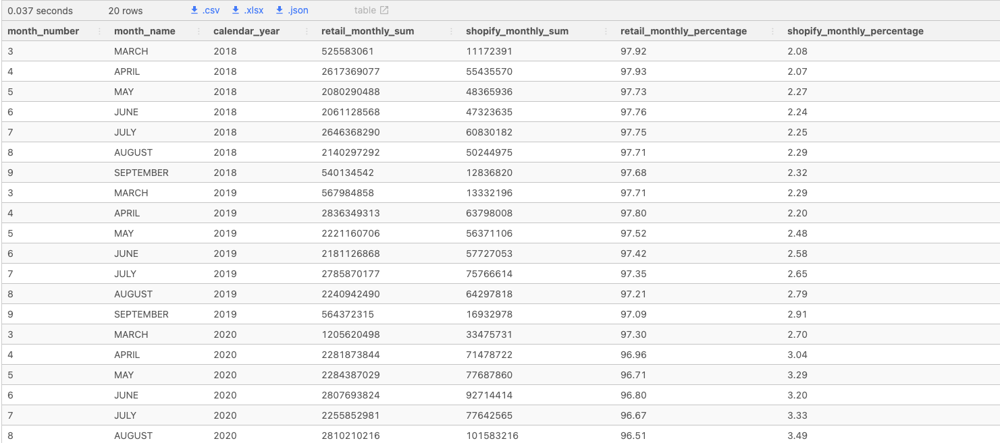

## Data Mart
#### **Introduction**
Data Mart is Danny’s latest venture and after running international operations for his online supermarket that specialises in fresh produce - Danny is asking for your support to analyse his sales performance.

In June 2020 - large scale supply changes were made at Data Mart. All Data Mart products now use sustainable packaging methods in every single step from the farm all the way to the customer.

Danny needs your help to quantify the impact of this change on the sales performance for Data Mart and it’s separate business areas.

The key business question he wants you to help him answer are the following:

* What was the quantifiable impact of the changes introduced in June 2020?
* Which platform, region, segment and customer types were the most impacted by this change?
* What can we do about future introduction of similar sustainability updates to the business to minimise impact on sales?

<br>

#### **Available Data**
For this case study there is only a single table: `data_mart.weekly_sales`

The Entity Relationship Diagram is shown below with the data types made clear, please note that there is only this one table - hence why it looks a little bit lonely!

* Query for postgresql column evaluation
```sql
SELECT
    column_name,
    data_type
FROM
    information_schema.columns
WHERE
    table_name = 'weekly_sales';
```

|column|datatype|
|----|-----|
|week_date|varchar|
|region|varchar|
|platform|varchar|
|segment|varchar|
|customer_type|varchar|
|transactions|int|
|sales|int|

<br>

#### **Column Dictionary**
The columns are pretty self-explanatory based on the column names but here are some further details about the dataset:

1. Data Mart has international operations using a `multi-region` strategy
2. Data Mart has both, a **retail and online** `platform` in the form of a Shopify store front to serve their customers
3. Customer `segment` and `customer_type` data relates to personal age and demographics information that is shared with Data Mart
4. Transactions is the **count** of unique purchases made through Data Mart and sales is the actual dollar amount of purchases

Each record in the dataset is related to a specific aggregated slice of the underlying sales data rolled up into a week_date value which represents the start of the sales week.

* `Example Rows` : Uncleaned Provided Weekly_Sales Table
```sql
SELECT * 
FROM data_mart.weekly_sales
LIMIT 10;
```
|week_date|region|platform|segment|customer_type|transactions|sales|
|----|-----|-----|-----|-----|----|----|
|31/8/20|ASIA|Retail|C3|New|120631|3656163|
|31/8/20|ASIA|Retail|F1|New|31574|996575|
|31/8/20|USA|Retail|null|Guest|529151|16509610|
|31/8/20|EUROPE|Retail|C1|New|4517|141942|
|31/8/20|AFRICA|Retail|C2|New|58046|1758388|
|31/8/20|CANADA|Shopify|F2|Existing|1336|243878|
|31/8/20|AFRICA|Shopify|F3|Existing|2514|519502|
|31/8/20|ASIA|Shopify|F1|Existing|2158|71417|
|31/8/20|AFRICA|Shopify|F2|New|318|49557|
|31/8/20|AFRICA|Retail|C3|New|111032|3888162|

---

<br>

### Case Study Questions
The following case study questions require some data cleaning steps before we start to unpack Danny’s key business questions in more depth.

<br>

### `A : Data Cleansing Steps`
In a single query, perform the following operations and generate a new table in the `data_mart schema` named `clean_weekly_sales`:

* Convert the `week_date` to a DATE format

* Add a `week_number` as the second column for each `week_date` value, for example any value from the 1st of January to 7th of January will be 1, 8th to 14th will be 2 etc

* Add a `month_number` with the calendar month for each `week_date` value as the 3rd column

* Add a `calendar_year` column as the 4th column containing either **2018, 2019 or 2020** values

* Add a new column called `age_band` after the original segment column using the following mapping on the number inside the segment value

|segment|age_band|
|----|----|
|1|Young Adults|
|2|Middle Aged|
|3 or 4|Retirees|

* Add a new demographic column using the following mapping for the first letter in the segment values:

|segment|demographic|
|----|----|
|C|Couples|
|F|Families|

* Ensure all null string values with an "unknown" string value in the original segment column as well as the new age_band and demographic columns

* Generate a new avg_transaction column as the sales value divided by transactions rounded to 2 decimal places for each record

<br>

#### **New Table Generation**
* So prior to getting the full table, let's see how we got there with some exploratory queries that will ultimately be compiled into our new table for the schema

<br>

##### **Date_Parts**
```sql
SELECT 
  TO_DATE(week_date, 'DD/MM/YY') AS week_date,
  DATE_PART('week', TO_DATE(week_date, 'DD/MM/YY')) AS week_number,
  DATE_PART('month', TO_DATE(week_date, 'DD/MM/YY')) AS month_number,
  DATE_PART('year', TO_DATE(week_date, 'DD/MM/YY')) AS calendar_year
FROM data_mart.weekly_sales
WHERE week_date < '20219-01-01'
ORDER BY week_date DESC
LIMIT 5;
```
|week_date|week_number|month_number|calendar_year|
|----|-----|----|-----|
|2020-01-18|3|1|2020|
|2020-01-18|3|1|2020|
|2020-01-18|3|1|2020|
|2020-01-18|3|1|2020|
|2020-08-31|3|1|2020|

* The Date string being mutated in the `TO_DATE` call takes the string **week_date** value (varchar as seen in the data columns) and a **format** to mutate from
* After setting the varchar to a date type, we can than use `DATE_PART` and a time value to extract to get the **week, month and calendar year** as requested
* **Note** : value for `TO_DATE` needed to be changed in order to get recognizable date value back
    - Good reference for next time when evaluating `DATE` type casting returns
    - **Previous : 'DD/M/YY'** value for string which was giving different dates (or standardized date in which the uncleaned orders table had )

<br>

##### **Age_Band**
* Unique segments (We want the last digit it would appear)
```sql
SELECT 
  DISTINCT(segment) AS unique_segments
FROM data_mart.weekly_sales
```
|unique_segments|
|----|
|C3|
|C2|
|null|
|F2|
|C4|
|F1|
|F3|
|C1|

```sql
-- CTE to use a regexp_match for last digit
WITH segment_reg_ex AS (
SELECT 
  DISTINCT(segment) AS unique_segments
FROM data_mart.weekly_sales
),
regexp_matches AS (
SELECT
  unique_segments,
  regexp_matches(unique_segments, '\d{1}$') AS segment_last_digit
FROM segment_reg_ex
)
SELECT *,
  segment_last_digit[1]
FROM regexp_matches
```
|unique_segments|segment_last_digit|
|----|----|
|C3|3|
|C2|2|
|F2|2|
|C4|4|
|F1|1|
|F3|3|
|C1|1|

* It's likely a fair bit more than we need but just wanted to have a bit of fun here. You can't index the matches for the unique segments column until after being generated in the second cte above

<br>

`Last items`
* So we walso want the first value of the unique segments (C or F) as either couples or families for the demographic
    - We can just use the `LEFT/RIGHT` to perform a type substring for segment to get the values at the start and end of the string we're after 
```sql
SELECT
  LEFT(segment, 1) as left_1,
  LEFT(segment, 2) as left_2,
  RIGHT(segment, 1) AS reverse_left_1,
  segment
FROM data_mart.weekly_sales
LIMIT 5;
```
|left_1|left_2|reverse_left_1|segment|
|----|----|----|-----|
|C|C3|3|C3|
|F|F1|1|F1|
|n|nu|l|null|
|C|C1|1|C1|
|C|C2|2|C2|

* The avg_transaction just looks like a row type operation that we'll need to round.
* We'll also include the columns in the table that didn't require cleansing

So with a decent exploratory look at generating the new table for the schema, let's create!

#### **New Schema Table Creation**
```sql
DROP TABLE IF EXISTS data_mart.clean_weekly_sales;
CREATE TABLE data_mart.clean_weekly_sales AS
SELECT
  TO_DATE(week_date, 'DD/MM/YY') AS week_date,
  DATE_PART('week', TO_DATE(week_date, 'DD/MM/YY')) AS week_number,
  DATE_PART('month', TO_DATE(week_date, 'DD/MM/YY')) AS month_number,
  DATE_PART('year', TO_DATE(week_date, 'DD/MM/YY')) AS calendar_year,
  region,
  platform,
  CASE
    WHEN segment = 'null' THEN 'Unknown'
    ELSE segment
    END AS segment,
  CASE
    WHEN RIGHT(segment, 1) = '1' THEN 'Young Adults'
    WHEN RIGHT(segment, 1) = '2' THEN 'Middle Aged'
    WHEN RIGHT(segment, 1) IN ('3', '4') THEN 'Retirees'
    ELSE 'Unknown'
    END AS age_band,
  CASE
    WHEN LEFT(segment, 1) = 'C' THEN 'Couples'
    WHEN LEFT(segment, 1) = 'F' THEN 'Families'
    ELSE 'Unknown'
    END AS demographic,
  customer_type,
  transactions,
  sales,
  ROUND(
      sales / transactions,
      2
   ) AS avg_transaction
FROM data_mart.weekly_sales;


-- AFTER CREATION, LET'S QUERY A FEW ROWS
SELECT * FROM data_mart.clean_weekly_sales LIMIT 5;
```
* Arggghhh had messed up the date string for the `TO_DATE` function
    - 'DD/M/YY' - was the previous string value prior to correcting and getting results consistent with detailed desired result (see value in table creation for reference of change ... a month can be more than one digit kapuhhh)
    - https://www.commandprompt.com/education/postgresql-to_date-function-convert-string-to-date/
    - When in doubt, review the above for the string classification of different potential date representation you want to mutate from a string/varchar

* But now Here's a preview of our cleaned data

|week_date|week_number|month_number|calendar_year|region|platform|segment|age_band|demographic|customer_type|transactions|sales|avg_transaction|
|---|----|----|----|----|----|----|----|----|----|---|---|---|
|2020-08-31|36|8|2020|ASIA|Retail|C3|Retirees|Couples|New|120631|3656163|30.00|
|2020-08-31|36|8|2020|ASIA|Retail|F1|Young Adults|Families|New|31574|996575|31.00|
|2020-08-31|36|8|2020|USA|Retail|null|unknown|unknown|Guest|529151|16509610|31.00|
|2020-08-31|36|8|2020|EUROPE|Retail|C1|Young Adults|Couples|New|4517|141942|31.00|
|2020-08-31|36|8|2020|AFRICA|Retail|C2|Middle Aged|Couples|New|58046|1758388|30.00|

* Let's Before we move ensure we have the same count of rows in each table and haven't had any data leakage!
```sql
-- Make sure to do a union all as a union would return almost a join (equal values)
SELECT
    COUNT(*) AS total_rows
FROM data_mart.weekly_sales
UNION ALL
SELECT
    COUNT(*) AS total_rows
FROM data_mart.clean_weekly_sales;
```
|total_rows|
|----|
|17117|
|17117|

* **Alright!**, we can move along

<br>

--- 

### `B : Data Exploration`
**1.** What `day of the week` is used for each `week_date` value?
```sql
-- In theory this is what we can't do but return corrects for Each
SELECT 
  DISTINCT(TO_CHAR(week_date, 'Day')) AS Unique_Day_Name
FROM data_mart.clean_weekly_sales
UNION
SELECT
  DISTINCT(EXTRACT(dow FROM week_date)) AS Unique_Day_Value
FROM data_mart.clean_weekly_sales;
```
* `UNION` types text and double precision cannot be matched
    - One is an Int, one is a string
```sql
WITH unique_day_counts AS (
-- Each row will give us the day_name and the integer value associated to it 
SELECT
  (SELECT DISTINCT(TO_CHAR(week_date, 'Day'))) AS Unique_Day_Name,
  (SELECT DISTINCT(EXTRACT(dow FROM week_date))) AS Unique_Day_Value
FROM data_mart.clean_weekly_sales
)
-- Now just a generic count after grouping
SELECT
  Unique_Day_Name,
  Unique_Day_Value,
  COUNT(*) AS total_day_line_counts
FROM unique_day_counts
GROUP BY Unique_Day_Name, Unique_Day_Value
ORDER BY total_day_line_counts DESC;
```
|unique_day_name|unique_day_value|total_day_line_counts|
|-----|-----|-----|
|Monday|1|17117|

* See the match in total rows (**total_day_line_counts**) as the rows for the table validates that indeed it is only ever `Monday` in which the base/parent table has ever had data inserted

<br>

**2.** What range of week numbers are missing from the dataset?
```sql
WITH total_weeks AS (
SELECT
  GENERATE_SERIES(1,52) AS week_number
)
SELECT
  week_number AS unique_week_numbers_not_included
FROM total_weeks
WHERE week_number NOT IN (SELECT DISTINCT(week_number) FROM data_mart.clean_weekly_sales)
ORDER BY unique_week_numbers_not_included;
```
|unique_week_numbers_not_included|
|---|
|1|
|2|
|3|
|4|
|5|
|6|
|7|
|8|
|9|
|10|
|11|
|12|
|37|
|38|
|39|
|40|
|41|
|42|
|43|
|44|
|45|
|46|
|47|
|48|
|49|
|50|
|51|
|52|

* 28 Rows for Week Numbers not included
    - `GENERATE_SERIES` Used to create a number to compare against
* Keyboard hot cut of : https://stackoverflow.com/questions/30037808/multiline-editing-in-visual-studio-code
    - Option + Command and either up or down arrow
* Another approach
```sql
WITH all_week_numbers AS ( 
  SELECT GENERATE_SERIES(1, 52) AS week_number
)
SELECT
  week_number
FROM all_week_numbers AS t1
WHERE NOT EXISTS (
  SELECT 1
  FROM data_mart.clean_weekly_sales AS t2
  WHERE t1.week_number = t2.week_number 
);
-- Can use the aliased week_number from CTE w/Generate Series to match against found week numbers and WHERE NOT EXISTS to get the missing week_numbers
```

<br>

**3.** How many total transactions were there for each year in the dataset?
```sql
SELECT
  calendar_year,
  SUM(transactions) AS year_total_transactions,
  SUM(SUM(transactions)) OVER() AS total_years_summed_transactions_window
FROM data_mart.clean_weekly_sales
GROUP BY calendar_year
ORDER BY year_total_transactions DESC;
```
|calendar_year|year_total_transactions|total_years_summed_transactions_window|
|----|-----|-----|
|2020|375813651|1087859396|
|2019|365639285|1087859396|
|2018|346406460|1087859396|

* `SUM(SUM(column))` Can provide the window sum after getting an aggregate for different grouped/partitioned groups

<br>

**4.** What is the total sales for each region for each month?
```sql
-- Using TO_CHAR to get the month name for easier association
SELECT
  month_number,
  TO_CHAR(week_date, 'Month') AS month_name,
  region,
  SUM(sales) AS month_total_sales_over_years
FROM data_mart.clean_weekly_sales
GROUP BY month_number, month_name, region
ORDER BY region, month_number;
```
|month_number|month_name|region|month_total_sales_over_years|
|----|-----|-----|------|
|3|March|AFRICA|567767480|
|4|April|AFRICA|1911783504|
|5|May|AFRICA|1647244738|
|6|June|AFRICA|1767559760|
|7|July|AFRICA|1960219710|
|8|August|AFRICA|1809596890|
|9|September|AFRICA|276320987|
|3|March|ASIA|529770793|
|4|April|ASIA|1804628707|
|5|May|ASIA|1526285399|
|6|June|ASIA|1619482889|
|7|July|ASIA|1768844756|
|8|August|ASIA|1663320609|
|9|September|ASIA|252836807|
|3|March|CANADA|144634329|
|4|April|CANADA|484552594|
|5|May|CANADA|412378365|
|6|June|CANADA|443846698|
|7|July|CANADA|477134947|
|8|August|CANADA|447073019|
|9|September|CANADA|69067959|
|3|March|EUROPE|35337093|
|4|April|EUROPE|127334255|
|5|May|EUROPE|109338389|
|6|June|EUROPE|122813826|
|7|July|EUROPE|136757466|
|8|August|EUROPE|122102995|
|9|September|EUROPE|18877433|
|3|March|OCEANIA|783282888|
|4|April|OCEANIA|2599767620|
|5|May|OCEANIA|2215657304|
|6|June|OCEANIA|2371884744|
|7|July|OCEANIA|2563459400|
|8|August|OCEANIA|2432313652|
|9|September|OCEANIA|372465518|
|3|March|SOUTH AMERICA|71023109|
|4|April|SOUTH AMERICA|238451531|
|5|May|SOUTH AMERICA|201391809|
|6|June|SOUTH AMERICA|218247455|
|7|July|SOUTH AMERICA|235582776|
|8|August|SOUTH AMERICA|221166052|
|9|September|SOUTH AMERICA|34175583|
|3|March|USA|225353043|
|4|April|USA|759786323|
|5|May|USA|655967121|
|6|June|USA|703878990|
|7|July|USA|760331754|
|8|August|USA|712002790|
|9|September|USA|110532368|

<br>

**5.** What is the total count of transactions for each platform
* ... Well pretty straightforward here
```sql
SELECT
  platform,
  SUM(transactions) AS platform_total_transactions
FROM data_mart.clean_weekly_sales
GROUP BY platform
ORDER BY platform_total_transactions DESC;
```
|platform|platform_total_transactions|
|----|-----|
|Retail|1081934227|
|Shopify|5925169|

<br>

**6.** What is the percentage of sales for Retail vs Shopify for each month?
* Now we want the sum total on the same row so see the last query for how that would be done
```sql
WITH monthly_platform_sales AS (
SELECT
  month_number,
  TO_CHAR(week_date, 'MONTH') AS month_label,
  platform,
  SUM(sales)
FROM data_mart.clean_weekly_sales
GROUP BY month_number, month_label, platform
ORDER BY month_number, month_label
)
SELECT * FROM monthly_platform_sales LIMIT 5;
```
|month_number|month_label|platform|sum|
|-----|----|----|----|
|3|MARCH|Retail|2299188417|
|3|MARCH|Shopify|57980318|
|4|APRIL|Shopify|190712300|
|4|APRIL|Retail|7735592234|
|5|MAY|Retail|6585838223|


```sql
WITH monthly_platform_sales AS (
SELECT
  month_number,
  TO_CHAR(week_date, 'MONTH') AS month_name,
  calendar_year,
  SUM(CASE WHEN platform = 'Retail' THEN sales END) AS retail_monthly_sum,
  SUM(CASE WHEN platform = 'Shopify' THEN sales END) AS shopify_monthly_sum
FROM data_mart.clean_weekly_sales
GROUP BY month_number, month_name, calendar_year
-- Order by calendar year oldest, to newest in sequential month order
ORDER BY calendar_year, month_number
)
SELECT
  *,
  ROUND(100 * (retail_monthly_sum / (retail_monthly_sum + shopify_monthly_sum)::NUMERIC), 2) AS retail_monthly_percentage,
  ROUND(100 * (shopify_monthly_sum / (retail_monthly_sum + shopify_monthly_sum)::NUMERIC), 2) AS shopify_monthly_percentage
FROM monthly_platform_sales;
```



* Most notable here in the format is the ability to sum two different group objects and place on the same row for the other group by details we want
* We want to evaluate a proportion percentage for each grouped by month and is easiest to do so against row ... hence the SUM and CASE when statement for a quick separation of the two platoforms

<br>


**7.** What is the percentage of sales by demographic for each year in the dataset?
* Most notable here is the setting of each demo_s year percentage
* The Window function can do the sum chaining sum(sum(sales)) OVER(calendar_year) to get the entire year sum against the sum(sales) for our grouped by other materials
  - Want to make sure you multiply by 100 after you get the fraction (was explicit with my operations)
```sql
SELECT
  calendar_year,
  demographic,
  SUM(sales) AS yearly_sales,
  -- We want to take the our summed sale value for the demo and divide by the sum of all the sum(sales) over a particular year
  ROUND(
  100 * (SUM(sales)::NUMERIC / SUM(SUM(sales)) OVER (
    PARTITION BY calendar_year
  )), 2) AS demo_sales_percentage_for_year
FROM data_mart.clean_weekly_sales
GROUP BY calendar_year, demographic
ORDER BY calendar_year, demographic;
```
|calendar_year|demographic|yearly_sales|demo_sales_percentage_for_year|
|----|----|-----|-----|
|2018|Couples|3402388688|26.38|
|2018|Families|4125558033|31.99|
|2018|Unknown|5369434106|41.63|
|2019|Couples|3749251935|27.28|
|2019|Families|4463918344|32.47|
|2019|Unknown|5532862221|40.25|
|2020|Couples|4049566928|28.72|
|2020|Families|4614338065|32.73|
|2020|Unknown|5436315907|38.55|

<br>

**8.**
* Get sale value for each `age_band`, `demographic` in first CTE for **Retail**
* RANK by this aggregated group sum in most sales ranked higher **DESC**
* take same `age_demo_sales` group by value and get percentage against sum of all of these values in a window function percentage finder for our original group_by summed values
```sql
WITH age_demographic_retail_sales AS (
SELECT
  age_band,
  demographic,
  SUM(sales) AS age_demo_sales
FROM data_mart.clean_weekly_sales
WHERE platform = 'Retail'
GROUP BY age_band, demographic
),
age_band_sales_rankings AS (
SELECT 
  *,
  RANK() OVER(
    ORDER BY age_demo_sales DESC
  ) AS demo_ageband_retail_sales_rankings
FROM age_demographic_retail_sales
)
SELECT 
  *,
  ROUND(
    100 * (age_demo_sales::NUMERIC / SUM(age_demo_sales) OVER())
  , 1) AS age_demo_percentage_ofsale
FROM age_band_sales_rankings 
ORDER BY demo_ageband_retail_sales_rankings;
```
|age_band|demographic|age_demo_sales|demo_ageband_retail_sales_rankings|age_demo_percentage_ofsale|
|----|----|----|-----|-----|
|Unknown|Unknown|16067285533|1|40.5|
|Retirees|Families|6634686916|2|16.7|
|Retirees|Couples|6370580014|3|16.1|
|Middle Aged|Families|4354091554|4|11.0|
|Young Adults|Couples|2602922797|5|6.6|
|Middle Aged|Couples|1854160330|6|4.7|
|Young Adults|Families|1770889293|7|4.5|

---

<br>

### `C. Before & After Analysis`
This technique is usually used when we inspect an important event and want to inspect the impact before and after a certain point in time.

Taking the `week_date` value of 2020-06-15 as the baseline week where the Data Mart sustainable packaging changes came into effect.

We would include all `week_date` values for 2020-06-15 as the start of the period after the change and the previous `week_date` values would be before
- Starting to sound like a ranking to me!

Using this analysis approach - answer the following questions:

**1.** What is the total sales for the 4 weeks before and after 2020-06-15? What is the growth or reduction rate in actual values and percentage of sales?
```sql
SELECT
  week_date,
  sales,
  (week_date - INTERVAL '4 weeks')::DATE AS four_weeks_bakc
FROM data_mart.clean_weekly_sales
WHERE week_date BETWEEN '2020-06-01' AND '2020-06-30'
ORDER BY week_date
LIMIT 1;
```
|week_date|sales|four_weeks_bakc|
|----|----|----|
|2020-06-01|2200424|2020-05-04|

* So this is somewhat of an idea of what would be difficult with doing a interval on different days and have the default week_number starting on Monday as our bed rock and use the `week_number` value here instead

```sql
SELECT
  DISTINCT week_number, week_date
  FROM data_mart.clean_weekly_sales
WHERE week_date < '2020-08-15' AND week_date > '2020-05-01'
ORDER BY week_date;
```
|week_number|week_date|
|----|---|
|19|2020-05-04|
|20|2020-05-11|
|21|2020-05-18|
|22|2020-05-25|
|23|2020-06-01|
|24|2020-06-08|
|25|2020-06-15|
|26|2020-06-22|
|27|2020-06-29|
|28|2020-07-06|
|29|2020-07-13|
|30|2020-07-20|

* Now seeing about isolating the weeks before and after cutoff week with a `GENERATE_SERIES` calls
```sql
WITH cutoff_week AS (
SELECT DISTINCT week_number AS cutoff_week
FROM data_mart.clean_weekly_sales 
WHERE week_date = '2020-06-15'
)
-- let's look at generated series to get the 4 preceding and subsequent week_number int values
SELECT
  cutoff_week,
  GENERATE_SERIES(cutoff_week::INT - 4, cutoff_week::INT - 1) AS preceding_weeks,
  GENERATE_SERIES(cutoff_week::INT + 1,  cutoff_week::INT + 4) AS subsequent_weeks
FROM cutoff_week;
```
|cutoff_week|preceding_weeks|subsequent_weeks|
|------|-----|----|
|25|21|26|
|25|22|27|
|25|23|28|
|25|24|29|

* We may have to do a little more manipulation but this is a good look at how we can at least set our intervals
  - A bit of a tricky `SUM_CASE_WHEN` logic using a subquery return from our CTE .. but doable!
```sql
WITH cutoff_week AS (
SELECT DISTINCT week_number AS cutoff_week
FROM data_mart.clean_weekly_sales 
WHERE week_date = '2020-06-15'
),
-- let's look at generated series to get the 4 preceding and subsequent week_number int values
preceding_subsequent_weeks AS (
SELECT
  cutoff_week,
  GENERATE_SERIES(cutoff_week::INT - 4, cutoff_week::INT - 1) AS preceding_weeks,
  GENERATE_SERIES(cutoff_week::INT + 1,  cutoff_week::INT + 4) AS subsequent_weeks
FROM cutoff_week
),
-- total_sales
total_pre_post_sales AS (
SELECT
-- Now we need to do a conditional summing based on the week values .. a little tricky but doable
  SUM(CASE WHEN week_number in (SELECT preceding_weeks FROM preceding_subsequent_weeks) THEN sales END) AS preceding_weeks_sum,
  SUM(CASE WHEN week_number in (SELECT subsequent_weeks FROM preceding_subsequent_weeks) THEN sales END) AS subsequent_weeks_sum
FROM data_mart.clean_weekly_sales
)
SELECT * FROM total_pre_post_sales;
```
|preceding_weeks_sum|subsequent_weeks_sum|
|------|------|
|6721008962|6745365801|

<br>


### **Here is the Full Query**
* **Alright!** Now we have our sum values for the range requested, can have a bit of a custom return to show how the values relate
  * ... IT'S ALOT!
```sql
WITH cutoff_week AS (
SELECT DISTINCT week_number AS cutoff_week
FROM data_mart.clean_weekly_sales 
WHERE week_date = '2020-06-15'
),
-- let's look at generated series to get the 4 preceding and subsequent week_number int values
preceding_subsequent_weeks AS (
SELECT
  cutoff_week,
  GENERATE_SERIES(cutoff_week::INT - 4, cutoff_week::INT - 1) AS preceding_weeks,
  GENERATE_SERIES(cutoff_week::INT + 1,  cutoff_week::INT + 4) AS subsequent_weeks
FROM cutoff_week
),
-- total_sales
total_pre_post_sales AS (
SELECT
-- Now we need to do a conditional summing based on the week values .. a little tricky but doable
  SUM(CASE WHEN week_number in (SELECT preceding_weeks FROM preceding_subsequent_weeks) THEN sales END) AS preceding_weeks_sum,
  SUM(CASE WHEN week_number in (SELECT subsequent_weeks FROM preceding_subsequent_weeks) THEN sales END) AS subsequent_weeks_sum
FROM data_mart.clean_weekly_sales
)
SELECT 
  *,
  CASE
    WHEN preceding_weeks_sum > subsequent_weeks_sum THEN 'Higher Sales in Preceding Period'
    WHEN subsequent_weeks_sum > preceding_weeks_sum THEN 'Higher Sales in Subsequent Weeks'
    ELSE 'Wow! Somehow the sales are the same'
  END AS greater_sales_period,
  CASE 
    WHEN preceding_weeks_sum > subsequent_weeks_sum THEN preceding_weeks_sum - subsequent_weeks_sum
    WHEN subsequent_weeks_sum > preceding_weeks_sum THEN subsequent_weeks_sum - preceding_weeks_sum
    ELSE 0
  END AS greater_sales_period_diff,
  -- All branches of a CASE expression need to have the same type.
  CASE
    WHEN preceding_weeks_sum > subsequent_weeks_sum THEN TO_CHAR(ROUND(100 * (preceding_weeks_sum - subsequent_weeks_sum) / subsequent_weeks_sum::NUMERIC, 3), 'fm0D000%')
    WHEN subsequent_weeks_sum > preceding_weeks_sum THEN TO_CHAR(ROUND(100 * (subsequent_weeks_sum - preceding_weeks_sum) / preceding_weeks_sum::NUMERIC, 3), 'fm0D000%')
    ELSE TO_CHAR(0, 'fm0D000%') 
  END as greater_sales_percentage
FROM total_pre_post_sales;
```
|preceding_weeks_sum|subsequent_weeks_sum|greater_sales_period|greater_sales_period_diff|greater_sales_percentage|
|-----|-----|-----|-----|-----|
|6721008962|6745365801|Higher Sales in Subsequent Weeks|24356839|0.362%|