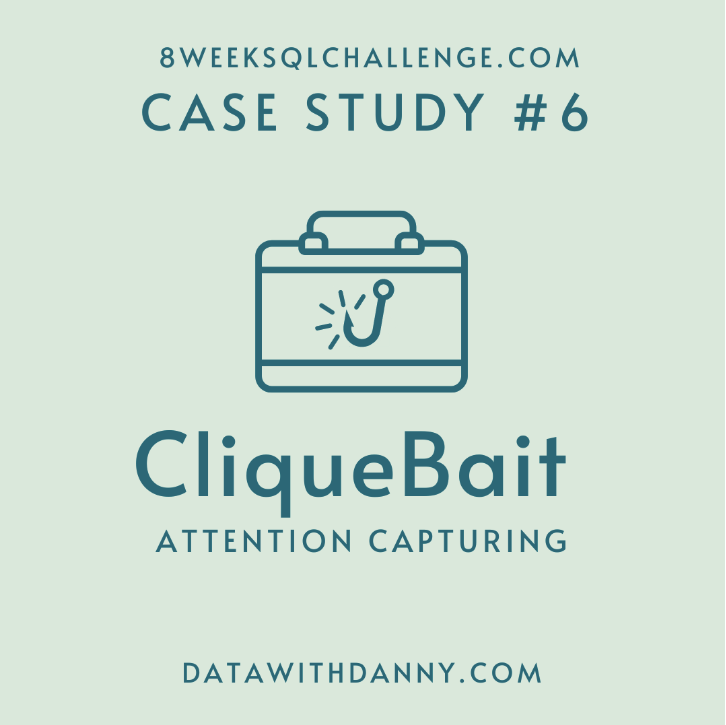

## **Clique Bait**


### **Introduction**
Clique Bait is not like your regular online seafood store - the founder and CEO Danny, was also a part of a digital data analytics team and wanted to expand his knowledge into the seafood industry!

In this case study - you are required to support Danny’s vision and analyse his dataset and come up with creative solutions to calculate funnel fallout rates for the Clique Bait online store.

### `Available Data`
For this case study there is a total of 5 datasets which you will need to combine to solve all of the questions.

<br>

#### **Clique Bait Tables**

`Users`
* Customers who visit the Clique Bait website are tagged via their `cookie_id`

|user_id|cookie_id|start_date|
|---|-----|----|
|397|	3759ff|	2020-03-30 00:00:00|
|215|	863329|	2020-01-26 00:00:00|
|191|	eefca9|	2020-03-15 00:00:00|
|89	|764796|	2020-01-07 00:00:00|
|127|	17ccc5|	2020-01-22 00:00:00|
|81	|b0b666|	2020-03-01 00:00:00|
|260|	a4f236|	2020-01-08 00:00:00|
|203|	d1182f|	2020-04-18 00:00:00|
|23	|12dbc8|	2020-01-18 00:00:00|
|375|	f61d69|	2020-01-03 00:00:00|

`Events`
* Customer visits are logged in this events table at a `cookie_id` level and the `event_type` and `page_id` values can be used to **join** onto relevant satellite tables to obtain further information about each event.

The sequence_number is used to order the events within each visit.

|visit_id	|cookie_id	|page_id	|event_type	|sequence_number	|event_time|
|-----|-----|-----|-----|----|-----|
|719fd3	|3d83d3|	5	|1	|4	|2020-03-02 00:29:09.975502|
|fb1eb1	|c5ff25|	5	|2	|8	|2020-01-22 07:59:16.761931|
|23fe81	|1e8c2d|	10	|1	|9	|2020-03-21 13:14:11.745667|
|ad91aa	|648115|	6	|1	|3	|2020-04-27 16:28:09.824606|
|5576d7	|ac418c|	6	|1	|4	|2020-01-18 04:55:10.149236|
|48308b	|c686c1|	8	|1	|5	|2020-01-29 06:10:38.702163|
|46b17d	|78f9b3|	7	|1	|12	|2020-02-16 09:45:31.926407|
|9fd196	|ccf057|	4	|1	|5	|2020-02-14 08:29:12.922164|
|edf853	|f85454|	1	|1	|1	|2020-02-22 12:59:07.652207|
|3c6716	|02e74f|	3	|2	|5	|2020-01-31 17:56:20.777383|


`Event Identifier`
* The event_identifier table shows the types of events which are captured by Clique Bait’s digital data systems.

|event_type	|event_name|
|-----|-----|
|1	|Page View|
|2	|Add to Cart|
|3	|Purchase|
|4	|Ad Impression|
|5	|Ad Click|

`Campaign Identifier`
* This table shows information for the 3 campaigns that Clique Bait has ran on their website so far in 2020.

|campaign_id|products|campaign_name|start_date|end_date|
|-----|----|-----|-----|-----|
|1	|1-3|	BOGOF - Fishing For Compliments	    |2020-01-01 00:00:00	|2020-01-14 00:00:00|
|2	|4-5|	25% Off - Living The Lux Life	    |2020-01-15 00:00:00	|2020-01-28 00:00:00|
|3	|6-8|	Half Off - Treat Your Shellf(ish)	|2020-02-01 00:00:00	|2020-03-31 00:00:00|


`Page Hierarchy`
* This table lists all of the pages on the Clique Bait website which are tagged and have data passing through from user interaction events.

|page_id|page_name|product_category|product_id|
|----|----|-----|-----|
|1	|Home Page	    |null	    |null|
|2	|All Products	|null	    |null|
|3	|Salmon	    |Fish	    |1|
|4	|Kingfish	    |Fish	    |2|
|5	|Tuna	       |Fish	    |3|
|6	|Russian Caviar|Luxury	    |4|
|7	|Black Truffle|	Luxury	    |5|
|8	|Abalone|	    Shellfish	|6|
|9	|Lobster|	    Shellfish	|7|
|10	|Crab|          Shellfish	|8|
|11	|Oyster|	    Shellfish	|9|
|12	|Checkout|	    null	    |null|
|13	|Confirmation|	null	    |null|


---

<br>

### **Case Study Questions**

#### `A. Enterprise Relationship Diagram`
* Using the following DDL schema details to create an ERD for all the Clique Bait datasets.
    - ... aight I'm gonna get here but using MySQLWorkBench as well for familiarity with that tool and likely reverse engineering
    - More to come here but let's get to querying to kick the project off

<br>

#### `B. Digital Analysis`
Using the available datasets - answer the following questions using a single query for each one:

**1.** How many users are there?
```sql
-- How many users are there?
SELECT COUNT(DISTINCT user_id) AS user_count
FROM clique_bait.users;
```
|user_count|
|----|
|500|

<br>

**2.** How many cookies does each user have on average?
```sql
-- Get user unique cookies
WITH user_cookie_counts AS (
SELECT 
  user_id,
  COUNT(DISTINCT cookie_id) AS user_unique_counts
FROM clique_bait.users
GROUP BY user_id
)
SELECT * FROM user_cookie_counts LIMIT 5;
```
|user_id|user_unique_counts|
|----|----|
|1|4|
|2|4|
|3|5|
|4|2|
|5|3|

* Now average them
```sql
WITH user_cookie_counts AS (
SELECT 
  user_id,
  COUNT(DISTINCT cookie_id) AS user_unique_counts
FROM clique_bait.users
GROUP BY user_id
)
SELECT
    ROUND(AVG(user_unique_counts), 2) AS average_user_cookie_amount,
    CONCAT('Users averaged ', ROUND(AVG(user_unique_counts), 2), ' cookies.') AS user_avg_str
FROM user_cookie_counts;
```
|average_user_cookie_amount|user_avg_str|
|----|----|
|3.56|Users averaged 3.56 cookies.|

<br>

**3.** What is the unique number of visits by all users per month?
```sql
-- Quick look at total row count to validate our return on subsequent query
SELECT COUNT(*) from clique_bait.users;
```
|count|
|--|
|1782|

```sql
-- This is just the counts of user events (we want event details)
SELECT
  DATE_PART('MONTH', start_date) AS Month,
  TO_CHAR(start_date, 'Month') AS Month_Name,
  COUNT(*) AS User_Counts_Per_Month,
  SUM(COUNT(*)) OVER() AS total_row_check
FROM clique_bait.users
GROUP BY Month, Month_Name
ORDER BY User_Counts_Per_Month DESC;
```
|month|month_name|user_counts_per_month|total_row_check|
|-----|-----|-----|-----|
|2|February|744|1782|
|3|March|458|1782|
|1|January|438|1782|
|4|April|124|1782|
|5|May|18|1782|

<br>

* Unique Number of visits by all users per month will look at data from the `Event` table
```sql
-- UNION ALL (Same Counts)
SELECT COUNT(DISTINCT cookie_id) FROM clique_bait.events
UNION ALL
SELECT COUNT(DISTINCT cookie_id) FROM clique_bait.users;
```
|count|
|----|
|1782|
|1782|

* We can see here that the events and users appear to share the same distinct cookie_id but the counts of rows in events is a lot higher as it appears to be a `many-many` type relationship
```sql
SELECT visit_id, cookie_id, sequence_number
FROM clique_bait.events
ORDER BY visit_id
LIMIT 5
```
|visit_id|cookie_id|sequence_number|
|---|----|----|
|242220|001652|1|
|c4120b|001652|1|
|c4120b|001652|2|
|c4120b|001652|3|
|c4120b|001652|4|

```sql
SELECT 
  DATE_PART('Month', event_time) AS Month,
  TO_CHAR(event_time, 'Month') AS Month_Name,
  COUNT(DISTINCT visit_id) AS monthly_unique_user_visits
FROM clique_bait.events
GROUP BY Month, Month_Name;
```
|month|month_name|monthly_unique_user_visits|
|-----|----|----|
|1|January|876|
|2|February|1488|
|3|March|916|
|4|April|248|
|5|May|36|

<br>

**4.** What is the number of events for each event type? 
* Looking outside of Users now for some Event Detail
```sql
SELECT
  ev.event_type,
  evid.event_name,
  COUNT(*) AS event_type_count
FROM clique_bait.events AS ev
INNER JOIN clique_bait.event_identifier AS evid
  USING(event_type)
GROUP BY ev.event_type, evid.event_name
ORDER BY event_type_count DESC;
```
|event_type|event_name|event_type_count
|----|----|----|
|1|Page View|20928|
|2|Add to Cart|8451|
|3|Purchase|1777|
|4|Ad Impression|876|
|5|Ad Click|702|

<br>

**5.** What is the percentage of visits which have a purchase event?
```sql
SELECT
  ev.event_type,
  evid.event_name,
  ROUND(
  COUNT(*)::NUMERIC / (SELECT COUNT(*) FROM clique_bait.events)
  , 2) AS purchase_percentage_decimal,
  CONCAT(
  100 * ROUND(
  COUNT(*)::NUMERIC / (SELECT COUNT(*) FROM clique_bait.events)
  , 2), '%') AS purchase_percentage
FROM clique_bait.events AS ev
INNER JOIN clique_bait.event_identifier AS evid
  USING(event_type)
WHERE evid.event_name = 'Purchase'
GROUP BY ev.event_type, evid.event_name;
```
|event_type|event_name|purchase_percentage_decimal|purchase_percentage|
|-----|-----|------|-----|
|3|Purchase|0.05|5.00%|

<br>

- So the above is unfortunately ... not right but a good idea of what I was first thinking when assessing the tables without an ERD diagram and know relationship between `events` and `users`. Now to more of the purchase events items
```sql
-- Now the way this looks is we would be looking at the distinct count of unique `visit_ids` against how many actually turned into a event_type of purchase
SELECT
  e.event_type,
  ei.event_name,
  SUM(CASE WHEN ei.event_name = 'Purchase' THEN 1 ELSE 0 END) AS purchase_count,
  (SELECT COUNT(DISTINCT visit_id) FROM clique_bait.events) AS unique_user_visit,
  ROUND(
  SUM(CASE WHEN ei.event_name = 'Purchase' THEN 1 ELSE 0 END)::NUMERIC / (SELECT COUNT(DISTINCT visit_id) AS unique_visit FROM clique_bait.events)
  , 4) AS decimal_percentage,
  CONCAT(
    ROUND(
    100 * SUM(CASE WHEN ei.event_name = 'Purchase' THEN 1 ELSE 0 END)::NUMERIC / (SELECT COUNT(DISTINCT visit_id) AS unique_visit FROM clique_bait.events)
    , 2), '%') AS purchase_perc_per_unique_visits 
FROM clique_bait.events AS e 
INNER JOIN clique_bait.event_identifier AS ei 
  USING(event_type)
WHERE ei.event_name = 'Purchase'
GROUP BY e.event_type, ei.event_name;
```
|event_type|event_name|purchase_count|unique_user_visit|decimal_percentage|purchase_perc_per_unique_visits|
|----|----|-----|-----|------|---|
|3|Purchase|1777|3564|0.4986|49.86%|

<br>

* Here's another way 
```sql
WITH cte_visits_with_purchase_flag AS (
  SELECT
    visit_id,
    MAX(CASE WHEN event_type = 3 THEN 3 ELSE 0 END) AS purchase_flag
  FROM clique_bait.events
  GROUP BY visit_id
)
SELECT
  ROUND(100 * SUM(purchase_flag) / COUNT(*), 2) AS purchase_percentage
FROM cte_visits_with_purchase_flag;
```
|visit_id|purchase_flag|
|----|----|
|fbfdcb|0|
|d27c65|0|
|79553d|0|
|aded2b|0|
|dc8de5|0|
|c91b3c|1|
|2be4dc|0|

* So now we have each visited grouped by (visit_id can have many events (`one-visit to many-events`)) so we would want to SUM the purchase flag and divide by our total unique visits
```sql
WITH cte_visits_with_purchase_flag AS (
  SELECT
    visit_id,
    SUM(CASE WHEN event_type = 3 THEN 1 ELSE 0 END) AS purchase_flag
  FROM clique_bait.events
  GROUP BY visit_id
)
SELECT
  100 * SUM(purchase_flag) / (SELECT COUNT(DISTINCT visit_id) FROM clique_bait.events)::NUMERIC AS purchase_percentage,
  SUM(purchase_flag) AS total_purchases, 
  (SELECT COUNT(DISTINCT visit_id) FROM clique_bait.events) AS unique_events,
  CONCAT(ROUND(100 * SUM(purchase_flag) / (SELECT COUNT(DISTINCT visit_id) FROM clique_bait.events)::NUMERIC, 2), '%') AS purchase_perc_str
FROM cte_visits_with_purchase_flag;
```
|purchase_percentage|total_purchases|unique_events|purchase_perc_str|
|-----|----|-----|-----|
|49.8597081930415264|1777|3564|49.86%|

<br>

**6.** What is the percentage of visits which view the checkout page but do not have a purchase event?
```sql
SELECT
  ev.event_type,
  evid.event_name,
  COUNT(*) AS event_type_count,
  ROUND(
    COUNT(*)::NUMERIC / SUM(COUNT(*)) OVER() 
  , 2) AS event_percetange_decimal,
  CONCAT(
  100 * ROUND(
  COUNT(*)::NUMERIC / SUM(COUNT(*)) OVER() 
  , 2), '%') AS event_percetange
FROM clique_bait.events AS ev
INNER JOIN clique_bait.event_identifier AS evid
  USING(event_type)
WHERE evid.event_name IN ('Purchase', 'Add to Cart')
GROUP BY ev.event_type, evid.event_name;
```
|event_type|event_name|event_type_count|event_percetange_decimal|event_percetange|
|-----|-----|-----|----|----|
|3|Purchase|1777|0.17|17.00%|
|2|Add to Cart|8451|0.83|83.00%|

- So ... similar to above we approaceh the above just a bit wrong in terms of how the relationships we're creating rows for our percentage counts

<br>

* Initially we can look at the distinct `user event` counts by event (a user event can have many events!)
```sql
WITH unique_user_event_counts AS (
SELECT
  e.event_type,
  ei.event_name,
  COUNT(DISTINCT visit_id) AS unique_visits_by_event
FROM clique_bait.events AS e 
INNER JOIN clique_bait.event_identifier AS ei 
  ON e.event_type = ei.event_type
GROUP BY e.event_type, ei.event_name
ORDER BY unique_visits_by_event
)

```
|event_type|event_name|unique_visits_by_event|
|----|-----|-----|
|5|Ad Click|702|
|4|Ad Impression|876|
|3|Purchase|1777|
|2|Add to Cart|2510|
|1|Page View|3564|

* So I would define percentage of views ot a checkout page as the `Add  to Cart` option with the `Purchase` as the self-defined .. purchase
```sql
WITH unique_user_event_counts AS (
SELECT
  e.event_type,
  ei.event_name,
  COUNT(DISTINCT visit_id) AS unique_visits_by_event
FROM clique_bait.events AS e 
INNER JOIN clique_bait.event_identifier AS ei 
  ON e.event_type = ei.event_type
GROUP BY e.event_type, ei.event_name
ORDER BY unique_visits_by_event
)
SELECT
ROUND(
    (SELECT unique_visits_by_event FROM unique_user_event_counts WHERE event_name = 'Purchase') / 
    (SELECT unique_visits_by_event FROM unique_user_event_counts WHERE event_name = 'Add to Cart')::NUMERIC
  , 3) AS purchase_decimal_percentage,
CONCAT(
  ROUND(
      (SELECT unique_visits_by_event FROM unique_user_event_counts WHERE event_name = 'Purchase') / 
      (SELECT unique_visits_by_event FROM unique_user_event_counts WHERE event_name = 'Add to Cart')::NUMERIC
    , 3) * 100, '%') AS purchase_percentage
```
|purchase_decimal_percentage|purchase_percentage|
|----|----|
|0.708|70.800%|

* ... Aaaah so we want to look at this a bit different again but maintaining some approaches to this as a way to remember how data can be ... interepreted in a fair few different ways when working with a data schema initially for the first time.
    - The `checkout` page has a different page id so an event of `add to cart` does not != a view to the checkout page and rather is defined by the `page_id` within events

```sql
-- We wnat to use the page_hierarchy here for help
SELECT 
  DISTINCT page_id, page_name
FROM clique_bait.page_hierarchy
ORDER BY page_id;
```
|page_id|page_name|
|-----|----|
|1|Home Page|
|2|All Products|
|3|Salmon|
|4|Kingfish|
|5|Tuna|
|6|Russian Caviar|
|7|Black Truffle|
|8|Abalone|
|9|Lobster|
|10|Crab|
|11|Oyster|
|12|Checkout|
|13|Confirmation|

* So we can now drill down into counts by keying in on the shared `page_id`
```sql
SELECT
  ph.page_id,
  ph.page_name,
  COUNT(DISTINCT visit_id) AS unique_visits_page_counts
FROM clique_bait.events AS e 
INNER JOIN clique_bait.page_hierarchy AS ph 
ON e.page_id = ph.page_id
WHERE e.page_id IN (12, 13)
GROUP BY ph.page_id, ph.page_name
ORDER BY unique_visits_page_counts;
```
|page_id|page_name|unique_visits_page_counts|
|----|-----|-----|
|13|Confirmation|1777|
|12|Checkout|2103|

* And now just a bit deeper here to take the total "confirmations" and see the percentage against those who reached the checkout page

```sql
-- This groups unique user visits (GROUP BY) to see if they had a confirmation or Checkout event and provide a 1 for each conditional SUM/Case column
WITH page_counts AS (
SELECT
  e.visit_id,
  SUM(CASE WHEN ph.page_name = 'Confirmation' THEN 1 ELSE 0 END) AS Confirmation_unique_events,
  SUM(CASE WHEN ph.page_name = 'Checkout' THEN 1 ELSE 0 END) AS Checkout_unique_events
FROM clique_bait.page_hierarchy AS ph 
INNER JOIN clique_bait.events AS e 
  ON  e.page_id = ph.page_id
GROUP BY e.visit_id
)
SELECT * FROM page_counts WHERE Confiration_unique_events = 1 OR Checkout_unique_events = 1 LIMIT 5;
```
|visit_id|confirmation_unique_events|checkout_unique_events|
|----|-----|-----|
|c91b3c|1|1|
|5c3394|1|1|
|b98573|0|1|
|8be702|1|1|
|b41d80|1|1|

* This is closer to what we want and now just need to sum each and see the percentage of checkout vs confirmation 
```sql
WITH page_counts AS (
SELECT
  e.visit_id,
  SUM(CASE WHEN ph.page_name = 'Confirmation' THEN 1 ELSE 0 END) AS Purchase_unique_events,
  SUM(CASE WHEN ph.page_name = 'Checkout' THEN 1 ELSE 0 END) AS Checkout_unique_events
FROM clique_bait.page_hierarchy AS ph 
INNER JOIN clique_bait.events AS e 
  ON  e.page_id = ph.page_id
GROUP BY e.visit_id
)
SELECT
  SUM(Purchase_unique_events) AS total_unique_purchases,
  SUM(Checkout_unique_events) AS total_unique_checkoutpg_events,
  CONCAT(ROUND(SUM(Purchase_unique_events)::NUMERIC / SUM(Checkout_unique_events), 3) * 100, '%') AS check_out_to_purchase, 
  CONCAT(ROUND( 1 - SUM(Purchase_unique_events)::NUMERIC / SUM(Checkout_unique_events), 3) * 100, '%') AS check_out_and_no_purchase
FROM page_counts;
```
|total_unique_purchases|total_unique_checkoutpg_events|check_out_to_purchase|check_out_and_no_purchase|
|----|-----|-----|-----|
|1777|2103|84.500%|15.500%|

* And there it is! Awesome conversion from the checkout page to a subsequent purchase action for our grouped by visits

<br>

**7.** What are the top 3 pages by number of views?
```sql
SELECT
  ph.page_id,
  ph.page_name,
  ei.event_name,
  COUNT(*) AS total_page_visits
FROM clique_bait.page_hierarchy AS ph 
INNER JOIN clique_bait.events AS e 
  USING(page_id)
INNER JOIN clique_bait.event_identifier AS ei 
  ON ei.event_type = e.event_type
GROUP BY ph.page_id, ph.page_name, ei.event_name
ORDER BY total_page_visits DESC
LIMIT 5
```
|page_id|page_name|event_name|total_page_visits|
|----|----|----|---|
|2|All Products|Page View|3174|
|12|Checkout|Page View|2103|
|1|Home Page|Page View|1782|
|13|Confirmation|Purchase|1777|
|11|Oyster|Page View|1568|

* We can see organically that even before using a `WHERE` clause for the count of the different events by **page** definition we can already see the top 3 Page View which has 4 of the 5 top event counts per page to start with


<br>

**8.** What is the number of views and cart adds for each product category?
```sql
SELECT 
  ph.product_category,
  ph.product_id,
  e.event_type,
  ei.event_name
FROM clique_bait.page_hierarchy AS ph 
INNER JOIN clique_bait.events AS e 
  ON ph.page_id = e.page_id
INNER JOIN clique_bait.event_identifier AS ei 
  ON e.event_type = ei.event_type
WHERE product_category IS NOT NULL AND product_id IS NOT NULL
LIMIT 5;
```
|product_category|product_id|event_type|event_name|
|----|----|----|-----|
|Luxury|4|1|Page View|
|Shellfish|7|1|Page View|
|Shellfish|7|2|Add to Cart|
|Shellfish|8|1|Page View|
|Shellfish|8|2|Add to Cart|

* Ok so we can simply now do a similar sum/case with a group by to get each product details for the counts for `views` and `carts` onto one line

```sql
SELECT 
  ph.product_category,
  SUM(CASE WHEN ei.event_name = 'Page View' THEN 1 ELSE 0 END) AS product_page_views,
  SUM(CASE WHEN ei.event_name = 'Add to Cart' THEN 1 ELSE 0 END) AS product_cart_adds
FROM clique_bait.page_hierarchy AS ph 
INNER JOIN clique_bait.events AS e 
  ON ph.page_id = e.page_id
INNER JOIN clique_bait.event_identifier AS ei 
  ON e.event_type = ei.event_type
WHERE ph.product_category IS NOT NULL
GROUP BY ph.product_category
ORDER BY ph.product_category;
```
|product_category|product_page_views|product_cart_adds|
|------|----|-----|
|Fish|4633|2789|
|Luxury|3032|1870|
|Shellfish|6204|3792|

<br>

**9.** What are the top 3 products by purchases?
* So in order to use the data schema as constructed, we would need to isolate all the products that have first been added to the cart, then narrow down the order or event_id to have been being purchased. Secondary `in` check will use a subquery to validate event and products captured in an `add to cart` type action subsequently ending in an order.
```sql
-- First let's join the events, event_identifier, and page_hierarchy items which will be aggregating at the end
-- Also, we want to get all products added to the cart initially
SELECT
  ph.product_id, 
  ph.page_name AS product,
  ph.product_category AS category,
  COUNT(*) AS product_purchases
FROM clique_bait.events AS e 
INNER JOIN clique_bait.event_identifier AS ei 
  ON e.event_type = ei.event_type
INNER JOIN clique_bait.page_hierarchy AS ph 
  ON e.page_id = ph.page_id
WHERE ei.event_name = 'Add to Cart'
-- Now we want to validate if the visit ultimately resulted in a purchase with what was added to the cart
AND e.visit_id IN (
SELECT 
  e.visit_id
FROM clique_bait.events AS e 
WHERE e.event_type = 3 -- Purchase event_type 
)
-- now we should have a base table to group by and order by
GROUP BY ph.product_id, product, product_category
ORDER BY product_purchases DESC;
```
|product_id|product|category|product_purchases|
|-----|-----|----|-----|
|7|Lobster|Shellfish|754|
|9|Oyster|Shellfish|726|
|8|Crab|Shellfish|719|
|1|Salmon|Fish|711|
|5|Black Truffle|Luxury|707|
|2|Kingfish|Fish|707|
|6|Abalone|Shellfish|699|
|4|Russian Caviar|Luxury|697|
|3|Tuna|Fish|697|

<br>

#### `Quick Visit of Above`
* In order to get all the products that could have been purchased in any event type that ultimately had a purchase, we first must aggregate all the products that have been added to a cart (you can see the two joins to get that detail prior to the subquery inclusion check)
* Next, we can still use a column/value from our join (customer visit) not within our aggregated look to narrow down the visits that ultimately converted after having been added to the cart.
* Lastly after the second subquery check for the event resulting in a purchase, we can group by the products, category and unique identifier for the product to get the total counts for an event ultimately ending in a purchase

---

<br>

### `Product Funnel Analysis`
**1.** Using a single SQL query - create a new output table which has the following details:
* How many times was each product viewed?
* How many times was each product added to cart?
* How many times was each product added to a cart but not purchased (abandoned)?
* How many times was each product purchased?

<br>

#### **Process Break Down for Table Generation**
* So .. in terms of approaches, I think we want to like create a series of CTE's that can uniquely look to populate the different conditions for the event_types and use a conditional CASE SUM for the group by counts we ultimately want for each product

#### `First Look at Views and Additions to the Cart`
```sql
WITH product_views_cart_additions AS (
SELECT
  ph.page_name AS product, 
  SUM(CASE WHEN e.event_type = 1 THEN 1 ELSE 0 END) AS product_views,
  SUM(CASE WHEN e.event_type = 2 THEN 1 ELSE 0 END) AS product_cart_adds
FROM clique_bait.page_hierarchy AS ph 
INNER JOIN clique_bait.events AS e 
  ON e.page_id = ph.page_id
WHERE ph.product_id IS NOT NULL
GROUP BY product
ORDER BY product
)
SELECT * FROM product_views_cart_additions;
```
|product|product_views|product_cart_adds|
|----|-----|-----|
|Abalone|1525|932|
|Black Truffle|1469|924|
|Crab|1564|949|
|Kingfish|1559|920|
|Lobster|1547|968|
|Oyster|1568|943|
|Russian Caviar|1563|946|
|Salmon|1559|938|
|Tuna|1515|931|

#### `Now to Cart Additions But Not Purchased`
* Now there doesn't appear to be any `event_type` in which a cart removal is tracked in events. So similar to above, I think we can look to filter by the events `visit_id` which doesn't have a purchase event and group by the product for a simple count of the table we build for visits that don't have a purchase event.
```sql
WITH cart_additions_no_purchase AS (
SELECT
  ph.page_name AS product, 
  COUNT(*) AS abandoned_count
FROM clique_bait.page_hierarchy AS ph 
INNER JOIN clique_bait.events AS e 
  ON e.page_id = ph.page_id 
WHERE e.event_type = 2
AND e.visit_id NOT IN (
  SELECT
    e.visit_id
  FROM clique_bait.events AS e 
  WHERE e.event_type = 3
) 
AND ph.product_id IS NOT NULL
GROUP BY product
ORDER BY product
)
SELECT * FROM cart_additions_no_purchase
```
|product|abandoned_count|
|-----|-----|
|Abalone|233|
|Black Truffle|217|
|Crab|230|
|Kingfish|213|
|Lobster|214|
|Oyster|217|
|Russian Caviar|249|
|Salmon|227|
|Tuna|234|

* Both CTE combined w/join on the product 
```sql
WITH product_views_cart_additions AS (
SELECT
  ph.page_name AS product, 
  SUM(CASE WHEN e.event_type = 1 THEN 1 ELSE 0 END) AS product_views,
  SUM(CASE WHEN e.event_type = 2 THEN 1 ELSE 0 END) AS product_cart_adds
FROM clique_bait.page_hierarchy AS ph 
INNER JOIN clique_bait.events AS e 
  ON e.page_id = ph.page_id
WHERE ph.product_id IS NOT NULL
GROUP BY product
ORDER BY product
),
cart_additions_no_purchase AS (
SELECT
  ph.page_name AS product, 
  COUNT(*) AS abandoned_count
FROM clique_bait.page_hierarchy AS ph 
INNER JOIN clique_bait.events AS e 
  ON e.page_id = ph.page_id 
WHERE e.event_type = 2
AND e.visit_id NOT IN (
  SELECT
    e.visit_id
  FROM clique_bait.events AS e 
  WHERE e.event_type = 3
) 
AND ph.product_id IS NOT NULL
GROUP BY product
ORDER BY product
)
SELECT
  product,
  first_cte.product_views,
  first_cte.product_cart_adds,
  second_cte.abandoned_count
FROM product_views_cart_additions AS first_cte
INNER JOIN cart_additions_no_purchase AS second_cte
  USING(product)
```
|product|product_views|product_cart_adds|abandoned_count|
|----|-----|-----|-----|
|Abalone|1525|932|233|
|Black Truffle|1469|924|217|
|Crab|1564|949|230|
|Kingfish|1559|920|213|
|Lobster|1547|968|214|
|Oyster|1568|943|217|
|Russian Caviar|1563|946|249|
|Salmon|1559|938|227|
|Tuna|1515|931|234|

#### `How Many Times was Each Product Purchased`
* Now as we have the details of abandonents we can deduce the purchases as the table structure is really a boolean yes/no for visit ids if they included a purchase. We can also do a quick join back to page_hierarchy to get the respective product_id
```sql
CREATE TEMPORARY TABLE IF NOT EXISTS pfa AS
WITH product_views_cart_additions AS (
SELECT
  ph.page_name AS product, 
  SUM(CASE WHEN e.event_type = 1 THEN 1 ELSE 0 END) AS product_views,
  SUM(CASE WHEN e.event_type = 2 THEN 1 ELSE 0 END) AS product_cart_adds
FROM clique_bait.page_hierarchy AS ph 
INNER JOIN clique_bait.events AS e 
  ON e.page_id = ph.page_id
WHERE ph.product_id IS NOT NULL
GROUP BY product
ORDER BY product
),
cart_additions_no_purchase AS (
SELECT
  ph.page_name AS product, 
  COUNT(*) AS abandoned_count
FROM clique_bait.page_hierarchy AS ph 
INNER JOIN clique_bait.events AS e 
  ON e.page_id = ph.page_id 
WHERE e.event_type = 2
AND e.visit_id NOT IN (
  SELECT
    e.visit_id
  FROM clique_bait.events AS e 
  WHERE e.event_type = 3
) 
AND ph.product_id IS NOT NULL
GROUP BY product
ORDER BY product
),
product_joined_values AS (
-- Output includes the product id so we can do another quick join here to get the product id and match on the page_name which is our aliased product
SELECT
  ph.product_id,
  product,
  first_cte.product_views,
  first_cte.product_cart_adds,
  second_cte.abandoned_count
FROM product_views_cart_additions AS first_cte
INNER JOIN cart_additions_no_purchase AS second_cte
  USING(product)
INNER JOIN clique_bait.page_hierarchy AS ph 
  ON product = ph.page_name
ORDER BY ph.product_id
)
SELECT
  *,
  product_cart_adds - abandoned_count AS purchases
FROM product_joined_values;
SELECT * FROM pfa;
```
* Creating Temporary Table for Easier Query for next set of questions

|product_id|product|product_views|product_cart_adds|abandoned_count|purchases|
|----|----|----|---|----|----|
|1|Salmon|1559|938|227|711|
|2|Kingfish|1559|920|213|707|
|3|Tuna|1515|931|234|697|
|4|Russian Caviar|1563|946|249|697|
|5|Black Truffle|1469|924|217|707|
|6|Abalone|1525|932|233|699|
|7|Lobster|1547|968|214|754|
|8|Crab|1564|949|230|719|
|9|Oyster|1568|943|217|726|

<br>

* Additionally, create another table which further aggregates the data for the above points but this time for each product category instead of individual products.
#### `Category Product Analysis`
* Can similarly use the base of the query above to create a similar output with a few adjustments to our query
```sql
DROP TABLE IF EXISTS pcfa;
CREATE TEMP TABLE pcfa AS 
WITH product_category_views_cart_adds AS (
SELECT
  ph.product_category AS product_category, 
  SUM(CASE WHEN e.event_type = 1 THEN 1 ELSE 0 END) AS category_views,
  SUM(CASE WHEN e.event_type = 2 THEN 1 ELSE 0 END) AS category_cart_adds
FROM clique_bait.page_hierarchy AS ph 
INNER JOIN clique_bait.events AS e 
  ON e.page_id = ph.page_id
WHERE ph.product_id IS NOT NULL
GROUP BY product_category
),
cart_additions_no_purchase_categories AS (
SELECT
  ph.product_category AS product_category, 
  COUNT(*) AS abandoned_count
FROM clique_bait.page_hierarchy AS ph 
INNER JOIN clique_bait.events AS e 
  ON e.page_id = ph.page_id 
WHERE e.event_type = 2
AND e.visit_id NOT IN (
  SELECT
    e.visit_id
  FROM clique_bait.events AS e 
  WHERE e.event_type = 3
) 
AND ph.product_id IS NOT NULL
GROUP BY product_category
),
category_joined_values AS (
-- Output includes the product id so we can do another quick join here to get the product id and match on the page_name which is our aliased product
SELECT
  product_category,
  first_cte.category_views,
  first_cte.category_cart_adds,
  second_cte.abandoned_count
FROM product_category_views_cart_adds AS first_cte
INNER JOIN cart_additions_no_purchase_categories AS second_cte
  USING(product_category)
ORDER BY product_category
)
SELECT
  *,
  category_cart_adds - abandoned_count AS purchases
FROM category_joined_values;
```
* Similar to above we'll make a temporary table for the next set of PFA and PFCA (product and product category funnel analysis)

|product_category|category_views|category_cart_adds|abandoned_count|purchases|
|----|----|----|----|----|
|Fish|4633|2789|674|2115|
|Luxury|3032|1870|466|1404|
|Shellfish|6204|3792|894|2898|

<br>

### **Product Analysis From Created Product & Category Tables**

Use your 2 new output tables - answer the following questions:
* Output the column types from one of your temp tables
  - Good reminder here of the ability for temp tables and getting their detail/type if needed
```sql
SELECT
    column_name,
    data_type
FROM
    information_schema.columns
WHERE
    table_name = 'pfa';
```
|column_name|data_type|
|----|----|
|product_id|integer|
|product|character varying|
|product_views|bigint|
|product_cart_adds|bigint|
|abandoned_count|bigint|
|purchases|bigint|

<br>

**1.** Which product had the most views, cart adds and purchases?
  - We'll do a few different methods to get the max values for each categorical count
```sql
-- Max product views
SELECT
  product,
  product_views AS max_product_views
FROM pfa
WHERE product_views = (SELECT MAX(product_views) FROM pfa);

-- Most Cart Adds
SELECT
  product,
  product_cart_adds
FROM pfa
ORDER BY product_cart_adds DESC
LIMIT 1;

-- Most purchases
SELECT
  product,
  purchases
FROM pfa
ORDER BY purchases DESC
LIMIT 1;
```
|product|max_product_views|
|----|----|
|Oyster|1568|

|product|product_cart_adds|
|----|----|
|Lobster|968|

|product|purchases|
|----|----|
|Lobster|754|

<br>

**2.** Which product was most likely to be abandoned?
  - This can be interpreted as the the product being added to the cart but not subsequently purchased 
```sql
SELECT
  product,
  product_cart_adds,
  abandoned_count,
  ROUND(100 * (abandoned_count::NUMERIC / product_cart_adds), 1) AS abandoned_perc_num,
  CONCAT(ROUND(100 * (abandoned_count::NUMERIC / product_cart_adds), 1), '%') AS abandoned_perc_str
FROM pfa
ORDER BY abandoned_perc_num DESC
LIMIT 3;
```
|product|product_cart_adds|abandoned_count|abandoned_perc_num|abandoned_perc_str|
|-----|-----|-----|-----|-----|
|Russian Caviar|946|249|26.3|26.3%|
|Tuna|931|234|25.1|25.1%|
|Abalone|932|233|25.0|25.0%|

<br>

**3.** Which product had the highest view to purchase percentage?
```sql
WITH purchase_percentages AS (
SELECT
  product,
  ROUND(purchases::NUMERIC / product_views, 2) AS purchase_perc_dec,
  -- Using multiple rounds here to narrow down fairly tight percentages on the first percentage and cleaning up to 2 decimal points after multiplying by 100 for 2 decimal points
  ROUND(100 * ROUND(purchases::NUMERIC / product_views, 4), 2) AS purchase_perc_int
FROM pfa
ORDER BY purchase_perc_int DESC
)
SELECT
  *,
  CONCAT(purchase_perc_int, '%') AS percentage_str
FROM purchase_percentages
LIMIT 2;
```
|product|purchase_perc_dec|purchase_perc_int|percentage_str|
|-----|-----|-----|-----|
|Lobster|0.49|48.74|48.74%|
|Black Truffle|0.48|48.13|48.13%|

<br>

**4.** What is the average conversion rate from view to cart add?

<br>

**5.** What is the average conversion rate from cart add to purchase?