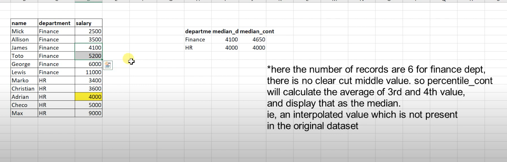
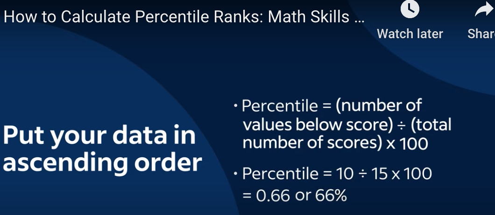

# Balanced Tree Clothing Company


<br>

### **Introduction**
Balanced Tree Clothing Company prides themselves on providing an optimised range of clothing and lifestyle wear for the modern adventurer!

Danny, the CEO of this trendy fashion company has asked you to assist the team’s merchandising teams analyse their sales performance and generate a basic financial report to share with the wider business.

<br>

### **Available Data**
For this case study there is a total of 4 datasets for this case study - however you will only need to utilise 2 main tables to solve all of the regular questions, and the additional 2 tables are used only for the bonus challenge question!

<br>

`Product Details`
* `balanced_tree.product_details` includes all information about the entire range that Balanced Clothing sells in their store.

|product_id|price|product_name|category_id|segment_id|style_id|category_name|segment_name|style_name|
|----|----|----|-----|-----|-----|----|----|-----|
|c4a632|13|Navy Oversized Jeans - Womens|1|3|7|Womens|Jeans|Navy Oversized|
|e83aa3|32|Black Straight Jeans - Womens|1|3|8|Womens|Jeans|Black Straight|
|e31d39|10|Cream Relaxed Jeans - Womens|1|3|9|Womens|Jeans|Cream Relaxed|
|d5e9a6|23|Khaki Suit Jacket - Womens|1|4|10|Womens|Jacket|Khaki Suit|
|72f5d4|19|Indigo Rain Jacket - Womens|1|4|11|Womens|Jacket|Indigo Rain|

<br>

`Product Sales`
* `balanced_tree.sales` contains product level information for all the transactions made for Balanced Tree including **quantity, price, percentage discount, member status, a transaction ID** and also the **transaction timestamp**.

|prod_id|qty|price|discount|member|txn_id|start_txn_time|
|----|----|----|----|----|----|-----|
|c4a632|4|13|17|true|54f307|2021-02-13 01:59:43.296|
|5d267b|4|40|17|true|54f307|2021-02-13 01:59:43.296|
|b9a74d|4|17|17|true|54f307|2021-02-13 01:59:43.296|
|2feb6b|2|29|17|true|54f307|2021-02-13 01:59:43.296|
|c4a632|5|13|21|true|26cc98|2021-01-19 01:39:00.346|

<br>

`Product Hierarcy & Product Price`
Thes tables are used only for the bonus question where we will use them to recreate the **balanced_tree.product_details table**.


- balanced_tree.product_hierarchy

|id|parent_id|level_text|level_name|
|-----|-----|-----|-----|
|1|null|Womens|Category|
|2|null|Mens|Category|
|3|1|Jeans|Segment|
|4|1|Jacket|Segment|
|5|2|Shirt|Segment|

<br>

- balanced_tree.product_prices

|id|product_id|price|
|----|----|----|
|7|c4a632|13|
|8|e83aa3|32|
|9|e31d39|10|
|10|d5e9a6|23|
|11|72f5d4|19|

---

<br>

### **Case Study Questions**
The following questions can be considered key business questions and metrics that the Balanced Tree team requires for their monthly reports.

Each question can be answered using a single query - but as you are writing the SQL to solve each individual problem, keep in mind how you would generate all of these metrics in a single SQL script which the Balanced Tree team can run each month.

<br>

#### `A. High Level Sales Analysis`

**1.** What was the total quantity sold for all products?
```sql
SELECT
  s.prod_id AS prod_id, pd.product_name,
  SUM(s.qty) AS product_sales_counts
FROM balanced_tree.sales AS s 
INNER JOIN balanced_tree.product_details AS pd 
  ON s.prod_id = pd.product_id
GROUP BY prod_id, product_name
ORDER BY product_sales_counts DESC;
```
|prod_id|product_name|product_sales_counts|
|-----|-----|-----|
|9ec847|Grey Fashion Jacket - Womens|3876|
|c4a632|Navy Oversized Jeans - Womens|3856|
|2a2353|Blue Polo Shirt - Mens|3819|
|5d267b|White Tee Shirt - Mens|3800|
|f084eb|Navy Solid Socks - Mens|3792|
|e83aa3|Black Straight Jeans - Womens|3786|
|2feb6b|Pink Fluro Polkadot Socks - Mens|3770|
|72f5d4|Indigo Rain Jacket - Womens|3757|
|d5e9a6|Khaki Suit Jacket - Womens|3752|
|e31d39|Cream Relaxed Jeans - Womens|3707|
|b9a74d|White Striped Socks - Mens|3655|
|c8d436|Teal Button Up Shirt - Mens|3646|

<br>

**2.** What is the total generated revenue for all products before discounts?
* Recall that discount value is a **%** 
```sql
WITH product_counts AS (
SELECT
  s.prod_id AS prod_id, pd.product_name,
  SUM(s.qty) AS product_sales_counts
FROM balanced_tree.sales AS s 
INNER JOIN balanced_tree.product_details AS pd 
  ON s.prod_id = pd.product_id
GROUP BY prod_id, product_name
ORDER BY product_sales_counts 
)
SELECT 
  pc.prod_id, pc.product_name,
  ROUND(pc.product_sales_counts * pp.price, 2) AS product_rev_pre_disc,
  CONCAT('$', ROUND(pc.product_sales_counts * pp.price, 2)) as product_rev_pre_disc_str,
  -- Window SUM for the total product sales (as requested by the prompt) 
  CONCAT('$', SUM(pc.product_sales_counts * pp.price) OVER()) AS total_product_rev_pre_disc
FROM product_counts AS pc 
INNER JOIN balanced_tree.product_prices AS pp 
  ON pc.prod_id = pp.product_id
ORDER BY product_rev_pre_disc DESC;
```
|prod_id|product_name|product_rev_pre_disc|product_rev_pre_disc_str|total_product_rev_pre_disc|
|----|----|-----|-----|------|
|2a2353|Blue Polo Shirt - Mens|217683.00|$217683.00|$1289453|
|9ec847|Grey Fashion Jacket - Womens|209304.00|$209304.00|$1289453|
|5d267b|White Tee Shirt - Mens|152000.00|$152000.00|$1289453|
|f084eb|Navy Solid Socks - Mens|136512.00|$136512.00|$1289453|
|e83aa3|Black Straight Jeans - Womens|121152.00|$121152.00|$1289453|
|2feb6b|Pink Fluro Polkadot Socks - Mens|109330.00|$109330.00|$1289453|
|d5e9a6|Khaki Suit Jacket - Womens|86296.00|$86296.00|$1289453|
|72f5d4|Indigo Rain Jacket - Womens|71383.00|$71383.00|$1289453|
|b9a74d|White Striped Socks - Mens|62135.00|$62135.00|$1289453|
|c4a632|Navy Oversized Jeans - Womens|50128.00|$50128.00|$1289453|
|e31d39|Cream Relaxed Jeans - Womens|37070.00|$37070.00|$1289453|
|c8d436|Teal Button Up Shirt - Mens|36460.00|$36460.00|$1289453|

* Now we can do a better just `CAST`'ing as a **Money** type 
```sql
WITH product_counts AS (
SELECT
  s.prod_id AS prod_id, pd.product_name,
  SUM(s.qty) AS product_sales_counts
FROM balanced_tree.sales AS s 
INNER JOIN balanced_tree.product_details AS pd 
  ON s.prod_id = pd.product_id
GROUP BY prod_id, product_name
ORDER BY product_sales_counts 
)
SELECT 
  pc.prod_id, pc.product_name,
  ROUND(pc.product_sales_counts * pp.price, 2) AS product_rev_pre_disc,
  CAST(ROUND(pc.product_sales_counts * pp.price, 2) AS money) as product_rev_pre_disc_str,
  -- Window SUM for the total product sales (as requested by the prompt )
  CAST(SUM(pc.product_sales_counts * pp.price) OVER() AS money) AS total_product_rev_pre_disc
FROM product_counts AS pc 
INNER JOIN balanced_tree.product_prices AS pp 
  ON pc.prod_id = pp.product_id
ORDER BY product_rev_pre_disc DESC;
```
|prod_id|product_name|product_rev_pre_disc|product_rev_pre_disc_str|total_product_rev_pre_disc|
|----|-----|-----|------|------|
|2a2353|Blue Polo Shirt - Mens|217683.00|$217,683.00|$1,289,453.00|
|9ec847|Grey Fashion Jacket - Womens|209304.00|$209,304.00|$1,289,453.00|
|5d267b|White Tee Shirt - Mens|152000.00|$152,000.00|$1,289,453.00|
|f084eb|Navy Solid Socks - Mens|136512.00|$136,512.00|$1,289,453.00|
|e83aa3|Black Straight Jeans - Womens|121152.00|$121,152.00|$1,289,453.00|
|2feb6b|Pink Fluro Polkadot Socks - Mens|109330.00|$109,330.00|$1,289,453.00|
|d5e9a6|Khaki Suit Jacket - Womens|86296.00|$86,296.00|$1,289,453.00|
|72f5d4|Indigo Rain Jacket - Womens|71383.00|$71,383.00|$1,289,453.00|
|b9a74d|White Striped Socks - Mens|62135.00|$62,135.00|$1,289,453.00|
|c4a632|Navy Oversized Jeans - Womens|50128.00|$50,128.00|$1,289,453.00|
|e31d39|Cream Relaxed Jeans - Womens|37070.00|$37,070.00|$1,289,453.00|
|c8d436|Teal Button Up Shirt - Mens|36460.00|$36,460.00|$1,289,453.00|

```sql
-- lol, this also works
SELECT
  -- Will multiply each row and simply take the sum of all rows quanity * price at the end
  SUM(qty * price) AS total_revenue,
  CAST(SUM(qty * price) AS money) AS str_total_revenue
FROM balanced_tree.sales;
```
|total_revenue|str_total_revenue|
|----|---|
|1289453|$1,289,453.00|

<br>

**3.** What was the total discount amount for all products?
* Let's look at a row first for the price post discount against w/o discount
```sql
SELECT 
  qty, price, discount,
  -- qty * (price - (price * (discount/100)))
  price - (price * (ROUND(discount::NUMERIC/100, 2))) AS indiviual_price_w_disc,
  -- explicit here about which operations to do first
  qty * (price - (price * (ROUND(discount::NUMERIC/100, 2)))) AS total_after_disc,
  qty * price AS total_pre_disc
FROM balanced_tree.sales
LIMIT 1;
```
|qty|price|discount|indiviual_price_w_disc|total_after_disc|total_pre_disc|
|---|----|----|-----|----|-----|
|4|13|17|10.79|43.16|52|

```sql
SELECT
  -- subtract base price by the discounted price of a product rounded to two decimals
  SUM(qty * ROUND(price - (price * discount/100::NUMERIC), 2)) AS total_amount_post_discount,
  CAST(SUM(qty * ROUND(price - (price * discount/100::NUMERIC), 2)) AS money) AS total_post_discount_$,
  -- and now we will simply take the total pre-discount and minus total-after discount for eact sale
  SUM(qty * price) - SUM(qty * ROUND(price - (price * discount/100::NUMERIC), 2)) AS total_discount_amount,
  CAST(SUM(qty * price) - SUM(qty * ROUND(price - (price * discount/100::NUMERIC), 2)) AS money) AS discount_amount_$
FROM balanced_tree.sales;
```
|total_amount_post_discount|total_post_discount_$|total_discount_amount|discount_amount_$|
|-----|-----|------|-----|
|1133223.86|$1,133,223.86|156229.14|$156,229.14|

<br><br>

### `B. Transaction Analysis`
**1.** How many unique transactions were there?
```sql
SELECT
  COUNT(DISTINCT txn_id) AS unique_transactions
FROM balanced_tree.sales;
```
|unique_transactions|
|-----|
|2500|

<br>

**2.** What is the average unique products purchased in each transaction?
* Let's look at two first here just to see how sales data looks per record in relation to an overall transaction
```sql
SELECT * FROM balanced_tree.sales WHERE txn_id IN ('54f307', '26cc98') LIMIT 10;
```
|prod_id|qty|price|discount|member|txn_id|start_txn_time|
|----|----|-----|----|----|----|----|
|c4a632|4|13|17|true|54f307|2021-02-13 01:59:43.296|
|5d267b|4|40|17|true|54f307|2021-02-13 01:59:43.296|
|b9a74d|4|17|17|true|54f307|2021-02-13 01:59:43.296|
|2feb6b|2|29|17|true|54f307|2021-02-13 01:59:43.296|
|c4a632|5|13|21|true|26cc98|2021-01-19 01:39:00.346|
|e31d39|2|10|21|true|26cc98|2021-01-19 01:39:00.346|
|72f5d4|3|19|21|true|26cc98|2021-01-19 01:39:00.346|
|2a2353|3|57|21|true|26cc98|2021-01-19 01:39:00.346|
|f084eb|3|36|21|true|26cc98|2021-01-19 01:39:00.346|

* So her we can see for two transaction ids over 9 rows is each product is given its own line in the sales table so we can look to group by the unique prod_id per `txn_id`

```sql
SELECT
  txn_id,
  COUNT(DISTINCT prod_id) AS unique_prod_count_per_txn
FROM balanced_tree.sales
WHERE txn_id IN ('54f307', '26cc98')
GROUP BY txn_id
```
|txn_id|unique_prod_count_per_txn|
|----|----|
|26cc98|5|
|54f307|4|

```sql
WITH unique_prod_per_txn AS (
SELECT
  txn_id,
  COUNT(DISTINCT prod_id) AS unique_prod_count_per_txn
FROM balanced_tree.sales
GROUP BY txn_id
)
SELECT 
  ROUND(AVG(unique_prod_count_per_txn), 2) AS avg_unq_prod_per_txn
FROM unique_prod_per_txn;
```
|avg_unq_prod_per_txn|
|-----|
|6.04|

* If rounded to a **full** product would just be 6 here

<br>

**3.** What are the 25th, 50th and 75th percentile values for the revenue per transaction?

* So just some first thoughts here. How is our pricing from sales against the product details.
* ... Also, this diverges a bit into percentile discussion and how to calculate in **sql** and **python**
```sql
-- Let's confirm that sales price and product_price is the same 
SELECT
  pd.product_id AS id, pd.product_name AS product,
  pd.price AS product_price, sal.price AS sale_price,
  COUNT(*) AS product_sale_prices_count
FROM balanced_tree.product_details AS pd 
INNER JOIN balanced_tree.sales AS sal
  ON sal.prod_id = pd.product_id
GROUP BY id, product, product_price, sale_price;
```
|id|product|product_price|sale_price|product_sale_prices_count|
|---|----|----|-----|-----|
|f084eb|Navy Solid Socks - Mens|36|36|1281|
|e31d39|Cream Relaxed Jeans - Womens|10|10|1243|
|b9a74d|White Striped Socks - Mens|17|17|1243|
|5d267b|White Tee Shirt - Mens|40|40|1268|
|2a2353|Blue Polo Shirt - Mens|57|57|1268|
|9ec847|Grey Fashion Jacket - Womens|54|54|1275|
|e83aa3|Black Straight Jeans - Womens|32|32|1246|
|72f5d4|Indigo Rain Jacket - Womens|19|19|1250|
|c8d436|Teal Button Up Shirt - Mens|10|10|1242|
|d5e9a6|Khaki Suit Jacket - Womens|23|23|1247|
|c4a632|Navy Oversized Jeans - Womens|13|13|1274|
|2feb6b|Pink Fluro Polkadot Socks - Mens|29|29|1258|

* First observations is the product price and sale price is matched, a little uncertain how **profit** is measured but still getting familiar with the data set. Now since we're just looking for **revenue** we can get the total of each transaction prior to getting our `%` type figures for revenue

* Also, `percentile_disc` and `percentile_cont` are discussed in the provided solution and I wanted to better understand the difference
    - https://www.mssqltips.com/sqlservertutorial/9128/sql-server-statistical-window-functions-percentile-disc-and-percentile-cont/
    - https://www.youtube.com/watch?v=4Gr93tPMXeo
    - Later in this video is helpful how the `percentile_disc` interprets the set of pulling a **percentile** from commonly aggregated values (think like a department average for salary). 

    - Here we can see how the Finance department return a median of 4100 for `percentile_disc` which details the even set of values  picking the **lower** band of an even set of values when looking for the median

* `Python` percentile for scores in a mocked test for reference on getting a percentile of a value in a set of ordered numbers
```python
# So here is a quick look at grabbing the percentile value that the person was in who scorred an 88 on the test 
>>> scores
[95, 93, 90, 89, 88, 87, 85, 83, 80, 78, 77, 76, 75, 70, 67]
>>> scores_sorted
[67, 70, 75, 76, 77, 78, 80, 83, 85, 87, 88, 89, 90, 93, 95]
>>> percentile_88_score = len(scores_sorted[:scores_])
KeyboardInterrupt
>>> values_below_88 = scores_sorted[:scores_sorted.index(88)]
>>> values_below_88
[67, 70, 75, 76, 77, 78, 80, 83, 85, 87]
>>> len(values_below_88)
10
>>> score_88_percentile = ROUND((len(values_below_88) / len(scores)) * 100, 2)
Traceback (most recent call last):
  File "<stdin>", line 1, in <module>
NameError: name 'ROUND' is not defined
>>> score_88_percentile = (len(values_below_88) / len(scores)) * 100
>>> score_88_percentile
66.66666666666666
>>> import math
>>> math.round(score_88_percentile, 2)
Traceback (most recent call last):
  File "<stdin>", line 1, in <module>
AttributeError: module 'math' has no attribute 'round'
>>> round(score_88_percentile, 2)
66.67
>>> f'{round(score_88_percentile, 2)}%'
'66.67%'
>>> scores_sorted
[67, 70, 75, 76, 77, 78, 80, 83, 85, 87, 88, 89, 90, 93, 95]
>>> np.percentile(scores,25)
76.5
```


```sql
WITH transaction_avgs AS (
SELECT
  txn_id,
  ROUND(SUM(qty * price), 2) AS txn_avg
FROM balanced_tree.sales
GROUP BY txn_id
)
SELECT
  CAST(PERCENTILE_CONT(.25) WITHIN GROUP(ORDER BY txn_avg)::NUMERIC AS MONEY) AS twenty_fifth_percentile,
  CAST(PERCENTILE_CONT(.5) WITHIN GROUP(ORDER BY txn_avg)::NUMERIC AS MONEY) AS fiftieth_percentile,
  CAST(ROUND(AVG(txn_avg), 2) AS MONEY) AS mean_txn_avg,
  -- cannot cast type double precision to money if not converting the percentile return to numeric
  CAST(PERCENTILE_CONT(.75) WITHIN GROUP(ORDER BY txn_avg)::NUMERIC AS MONEY) AS seventh_fifth_percentile
FROM transaction_avgs;
```
|twenty_fifth_percentile|fiftieth_percentile|mean_txn_avg|seventh_fifth_percentile|
|------|-----|-----|-----|
|$375.75|$509.50|$515.78|$647.00|

<br>

**4.** What is the average discount value per transaction?
* We'll look at one row first here for how I take it. We would want to find the sum of all sales in a transaction prior to the discount and after to get a **total discount value** for the entire transaction which is a series of sales.
    - We can look at one order first **note** the shared : `txn_id` 

|prod_id|qty|price|discount|member|txn_id|start_txn_time|
|----|----|---|----|----|-----|----|
|c4a632|4|13|17|true|54f307|2021-02-13 01:59:43.296|
|5d267b|4|40|17|true|54f307|2021-02-13 01:59:43.296|
|b9a74d|4|17|17|true|54f307|2021-02-13 01:59:43.296|
|2feb6b|2|29|17|true|54f307|2021-02-13 01:59:43.296|

```sql
SELECT
  txn_id,
  -- Sum of Each sale in all sales for a transaction w a discount applied to the price and qty for each sale in an order 
  -- Recall discount applied as discount (which is integer) / 100 * price, then the price minus that to subtract discount amount from price before multiply by the quantity purchased 
  ROUND(SUM(qty * (price - ( price * (discount/100::NUMERIC) ) ) ), 2) AS txn_total_w_discount,
  -- Sum of Each sale in all sales for a transaction w/o a discount applied to the price and qty for each sale in an order
  SUM(qty * price) AS txn_total_wo_discount
FROM balanced_tree.sales
WHERE txn_id = '54f307'
GROUP BY txn_id
```
|txn_id|txn_total_w_discount|txn_total_wo_discount|
|----|----|----|
|54f307|280.54|338|

* As we can see here for the transaction that the sum total after applied the price discount is substantial!
    - Let's dig a bit deeper and use a `WINDOW FUNCTION` to look at an individual transaction sale discount applied at each level and validate the sum values from above on the entire total 

```sql
-- Just for fun can we do an example order for the discount applied at each sale in a transaction???
WITH individual_txn_sale_details AS (
SELECT
  prod_id, txn_id, qty, price, discount,
  ROUND (
  -- Remember you want to perform the window operation on each row prior to rounding the value returned from it 
    SUM(qty * (price - ( price * (discount/100::NUMERIC) ) ) )
      OVER (
        PARTITION BY prod_id, txn_id
    )
  , 2 ) AS sale_discount,
  ROUND (
    SUM(qty * price ) OVER (
      PARTITION BY prod_id, txn_id
    )
  , 2) AS sale_pre_discount
FROM balanced_tree.sales
WHERE txn_id = '54f307'
)
SELECT 
  *,
  SUM(sale_discount) OVER() AS txn_total_discount_sum,
  SUM(sale_pre_discount) OVER() AS txn_total_sum_no_discount
FROM individual_txn_sale_details
```
|prod_id|txn_id|qty|price|discount|sale_discount|sale_pre_discount|txn_total_discount_sum|txn_total_sum_no_discount|
|----|----|---|----|----|-----|-----|-----|-----|
|2feb6b|54f307|2|29|17|48.14|58.00|280.54|338.00|
|5d267b|54f307|4|40|17|132.80|160.00|280.54|338.00|
|b9a74d|54f307|4|17|17|56.44|68.00|280.54|338.00|
|c4a632|54f307|4|13|17|43.16|52.00|280.54|338.00|

- And ... back to the original question
```sql
-- Recall each SUM value in CTE below is performing the operation on each sale line before aggregating by the transaction
WITH txn_total AS (
SELECT
  txn_id,
  -- Sum of Each sale in all sales for a transaction w a discount applied to the price and qty for each sale in an order 
  -- Recall discount applied as discount (which is integer) / 100 * price, then the price minus that to subtract discount amount from price before multiply by the quantity purchased 
  ROUND(SUM(qty * (price - ( price * (discount/100::NUMERIC) ) ) ), 2) AS txn_total_w_discount,
  -- Sum of Each sale in all sales for a transaction w/o a discount applied to the price and qty for each sale in an order
  SUM(qty * price) AS txn_total_wo_discount
FROM balanced_tree.sales
GROUP BY txn_id
),
txn_disc_differences AS (
SELECT
  *,
  txn_total_wo_discount - txn_total_w_discount AS txn_discount_savings
FROM txn_total
)
SELECT * FROM txn_disc_differences WHERE txn_id = '54f307';
```
|txn_id|txn_total_w_discount|txn_total_wo_discount|txn_discount_savings|
|-----|-----|-----|-----|
|54f307|280.54|338|57.46|

* Looking good for one transaction getting the difference, now to all of them
```sql
WITH txn_total AS (
SELECT
  txn_id,
  -- Sum of Each sale in all sales for a transaction w a discount applied to the price and qty for each sale in an order 
  -- Recall discount applied as discount (which is integer) / 100 * price, then the price minus that to subtract discount amount from price before multiply by the quantity purchased 
  ROUND(SUM(qty * (price - ( price * (discount/100::NUMERIC) ) ) ), 2) AS txn_total_w_discount,
  -- Sum of Each sale in all sales for a transaction w/o a discount applied to the price and qty for each sale in an order
  SUM(qty * price) AS txn_total_wo_discount
FROM balanced_tree.sales
GROUP BY txn_id
),
txn_disc_differences AS (
SELECT
  *,
  txn_total_wo_discount - txn_total_w_discount AS txn_discount_savings
FROM txn_total
)
SELECT 
  ROUND(AVG(txn_discount_savings), 2) AS avg_disc_per_txn,
  CAST(ROUND(AVG(txn_discount_savings), 2) AS MONEY) AS avg_disc_per_txn_string
FROM txn_disc_differences;
```
|avg_disc_per_txn|avg_disc_per_txn_string|
|-----|-----|
|62.49|$62.49|

<br>

**5.** What is the percentage split of all transactions for members vs non-members?
```sql
-- What type is member (looks like a boolean but let's check)
SELECT
  table_catalog, table_schema, table_name, column_name, data_type
FROM INFORMATION_SCHEMA.COLUMNS
WHERE table_name = 'sales'
AND table_schema = 'balanced_tree';
```
|table_catalog|table_schema|table_name|column_name|data_type|
|----|-----|-----|-----|----|
|postgres|balanced_tree|sales|prod_id|character varying|
|postgres|balanced_tree|sales|qty|integer|
|postgres|balanced_tree|sales|price|integer|
|postgres|balanced_tree|sales|discount|integer|
|postgres|balanced_tree|sales|member|boolean|
|postgres|balanced_tree|sales|txn_id|character varying|
|postgres|balanced_tree|sales|start_txn_time|timestamp without time zone|

* We can see that the member check is a boolean here and not a str - varchar type

```sql
-- Quick validation that every transaction only has one distinct member value
SELECT
  txn_id,
  COUNT(DISTINCT member) AS txn_member_unique_count
FROM balanced_tree.sales
GROUP BY txn_id
ORDER BY txn_member_unique_count DESC
LIMIT 5;
-- No result greather than 1

-- Let's get a respone value here for future reference
SELECT
  array_agg(member) AS member_txn_values,
  -- can check cardinality but just also eyeball here that these are the same (length wise so each txn has same member boolean status)
  SUM(CASE WHEN member IS TRUE THEN 1 ELSE 0 END) AS member_sale_rows_per_txn,
  SUM(CASE WHEN member IS NOT TRUE THEN 1 ELSE 0 END) AS non_member_sale_rows_per_txn
FROM balanced_tree.sales
WHERE txn_id = '000027'
GROUP BY txn_id
```
|member_txn_values|member_sale_rows_per_txn|non_member_sale_rows_per_txn|
|-----|-----|-----|
|[ false, false, false, false, false, false, false ]|0|7|

* As we se here this is a sample transaction and how each sale within_txn provides a member status
    - The first query confirmed that no transaction has any more distinct member value (boolean check) greater than 1 meaning that all transactions when grouped by for each sale in the whole transaction only had 1 member value! Which is good and in theory duh ... but not always how it works

```sql
WITH txn_indv_sale_member_counts AS (
SELECT
  array_agg(member) AS member_txn_values,
  -- can check cardinality but just also eyeball here that these are the same (length wise so each txn has same member boolean status)
  SUM(CASE WHEN member IS TRUE THEN 1 ELSE 0 END) AS member_sale_rows_per_txn,
  SUM(CASE WHEN member IS NOT TRUE THEN 1 ELSE 0 END) AS non_member_sale_rows_per_txn
FROM balanced_tree.sales
GROUP BY txn_id
),
-- Now we can just target two scenarios here to get a total txn_value of 1 or 0 for the member status
agg_txn_member_counts AS (
SELECT
  SUM(CASE WHEN CARDINALITY(member_txn_values) = member_sale_rows_per_txn THEN 1 ELSE 0 END) AS member_txn_total_events,
  SUM(CASE WHEN CARDINALITY(member_txn_values) = non_member_sale_rows_per_txn THEN 1 ELSE 0 END) AS non_member_txn_total_events
FROM txn_indv_sale_member_counts
)
SELECT * FROM agg_txn_member_counts;
```
|member_txn_total_events|non_member_txn_total_events|
|-----|-----|
|1505|995|

```sql
WITH txn_indv_sale_member_counts AS (
SELECT
  array_agg(member) AS member_txn_values,
  -- can check cardinality but just also eyeball here that these are the same (length wise so each txn has same member boolean status)
  SUM(CASE WHEN member IS TRUE THEN 1 ELSE 0 END) AS member_sale_rows_per_txn,
  SUM(CASE WHEN member IS NOT TRUE THEN 1 ELSE 0 END) AS non_member_sale_rows_per_txn
FROM balanced_tree.sales
GROUP BY txn_id
),
-- Now we can just target two scenarios here to get a total txn_value of 1 or 0 for the member status
agg_txn_member_counts AS (
SELECT
  SUM(CASE WHEN CARDINALITY(member_txn_values) = member_sale_rows_per_txn THEN 1 ELSE 0 END) AS member_txn_total_events,
  SUM(CASE WHEN CARDINALITY(member_txn_values) = non_member_sale_rows_per_txn THEN 1 ELSE 0 END) AS non_member_txn_total_events
FROM txn_indv_sale_member_counts
)
-- Union check for all distinct transaction  ... cause why not
SELECT 
  member_txn_total_events + non_member_txn_total_events AS txn_count
FROM agg_txn_member_counts
UNION ALL 
SELECT 
  COUNT(DISTINCT txn_id) AS txn_count
FROM balanced_tree.sales
```
|txn_count|
|----|
|2500|
|2500|

*   **Now to the Percentages!!**
```sql
-- Now to the solution 
WITH txn_indv_sale_member_counts AS (
SELECT
  array_agg(member) AS member_txn_values,
  -- can check cardinality but just also eyeball here that these are the same (length wise so each txn has same member boolean status)
  SUM(CASE WHEN member IS TRUE THEN 1 ELSE 0 END) AS member_sale_rows_per_txn,
  SUM(CASE WHEN member IS NOT TRUE THEN 1 ELSE 0 END) AS non_member_sale_rows_per_txn
FROM balanced_tree.sales
GROUP BY txn_id
),
-- Now we can just target two scenarios here to get a total txn_value of 1 or 0 for the member status 
-- (cardinality checks length of array_agg against count of member rows value per grouped txn)
agg_txn_member_counts AS (
SELECT
  SUM(CASE WHEN CARDINALITY(member_txn_values) = member_sale_rows_per_txn THEN 1 ELSE 0 END) AS member_txn_total_events,
  SUM(CASE WHEN CARDINALITY(member_txn_values) = non_member_sale_rows_per_txn THEN 1 ELSE 0 END) AS non_member_txn_total_events
FROM txn_indv_sale_member_counts
)
-- percentage split
SELECT
  *,
  -- don't forget wonky floor division (will round to two decimal places)
  ROUND(100 * (member_txn_total_events / (member_txn_total_events + non_member_txn_total_events)::NUMERIC), 2) AS member_percentage,
  CONCAT(ROUND(100 * (member_txn_total_events / (member_txn_total_events + non_member_txn_total_events)::NUMERIC), 2), '%') AS member_perc_str,
  ROUND(100 * (non_member_txn_total_events / (member_txn_total_events + non_member_txn_total_events)::NUMERIC), 2) AS non_member_percentage,
  CONCAT(ROUND(100 * (non_member_txn_total_events / (member_txn_total_events + non_member_txn_total_events)::NUMERIC), 2), '%') AS non_member_perc_str
FROM agg_txn_member_counts;
```
- Truncating the column names  

|member_txn_tevts|non_member_txn_tevts|member_per|member_str|non_member_per|non_member_str|
|----|----|-----|-----|----|----|
|1505|995|60.20|60.20%|39.80|39.80%|

<br>

**6.** What is the average revenue for member transactions and non-member transactions?
```sql
-- This would've been easier for the last query lol
SELECT
  txn_id,
  -- get unique member value for each transaction
  array_agg(DISTINCT member) AS txn_member_flag
FROM balanced_tree.sales
GROUP BY txn_id
-- Let's see if a check here for ordering by the length of the aggregated distinct member for transaction is allowed
ORDER BY CARDINALITY(array_agg(DISTINCT member)) DESC
LIMIT 5;
```
|txn_id|txn_member_flag|
|-----|-----|
|000027|[ false ]|
|000106|[ true ]|
|000dd8|[ false ]|
|003920|[ true ]|
|003c6d|[ true ]|

* For future reference **CHECK** out the `ORDER BY` in the above query how we are using the length of unique distinct member values per transaction (**aka : value of the array_agg call**) to get one solitary value for if a transaction was a member or not!

```sql
WITH txn_distinct_mmb_status AS (
SELECT
  txn_id,
  -- get unique member value for each transaction
  array_agg(DISTINCT member) AS txn_member_flag
FROM balanced_tree.sales
GROUP BY txn_id
),
-- 
txn_total_join AS (
SELECT
  cte_txn_flg.txn_id AS id,
  cte_txn_flg.txn_member_flag[1] AS txn_flag,
  SUM(sales.qty * sales.price) AS txn_total
FROM txn_distinct_mmb_status AS cte_txn_flg
INNER JOIN balanced_tree.sales AS sales 
  ON cte_txn_flg.txn_id = sales.txn_id
GROUP BY id, txn_flag
)
SELECT 
  * 
FROM txn_total_join
LIMIT 5;
```
* With this CTE path we can now see how we have each unique transaction id and their total revenue pre_discount along with if the flag was a member or non member purchase

|id|txn_flag|txn_total|
|----|-----|----|
|2ebc85|true|638|
|10a814|true|159|
|5d9add|false|780|
|09c243|true|509|
|12a9bf|true|353|

```sql
WITH txn_distinct_mmb_status AS (
SELECT
  txn_id,
  -- get unique member value for each transaction
  array_agg(DISTINCT member) AS txn_member_flag
FROM balanced_tree.sales
GROUP BY txn_id
),
-- 
txn_total_join AS (
SELECT
  cte_txn_flg.txn_id AS id,
  cte_txn_flg.txn_member_flag[1] AS txn_flag,
  SUM(sales.qty * sales.price) AS txn_total
FROM txn_distinct_mmb_status AS cte_txn_flg
INNER JOIN balanced_tree.sales AS sales 
  ON cte_txn_flg.txn_id = sales.txn_id
GROUP BY id, txn_flag
)
-- now let's get a print out for the total sum of member transactions and aggregate the total transactions (similar to the last exercise)
-- price is a INT type AND not a decimal so only need to round in the next step when computing average
SELECT 
  SUM(CASE WHEN txn_flag IS TRUE THEN 1 ELSE 0 END) AS mmbr_txn_count,
  SUM(CASE WHEN txn_flag IS TRUE THEN txn_total ELSE 0 END) mmbr_sale_total,
  SUM(CASE WHEN txn_flag IS NOT TRUE THEN 1 ELSE 0 END) AS na_mmbr_txn_count,
  SUM(CASE WHEN txn_flag IS NOT TRUE THEN txn_total ELSE 0 END) na_mmbr_sale_total
FROM txn_total_join;
```
|mmbr_txn_count|mmbr_sale_total|na_mmbr_txn_count|na_mmbr_sale_total|
|-----|-----|-----|-----|
|1505|776984|995|512469|

* **Finally to the averages!**
```sql
WITH txn_distinct_mmb_status AS (
SELECT
  txn_id,
  -- get unique member value for each transaction
  array_agg(DISTINCT member) AS txn_member_flag
FROM balanced_tree.sales
GROUP BY txn_id
),
-- 
txn_total_join AS (
SELECT
  cte_txn_flg.txn_id AS id,
  cte_txn_flg.txn_member_flag[1] AS txn_flag,
  SUM(sales.qty * sales.price) AS txn_total
FROM txn_distinct_mmb_status AS cte_txn_flg
INNER JOIN balanced_tree.sales AS sales 
  ON cte_txn_flg.txn_id = sales.txn_id
GROUP BY id, txn_flag
),
-- now let's get a print out for the total sum of member transactions and aggregate the total transactions (similar to the last exercise)
-- price is a INT type AND not a decimal so only need to round in the next step when computing average
mbr_sales_txn_total AS (
SELECT 
  SUM(CASE WHEN txn_flag IS TRUE THEN 1 ELSE 0 END) AS mmbr_txn_count,
  SUM(CASE WHEN txn_flag IS TRUE THEN txn_total ELSE 0 END) mmbr_sale_total,
  SUM(CASE WHEN txn_flag IS NOT TRUE THEN 1 ELSE 0 END) AS na_mmbr_txn_count,
  SUM(CASE WHEN txn_flag IS NOT TRUE THEN txn_total ELSE 0 END) na_mmbr_sale_total
FROM txn_total_join
)
-- Let's try a UNION for a multiple row output
SELECT 
  'Member Avg' AS member_type,
  CAST(ROUND(mmbr_sale_total/mmbr_txn_count::NUMERIC, 2) AS MONEY) AS txn_avg
FROM mbr_sales_txn_total
UNION 
SELECT 
  'Non Member Avg' AS member_type,
  CAST(ROUND(na_mmbr_sale_total/na_mmbr_txn_count::NUMERIC, 2) AS MONEY) AS txn_avg
FROM mbr_sales_txn_total
```
|member_type|txn_avg|
|----|----|
|Member Avg|$516.27|
|Non Member Avg|$515.04|

<br>

#### `Another Simpler Path`
* Above was fun because it's good to practice these techniques, however, here's a simpler path as well for reference
* First Step (Notice Output leads to similar agg value for the txn and member flag to yours??!)
```sql
  SELECT
    member,
    txn_id,
    SUM(price * qty) AS revenue
  FROM balanced_tree.sales
  GROUP BY member, txn_id
```
|member|txn_id|revenue|
|---|----|----|
|true|fc7210|224|
|false|a58b8a|488|
|true|bf755f|451|
|true|c2f82c|295|
|false|393360|250|

* Final Query
```sql
WITH cte_member_revenue AS (
  SELECT
    member,
    txn_id,
    SUM(price * qty) AS revenue
  FROM balanced_tree.sales
  GROUP BY member, txn_id
)
SELECT
  member,
  PERCENTILE_CONT(0.5) WITHIN GROUP (ORDER BY revenue) AS median_avg_rev,
  CAST(AVG(revenue) AS MONEY) AS mean_avg_rev
FROM cte_member_revenue
GROUP BY member;
```
|member|median_avg_rev|mean_avg_rev|
|----|-----|---|
|false|508|$515.04|
|true|511|$516.27|


<br><br>

### `C. Product Analysis`

**1.**  What are the top 3 products by total revenue before discount?
```sql
-- We'll take a peek at the first five
SELECT 
  pd.product_id, pd.product_name,
  SUM(sl.price * sl.qty) AS product_pre_disc_revenue,
  CAST(SUM(sl.price * sl.qty) AS MONEY) AS product_pre_disc_str
FROM balanced_tree.sales AS sl 
INNER JOIN balanced_tree.product_details AS pd 
  ON sl.prod_id = pd.product_id
GROUP BY product_id, product_name
ORDER BY product_pre_disc_revenue DESC
LIMIT 5;
```
|product_id|product_name|product_pre_disc_revenue|product_pre_disc_str|
|----|----|-----|-----|
|2a2353|Blue Polo Shirt - Mens|217683|$217,683.00|
|9ec847|Grey Fashion Jacket - Womens|209304|$209,304.00|
|5d267b|White Tee Shirt - Mens|152000|$152,000.00|
|f084eb|Navy Solid Socks - Mens|136512|$136,512.00|
|e83aa3|Black Straight Jeans - Womens|121152|$121,152.00|

<br>

**2.** What is the total quantity, revenue and discount for each segment?
```sql
-- Let's peek at unique segments first to get an idea of what we're working with
SELECT 
  pd.product_id, pd.product_name, pd.price AS prod_price, pd.category_name, 
  sl.qty AS sale_qty, sl.price AS sale_price, sl.discount AS sale_discount_perc
FROM balanced_tree.sales AS sl 
  INNER JOIN 
  balanced_tree.product_details AS pd 
  ON sl.prod_id = pd.product_id
LIMIT 5;
```
|segment_id|segment_name|
|----|-----|
|4|Jacket|
|6|Socks|
|5|Shirt|
|3|Jeans|

* Look's pretty straight forward here for revenue pre & post discount as well as total counts

```sql
-- What is the total quantity, revenue and discount for each segment?
SELECT 
  pd.segment_id as seg_id, pd.segment_name AS seg_name,
  SUM(sl.qty) AS seg_total_qty, 
  SUM(sl.price * sl.qty) AS seg_no_disc_rev,
  CAST(SUM(sl.price * sl.qty) AS MONEY) AS seg_no_disc_rev_str,
  -- Explicit state for order of operations for revenue segment sale after discount applied recall discount needs to be turned to a decimal
  ROUND (
    SUM(sl.qty * (sl.price - ((sl.discount/100::NUMERIC) * sl.price)))
  , 2) AS seg_rev_w_disc,
  CAST( 
  ROUND (
    SUM(sl.qty * (sl.price - ((sl.discount/100::NUMERIC) * sl.price)))
  , 2) 
  AS MONEY)AS seg_rev_w_disc_str,
  -- Now we just want the discount amount for each segment 
  ROUND(
    SUM(
      ((sl.discount/100::NUMERIC) * sl.price) * sl.qty
    ) , 2)AS seg_disc_total,
  CAST(ROUND(
    SUM(
      ((sl.discount/100::NUMERIC) * sl.price) * sl.qty
    ) , 2) AS MONEY)AS seg_disc_total_str
FROM balanced_tree.sales AS sl 
INNER JOIN balanced_tree.product_details AS pd 
  ON sl.prod_id = pd.product_id
GROUP BY seg_id, seg_name
ORDER BY seg_name;
```
|seg_id|seg_name|seg_total_qty|seg_no_disc_rev|seg_no_disc_rev_str|seg_rev_w_disc|seg_rev_w_disc_str|seg_disc_total|seg_disc_total_str|
|----|----|----|-----|-----|----|----|-----|-----|
|4|Jacket|11385|366983|$366,983.00|322705.54|$322,705.54|44277.46|$44,277.46|
|3|Jeans|11349|208350|$208,350.00|183006.03|$183,006.03|25343.97|$25,343.97|
|5|Shirt|11265|406143|$406,143.00|356548.73|$356,548.73|49594.27|$49,594.27|
|6|Socks|11217|307977|$307,977.00|270963.56|$270,963.56|37013.44|$37,013.44|

* This matches with the answer!
  - Good reminder here for how to get revenue with and without the discount applied (it's an integer we need to turn into a decimal)
  - Also about how to just see what the discount per segment is alone 

<br>

**3.** What is the top selling product for each segment?
```sql
-- What is the top selling product for each segment?
 SELECT 
  pd.product_id, pd.product_name, pd.segment_id, pd.segment_name,
  SUM(sl.qty) AS prod_seg_total
FROM balanced_tree.sales AS sl 
INNER JOIN balanced_tree.product_details AS pd
  ON sl.prod_id = pd.product_id
GROUP BY pd.product_id, pd.product_name, pd.segment_id, pd.segment_name
ORDER BY segment_name, prod_seg_total DESC;
```
* Output of 12 rows matches the total from the product details total row count which we want

|product_id|product_name|segment_id|segment_name|prod_seg_total|
|-----|-----|-----|-----|------|
|9ec847|Grey Fashion Jacket - Womens|4|Jacket|3876|
|72f5d4|Indigo Rain Jacket - Womens|4|Jacket|3757|
|d5e9a6|Khaki Suit Jacket - Womens|4|Jacket|3752|
|c4a632|Navy Oversized Jeans - Womens|3|Jeans|3856|
|e83aa3|Black Straight Jeans - Womens|3|Jeans|3786|
|e31d39|Cream Relaxed Jeans - Womens|3|Jeans|3707|
|2a2353|Blue Polo Shirt - Mens|5|Shirt|3819|
|5d267b|White Tee Shirt - Mens|5|Shirt|3800|
|c8d436|Teal Button Up Shirt - Mens|5|Shirt|3646|
|f084eb|Navy Solid Socks - Mens|6|Socks|3792|
|2feb6b|Pink Fluro Polkadot Socks - Mens|6|Socks|3770|
|b9a74d|White Striped Socks - Mens|6|Socks|3655|

* Here is a quick look pre ranking for the products ordered by their segment and the respective highest product from each segment in their grouped by and ordered by output above
  - Let's look to rank the segmented values with another column output than use the CTE structure to just select the top which we can validate from above

```sql
 SELECT 
  pd.product_id, pd.product_name, pd.segment_id, pd.segment_name,
  SUM(sl.qty) AS prod_seg_total,
  RANK() OVER(
    PARTITION BY pd.segment_name
    ORDER BY SUM(sl.qty) DESC
  ) AS segment_rank
FROM balanced_tree.sales AS sl 
INNER JOIN balanced_tree.product_details AS pd
  ON sl.prod_id = pd.product_id
GROUP BY pd.product_id, pd.product_name, pd.segment_id, pd.segment_name
ORDER BY segment_name, prod_seg_total DESC;
```
|product_id|product_name|segment_id|segment_name|prod_seg_total|segment_rank|
|-----|-----|-----|------|------|------|
|9ec847|Grey Fashion Jacket - Womens|4|Jacket|3876|1|
|72f5d4|Indigo Rain Jacket - Womens|4|Jacket|3757|2|
|d5e9a6|Khaki Suit Jacket - Womens|4|Jacket|3752|3|
|c4a632|Navy Oversized Jeans - Womens|3|Jeans|3856|1|
|e83aa3|Black Straight Jeans - Womens|3|Jeans|3786|2|
|e31d39|Cream Relaxed Jeans - Womens|3|Jeans|3707|3|
|2a2353|Blue Polo Shirt - Mens|5|Shirt|3819|1|
|5d267b|White Tee Shirt - Mens|5|Shirt|3800|2|
|c8d436|Teal Button Up Shirt - Mens|5|Shirt|3646|3|
|f084eb|Navy Solid Socks - Mens|6|Socks|3792|1|
|2feb6b|Pink Fluro Polkadot Socks - Mens|6|Socks|3770|2|
|b9a74d|White Striped Socks - Mens|6|Socks|3655|3|


* Now the whole query
```sql
WITH ranked_segment_product_counts AS (
 SELECT 
  pd.product_id, pd.product_name, pd.segment_id, pd.segment_name,
  SUM(sl.qty) AS prod_seg_total,
  RANK() OVER(
    PARTITION BY pd.segment_name
    ORDER BY SUM(sl.qty) DESC
  ) AS segment_rank
FROM balanced_tree.sales AS sl 
INNER JOIN balanced_tree.product_details AS pd
  ON sl.prod_id = pd.product_id
GROUP BY pd.product_id, pd.product_name, pd.segment_id, pd.segment_name
ORDER BY segment_name, prod_seg_total DESC
)
SELECT
* 
FROM ranked_segment_product_counts
WHERE segment_rank = 1
ORDER BY prod_seg_total DESC;
```
|product_id|product_name|segment_id|segment_name|prod_seg_total|segment_rank|
|-----|-----|-----|-----|-----|-----|
|9ec847|Grey Fashion Jacket - Womens|4|Jacket|3876|1|
|c4a632|Navy Oversized Jeans - Womens|3|Jeans|3856|1|
|2a2353|Blue Polo Shirt - Mens|5|Shirt|3819|1|
|f084eb|Navy Solid Socks - Mens|6|Socks|3792|1|

<br>

**4.** What is the total quantity, revenue and discount for each category?
- Now Based on #2, we simply need to change some stuff out here for a similar type statistical look but this time by category and not segment/product
```sql
-- What is the total quantity, revenue and discount for each category?
SELECT 
  pd.category_id as cat_id, pd.category_name AS cat_name,
  SUM(sl.qty) AS cat_total_qty, 
  SUM(sl.price * sl.qty) AS cat_no_disc_rev,
  CAST(SUM(sl.price * sl.qty) AS MONEY) AS cat_no_disc_rev_str,
  -- Explicit state for order of operations for revenue segment sale after discount applied recall discount needs to be turned to a decimal
  -- Recall here we are multiply the qty times the price after accounting for discount
  ROUND (
    SUM(sl.qty * (sl.price - ((sl.discount/100::NUMERIC) * sl.price)))
  , 2) AS cat_rev_w_disc,
  CAST( 
  ROUND (
    SUM(sl.qty * (sl.price - ((sl.discount/100::NUMERIC) * sl.price)))
  , 2) 
  AS MONEY)AS cat_rev_w_disc_str,
  -- Now we just want the discount amount for each segment so essientially the discount per purchased qty
  ROUND(
    SUM(
      ((sl.discount/100::NUMERIC) * sl.price) * sl.qty
    ) , 2)AS cat_disc_total,
  CAST(ROUND(
    SUM(
      ((sl.discount/100::NUMERIC) * sl.price) * sl.qty
    ) , 2) AS MONEY)AS cat_disc_total_str
FROM balanced_tree.sales AS sl 
INNER JOIN balanced_tree.product_details AS pd 
  ON sl.prod_id = pd.product_id
GROUP BY cat_id, cat_name
-- A little over explicit here as it's just two categoryies lol
ORDER BY cat_id, cat_no_disc_rev DESC;
```
|cat_id|cat_name|cat_total_qty|cat_no_disc_rev|cat_no_disc_rev_str|cat_rev_w_disc|cat_rev_w_disc_str|cat_disc_total|cat_disc_total_str|
|-----|----|----|-----|----|----|-----|-----|-----|
|1|Womens|22734|575333|$575,333.00|505711.57|$505,711.57|69621.43|$69,621.43|
|2|Mens|22482|714120|$714,120.00|627512.29|$627,512.29|86607.71|$86,607.71|

<br>

**5.** What is the top selling product for each category?
```sql
-- Each Category?
SELECT DISTINCT category_id, category_name FROM balanced_tree.product_details;
```
|category_id|category_name|
|----|----|
|2|Mens|
|1|Womens|

* Just quick reminder of the only two categories within the product details
  - So essentially were just finiding the top sold product for men and women and can similarly rank over our generated window

```sql
-- What is the top selling product for each category?
SELECT
  pd.product_id, pd.product_name, pd.category_name,
  SUM(sl.qty) AS prod_cat_total_qty,
  RANK() OVER (
    PARTITION BY pd.category_name
    ORDER BY SUM(sl.qty) DESC
  ) AS category_qty_rank
FROM balanced_tree.product_details AS pd 
INNER JOIN balanced_tree.sales AS sl 
  ON pd.product_id = sl.prod_id
GROUP BY pd.product_id, pd.product_name, pd.category_name
ORDER BY pd.category_name, category_qty_rank;
```
|product_id|product_name|category_name|prod_cat_total_qty|category_qty_rank|
|-----|-----|------|-----|------|
|2a2353|Blue Polo Shirt - Mens|Mens|3819|1|
|5d267b|White Tee Shirt - Mens|Mens|3800|2|
|f084eb|Navy Solid Socks - Mens|Mens|3792|3|
|2feb6b|Pink Fluro Polkadot Socks - Mens|Mens|3770|4|
|b9a74d|White Striped Socks - Mens|Mens|3655|5|
|c8d436|Teal Button Up Shirt - Mens|Mens|3646|6|
|9ec847|Grey Fashion Jacket - Womens|Womens|3876|1|
|c4a632|Navy Oversized Jeans - Womens|Womens|3856|2|
|e83aa3|Black Straight Jeans - Womens|Womens|3786|3|
|72f5d4|Indigo Rain Jacket - Womens|Womens|3757|4|
|d5e9a6|Khaki Suit Jacket - Womens|Womens|3752|5|
|e31d39|Cream Relaxed Jeans - Womens|Womens|3707|6|

* Good reminder here how the order by for how we partition next is still using the non window function aggregated for its' ordering value

```sql
-- What is the top selling product for each category?
WITH products_per_cat AS (
SELECT
  pd.product_id, pd.product_name, pd.category_name,
  SUM(sl.qty) AS prod_cat_total_qty,
  RANK() OVER (
    PARTITION BY pd.category_name
    ORDER BY SUM(sl.qty) DESC
  ) AS category_qty_rank
FROM balanced_tree.product_details AS pd 
INNER JOIN balanced_tree.sales AS sl 
  ON pd.product_id = sl.prod_id
GROUP BY pd.product_id, pd.product_name, pd.category_name
ORDER BY pd.category_name, category_qty_rank
)
SELECT * FROM products_per_cat WHERE category_qty_rank = 1;
```
|product_id|product_name|category_name|prod_cat_total_qty|category_qty_rank|
|------|------|-----|-----|-----|
|2a2353|Blue Polo Shirt - Mens|Mens|3819|1|
|9ec847|Grey Fashion Jacket - Womens|Womens|3876|1|

<br>

**6.** What is the percentage split of revenue by product for each segment?
```sql
-- First an Idea of how the segments look
SELECT
  pd.product_name,
  pd.segment_name,
  SUM(sl.qty * sl.price) AS prod_seg_rev,
  CAST(SUM(sl.qty * sl.price) AS MONEY) AS prod_seg_rev_str
FROM balanced_tree.product_details AS pd
INNER JOIN balanced_tree.sales AS sl 
  ON pd.product_id = sl.prod_id
GROUP BY pd.product_name, pd.segment_name
ORDER BY segment_name, prod_seg_rev DESC;
```
|product_name|segment_name|prod_seg_rev|prod_seg_rev_str|
|-----|-----|-----|-----|
|Grey Fashion Jacket - Womens|Jacket|209304|$209,304.00|
|Khaki Suit Jacket - Womens|Jacket|86296|$86,296.00|
|Indigo Rain Jacket - Womens|Jacket|71383|$71,383.00|
|Black Straight Jeans - Womens|Jeans|121152|$121,152.00|
|Navy Oversized Jeans - Womens|Jeans|50128|$50,128.00|
|Cream Relaxed Jeans - Womens|Jeans|37070|$37,070.00|
|Blue Polo Shirt - Mens|Shirt|217683|$217,683.00|
|White Tee Shirt - Mens|Shirt|152000|$152,000.00|
|Teal Button Up Shirt - Mens|Shirt|36460|$36,460.00|
|Navy Solid Socks - Mens|Socks|136512|$136,512.00|
|Pink Fluro Polkadot Socks - Mens|Socks|109330|$109,330.00|
|White Striped Socks - Mens|Socks|62135|$62,135.00|

```sql
-- Let's got a bit deeper and use a window function to look at our segment total
SELECT
  pd.product_name,
  pd.segment_name,
  SUM(sl.qty * sl.price) AS prod_seg_rev,
  CAST(SUM(sl.qty * sl.price) AS MONEY) AS prod_seg_rev_str,
  SUM(SUM(sl.qty * sl.price)) OVER (
    PARTITION BY pd.segment_name
  ) AS segment_total,
  CAST(
    SUM(SUM(sl.qty * sl.price)) OVER (
    PARTITION BY pd.segment_name
    ) 
  AS MONEY) AS seg_total_str,
  RANK() OVER(
    PARTITION BY pd.segment_name
    ORDER BY SUM(sl.qty * sl.price) DESC
  ) AS segment_rank
FROM balanced_tree.product_details AS pd
INNER JOIN balanced_tree.sales AS sl 
  ON pd.product_id = sl.prod_id
GROUP BY pd.product_name, pd.segment_name
ORDER BY segment_name, segment_rank
```
|product_name|segment_name|prod_seg_rev|prod_seg_rev_str|segment_total|seg_total_str|segment_rank|
|-----|-----|-----|----|-----|-----|-----|
|Grey Fashion Jacket - Womens|Jacket|209304|$209,304.00|366983|$366,983.00|1|
|Khaki Suit Jacket - Womens|Jacket|86296|$86,296.00|366983|$366,983.00|2|
|Indigo Rain Jacket - Womens|Jacket|71383|$71,383.00|366983|$366,983.00|3|
|Black Straight Jeans - Womens|Jeans|121152|$121,152.00|208350|$208,350.00|1|
|Navy Oversized Jeans - Womens|Jeans|50128|$50,128.00|208350|$208,350.00|2|
|Cream Relaxed Jeans - Womens|Jeans|37070|$37,070.00|208350|$208,350.00|3|
|Blue Polo Shirt - Mens|Shirt|217683|$217,683.00|406143|$406,143.00|1|
|White Tee Shirt - Mens|Shirt|152000|$152,000.00|406143|$406,143.00|2|
|Teal Button Up Shirt - Mens|Shirt|36460|$36,460.00|406143|$406,143.00|3|
|Navy Solid Socks - Mens|Socks|136512|$136,512.00|307977|$307,977.00|1|
|Pink Fluro Polkadot Socks - Mens|Socks|109330|$109,330.00|307977|$307,977.00|2|
|White Striped Socks - Mens|Socks|62135|$62,135.00|307977|$307,977.00|3|

* And lastly we can get the product segment proportion now
```sql
-- What is the percentage split of revenue by product for each segment?
WITH segment_prod_totals AS (
-- First an Idea of how the segments look
SELECT
  pd.product_name,
  pd.segment_name,
  SUM(sl.qty * sl.price) AS prod_seg_rev,
  CAST(SUM(sl.qty * sl.price) AS MONEY) AS prod_seg_rev_str,
  SUM(SUM(sl.qty * sl.price)) OVER (
    PARTITION BY pd.segment_name
  ) AS segment_total,
  CAST(
    SUM(SUM(sl.qty * sl.price)) OVER (
    PARTITION BY pd.segment_name
    ) 
  AS MONEY) AS seg_total_str,
  -- Now Can Rank to select the top segment and get percentages
  RANK() OVER(
    PARTITION BY pd.segment_name
    ORDER BY SUM(sl.qty * sl.price) DESC
  ) AS segment_rank
FROM balanced_tree.product_details AS pd
INNER JOIN balanced_tree.sales AS sl 
  ON pd.product_id = sl.prod_id
GROUP BY pd.product_name, pd.segment_name
ORDER BY segment_name, segment_rank
)
SELECT 
  *,
  -- take the sum of the product total for each segment with window function below (floor division)
  CONCAT(ROUND(100 * (prod_seg_rev / SUM(prod_seg_rev) OVER(PARTITION BY segment_name)::NUMERIC), 2), '%') AS seg_prod_proportion
FROM segment_prod_totals;
```
|product_name|segment_name|prod_seg_rev|prod_seg_rev_str|segment_total|seg_total_str|segment_rank|seg_prod_proportion|
|-----|-----|------|-----|-----|-----|----|-----|
|Grey Fashion Jacket - Womens|Jacket|209304|$209,304.00|366983|$366,983.00|1|57.03%|
|Khaki Suit Jacket - Womens|Jacket|86296|$86,296.00|366983|$366,983.00|2|23.51%|
|Indigo Rain Jacket - Womens|Jacket|71383|$71,383.00|366983|$366,983.00|3|19.45%|
|Black Straight Jeans - Womens|Jeans|121152|$121,152.00|208350|$208,350.00|1|58.15%|
|Navy Oversized Jeans - Womens|Jeans|50128|$50,128.00|208350|$208,350.00|2|24.06%|
|Cream Relaxed Jeans - Womens|Jeans|37070|$37,070.00|208350|$208,350.00|3|17.79%|
|Blue Polo Shirt - Mens|Shirt|217683|$217,683.00|406143|$406,143.00|1|53.60%|
|White Tee Shirt - Mens|Shirt|152000|$152,000.00|406143|$406,143.00|2|37.43%|
|Teal Button Up Shirt - Mens|Shirt|36460|$36,460.00|406143|$406,143.00|3|8.98%|
|Navy Solid Socks - Mens|Socks|136512|$136,512.00|307977|$307,977.00|1|44.33%|
|Pink Fluro Polkadot Socks - Mens|Socks|109330|$109,330.00|307977|$307,977.00|2|35.50%|
|White Striped Socks - Mens|Socks|62135|$62,135.00|307977|$307,977.00|3|20.18%|

* So we can now look at the segments as a total outside of the individual product segment proportions to see how each segment accounts for revenue and not just per product too 
```sql
WITH segment_totals AS (
-- First an Idea of how the segments look
SELECT
  pd.product_name,
  pd.segment_name,
  SUM(sl.qty * sl.price) AS prod_seg_rev,
  CAST(SUM(sl.qty * sl.price) AS MONEY) AS prod_seg_rev_str,
  SUM(SUM(sl.qty * sl.price)) OVER (
    PARTITION BY pd.segment_name
  ) AS segment_total,
  CAST(
    SUM(SUM(sl.qty * sl.price)) OVER (
    PARTITION BY pd.segment_name
    ) 
  AS MONEY) AS seg_total_str,
  -- Now Can Rank to select the top segment and get percentages
  RANK() OVER(
    PARTITION BY pd.segment_name
    ORDER BY SUM(sl.qty * sl.price) DESC
  ) AS segment_rank
FROM balanced_tree.product_details AS pd
INNER JOIN balanced_tree.sales AS sl 
  ON pd.product_id = sl.prod_id
GROUP BY pd.product_name, pd.segment_name
ORDER BY segment_name, segment_rank
)
SELECT 
  segment_name,
  segment_total,
  seg_total_str,
  -- Now we can get the proportion for the whole segment 
  CONCAT(ROUND(100 * (segment_total / SUM(segment_total) OVER())::NUMERIC, 2), '%') AS seg_proportion,
  CAST(SUM(segment_total) OVER() AS MONEY) AS total_revenue
FROM segment_totals
WHERE segment_rank = 1;
```
|segment_name|segment_total|seg_total_str|seg_proportion|total_revenue|
|-----|------|------|------|------|
|Jacket|366983|$366,983.00|28.46%|$1,289,453.00|
|Jeans|208350|$208,350.00|16.16%|$1,289,453.00|
|Shirt|406143|$406,143.00|31.50%|$1,289,453.00|
|Socks|307977|$307,977.00|23.88%|$1,289,453.00|

<br>

**7.** What is the percentage split of revenue by segment for each category?