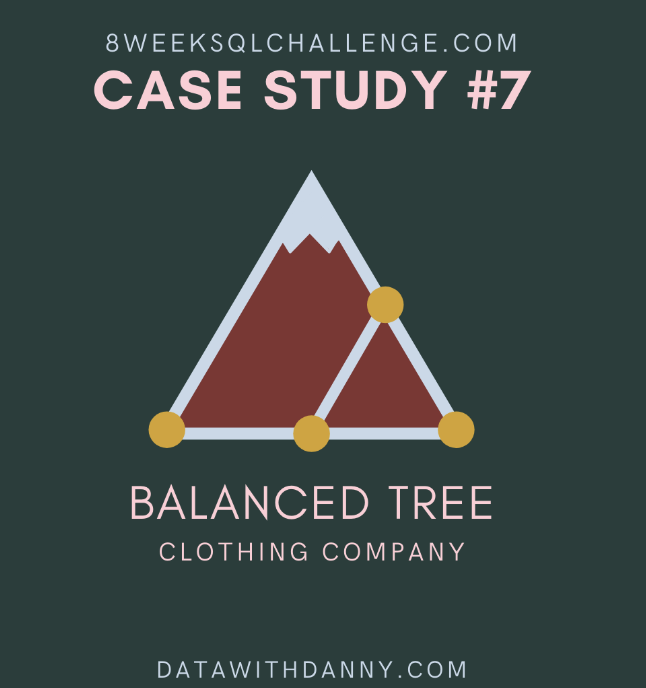

# Balanced Tree Clothing Company


<br>

### **Introduction**
Balanced Tree Clothing Company prides themselves on providing an optimised range of clothing and lifestyle wear for the modern adventurer!

Danny, the CEO of this trendy fashion company has asked you to assist the team’s merchandising teams analyse their sales performance and generate a basic financial report to share with the wider business.

<br>

### **Available Data**
For this case study there is a total of 4 datasets for this case study - however you will only need to utilise 2 main tables to solve all of the regular questions, and the additional 2 tables are used only for the bonus challenge question!

<br>

`Product Details`
* `balanced_tree.product_details` includes all information about the entire range that Balanced Clothing sells in their store.

|product_id|price|product_name|category_id|segment_id|style_id|category_name|segment_name|style_name|
|----|----|----|-----|-----|-----|----|----|-----|
|c4a632|13|Navy Oversized Jeans - Womens|1|3|7|Womens|Jeans|Navy Oversized|
|e83aa3|32|Black Straight Jeans - Womens|1|3|8|Womens|Jeans|Black Straight|
|e31d39|10|Cream Relaxed Jeans - Womens|1|3|9|Womens|Jeans|Cream Relaxed|
|d5e9a6|23|Khaki Suit Jacket - Womens|1|4|10|Womens|Jacket|Khaki Suit|
|72f5d4|19|Indigo Rain Jacket - Womens|1|4|11|Womens|Jacket|Indigo Rain|

<br>

`Product Sales`
* `balanced_tree.sales` contains product level information for all the transactions made for Balanced Tree including **quantity, price, percentage discount, member status, a transaction ID** and also the **transaction timestamp**.

|prod_id|qty|price|discount|member|txn_id|start_txn_time|
|----|----|----|----|----|----|-----|
|c4a632|4|13|17|true|54f307|2021-02-13 01:59:43.296|
|5d267b|4|40|17|true|54f307|2021-02-13 01:59:43.296|
|b9a74d|4|17|17|true|54f307|2021-02-13 01:59:43.296|
|2feb6b|2|29|17|true|54f307|2021-02-13 01:59:43.296|
|c4a632|5|13|21|true|26cc98|2021-01-19 01:39:00.346|

<br>

`Product Hierarcy & Product Price`
Thes tables are used only for the bonus question where we will use them to recreate the **balanced_tree.product_details table**.


- balanced_tree.product_hierarchy

|id|parent_id|level_text|level_name|
|-----|-----|-----|-----|
|1|null|Womens|Category|
|2|null|Mens|Category|
|3|1|Jeans|Segment|
|4|1|Jacket|Segment|
|5|2|Shirt|Segment|

<br>

- balanced_tree.product_prices

|id|product_id|price|
|----|----|----|
|7|c4a632|13|
|8|e83aa3|32|
|9|e31d39|10|
|10|d5e9a6|23|
|11|72f5d4|19|

---

<br>

### **Case Study Questions**
The following questions can be considered key business questions and metrics that the Balanced Tree team requires for their monthly reports.

Each question can be answered using a single query - but as you are writing the SQL to solve each individual problem, keep in mind how you would generate all of these metrics in a single SQL script which the Balanced Tree team can run each month.

<br>

#### `A. High Level Sales Analysis`

**1.** What was the total quantity sold for all products?
```sql
SELECT
  s.prod_id AS prod_id, pd.product_name,
  SUM(s.qty) AS product_sales_counts
FROM balanced_tree.sales AS s 
INNER JOIN balanced_tree.product_details AS pd 
  ON s.prod_id = pd.product_id
GROUP BY prod_id, product_name
ORDER BY product_sales_counts DESC;
```
|prod_id|product_name|product_sales_counts|
|-----|-----|-----|
|9ec847|Grey Fashion Jacket - Womens|3876|
|c4a632|Navy Oversized Jeans - Womens|3856|
|2a2353|Blue Polo Shirt - Mens|3819|
|5d267b|White Tee Shirt - Mens|3800|
|f084eb|Navy Solid Socks - Mens|3792|
|e83aa3|Black Straight Jeans - Womens|3786|
|2feb6b|Pink Fluro Polkadot Socks - Mens|3770|
|72f5d4|Indigo Rain Jacket - Womens|3757|
|d5e9a6|Khaki Suit Jacket - Womens|3752|
|e31d39|Cream Relaxed Jeans - Womens|3707|
|b9a74d|White Striped Socks - Mens|3655|
|c8d436|Teal Button Up Shirt - Mens|3646|


**2.** What is the total generated revenue for all products before discounts?
* Recall that discount value is a **%** 
```sql
WITH product_counts AS (
SELECT
  s.prod_id AS prod_id, pd.product_name,
  SUM(s.qty) AS product_sales_counts
FROM balanced_tree.sales AS s 
INNER JOIN balanced_tree.product_details AS pd 
  ON s.prod_id = pd.product_id
GROUP BY prod_id, product_name
ORDER BY product_sales_counts 
)
SELECT 
  pc.prod_id, pc.product_name,
  ROUND(pc.product_sales_counts * pp.price, 2) AS product_rev_pre_disc,
  CONCAT('$', ROUND(pc.product_sales_counts * pp.price, 2)) as product_rev_pre_disc_str,
  -- Window SUM for the total product sales (as requested by the prompt) 
  CONCAT('$', SUM(pc.product_sales_counts * pp.price) OVER()) AS total_product_rev_pre_disc
FROM product_counts AS pc 
INNER JOIN balanced_tree.product_prices AS pp 
  ON pc.prod_id = pp.product_id
ORDER BY product_rev_pre_disc DESC;
```
|prod_id|product_name|product_rev_pre_disc|product_rev_pre_disc_str|total_product_rev_pre_disc|
|----|----|-----|-----|------|
|2a2353|Blue Polo Shirt - Mens|217683.00|$217683.00|$1289453|
|9ec847|Grey Fashion Jacket - Womens|209304.00|$209304.00|$1289453|
|5d267b|White Tee Shirt - Mens|152000.00|$152000.00|$1289453|
|f084eb|Navy Solid Socks - Mens|136512.00|$136512.00|$1289453|
|e83aa3|Black Straight Jeans - Womens|121152.00|$121152.00|$1289453|
|2feb6b|Pink Fluro Polkadot Socks - Mens|109330.00|$109330.00|$1289453|
|d5e9a6|Khaki Suit Jacket - Womens|86296.00|$86296.00|$1289453|
|72f5d4|Indigo Rain Jacket - Womens|71383.00|$71383.00|$1289453|
|b9a74d|White Striped Socks - Mens|62135.00|$62135.00|$1289453|
|c4a632|Navy Oversized Jeans - Womens|50128.00|$50128.00|$1289453|
|e31d39|Cream Relaxed Jeans - Womens|37070.00|$37070.00|$1289453|
|c8d436|Teal Button Up Shirt - Mens|36460.00|$36460.00|$1289453|

* Now we can do a better just `CAST`'ing as a **Money** type 
```sql
WITH product_counts AS (
SELECT
  s.prod_id AS prod_id, pd.product_name,
  SUM(s.qty) AS product_sales_counts
FROM balanced_tree.sales AS s 
INNER JOIN balanced_tree.product_details AS pd 
  ON s.prod_id = pd.product_id
GROUP BY prod_id, product_name
ORDER BY product_sales_counts 
)
SELECT 
  pc.prod_id, pc.product_name,
  ROUND(pc.product_sales_counts * pp.price, 2) AS product_rev_pre_disc,
  CAST(ROUND(pc.product_sales_counts * pp.price, 2) AS money) as product_rev_pre_disc_str,
  -- Window SUM for the total product sales (as requested by the prompt )
  CAST(SUM(pc.product_sales_counts * pp.price) OVER() AS money) AS total_product_rev_pre_disc
FROM product_counts AS pc 
INNER JOIN balanced_tree.product_prices AS pp 
  ON pc.prod_id = pp.product_id
ORDER BY product_rev_pre_disc DESC;
```
|prod_id|product_name|product_rev_pre_disc|product_rev_pre_disc_str|total_product_rev_pre_disc|
|----|-----|-----|------|------|
|2a2353|Blue Polo Shirt - Mens|217683.00|$217,683.00|$1,289,453.00|
|9ec847|Grey Fashion Jacket - Womens|209304.00|$209,304.00|$1,289,453.00|
|5d267b|White Tee Shirt - Mens|152000.00|$152,000.00|$1,289,453.00|
|f084eb|Navy Solid Socks - Mens|136512.00|$136,512.00|$1,289,453.00|
|e83aa3|Black Straight Jeans - Womens|121152.00|$121,152.00|$1,289,453.00|
|2feb6b|Pink Fluro Polkadot Socks - Mens|109330.00|$109,330.00|$1,289,453.00|
|d5e9a6|Khaki Suit Jacket - Womens|86296.00|$86,296.00|$1,289,453.00|
|72f5d4|Indigo Rain Jacket - Womens|71383.00|$71,383.00|$1,289,453.00|
|b9a74d|White Striped Socks - Mens|62135.00|$62,135.00|$1,289,453.00|
|c4a632|Navy Oversized Jeans - Womens|50128.00|$50,128.00|$1,289,453.00|
|e31d39|Cream Relaxed Jeans - Womens|37070.00|$37,070.00|$1,289,453.00|
|c8d436|Teal Button Up Shirt - Mens|36460.00|$36,460.00|$1,289,453.00|

**3.** What was the total discount amount for all products?