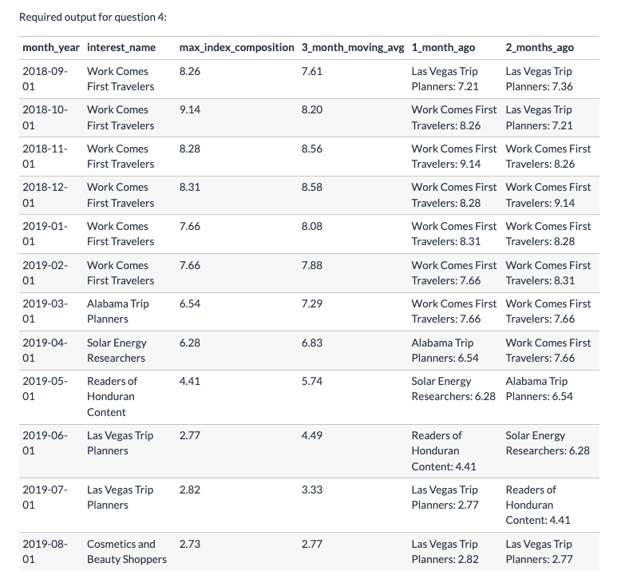

# Fresh Segments (Extract Max Value!)


### **Introduction** 🍊
Danny created `Fresh Segments`, a digital marketing agency that helps other businesses analyse trends in online ad click behaviour for their unique customer base.

Clients share their customer lists with the Fresh Segments team who then aggregate interest metrics and generate a single dataset worth of metrics for further analysis.

In particular - the composition and rankings for different interests are provided for each client showing the proportion of their customer list who interacted with online assets related to each interest for each month.

#### `Objective` 📔
Danny has asked for your assistance to analyse aggregated metrics for an example client and provide some high level insights about the customer list and their interests.


#### `Available Data / Tables` 🗄️
For this case study there is a total of 2 datasets which you will need to use to solve the questions.

**Interest Metrics**
* This table contains information about aggregated interest metrics for a specific major client of Fresh Segments which makes up a large proportion of their customer base.
* Each record in this table represents the performance of a specific `interest_id` based on the client’s customer base interest measured through clicks and interactions with specific targeted advertising content.


|_month|_year|month_year|interest_id|composition|index_value|ranking|percentile_ranking|
|----|----|-----|-----|-----|-----|-----|----|
|7	|2018	|07-2018	|32486	|11.89	|6.19	|1	|99.86|
|7	|2018	|07-2018	|6106	|9.93	|5.31	|2	|99.73|
|7	|2018	|07-2018	|18923	|10.85	|5.29	|3	|99.59|
|7	|2018	|07-2018	|6344	|10.32	|5.1	|4	|99.45|
|7	|2018	|07-2018	|100	|10.77	|5.04	|5	|99.31|
|7	|2018	|07-2018	|69	    |10.82	|5.03	|6	|99.18|
|7	|2018	|07-2018	|79	    |11.21	|4.97	|7	|99.04|
|7	|2018	|07-2018	|6111	|10.71	|4.83	|8	|98.9|
|7	|2018	|07-2018	|6214	|9.71	|4.83	|8	|98.9|
|7	|2018	|07-2018	|19422	|10.11	|4.81	|10	|98.63|

For example - let’s interpret the first row of the interest_metrics table together:
* In July 2018, the composition metric is 11.89, meaning that 11.89% of the client’s customer list interacted with the interest interest_id = 32486 - we can link interest_id to a separate mapping table to find the segment name called “Vacation Rental Accommodation Researchers”

The index_value is 6.19, means that the composition value is 6.19x the average composition value for all Fresh Segments clients’ customer for this particular interest in the month of July 2018.

The ranking and percentage_ranking relates to the order of index_value records in each month year.

**Interest Map**
* This mapping table links the interest_id with their relevant interest information. 
* You will need to join this table onto the previous interest_details table to obtain the interest_name as well as any details about the summary information.

|id|interest_name|interest_summary|created_at|last_modified|
|---|----|-----|----|-----|
1|Fitness Enthusiasts|Consumers using fitness tracking apps and websites.|2016-05-26 14:57:59	|2018-05-23 11:30:12|
|2|Gamers|Consumers researching game reviews and cheat codes.|2016-05-26 14:57:59|2018-05-23 11:30:12|
|3|Car Enthusiasts|Readers of automotive news and car reviews.|2016-05-26 14:57:59|2018-05-23 11:30:12|
|4|Luxury Retail Researchers|Consumers researching luxury product reviews and gift ideas|2016-05-26 14:57:59|2018-05-23 11:30:12|
|5|Brides & Wedding Planners|People researching wedding ideas and vendors.|2016-05-26 14:57:59|2018-05-23 11:30:12|
|6|Vacation Planners|Consumers reading reviews of vacation destinations and accommodations.|2016-05-26 14:57:59|2018-05-23 11:30:13|
|7|Motorcycle Enthusiasts|Readers of motorcycle news and reviews.|2016-05-26 14:57:59|2018-05-23 11:30:13|
|8|Business News Readers|Readers of online business news content.|2016-05-26 14:57:59|2018-05-23 11:30:12|
|12|Thrift Store Shoppers|Consumers shopping online for clothing at thrift stores and researching locations.|2016-05-26 14:57:59|2018-03-16 13:14:00|
|13|Advertising Professionals|People who read advertising industry news.|2016-05-26|14:57:59|2018-05-23 11:30:12|

---

<br>

## **Case Study Questions** :books:
The following questions can be considered key business questions that are required to be answered for the Fresh Segments team.

Most questions can be answered using a single query however some questions are more open ended and require additional thought and not just a coded solution!

<br>

### `A. Data Exploration and Cleansing` 🥾 :broom:
**1.** Update the **fresh_segments.interest_metrics** table by modifying the **month_year** column to be a date data type with the start of the month
```sql
-- Check Types
SELECT
  column_name, data_type
FROM information_schema.columns
WHERE table_name = 'interest_metrics' AND table_schema = 'fresh_segments';
```
|column_name|data_type|
|----|-----|
|_month|text|
|_year|text|
|month_year|text|
|interest_id|integer|
|composition|double precision|
|index_value|double precision|
|ranking|integer|
|percentile_ranking|double precision|

```sql
-- idea of the column mutation setting
SELECT
  TO_DATE(month_year, 'MM-YYYY'),
  month_year
FROM fresh_segments.interest_metrics
LIMIT 5;

-- Update 
UPDATE fresh_segments.interest_metrics
SET month_year = TO_DATE(month_year, 'MM-YYYY');

-- DML Required to update Schema
ALTER TABLE fresh_segments.interest_metrics
ALTER month_year TYPE DATE USING month_year::DATE;

-- Similarly call the information schema at the beginning of the question to validate the output and column being updated
```
|column_name|data_type|
|-----|-----|
|_month|text|
|_year|text|
|month_year|date|
|interest_id|integer|
|composition|double precision|
|index_value|double precision|
|ranking|integer|
|percentile_ranking|double precision|


<br>

**2.** What is count of records in the fresh_segments.interest_metrics for each month_year value sorted in chronological order (earliest to latest) with the null values appearing first?
```sql
SELECT
  DATE_PART('Month', month_year) AS Month_Extract,
  month_year AS month_column,
  COUNT(*) AS monthly_record_count
FROM fresh_segments.interest_metrics
GROUP BY Month_Extract, month_column
-- Can use or month_extract to group by months of different years
-- for comparisson which a normal desc on the month_column wouldn't allow
ORDER BY Month_Extract DESC;
```
|month_extract|month_column|monthly_record_count|
|-----|------|------|
|null|null|1194|
|12|2018-12-01|995|
|11|2018-11-01|928|
|10|2018-10-01|857|
|9|2018-09-01|780|
|8|2018-08-01|767|
|8|2019-08-01|1149|
|7|2019-07-01|864|
|7|2018-07-01|729|
|6|2019-06-01|824|
|5|2019-05-01|857|
|4|2019-04-01|1099|
|3|2019-03-01|1136|
|2|2019-02-01|1121|
|1|2019-01-01|973|

<br>

**3.** What do you think we should do with these null values in the fresh_segments.interest_metrics
* As our metrics look heavily involved in regards to time (see counts above), we can likely remove the null values from our data as there is not contextual or referential ways to impute the values.
* Looking at this in the context of the overall dataset and the business problem - it does not make too much sense to include these erroneous records into the analysis because we are going to be interested in the records only with a date specified!

**4.** How many interest_id values exist in the fresh_segments.interest_metrics table but not in the fresh_segments.interest_map table? What about the other way around?
```sql
SELECT
  COUNT(interest_metrics.interest_id) AS all_interest_metric,
  COUNT(interest_map.id) AS all_interest_map,
  COUNT(CASE WHEN interest_map.id IS NULL THEN interest_metrics.interest_id ELSE NULL END) AS not_in_map,
  COUNT(CASE WHEN interest_metrics.interest_id IS NULL THEN interest_map.id ELSE NULL END)  AS not_in_metrics
FROM fresh_segments.interest_metrics
FULL OUTER JOIN fresh_segments.interest_map
  ON interest_metrics.interest_id = interest_map.id;
```
|all_interest_metric|all_interest_map|not_in_map|not_in_metrics|
|----|----|----|----|
|1202|1209|0|7|

`Note`: We can also use an **anti-join** which is conceptually a little easier to understand here in terms of checking where there isn't any intersection on the shared id values 

```sql
-- Anti Join
SELECT 
(
  SELECT
    COUNT(id)
  FROM fresh_segments.interest_map AS i_map 
  WHERE NOT EXISTS (
    SELECT
      1
    FROM fresh_segments.interest_metrics AS i_metrics 
    WHERE i_metrics.interest_id = i_map.id
  ) 
) AS interest_map_id_count_unique,
(
  SELECT
    COUNT(interest_id)
  FROM fresh_segments.interest_metrics AS i_metrics
  WHERE NOT EXISTS (
    SELECT
      1
    FROM fresh_segments.interest_map AS i_map 
    WHERE i_map.id = i_metrics.interest_id
  ) 
) AS interest_metrics_id_count_unique
```
|interest_map_id_count_unique|interest_metrics_id_count_unique|
|----|----|
|7|0|

* What about the unique ID values though?
```sql
SELECT 
(
  SELECT
    ARRAY_AGG(DISTINCT i_map.id)
  FROM fresh_segments.interest_map AS i_map 
  WHERE NOT EXISTS (
    SELECT
      1
    FROM fresh_segments.interest_metrics AS i_metrics 
    WHERE i_metrics.interest_id = i_map.id
  ) 
) AS interest_map_id_count_unique,
(
  SELECT
    ARRAY_AGG(DISTINCT i_metrics.interest_id)
  FROM fresh_segments.interest_metrics AS i_metrics
  WHERE NOT EXISTS (
    SELECT
      1
    FROM fresh_segments.interest_map AS i_map 
    WHERE i_map.id = i_metrics.interest_id
  ) 
) AS interest_metrics_id_count_unique
```
|interest_map_id_count_unique|interest_metrics_id_count_unique|
|----|-----|
|[ 19598, 35964, 40185, 40186, 42010, 42400, 47789 ]|[ null ]|

<br>

**5.** Summarise the id values in the fresh_segments.interest_map by its total record count in this table
```sql
-- First part of query to look at all rows for each id 
SELECT
  id,
  COUNT(*) AS id_rows
FROM fresh_segments.interest_map
GROUP BY id 
ORDER BY id_rows DESC;
```
|id|id_rows|
|--|-----|
|10978|1|
|7546|1|
|51|1|
|45524|1|
|6062|1|

* On first impression it doesn't look like **interest_map** has any duplicate id values in the table
    - After grouping by the id and the rows found for each id, we can then pull another level of aggregation by grouping by the total_record aggregated value for each id to see how many ids share the same number of rows
    - Keep in mind that the `id_rows` didn't show any id greater than one particular row so would assume that the record_count should be the same for all ids
```sql
WITH interest_map_id_row_counts AS (
SELECT
  id,
  COUNT(*) AS id_rows
FROM fresh_segments.interest_map
GROUP BY id
),
record_counts AS (
SELECT
  -- group by the counts from previous query
  id_rows AS id_record_counts,
  COUNT(*) AS total_ids_w_shared_recourd_count
FROM interest_map_id_row_counts
GROUP BY id_record_counts
ORDER BY total_ids_w_shared_recourd_count DESC
)
SELECT * FROM record_counts;
```
|id_record_counts|total_ids_w_shared_recourd_count|
|---|----|
|1|1209|

<br>

**6.** What sort of table join should we perform for our analysis and why? Check your logic by checking the rows where interest_id = 21246 in your joined output and include all columns from fresh_segments.interest_metrics and all columns from fresh_segments.interest_map except from the id column.
```sql
WITH cte_join AS (
SELECT
  -- Can grab all columns with the .* usage for a join table output 
  interest_metrics.*,
  interest_map.interest_name,
  interest_map.interest_summary,
  interest_map.created_at,
  interest_map.last_modified
FROM fresh_segments.interest_metrics
INNER JOIN fresh_segments.interest_map
  ON interest_metrics.interest_id = interest_map.id
WHERE interest_metrics.month_year IS NOT NULL
)
SELECT * FROM cte_join
WHERE interest_id = 21246;
```

Since we know all of the records from the `interest_details` table exists in the `interest_map` and there are no duplicate records on the `id` column in the `fresh_segments.interest_map` - we can use either LEFT JOIN or INNER JOIN for the analysis, however it depends on the order of the tables specified in the join.

If we use the `fresh_segments.interest_metrics` as our base - we can use either join. However if we use the `fresh_segments.interest_map` table as the base, we must use INNER JOIN to remove all records in the metrics table which do not have a relevant interest_id value.
* Meaning there are some id values in the map which if performing a left join would be included that do not have any associative metric rows

Additionally - if you want to be as strict as possible - using an INNER JOIN is the best solution as you will also remove the missing `interest_id `values from the `fresh_segments.interest_metrics` table - but you will still need to deal with the single record which has a valid `interest_id` value.

<br>

**7.** Are there any records in your joined table where the month_year value is before the created_at value from the fresh_segments.interest_map table? Do you think these values are valid and why?
```sql
WITH cte_join AS (
SELECT
  -- Can grab all columns with the .* usage for a join table output 
  interest_metrics.*,
  interest_map.interest_name,
  interest_map.interest_summary,
  interest_map.created_at,
  interest_map.last_modified
FROM fresh_segments.interest_metrics
INNER JOIN fresh_segments.interest_map
  ON interest_metrics.interest_id = interest_map.id
WHERE interest_metrics.month_year IS NOT NULL
),
month_year_before_created_at AS (
SELECT 
  *
FROM cte_join
WHERE month_year < created_at
ORDER BY interest_id
)
SELECT COUNT(DISTINCT interest_id) FROM month_year_before_created_at;
```
|count|
|---|
|188|

So there are definitely rows which show this characteristic - however, when we think about this from a deeper perspective - all of our metrics look like they are created monthly!

Having the beginning of the month may just be a proxy for a summary version of all of our aggregated metrics throughout the month - so in this case we need to be wary that the `month_year` column might well be before our created_at column - **but it shouldn’t be from an earlier month!!**

* Let’s confirm this by comparing the truncatated beginning of month for each created_at value with the month_year column again:

```sql
-- Quick view of operation output prior to 
WITH cte_join AS (
SELECT
  -- Can grab all columns with the .* usage for a join table output 
  interest_metrics.*,
  interest_map.interest_name,
  interest_map.interest_summary,
  interest_map.created_at,
  interest_map.last_modified
FROM fresh_segments.interest_metrics
INNER JOIN fresh_segments.interest_map
  ON interest_metrics.interest_id = interest_map.id
WHERE interest_metrics.month_year IS NOT NULL
),
month_year_before_created_at AS (
SELECT 
  interest_id,
  month_year,
  created_at
FROM cte_join
WHERE month_year < created_at
ORDER BY interest_id
)
SELECT * FROM month_year_before_created_at LIMIT 5;
```
|interest_id|month_year|created_at|
|----|----|----|
|32701|2018-07-01|2018-07-06 14:35:03.000|
|32702|2018-07-01|2018-07-06 14:35:04.000|
|32703|2018-07-01|2018-07-06 14:35:04.000|
|32704|2018-07-01|2018-07-06 14:35:04.000|
|32705|2018-07-01|2018-07-06 14:35:04.000|

```sql
WITH cte_join AS (
SELECT
  -- Can grab all columns with the .* usage for a join table output 
  interest_metrics.*,
  interest_map.interest_name,
  interest_map.interest_summary,
  interest_map.created_at,
  interest_map.last_modified
FROM fresh_segments.interest_metrics
INNER JOIN fresh_segments.interest_map
  ON interest_metrics.interest_id = interest_map.id
WHERE interest_metrics.month_year IS NOT NULL
),
month_year_before_created_at AS (
SELECT 
  interest_id,
  month_year,
  created_at
FROM cte_join
WHERE month_year < created_at
ORDER BY interest_id
)
SELECT 
  *,
  DATE_TRUNC('month', created_at) AS created_at_month_trunc
FROM month_year_before_created_at LIMIT 5;
```
|interest_id|month_year|created_at|created_at_month_trunc|
|-----|----|----|----|
|32701|2018-07-01|2018-07-06 14:35:03.000|2018-07-01|
|32702|2018-07-01|2018-07-06 14:35:04.000|2018-07-01|
|32703|2018-07-01|2018-07-06 14:35:04.000|2018-07-01|
|32704|2018-07-01|2018-07-06 14:35:04.000|2018-07-01|
|32705|2018-07-01|2018-07-06 14:35:04.000|2018-07-01|

* We can now with the `date_trunc` return setting the `created_at` column to the beginning of the month (see fourth column above), check if the same condition **month_year < created_at_month_trunc** with the new output yields any rows

```sql
WITH cte_join AS (
SELECT
  -- Can grab all columns with the .* usage for a join table output 
  interest_metrics.*,
  interest_map.interest_name,
  interest_map.interest_summary,
  interest_map.created_at,
  interest_map.last_modified
FROM fresh_segments.interest_metrics
INNER JOIN fresh_segments.interest_map
  ON interest_metrics.interest_id = interest_map.id
WHERE interest_metrics.month_year IS NOT NULL
),
month_year_before_created_at AS (
SELECT 
  interest_id,
  month_year,
  created_at
FROM cte_join
WHERE month_year < created_at
ORDER BY interest_id
),
created_at_trunc AS (
SELECT 
  *,
  DATE_TRUNC('month', created_at) AS created_at_month_trunc
FROM month_year_before_created_at
)
SELECT 
  COUNT(*) 
FROM created_at_trunc 
WHERE month_year < created_at_month_trunc
```
|count|
|---|
|0|

* After setting the `created_at` column to the months' beginning date, we see there is now predating value from the `interest_metrics` table before the id declaration in `interest_map`
    - We can see that there are no rows for this query - so all of our data points seem to be valid for our case study!

<br><br>


### `B. Interest Analysis` 💰 🥼
**1.** Which interests have been present in all month_year dates in our dataset?
```sql
-- What's our distinct month_year values and the count
SELECT 
  DISTINCT month_year
FROM fresh_segments.interest_metrics
ORDER BY month_year;

-- Count distinct
SELECT 
  COUNT(DISTINCT month_year) 
FROM 
fresh_segments.interest_metrics 
WHERE month_year IS NOT NULL;
```
|month_year|
|---|
|2018-07-01|
|2018-08-01|
|2018-09-01|
|2018-10-01|
|2018-11-01|
|2018-12-01|
|2019-01-01|
|2019-02-01|
|2019-03-01|
|2019-04-01|
|2019-05-01|
|2019-06-01|
|2019-07-01|
|2019-08-01|
|null|

|count|
|---|
|14|

* Alright, so my just first thought approach and allows us to use some things we haven't in awhile (Window partitions and moving sum)
```sql
SELECT
  DISTINCT interest_id, month_year,
  COUNT(*) AS interest_month_val_present
FROM fresh_segments.interest_metrics
WHERE month_year IS NOT NULL AND interest_id IS NOT NULL
AND interest_id = 5
GROUP BY interest_id, month_year
ORDER BY month_year;
```
|interest_id|month_year|interest_month_val_present|
|-----|-----|-----|
|5|2018-07-01|1|
|5|2018-08-01|1|
|5|2018-09-01|1|

* We used just a subset above but this particular interest_id had 14 rows which matches the total unique `month_year` values
* Using the `DISTINCT` clause here let's us get each distinct combo of an interest_id and month_year, using the `COUNT` simply returns a default for if the interest_id and month_year exist as we'll be summing that parition next
  - We could do a standard GROUP BY aggregate with the interest id but will just have a bit more fun here and practice

```sql
WITH interest_month_records AS (
SELECT
  DISTINCT interest_id, month_year,
  COUNT(*) AS interest_month_val_present
FROM fresh_segments.interest_metrics
WHERE month_year IS NOT NULL AND interest_id IS NOT NULL
AND interest_id = 5
GROUP BY interest_id, month_year
ORDER BY month_year
),
-- We could just do a standard GROUP BY aggregate count here too
interest_id_total_months AS (
SELECT
  DISTINCT interest_id,
  SUM(interest_month_val_present) OVER (
    PARTITION BY interest_id
  ) AS interest_id_total_months
FROM interest_month_records
)
SELECT * FROM interest_id_total_months;
```
|interest_id|interest_id_total_months|
|----|----|
|5|14|

* As we saw above, **14** is the unique count of non-null `month_year` column in total so this particular interest_id
* With the information we could gather on all **interest_ids**, we could subsequently get the total unique id counts which was present over the 14 month period of data

```sql
WITH interest_month_records AS (
SELECT
  DISTINCT interest_id, month_year,
  COUNT(*) AS interest_month_val_present
FROM fresh_segments.interest_metrics
WHERE month_year IS NOT NULL AND interest_id IS NOT NULL
GROUP BY interest_id, month_year
ORDER BY month_year
),
-- We could just do a standard GROUP BY aggregate count here too
interest_id_total_months AS (
SELECT
  DISTINCT interest_id,
  -- Each value here is just one, interesting to see the total still available after the DISTINCT call 
  SUM(interest_month_val_present) OVER (
    PARTITION BY interest_id
  ) AS interest_id_total_months
FROM interest_month_records
)
-- Now we can look at how many unique interest_ids were seen over the 14 month period
SELECT 
  interest_id_total_months AS total_months,
  COUNT(interest_id) AS interest_id_counts
FROM interest_id_total_months
GROUP BY total_months
ORDER BY total_months DESC;
```
|total_months|interest_id_counts|
|----|-----|
|14|480|
|13|82|
|12|65|
|11|94|
|10|86|
|9|95|
|8|67|
|7|90|
|6|33|
|5|38|
|4|32|
|3|15|
|2|12|
|1|13|

<br>

**2.** Using this same total_months measure - calculate the cumulative percentage of all records starting at 14 months - which total_months value passes the 90% cumulative percentage value?
* We can use a rows window sum to get a running total and then use that value dividied by the total window value for the same column to get a running cumulative percentage
```sql
WITH interest_month_records AS (
SELECT
  DISTINCT interest_id, month_year,
  COUNT(*) AS interest_month_val_present
FROM fresh_segments.interest_metrics
WHERE month_year IS NOT NULL AND interest_id IS NOT NULL
GROUP BY interest_id, month_year
ORDER BY month_year
),
-- We could just do a standard GROUP BY aggregate count here too
interest_id_total_months AS (
SELECT
  DISTINCT interest_id,
  -- Each value here is just one, interesting to see the total still available after the DISTINCT call 
  SUM(interest_month_val_present) OVER (
    PARTITION BY interest_id
  ) AS interest_id_total_months
FROM interest_month_records
),
-- 1 more level for cumulative percentages
month_total_distinct_ids_count AS (
SELECT 
  interest_id_total_months AS total_months,
  COUNT(interest_id) AS interest_id_counts
FROM interest_id_total_months
GROUP BY total_months
ORDER BY total_months DESC
)
SELECT
  *,
  -- Already ordered in total_months order
  SUM(interest_id_counts) OVER(
    ROWS BETWEEN UNBOUNDED PRECEDING AND CURRENT ROW
  ) AS running_total,
  -- calculate the running_total as a cumulative percentage
  ROUND(
  100 * SUM(interest_id_counts) OVER(
      ROWS BETWEEN UNBOUNDED PRECEDING AND CURRENT ROW
    )::NUMERIC / SUM(interest_id_counts) OVER()
    , 2) AS cumulative_percentage
FROM month_total_distinct_ids_count;
```
|total_months|interest_id_counts|running_total|cumulative_percentage|
|-----|------|------|------|
|14|480|480|39.93|
|13|82|562|46.76|
|12|65|627|52.16|
|11|94|721|59.98|
|10|86|807|67.14|
|9|95|902|75.04|
|8|67|969|80.62|
|7|90|1059|88.10|
|6|33|1092|90.85|
|5|38|1130|94.01|
|4|32|1162|96.67|
|3|15|1177|97.92|
|2|12|1189|98.92|
|1|13|1202|100.00|

<br>

**3.** If we were to remove all **interest_id** values which are lower than the **total_months** value we found in the previous question - how many total data points would we be removing?
* In reference to the value of interest `(which total_months value passes the 90% cumulative percentage value?)` from the question above
  - By the fifth month total count we had accumulated more than 90% of the total unique interest_ids. This will be our starting point
* Now the way I'm reading this as the value of 6 total months being the cutoff point and any interest_id within the 5 total months or lower counts from the table above would have all their rows removed.
* So we can use the similar base query here as we can simply multiply the total_months by the interest_id counts to get the rows to remove at each level and then cumulatively get that sum

```sql
WITH interest_month_records AS (
SELECT
  DISTINCT interest_id, month_year,
  COUNT(*) AS interest_month_val_present
FROM fresh_segments.interest_metrics
WHERE month_year IS NOT NULL AND interest_id IS NOT NULL
GROUP BY interest_id, month_year
ORDER BY month_year
),
-- We could just do a standard GROUP BY aggregate count here too
interest_id_total_months AS (
SELECT
  DISTINCT interest_id,
  -- Each value here is just one, interesting to see the total within window still available after the DISTINCT call 
  SUM(interest_month_val_present) OVER (
    PARTITION BY interest_id
  ) AS interest_id_total_months
FROM interest_month_records
),
-- 1 more level for cumulative percentages
month_total_distinct_ids_count AS (
SELECT 
  interest_id_total_months AS total_months,
  COUNT(interest_id) AS interest_id_counts
FROM interest_id_total_months
WHERE interest_id_total_months <= 5 -- for question #3 
GROUP BY total_months
ORDER BY total_months DESC
),
rows_level_data_points_mock_remove AS (
SELECT 
  *,
  total_months * interest_id_counts AS data_rows_removed_from_level,
  SUM(total_months * interest_id_counts) OVER() AS total_rows_removed
FROM month_total_distinct_ids_count
)
SELECT * FROM rows_level_data_points_mock_remove;
```
|total_months|interest_id_counts|data_rows_removed_from_level|total_rows_removed|
|------|------|------|------|
|5|38|190|400|
|4|32|128|400|
|3|15|45|400|
|2|12|24|400|
|1|13|13|400|

<br>

**4.** Does this decision make sense to remove these data points from a business perspective? Use an example where there are all 14 months present to a removed interest example for your arguments - think about what it means to have less months present from a segment perspective.

- This is a business specific question where you have to think about what the data actually means - in our example any record which has less than 6 months worth of data might be an interest which was recently introduced, or it has missing data across multiple months (inconsistent data)

* These are both solid reasons to exclude them from the analysis - however there should be a bit more analysis performed on these “rare” records just in case they actually provide some insight into the introduction of new interests at different points in time for the analysis.

* As with nearly all things in data analytics and problem solving in general - there is no consensus on whether we should remove these records or not, especially without fully understanding the business problem in question!

<br>

**5.** If we include all of our interests regardless of their counts - how many unique interests are there for each month?

* Ok so just to get an idea here, the two queries resulted in 729 (one was for the unique rows and group by aggregate count - was never more than 1 so each grouped by count)
  - Meaning that every map_id/interst_id is only ever one row per month
```sql
SELECT
  map.id AS map_id, map.interest_name AS name, metrics.interest_id AS metrics_id, metrics.month_year,
  COUNT(*) AS unique_month_interests
FROM fresh_segments.interest_metrics AS metrics 
INNER JOIN fresh_segments.interest_map AS map 
  ON metrics.interest_id = map.id
WHERE metrics.month_year = '2018-07-01'
GROUP BY map_id, name, metrics_id, metrics.month_year
ORDER BY  unique_month_interests DESC;
```
|map_id|name|metrics_id|month_year|unique_month_interests|
|----|----|-----|---|----|
|10008|Japanese Luxury Car Enthusiasts|10008|2018-07-01|1|
|50|Discount Big Box Shoppers|50|2018-07-01|1|
|6230|Vegans|6230|2018-07-01|1|
|5907|Budget Small Business Researchers|5907|2018-07-01|1|
|46|Job Seekers|46|2018-07-01|1|

```sql
SELECT COUNT(*) FROM fresh_segments.interest_metrics WHERE month_year = '2018-07-01';
```
|count|
|---|
|729|

* Now we can do just a straight forward check for names/ids for the unique interest per month
```sql
-- If we include all of our interests regardless of their counts - how many unique interests are there for each month?
WITH months_data_joined AS (
SELECT
  metrics.month_year AS metric_mth_year,
  map.interest_name AS map_name,
  map.id AS map_id,
  metrics.interest_id AS metrics_id
FROM fresh_segments.interest_metrics AS metrics 
INNER JOIN fresh_segments.interest_map AS map 
  ON metrics.interest_id = map.id
WHERE metrics.month_year IS NOT NULL
ORDER BY metric_mth_year
)
SELECT
  metric_mth_year,
  COUNT(DISTINCT map_name) AS month_unique_interests
FROM months_data_joined
GROUP BY metric_mth_year
ORDER BY month_unique_interests DESC;
```
|metric_mth_year|month_unique_interests|
|----|----|
|2019-08-01|1148|
|2019-03-01|1135|
|2019-02-01|1120|
|2019-04-01|1098|
|2018-12-01|995|
|2019-01-01|973|
|2018-11-01|928|
|2019-07-01|864|
|2019-05-01|857|
|2018-10-01|857|
|2019-06-01|824|
|2018-09-01|780|
|2018-08-01|767|
|2018-07-01|729|

<br><br>

### **`C. Segment Analysis`**
**1.** Using the complete dataset - which are the top 10 and bottom 10 interests which have the largest composition values in any month_year? Only use the maximum composition value for each interest but you must keep the corresponding month_year
```SQL
-- Let's see if we can use the ranking column for one month for max/min composition values
SELECT 
  interest_id, month_year, composition, ranking, percentile_ranking
FROM fresh_segments.interest_metrics
WHERE month_year = '2018-07-01'
ORDER BY ranking
LIMIT 3;
```
|interest_id|month_year|composition|ranking|percentile_ranking|
|----|----|-----|-----|----|
|32486|2018-07-01|11.89|1|99.86|
|6106|2018-07-01|9.93|2|99.73|
|18923|2018-07-01|10.85|3|99.59|

* So it doesn't look like we do anything to special here but we can create a custom output with the segments and a ranking for the the `highest` and `lowest` segments
  - Notice how the CTE is able to scope first CTE in Union reference for segments
```sql
WITH top_composition_interests AS (
SELECT
  interest_id,
  month_year,
  composition,
  'Highest' AS composition_segment
FROM fresh_segments.interest_metrics
ORDER BY composition DESC 
LIMIT 10
),
lowest_compositions AS (
SELECT
  interest_id,
  month_year,
  composition,
  'Lowest' AS composition_segment
FROM fresh_segments.interest_metrics
ORDER BY composition  
LIMIT 10
),
segments AS (
SELECT * FROM top_composition_interests
UNION
SELECT * FROM lowest_compositions
)
SELECT * FROM segments ORDER BY composition DESC;
```
|interest_id|month_year|composition|composition_segment|
|-----|------|-----|------|
|21057|2018-12-01|21.2|Highest|
|21057|2018-10-01|20.28|Highest|
|21057|2018-11-01|19.45|Highest|
|21057|2019-01-01|18.99|Highest|
|6284|2018-07-01|18.82|Highest|
|21057|2019-02-01|18.39|Highest|
|21057|2018-09-01|18.18|Highest|
|39|2018-07-01|17.44|Highest|
|77|2018-07-01|17.19|Highest|
|12133|2018-10-01|15.15|Highest|
|34645|2019-04-01|1.52|Lowest|
|4918|2019-05-01|1.52|Lowest|
|44449|2019-04-01|1.52|Lowest|
|16198|2019-03-01|1.52|Lowest|
|17274|2018-08-01|1.52|Lowest|
|20768|2019-05-01|1.52|Lowest|
|34083|2019-06-01|1.52|Lowest|
|39336|2019-05-01|1.52|Lowest|
|35742|2019-06-01|1.52|Lowest|
|45524|2019-05-01|1.51|Lowest|

```sql
WITH top_composition_interests AS (
SELECT
  interest_id,
  month_year,
  composition,
  'Highest' AS composition_segment
FROM fresh_segments.interest_metrics
WHERE month_year IS NOT NULL
ORDER BY composition DESC 
LIMIT 10
),
lowest_compositions AS (
SELECT
  interest_id,
  month_year,
  composition,
  'Lowest' AS composition_segment
FROM fresh_segments.interest_metrics
WHERE month_year IS NOT NULL
ORDER BY composition  
LIMIT 10
),
segments AS (
SELECT * FROM top_composition_interests
UNION
SELECT * FROM lowest_compositions
)
SELECT 
  *,
  CASE
    WHEN composition_segment = 'Highest'
      THEN 
      DENSE_RANK() OVER(
        PARTITION BY composition_segment
        ORDER BY composition DESC
      )
    WHEN composition_segment = 'Lowest'
      THEN
      DENSE_RANK() OVER(
        PARTITION BY composition_segment
        ORDER BY composition
      )
  END AS segment_ranking
FROM segments
ORDER BY composition_segment, segment_ranking
```
|interest_id|month_year|composition|composition_segment|segment_ranking|
|----|-----|------|------|-----|
|21057|2018-12-01|21.2|Highest|1|
|21057|2018-10-01|20.28|Highest|2|
|21057|2018-11-01|19.45|Highest|3|
|21057|2019-01-01|18.99|Highest|4|
|6284|2018-07-01|18.82|Highest|5|
|21057|2019-02-01|18.39|Highest|6|
|21057|2018-09-01|18.18|Highest|7|
|39|2018-07-01|17.44|Highest|8|
|77|2018-07-01|17.19|Highest|9|
|12133|2018-10-01|15.15|Highest|10|
|45524|2019-05-01|1.51|Lowest|1|
|34645|2019-04-01|1.52|Lowest|2|
|35742|2019-06-01|1.52|Lowest|2|
|44449|2019-04-01|1.52|Lowest|2|
|17274|2018-08-01|1.52|Lowest|2|
|16198|2019-03-01|1.52|Lowest|2|
|4918|2019-05-01|1.52|Lowest|2|
|20768|2019-05-01|1.52|Lowest|2|
|34083|2019-06-01|1.52|Lowest|2|
|39336|2019-05-01|1.52|Lowest|2|

<br>

* **`W/Unique Non Repeating InterestID Values`**
  - Only use the **maximum composition value for each interest** but you must keep the corresponding month_year : `Question Revision for New Query Output`
  - As the above output shows, the interest_id is repeating in instances and the discord channel details the uniqueness of the interest_id values for high/low values and non-repeating values for the interest in a singular (one potential high and one potential low for our top/bottom 10 counts)
  - This means we'll need to rank the **interest_id** in their own `window / partition` then order by the composition of the top/bottom value for each in a standard DESC/ASC ordering style

```sql
WITH ranked_composition_values AS (
SELECT
  interest_id,
  month_year,
  composition,
  -- As we're only taking a top/bottom value per interest_id value 
  -- (don't want repeating interest_id values we need to give each composition a ranking regardless if they're tied)
  ROW_NUMBER() OVER(
    PARTITION BY interest_id
    ORDER BY composition DESC
  ) AS id_composition_rankings
FROM fresh_segments.interest_metrics
WHERE month_year IS NOT NULL
ORDER BY interest_id, id_composition_rankings 
),
top_bottom_intid_values AS (
SELECT
  interest_id,
  MIN(id_composition_rankings) AS top_join_value,
  MAX(id_composition_rankings) AS bottom_join_value
FROM ranked_composition_values
GROUP BY interest_id
)
SELECT
  cte_1.interest_id,
  cte_1.month_year,
  cte_1.composition,
  cte_1.id_composition_rankings
FROM top_bottom_intid_values AS cte_2
INNER JOIN ranked_composition_values AS cte_1
  ON cte_2.interest_id = cte_1.interest_id
  AND (cte_2.top_join_value = cte_1.id_composition_rankings OR cte_2.bottom_join_value = cte_1.id_composition_rankings)
ORDER BY cte_1.interest_id, cte_1.id_composition_rankings
LIMIT 10
```
* Output here is the top and bottom composition value for each `interest_id`

|interest_id|month_year|composition|id_composition_rankings|
|----|----|-----|-----|
|1|2018-07-01|7.02|1|
|1|2019-05-01|1.68|12|
|2|2019-02-01|3.09|1|
|2|2018-07-01|1.81|11|
|3|2018-07-01|6.14|1|
|3|2018-12-01|1.73|10|
|4|2018-07-01|13.97|1|
|4|2019-05-01|3.43|14|
|5|2018-07-01|10.82|1|
|5|2019-05-01|1.78|14|

* Multi-level join here allows us to use the partition rankings for the composition value to extract the highest and lowest values for each, we can now get a more diverse look at the top/bottom composition values
```sql
WITH ranked_composition_values AS (
SELECT
  interest_id,
  month_year,
  composition,
  -- As we're only taking a top/bottom value per interest_id value 
  -- (don't want repeating interest_id values we need to give each composition a ranking regardless if they're tied)
  ROW_NUMBER() OVER(
    PARTITION BY interest_id
    ORDER BY composition DESC
  ) AS id_composition_rankings
FROM fresh_segments.interest_metrics
WHERE month_year IS NOT NULL
ORDER BY interest_id, id_composition_rankings 
),
top_bottom_intid_values AS (
SELECT
  interest_id,
  MIN(id_composition_rankings) AS top_join_value,
  MAX(id_composition_rankings) AS bottom_join_value
FROM ranked_composition_values
GROUP BY interest_id
),
joined_ctes AS (
SELECT
  cte_1.interest_id,
  cte_1.month_year,
  cte_1.composition,
  cte_1.id_composition_rankings
FROM top_bottom_intid_values AS cte_2
INNER JOIN ranked_composition_values AS cte_1
  ON cte_2.interest_id = cte_1.interest_id
  AND (cte_2.top_join_value = cte_1.id_composition_rankings OR cte_2.bottom_join_value = cte_1.id_composition_rankings)
ORDER BY cte_1.interest_id, cte_1.id_composition_rankings
),
unioned_top_bottom AS (
-- Each query below to be unioned (for top/bottom 10 w/limit must be passed in parentheses to be unioned)
(SELECT
  interest_id, month_year, composition, 
  'Higher Segment' AS composition_segment
FROM joined_ctes
ORDER BY composition DESC 
LIMIT 10)
UNION ALL
(SELECT
  interest_id, month_year, composition, 
  'Lower Segment' AS composition_segment
FROM joined_ctes
ORDER BY composition  
LIMIT 10)
)
SELECT 
  union_cte.interest_id, map.interest_name, union_cte.month_year,
  union_cte.composition, union_cte.composition_segment
FROM unioned_top_bottom AS union_cte
INNER JOIN fresh_segments.interest_map AS map 
  ON union_cte.interest_id = map.id
ORDER BY union_cte.composition_segment, union_cte.composition DESC;
```
|interest_id|interest_name|month_year|composition|composition_segment|
|----|-----|-----|----|----|
|21057|Work Comes First Travelers|2018-12-01|21.2|Higher Segment|
|6284|Gym Equipment Owners|2018-07-01|18.82|Higher Segment|
|39|Furniture Shoppers|2018-07-01|17.44|Higher Segment|
|77|Luxury Retail Shoppers|2018-07-01|17.19|Higher Segment|
|12133|Luxury Boutique Hotel Researchers|2018-10-01|15.15|Higher Segment|
|5969|Luxury Bedding Shoppers|2018-12-01|15.05|Higher Segment|
|171|Shoe Shoppers|2018-07-01|14.91|Higher Segment|
|4898|Cosmetics and Beauty Shoppers|2018-07-01|14.23|Higher Segment|
|6286|Luxury Hotel Guests|2018-07-01|14.1|Higher Segment|
|4|Luxury Retail Researchers|2018-07-01|13.97|Higher Segment|
|16198|World of Warcraft Enthusiasts|2019-03-01|1.52|Lower Segment|
|4918|Gastrointestinal Researchers|2019-05-01|1.52|Lower Segment|
|17274|Readers of Jamaican Content|2018-08-01|1.52|Lower Segment|
|35742|Disney Fans|2019-06-01|1.52|Lower Segment|
|20768|Beer Aficionados|2019-05-01|1.52|Lower Segment|
|34083|New York Giants Fans|2019-06-01|1.52|Lower Segment|
|34645|Minnesota Vikings Fans|2019-04-01|1.52|Lower Segment|
|39336|Philadelphia 76ers Fans|2019-05-01|1.52|Lower Segment|
|44449|United Nations Donors|2019-04-01|1.52|Lower Segment|
|45524|Mowing Equipment Shoppers|2019-05-01|1.51|Lower Segment|

* If we wanted to go one layer deeper we could rank the segment values in a window function to rank the segment values but will leave as is for now

<br>

**2.** Which 5 interests had the lowest average ranking value?
```sql
SELECT
  metrics.interest_id, map.interest_name,
  ROUND(AVG(ranking), 2) AS interest_avg_ranking,
  COUNT(*) AS interest_record_count
FROM fresh_segments.interest_metrics AS metrics 
INNER JOIN fresh_segments.interest_map AS map 
  ON map.id = metrics.interest_id
GROUP BY interest_id, interest_name
ORDER BY interest_avg_ranking
LIMIT 5;
```
|interest_id|interest_name|interest_avg_ranking|interest_record_count|
|-----|----|-----|-----|
|41548|Winter Apparel Shoppers|1.00|9|
|42203|Fitness Activity Tracker Users|4.11|9|
|115|Men's Shoe Shoppers|5.93|14|
|48154|Elite Cycling Gear Shoppers|7.80|5|
|171|Shoe Shoppers|9.36|14|

<br>

**3.** Which 5 interests had the largest standard deviation in their percentile_ranking value?
* Ranking by the aggregate stddev function with that interest id having at least 5 records from our metrics gathering
```sql
WITH std_percranking_ranks AS (
SELECT
  map.id, map.interest_name,
  STDDEV(metrics.percentile_ranking)::NUMERIC(10, 2) AS interest_stddev,
  RANK() OVER(
  -- This resulting rank is the grouped by percentile ranking for each interest_id (essentiall just the above aggregate)
    ORDER BY STDDEV(metrics.percentile_ranking)::NUMERIC(10, 2) DESC
  ) AS interest_id_stddev_rankings,
  COUNT(*) AS interest_metrics_records,
  MAX(metrics.percentile_ranking) AS max_percentile,
  MIN(metrics.percentile_ranking) AS min_percentile,
  ROUND(AVG(metrics.percentile_ranking)::NUMERIC, 2) AS avg_percentile
FROM fresh_segments.interest_metrics AS metrics 
INNER JOIN fresh_segments.interest_map AS map 
  ON metrics.interest_id = map.id
WHERE metrics.month_year IS NOT NULL 
-- set condition to only rank interest_id with at least 5 readings in the metrics table
AND map.id IN 
  (
    SELECT interest_id 
    FROM fresh_segments.interest_metrics 
    GROUP BY interest_id 
    HAVING COUNT(interest_id) >= 5
  )
GROUP BY map.id, map.interest_name
)
SELECT * 
FROM std_percranking_ranks 
WHERE interest_id_stddev_rankings <= 5
ORDER BY interest_id_stddev_rankings;
```
|id|interest_name|interest_stddev|interest_id_stddev_rankings|interest_metrics_records|max_percentile|min_percentile|avg_percentile|
|---|----|----|----|----|---|----|-----|
|131|Android Fans|30.72|1|5|75.03|4.84|20.25|
|150|TV Junkies|30.36|2|5|93.28|10.01|45.64|
|23|Techies|30.18|3|6|86.69|7.92|28.08|
|20764|Entertainment Industry Decision Makers|28.97|4|6|86.15|11.23|27.62|
|38992|Oregon Trip Planners|28.32|5|10|82.44|2.2|39.73|

<br>

**4.** For the 5 interests found in the previous question - what was minimum and maximum percentile_ranking values for each interest and its corresponding year_month value? Can you describe what is happening for these 5 interests?
* We're gonna use just a handful of the ids and calculate total for each interest id as well as percentage differences from percentile_ranks against the minimum and maximum percentile for that interest
```sql
WITH percentile_rankings AS (
SELECT  
  map.id, map.interest_name, metrics.month_year, metrics.composition, metrics.ranking AS data_set_ranking, metrics.percentile_ranking,
  RANK() OVER (
    PARTITION BY map.id
    ORDER BY metrics.percentile_ranking DESC
  ) AS id_pr_rank,
  RANK() OVER (
    PARTITION BY map.id
    ORDER BY metrics.composition DESC
  ) AS id_comp_rank,
  MAX(metrics.percentile_ranking) OVER (
    PARTITION BY map.id
  ) AS id_max_prank,
  MIN(metrics.percentile_ranking) OVER (
    PARTITION BY map.id
  ) AS id_min_prank
FROM fresh_segments.interest_metrics AS metrics 
INNER JOIN fresh_segments.interest_map AS map 
  ON metrics.interest_id = map.id
WHERE metrics.month_year IS NOT NULL
-- AND metrics.interest_id IN (131,150,23,20764,38992)
AND metrics.interest_id in (131, 23)
ORDER BY map.id, id_pr_rank
)
SELECT 
  *, 
  -- https://www.calculatorsoup.com/calculators/algebra/percent-difference-calculator.php
  CONCAT(
    ROUND(CAST((ABS(percentile_ranking - id_max_prank) / ((percentile_ranking + id_max_prank) / 2)) * 100 AS NUMERIC), 2)
  , '%') AS prank_diff_perc_max,
  CONCAT(
    ROUND(CAST((ABS(percentile_ranking - id_min_prank) / ((percentile_ranking + id_min_prank) / 2)) * 100 AS NUMERIC), 2)
  , '%') AS prank_diff_perc_min
FROM percentile_rankings;
```
|id|interest_name|month_year|composition|data_set_ranking|percentile_ranking|id_pr_rank|id_comp_rank|id_max_prank|id_min_prank|prank_diff_perc_max|prank_diff_perc_min|
|----|-----|---|----|----|-----|-----|----|----|-----|-----|------|
|23|Techies|2018-07-01|5.41|97|86.69|1|1|86.69|7.92|0.00%|166.52%|
|23|Techies|2018-08-01|1.9|530|30.9|2|3|86.69|7.92|94.89%|118.39%|
|23|Techies|2018-09-01|1.6|594|23.85|3|6|86.69|7.92|113.70%|100.28%|
|23|Techies|2019-03-01|1.91|1026|9.68|4|2|86.69|7.92|159.82%|20.00%|
|23|Techies|2019-02-01|1.89|1015|9.46|5|5|86.69|7.92|160.64%|17.72%|
|23|Techies|2019-08-01|1.9|1058|7.92|6|3|86.69|7.92|166.52%|0.00%|
|131|Android Fans|2018-07-01|5.09|182|75.03|1|1|75.03|4.84|0.00%|175.76%|
|131|Android Fans|2018-08-01|1.77|684|10.82|2|4|75.03|4.84|149.59%|76.37%|
|131|Android Fans|2019-02-01|1.85|1058|5.62|3|3|75.03|4.84|172.13%|14.91%|
|131|Android Fans|2019-08-01|1.91|1092|4.96|4|2|75.03|4.84|175.20%|2.45%|
|131|Android Fans|2019-03-01|1.72|1081|4.84|5|5|75.03|4.84|175.76%|0.00%|

<br><br>

### **`D. Index Analysis`**
* The `index_value` is a measure which can be used to reverse calculate the average composition for Fresh Segments’ clients.

Average composition can be calculated by dividing the composition column by the index_value column rounded to 2 decimal places.

**1.** What is the top 10 interests by the average composition for each month?
```sql
SELECT COUNT(*) FROM fresh_segments.interest_metrics WHERE month_year = '2018-07-01';
```
|count|
|---|
|729|

* As a reminder here, we'll need to rank by the **average composition** (composition / index_value) in each month. Above is just a quick idea of how many unique interests metrics there was for one month. We only want to return the top 10 for any particular month we rank by 

```sql
WITH month_avg_interest_composition_rankings AS (
SELECT
  map.id, map.interest_name, metrics.month_year,
  ROUND(CAST(metrics.composition / metrics.index_value AS NUMERIC), 2) AS int_idx_avgcomp,
  RANK() OVER (
    PARTITION BY metrics.month_year
    ORDER BY ROUND(CAST(metrics.composition / metrics.index_value AS NUMERIC), 2) DESC
  ) AS month_avg_comp_rank
FROM fresh_segments.interest_metrics AS metrics 
INNER JOIN fresh_segments.interest_map AS map 
  ON metrics.interest_id = map.id 
ORDER BY metrics.month_year, month_avg_comp_rank
)
SELECT 
  * 
FROM month_avg_interest_composition_rankings
WHERE month_avg_comp_rank <= 10;
```
* Snippet of Output (Each unique month values has 10 rankings for interest avg_comp highest rankings)

|id|interest_name|month_year|int_idx_avgcomp|month_avg_comp_rank|
|---|----|-----|-----|----|
|6324|Las Vegas Trip Planners|2018-07-01|7.36|1|
|6284|Gym Equipment Owners|2018-07-01|6.94|2|
|4898|Cosmetics and Beauty Shoppers|2018-07-01|6.78|3|
|77|Luxury Retail Shoppers|2018-07-01|6.61|4|
|39|Furniture Shoppers|2018-07-01|6.51|5|
|18619|Asian Food Enthusiasts|2018-07-01|6.10|6|
|6208|Recently Retired Individuals|2018-07-01|5.72|7|
|21060|Family Adventures Travelers|2018-07-01|4.85|8|
|21057|Work Comes First Travelers|2018-07-01|4.80|9|
|82|HDTV Researchers|2018-07-01|4.71|10|
|6324|Las Vegas Trip Planners|2018-08-01|7.21|1|
|6284|Gym Equipment Owners|2018-08-01|6.62|2|
|77|Luxury Retail Shoppers|2018-08-01|6.53|3|
|39|Furniture Shoppers|2018-08-01|6.30|4|

<br>

**2.** For all of these top 10 interests - which interest appears the most often?
```sql
WITH month_avg_interest_composition_rankings AS (
SELECT
  map.id, map.interest_name, metrics.month_year,
  ROUND(CAST(metrics.composition / metrics.index_value AS NUMERIC), 2) AS int_idx_avgcomp,
  RANK() OVER (
    PARTITION BY metrics.month_year
    ORDER BY ROUND(CAST(metrics.composition / metrics.index_value AS NUMERIC), 2) DESC
  ) AS month_avg_comp_rank
FROM fresh_segments.interest_metrics AS metrics
INNER JOIN fresh_segments.interest_map AS map 
  ON metrics.interest_id = map.id 
WHERE metrics.month_year IS NOT NULL
ORDER BY metrics.month_year, month_avg_comp_rank
),
top_10_monthly_interest AS (
SELECT * 
FROM month_avg_interest_composition_rankings
WHERE month_avg_comp_rank <= 10
),
top_10_total_interest_appearances AS (
SELECT 
  id, interest_name,
  COUNT(*) AS interest_id_top_10_apps,
  DENSE_RANK() OVER (
    ORDER BY COUNT(*) DESC
  ) AS interest_id_top_10_apps_rank
FROM top_10_monthly_interest
GROUP BY id, interest_name
ORDER BY interest_id_top_10_apps DESC
)
SELECT * FROM top_10_total_interest_appearances;
```
* Remember Here the `DENSE_RANK` would require a partition of the interest,id and simply want to rank by the count of the aggregate/value we are counting in the last query. So in essence a good reminder here of how a aggregate function in the GROUP BY clause can subsequently then be ranked for it's return for the aggregated count
* Output would be 30 rows for this particular ouptut as that's how many unique interest values were in the top_10 counts for interest by month. As we'll see, a lot of repeating interest_id values for the avg composition ranks
  - We'll show the top 3 for ranking for counts in this monthly aggregated roll-up

|id|interest_name|interest_id_top_10_apps|interest_id_top_10_apps_rank|
|----|----|-----|----|
|6065|Solar Energy Researchers|10|1|
|7541|Alabama Trip Planners|10|1|
|5969|Luxury Bedding Shoppers|10|1|
|21245|Readers of Honduran Content|9|2|
|18783|Nursing and Physicians Assistant Journal Researchers|9|2|
|10981|New Years Eve Party Ticket Purchasers|9|2|
|34|Teen Girl Clothing Shoppers|8|3|
|21057|Work Comes First Travelers|8|3|

<br>

**3.** What is the average of the average composition for the top 10 interests for each month and each months ranking for the 14 unique monthly metrics period?
```sql
WITH month_avg_interest_composition_rankings AS (
SELECT
  map.id, map.interest_name, metrics.month_year,
  ROUND(CAST(metrics.composition / metrics.index_value AS NUMERIC), 2) AS int_idx_avgcomp,
  RANK() OVER (
    PARTITION BY metrics.month_year
    ORDER BY ROUND(CAST(metrics.composition / metrics.index_value AS NUMERIC), 2) DESC
  ) AS month_avg_comp_rank
FROM fresh_segments.interest_metrics AS metrics
INNER JOIN fresh_segments.interest_map AS map 
  ON metrics.interest_id = map.id 
WHERE metrics.month_year IS NOT NULL
ORDER BY metrics.month_year, month_avg_comp_rank
),
top_10_monthly_interest AS (
SELECT * 
FROM month_avg_interest_composition_rankings
WHERE month_avg_comp_rank <= 10
)
SELECT
  month_year,
  ROUND(AVG(int_idx_avgcomp), 2) AS monthly_avg_composition,
  RANK() OVER (
    ORDER BY AVG(int_idx_avgcomp) DESC
  ) AS monthly_avg_composition_ranking
FROM top_10_monthly_interest
GROUP BY month_year
ORDER BY monthly_avg_composition_ranking;
```
|month_year|monthly_avg_composition|monthly_avg_composition_ranking|
|----|-----|----|
|2018-10-01|7.07|1|
|2018-09-01|6.90|2|
|2018-12-01|6.65|3|
|2018-11-01|6.62|4|
|2019-02-01|6.58|5|
|2019-01-01|6.32|6|
|2019-03-01|6.12|7|
|2018-07-01|6.04|8|
|2018-08-01|5.95|9|
|2019-04-01|5.75|10|
|2019-05-01|3.54|11|
|2019-07-01|2.77|12|
|2019-08-01|2.63|13|
|2019-06-01|2.43|14|

<br>

**4.** What is the 3 month rolling average of the max average composition value from September 2018 to August 2019 and include the previous top ranking interests in the same output shown below.
* Also a quick note on the output (the `max_index_comp` value is just the value for that month_year)
  * I'm using a `GREATEST` value for that of the 3 and will include the month standalone value as well

```sql
-- First let's isolate the top rankings per month from our previous CTE path
WITH month_avg_interest_composition_rankings AS (
SELECT
  map.id, map.interest_name, metrics.month_year,
  ROUND(CAST(metrics.composition / metrics.index_value AS NUMERIC), 2) AS int_idx_avgcomp,
  RANK() OVER (
    PARTITION BY metrics.month_year
    ORDER BY ROUND(CAST(metrics.composition / metrics.index_value AS NUMERIC), 2) DESC
  ) AS month_avg_comp_rank
FROM fresh_segments.interest_metrics AS metrics
INNER JOIN fresh_segments.interest_map AS map 
  ON metrics.interest_id = map.id 
WHERE metrics.month_year IS NOT NULL
ORDER BY metrics.month_year, month_avg_comp_rank
),
top_10_monthly_interest AS (
SELECT * 
FROM month_avg_interest_composition_rankings
WHERE month_avg_comp_rank <= 10
),
-- first we want to isolate the top ranking of each month RANK() did not have any ties for the max value for any month 
top_monthly_avg_comps AS (
SELECT * 
FROM top_10_monthly_interest
WHERE month_avg_comp_rank = 1
ORDER BY month_year
)
SELECT * FROM top_monthly_avg_comps;
```
|id|interest_name|month_year|int_idx_avgcomp|month_avg_comp_rank|
|----|----|----|-----|-----|
|6324|Las Vegas Trip Planners|2018-07-01|7.36|1|
|6324|Las Vegas Trip Planners|2018-08-01|7.21|1|
|21057|Work Comes First Travelers|2018-09-01|8.26|1|
|21057|Work Comes First Travelers|2018-10-01|9.14|1|
|21057|Work Comes First Travelers|2018-11-01|8.28|1|
|21057|Work Comes First Travelers|2018-12-01|8.31|1|
|21057|Work Comes First Travelers|2019-01-01|7.66|1|
|21057|Work Comes First Travelers|2019-02-01|7.66|1|
|7541|Alabama Trip Planners|2019-03-01|6.54|1|
|6065|Solar Energy Researchers|2019-04-01|6.28|1|
|21245|Readers of Honduran Content|2019-05-01|4.41|1|
|6324|Las Vegas Trip Planners|2019-06-01|2.77|1|
|6324|Las Vegas Trip Planners|2019-07-01|2.82|1|
|4898|Cosmetics and Beauty Shoppers|2019-08-01|2.73|1|

* We should now have all data to start getting closer the question's required output for the solution
  - Let's first start with a few LAG operations to see how we can generate further details to get closer to the final output
```sql
WITH month_avg_interest_composition_rankings AS (
SELECT
  map.id, map.interest_name, metrics.month_year,
  ROUND(CAST(metrics.composition / metrics.index_value AS NUMERIC), 2) AS int_idx_avgcomp,
  RANK() OVER (
    PARTITION BY metrics.month_year
    ORDER BY ROUND(CAST(metrics.composition / metrics.index_value AS NUMERIC), 2) DESC
  ) AS month_avg_comp_rank
FROM fresh_segments.interest_metrics AS metrics
INNER JOIN fresh_segments.interest_map AS map 
  ON metrics.interest_id = map.id 
WHERE metrics.month_year IS NOT NULL
ORDER BY metrics.month_year, month_avg_comp_rank
),
top_10_monthly_interest AS (
SELECT * 
FROM month_avg_interest_composition_rankings
WHERE month_avg_comp_rank <= 10
),
-- first we want to isolate the top ranking of each month RANK() did not have any ties for the max value for any month 
top_monthly_avg_comps AS (
SELECT * 
FROM top_10_monthly_interest
WHERE month_avg_comp_rank = 1
ORDER BY month_year
),
-- And now create the str type representation and extract the value for 1/2 months back
-- will need for the eventual 3_month_moving_avg
lagging_top_avg_comps AS (
SELECT 
  *, 
  LAG(CONCAT(interest_name, ': ', int_idx_avgcomp)) OVER (ORDER BY month_year) AS one_month_ago_str,
  LAG(int_idx_avgcomp) OVER (ORDER BY month_year) AS one_month_ago_value,
  LAG(CONCAT(interest_name, ': ', int_idx_avgcomp), 2) OVER (ORDER BY month_year) AS two_months_ago,
  LAG(int_idx_avgcomp, 2) OVER (ORDER BY month_year) AS two_month_ago_value
FROM top_monthly_avg_comps
)
SELECT * FROM lagging_top_avg_comps;
```
|id|interest_name|month_year|int_idx_avgcomp|month_avg_comp_rank|one_month_ago_str|one_month_ago_value|two_months_ago|two_month_ago_value|
|----|---|----|----|----|----|----|-----|-----|
|6324|Las Vegas Trip Planners|2018-07-01|7.36|1|null|null|null|null|
|6324|Las Vegas Trip Planners|2018-08-01|7.21|1|Las Vegas Trip Planners: 7.36|7.36|null|null|
|21057|Work Comes First Travelers|2018-09-01|8.26|1|Las Vegas Trip Planners: 7.21|7.21|Las Vegas Trip Planners: 7.36|7.36|
|21057|Work Comes First Travelers|2018-10-01|9.14|1|Work Comes First Travelers: 8.26|8.26|Las Vegas Trip Planners: 7.21|7.21|
|21057|Work Comes First Travelers|2018-11-01|8.28|1|Work Comes First Travelers: 9.14|9.14|Work Comes First Travelers: 8.26|8.26|
|21057|Work Comes First Travelers|2018-12-01|8.31|1|Work Comes First Travelers: 8.28|8.28|Work Comes First Travelers: 9.14|9.14|
|21057|Work Comes First Travelers|2019-01-01|7.66|1|Work Comes First Travelers: 8.31|8.31|Work Comes First Travelers: 8.28|8.28|
|21057|Work Comes First Travelers|2019-02-01|7.66|1|Work Comes First Travelers: 7.66|7.66|Work Comes First Travelers: 8.31|8.31|
|7541|Alabama Trip Planners|2019-03-01|6.54|1|Work Comes First Travelers: 7.66|7.66|Work Comes First Travelers: 7.66|7.66|
|6065|Solar Energy Researchers|2019-04-01|6.28|1|Alabama Trip Planners: 6.54|6.54|Work Comes First Travelers: 7.66|7.66|
|21245|Readers of Honduran Content|2019-05-01|4.41|1|Solar Energy Researchers: 6.28|6.28|Alabama Trip Planners: 6.54|6.54|
|6324|Las Vegas Trip Planners|2019-06-01|2.77|1|Readers of Honduran Content: 4.41|4.41|Solar Energy Researchers: 6.28|6.28|
|6324|Las Vegas Trip Planners|2019-07-01|2.82|1|Las Vegas Trip Planners: 2.77|2.77|Readers of Honduran Content: 4.41|4.41|
|4898|Cosmetics and Beauty Shoppers|2019-08-01|2.73|1|Las Vegas Trip Planners: 2.82|2.82|Las Vegas Trip Planners: 2.77|2.77|

* So we can put it together now and use the `GREATEST`, `ARRAY`, `CARDINALITY` to perform the moving averages and max_index for the three month moving values being evaluated
```sql
WITH month_avg_interest_composition_rankings AS (
SELECT
  map.id, map.interest_name, metrics.month_year,
  ROUND(CAST(metrics.composition / metrics.index_value AS NUMERIC), 2) AS int_idx_avgcomp,
  RANK() OVER (
    PARTITION BY metrics.month_year
    ORDER BY ROUND(CAST(metrics.composition / metrics.index_value AS NUMERIC), 2) DESC
  ) AS month_avg_comp_rank
FROM fresh_segments.interest_metrics AS metrics
INNER JOIN fresh_segments.interest_map AS map 
  ON metrics.interest_id = map.id 
WHERE metrics.month_year IS NOT NULL
ORDER BY metrics.month_year, month_avg_comp_rank
),
top_10_monthly_interest AS (
SELECT * 
FROM month_avg_interest_composition_rankings
WHERE month_avg_comp_rank <= 10
),
-- first we want to isolate the top ranking of each month RANK() did not have any ties for the max value for any month 
top_monthly_avg_comps AS (
SELECT * 
FROM top_10_monthly_interest
WHERE month_avg_comp_rank = 1
ORDER BY month_year
),
lagging_top_avg_comps AS (
SELECT 
  *, 
  LAG(CONCAT(interest_name, ': ', int_idx_avgcomp)) OVER (ORDER BY month_year) AS one_month_ago_str,
  LAG(int_idx_avgcomp) OVER (ORDER BY month_year) AS one_month_ago_value,
  LAG(CONCAT(interest_name, ': ', int_idx_avgcomp), 2) OVER (ORDER BY month_year) AS two_months_ago_str,
  LAG(int_idx_avgcomp, 2) OVER (ORDER BY month_year) AS two_month_ago_value
FROM top_monthly_avg_comps
)
SELECT 
  month_year, interest_name,
  int_idx_avgcomp AS cur_month_avgidxcomp ,
  GREATEST(int_idx_avgcomp, one_month_ago_value, two_month_ago_value) AS moving_3_month_maxcomp,
  ROUND((int_idx_avgcomp + one_month_ago_value + two_month_ago_value) / CARDINALITY(ARRAY[int_idx_avgcomp, one_month_ago_value, two_month_ago_value])::NUMERIC, 2) AS three_mthmoving_avg,
  one_month_ago_str AS one_month_ago,
  two_months_ago_str AS two_month_ago
FROM lagging_top_avg_comps
-- This will start us out at the first month date with two months of preceding data
WHERE two_month_ago_value IS NOT NULL;
```
|month_year|interest_name|cur_month_avgidxcomp|moving_3_month_maxcomp|three_mthmoving_avg|one_month_ago|two_month_ago|
|---|----|----|----|----|----|-----|
|2018-09-01|Work Comes First Travelers|8.26|8.26|7.61|Las Vegas Trip Planners: 7.21|Las Vegas Trip Planners: 7.36|
|2018-10-01|Work Comes First Travelers|9.14|9.14|8.20|Work Comes First Travelers: 8.26|Las Vegas Trip Planners: 7.21|
|2018-11-01|Work Comes First Travelers|8.28|9.14|8.56|Work Comes First Travelers: 9.14|Work Comes First Travelers: 8.26|
|2018-12-01|Work Comes First Travelers|8.31|9.14|8.58|Work Comes First Travelers: 8.28|Work Comes First Travelers: 9.14|
|2019-01-01|Work Comes First Travelers|7.66|8.31|8.08|Work Comes First Travelers: 8.31|Work Comes First Travelers: 8.28|
|2019-02-01|Work Comes First Travelers|7.66|8.31|7.88|Work Comes First Travelers: 7.66|Work Comes First Travelers: 8.31|
|2019-03-01|Alabama Trip Planners|6.54|7.66|7.29|Work Comes First Travelers: 7.66|Work Comes First Travelers: 7.66|
|2019-04-01|Solar Energy Researchers|6.28|7.66|6.83|Alabama Trip Planners: 6.54|Work Comes First Travelers: 7.66|
|2019-05-01|Readers of Honduran Content|4.41|6.54|5.74|Solar Energy Researchers: 6.28|Alabama Trip Planners: 6.54|
|2019-06-01|Las Vegas Trip Planners|2.77|6.28|4.49|Readers of Honduran Content: 4.41|Solar Energy Researchers: 6.28|
|2019-07-01|Las Vegas Trip Planners|2.82|4.41|3.33|Las Vegas Trip Planners: 2.77|Readers of Honduran Content: 4.41|
|2019-08-01|Cosmetics and Beauty Shoppers|2.73|2.82|2.77|Las Vegas Trip Planners: 2.82|Las Vegas Trip Planners: 2.77|

<br>

## `End of Case Study` 🏁