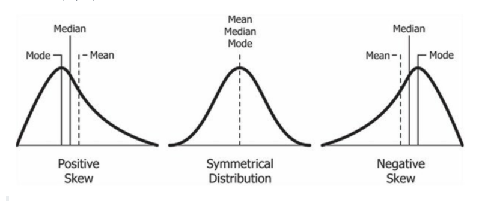
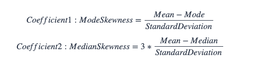

# Exercises

* For this tutorial we have focused on the filtered records WHERE measure = 'weight' - for these 3 exercise questions, we’ll look at some of the other measure values!

<br>

## Average, Median & Mode
* One popular method to detect an uneven distribution in the dataset is to compare the average, mode and median values - this statistical property is known as a **skew** in the distribution.


<br>

### Challenge:

    What is the average, median and mode values of blood glucose values to 2 decimal places?

```sql
SELECT 
  ROUND(AVG(measure_value), 2) AS mean,
  ROUND(MODE() WITHIN GROUP (ORDER BY measure_value), 2) AS mode,
  ROUND(
    -- this function actually returns a float which is incompatible with ROUND!
    -- we use this cast function to convert the output type to NUMERIC
    CAST(PERCENTILE_CONT(0.5) WITHIN GROUP (ORDER BY measure_value) AS NUMERIC),
    2
  ) AS median
FROM health.user_logs
WHERE measure = 'blood_glucose';
```
|mean|mode|median|
|----|----|-----|
|177.35|401.00|154.00|

<br>

____

<br>

## Most Frequent Values

### Challenge:

    What is the most frequently occuring measure_value values for all blood glucose measurements?

* Also have a think about why this value looks really similar as the MODE value above!
    * And how we can see ... mode order

```sql
SELECT
  measure_value,
  COUNT(*) AS frequencies
FROM health.user_logs
WHERE measure = 'blood_glucose'
GROUP BY measure_value
ORDER BY 2 DESC
LIMIT 5;
```
|measure_value|frequencies|
|-------|-------|
|401|433|
|117|350|
|118|307|
|115|290|
|126|290|

___

<br>

## Pearson Coefficients of Skewness


### Challenge:

    Calculate the 2 Pearson Coefficient of Skewness for blood glucose measures given the following formulas:

```sql
WITH PearsonSkew AS (
  SELECT 
    ROUND(AVG(measure_value), 2) AS mean,
    ROUND(
    -- this function actually returns a float which is incompatible with ROUND!
    -- we use this cast function to convert the output type to NUMERIC
    CAST(PERCENTILE_CONT(0.5) WITHIN GROUP (ORDER BY measure_value) AS NUMERIC),
    2) AS median,
    ROUND(STDDEV(measure_value), 2) AS stdv,
    ROUND(MODE() WITHIN GROUP (ORDER BY measure_value), 2) AS mode
  FROM health.user_logs
  WHERE measure = 'blood_glucose'
)
SELECT 
  ROUND((mean - mode) / stdv, 2) AS ModeSkewness_pearsoncorr1,
  ROUND(3 * ((mean - median) / stdv), 2) AS MedianSkewness_pearsoncorr2
FROM PearsonSkew;
```

|modeskewness_pearsoncorr1|medianskewness_pearsoncorr2|
|----|----|
|-0.19|0.06|