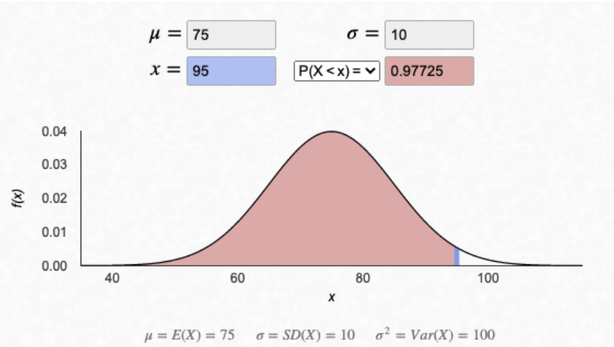
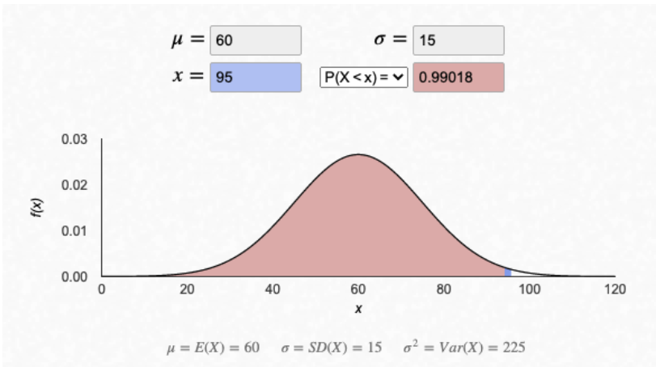
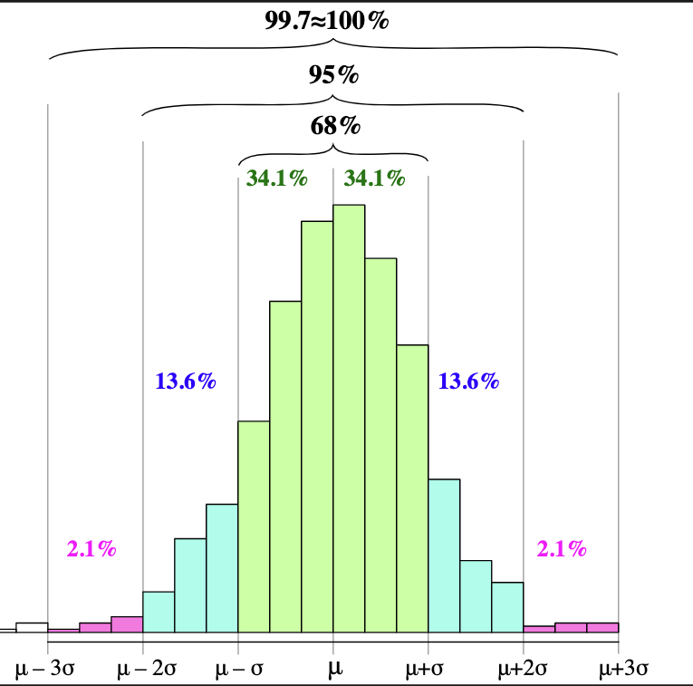

# Summary Statistics

If you’re anything like me - looking at the raw data isn’t the best way to intuitively solve most of my problems!

In this tutorial we will focus on further analyzing and exploring our raw data through the use of powerful summary statistics.

The core ideas will become additional layers to our previous SQL knowledge but will also have a laser sharp focus on how to interpret some of these outputs that come out of our statistical analysis.

To start off, we will cover the base level of what you need to know about statistics, so don’t worry if you have zero math and stats knowledge!

When we use summary statistics in SQL, we can compute our statistics on individual columns, but more generally we often combine the functions used to generate certain statistics with the powerful core foundational concept of GROUP BY to calculate statistics within certain groups that we are interested in.

For the entirety of this tutorial - we will continue inspecting our `health.user_logs` dataset.

Once we’ve covered some of these initial statistical concepts, we’ll return to some of our past decisions in the previous duplicates tutorial to demonstrate their impact on our summary statistics.

___
<br>

## Statistics 101
Statistics is full of is what I like to call “threshold concepts” whereby once you learn their meaning and understand the concept - you will find it very difficult to forget them!

This is exactly the case with some of the following terms I will introduce below - chances are you’ve probably used these same terms before in school, Excel or some other data/math related applications.

As we introduce each statistical concept - I will demonstrate how to calculate each summary statistic on the measure_value column in the   `health.user_logs` table

___

<br>

# Central Location Statistics

Location statistics are something I’m sure you’ve come across - mainly the **mean**, **median** and **mode** values.

They are all measures of the central location summary statistics and are often used in analytical reports everywhere!

The implementation of each metric is different so be sure to read through the code snippets and run them in your SQL environment!

<br>

## Arithmetic Mean or Average
___

The Arithmetic Mean or Average is something I’m sure you’ve seen in the past. It’s definition is simply 
* the sum of all values divided by the total count of values for a set of numbers.

The mean is commonly used as a location summary statistic to show the central tendancy for a set of observations. Note that the mean can only be calculated for numbers and cannot be used on any other data type.

The following mathematical equation is commonly used to show the mean calculation.

* μ=∑Ni=1Xi/N


The **mu** greek letter μ on the left is the most commonly used mathematical symbol to represent the mean and you will see this very often in future!

For a set of observations containing a total of N numbers: x1,x2,x3,...,xN - the mean equals the [ sum of all xi from i = 1 to i = N ] divided by N

The little i subscript of the x value is what is known as a dummy variable and any letter can be used in this equation. Often i and j are used for most mathematical equations you’ll encounter, as well as in for loops in programming languages.

The SQL implementation is relatively simple but can change depending on the flavour of SQL you are using!

In PostgreSQL the mean is calculated using the AVG function like so:

```sql
SELECT
  AVG(measure_value)
FROM health.user_logs;
```

| avg |
|:---|
|1986.2288605267024675|

Wait a moment…what were our measures called again and how many record counts were there?
```sql
SELECT
  measure,
  COUNT(*) AS counts
FROM health.user_logs
GROUP BY measure
ORDER BY counts DESC;
```
|measure|count|
|----|-----|
|blood_glucose| 38692|
|weight|2782|
|blood_pressure|2417|

Do you notice something fishy going on? What happens if we also take a look at the AVG value across each measure too?

```sql
SELECT
  measure,
  ROUND(AVG(measure_value), 2) AS average,
  COUNT(*) AS counts
FROM health.user_logs
GROUP BY measure
ORDER BY counts DESC;
```

|measure|average|counts|
|----|-----|-----|
|blood_glucose| 177.35|38692|
|weight|28786.85|2782|
|blood_pressure|95.40|2417|

<br>

... Looks odd
Let's park this for the meantime but earmark it for later


___
<br>

## Ordered Set Aggregate Functions
When you think of the underlying steps of calculating the median or the mode - there are a few steps involved in the “algorithm” required to calculate the values 

### Median Algorithm
*   Sort all N values from smallest to largest
*   Inspect the central values of the sorted set:
* **if** N is odd:
    + the median is the value in the (N+1/2)th position   
* **else** if N is even:
    + the median is the average of values in the (N/2)th and 1+(N/2)th positions
    + [1,2,3,4] (N=4)
        + 4/2 = 2 so the 2nd position in the arr[1] (Zero Indexing)
        + 1 + (4/2) = 3 so the 3rd position in the arr[2] (Zero Indexing)
        + 2 + 3 (Arr position values) / 2 = 2.5 
    + Median value would be 2.5

<br>

### Python Code Algorithm
```python
import random as rd
import numpy as np
#Generate 1-100 with even or odd amount using multiple libraries##
random_ints = []
np_random_ints = []
for i in range(14):
    random_ints.append(rd.randint(1,100))
for j in range(13):
    np_random_ints.append(np.random.randint(1, 100))
print(random_ints, '\n', np_random_ints)
random_ints.sort()
random_ints
len(random_ints)

def returnMedian(lst):
    """ 
    Returns Median Value of passed list similarly to Median Algorithm for SQL query below
    Validates if passed list is odd/even 
    Function requires a list of integer numeric types
    Arguments:
        lst : list of integers to pass to function
    Returns:
        Original List, Sorted List, Median Index Value if Odd (Zero Indexing Accounted For), Median Value of Passed List
    """
    if len(lst) % 2 != 0:
        # Account for zero indexing 
        # sorted_list = lst.sort() wouldn't work as the array method returns a nonetype and mutates the list in place
        sorted_list = sorted(lst)
        median_index = int((len(lst) + 1) / 2) - 1
        return (lst, sorted_list, median_index, sorted_list[median_index])
    else:
        sorted_list = sorted(lst)
        median_first_value = int((len(sorted_list) / 2) - 1)
        median_second_value = int(len(sorted_list) / 2)
        median_value = (sorted_list[median_first_value] + sorted_list[median_second_value]) / 2
        return (lst, sorted_list, median_value)
```
<br>

### Mode Algorithm
Calculate the tally of values similar to a GROUP BY and COUNT
The mode is the values with the highest number of occurences

1. Calculate the tally of values similar to a GROUP BY and COUNT
The mode is the values with the highest number of occurences
2. The mode is the values with the highest number of occurences

<br>

To implement these “algorithms” we need to use what are called **Ordered Set Aggregate Functions** in PostgreSQL.

Some flavours of SQL actually have implemented median and mode values as regular functions - but we will demonstrate how to implement them in our current PostgreSQL flavour for completeness!

Let’s use that same example data from above in a CTE to demonstrate the PostgreSQL implementations of the median and mode functions.

```sql
WITH sample_data (example_values) AS (
 VALUES
 (82), (51), (144), (84), (120), (148), (148), (108), (160), (86)
)
SELECT
  ROUND(AVG(example_values),2) AS mean_value,
  PERCENTILE_CONT(0.5) WITHIN GROUP (ORDER BY example_values) AS median_value,
  MODE() WITHIN GROUP (ORDER BY example_values) AS mode_value
from sample_data;
```
|mean_value|median_value|mode_value|
|----|-----|-----|
|113.10|114|148|

<br>

For now - there is not much to add for the SQL implementation of these median and mode values, apart from the fact that they are a little bit annoying…

Let’s also use this same syntax to calculate our median and mode values for our health.user_logs dataset for the weight measurements only - what happens when we compare it with the average value?

```sql
-- Quickly Refresht on Distinct values for columns : [blood_glucose, blood_pressure, weight]
-- Let's get the Centrality measures for Weight

SELECT DISTINCT(measure)
FROM health.user_logs;

SELECT
    ROUND(AVG(measure_value),2) AS mean_value,
    MODE () WITHIN GROUP (ORDER BY measure_value) AS mode_value,
    PERCENTILE_CONT(0.5) WITHIN GROUP (ORDER BY measure_value) AS median_value
FROM health.user_logs
WHERE measure = 'weight';
```
mean_value|mode_value|median_value|
|----|-----|-----|
|28786.85|68.49244787|75.976721975|

* Now that's a bit concerning, it appears that some outliers may exist that are significantly impacting our average
___

<br>

# Spread of the Data
The previous summary statistics all show different measures regarding the central tendancy of a set of observations.

Although these are interesting, we also like to see summary statistics about the spread of the data.

Just like we can spread peanut butter from edge to edge of a piece of toast - we usually think of spread in terms of how is our data distributed?

This will make more sense once we cover a few more statistics concepts!

<br>

## Min, Max & Range
___
The minimum and maximum values of observations in a dataset help us identify the boundaries of where our data exists.

We use the range calculation to show the total possible limits of our data by simply calculating the difference between the max and min values from our data.

Luckily the implementations in SQL are straightforward unlike the mode and median calculations! Also the MAX and MIN functions are portable across different flavours of SQL.

There is no built-in implementation of range, but we can simply subtract the MIN from the MAX value as shown below with the weight values:

```sql
SELECT
  MIN(measure_value) AS minimum_value,
  MAX(measure_value) AS maximum_value,
  MAX(measure_value) - MIN(measure_value) AS range_value
FROM health.user_logs
WHERE measure = 'weight';
```
minimum_value|maximum_value|range_value|
|----|-----|-----|
|0|39642120|39642120|

<br>

### CTE (Min & Max Efficiency)
If you feel the need for speed - this following query below is actually slightly more efficient because it doesn’t duplicate the MIN and MAX calculations on the entire dataset but rather just takes the calculated values for the range metric following the CTE in the following query"

Remember what we mentioned about SQL query performance and the number of rows in our datasets? This is one simple example of this exact case where we reduced the number of rows down from the total size of the health.user_logs down to just 2 numbers!

You can confirm this speedup by putting a EXPLAIN ANALYZE in front of each query and taking a look at the output, especially the Execution Time values.

We will touch upon these optimizations and more later on in the course because let’s be real here - who doesn’t like their queries to run faster?!?

```sql
EXPLAIN ANALYZE
WITH min_max_values AS (
  SELECT
    MIN(measure_value) AS minimum_value,
    MAX(measure_value) AS maximum_value
  FROM health.user_logs
  WHERE measure = 'weight'
)
SELECT
  minimum_value,
  maximum_value,
  maximum_value - minimum_value AS range_value
FROM min_max_values;

-- Output would be the same for the table defined above 
```
___

<br>

# Variance & Standard Deviation
The minimum and maximum values and the range are important to know for sure, but the real statistics stuff starts in when we start thinking about variance and standard deviation.

These two important values are used to describe the **“spread”** of the data about the mean value. Also, the **variance** is simply the square of the standard deviation. So once we know how to calculate one of these - we know both of these!

OK - the simplest way to learn more about these metrics is to develop an algorithm to calculate them

<br>

## Variance Algorithm
___
Before we dive straight into the algorithms itself - it’s important to understand the mathematical formula for the variance value.

We often use σ as the mathematical symbol for standard deviation and σ2 for variance. Do you remember what the μ symbol stands for?

* The **variance** is the sum of the (difference between each X value and the mean) squared, divided by N - 1, 1 less than the total number of values.
    + Squared to account for negative distances from the mean to get an absolute relative distance 

<br>

Let’s return to our original sample data example to explain our variance algorithm:

Consider the following data set with 10 numbers: [82,51,144,84,120,148,148,108,160,86]

<br>

First we calculate the mean:
    
    μ=82+51+144+84+120+148+148+108+160+86 / 10 = 113.1

Next We Need the Squared Difference
Let’s take the first value of 82 from our dataset:

    (82−113.1) ** 2 = 967.21

Now imagine we do this for all of our values to obtain the following numerator of our variance formula divided by 1 less than the total number of records we have in our dataset:

    (82−113.1)**2+(51−113.1)**2+...+(86−113.1)**2 / 10 - 1 = 1340.99

Finally let’s take a look at the single standard deviation σ value by taking the square root of our previous calculated value.

    σ = 36.62


### Similar Python Like Algorithm
```python
test_set = [82,51,144,84,120,148,148,108,160,86]

def variance_stdv(lst):
    """
    Return Variance and Stdv : Variance Algorithm Outputs
    Arguments:
        lst : list of integers to pass to function
    Returns:
        Variance & Stddeviation
    """
    import math
    mean = round(sum(lst)/len(lst),2)
    squared_differences = [round((x - mean)** 2, 2) for x in lst]
    variance = round(sum(squared_differences)/(len(lst) - 1),2)
    std_dev = round(math.sqrt(variance),2)
    return mean, squared_differences, variance, std_dev;

print(variance_stdv(test_set))
# (113.1, [967.21, 3856.41, 954.81, 846.81, 47.61, 1218.01, 1218.01, 26.01, 2199.61, 734.41], 1340.99, 36.62)
```

This is what it looks like in SQL to add onto our previous example:

```sql
WITH sample_data (example_values) AS (
 VALUES
 (82), (51), (144), (84), (120), (148), (148), (108), (160), (86)
)
SELECT
  ROUND(VARIANCE(example_values), 2) AS variance_value,
  ROUND(STDDEV(example_values), 2) AS standard_dev_value,
  ROUND(AVG(example_values), 2) AS mean_value,
  PERCENTILE_CONT(0.5) WITHIN GROUP (ORDER BY example_values) AS median_value,
  MODE() WITHIN GROUP (ORDER BY example_values) AS mode_value
FROM sample_data;
```
variance_value|standard_dev_value|mean_value|median_value|mode_value
|----|-----|-----|-------|------|
|1340.99|36.62|113.10|114|148|

<br>

So now we have the raw values - but there is still a question isn’t there…what do they ACTUALLY mean????

<br>

## Interpreting Spread
___
We’ve talked about the variance and standard deviation being a measure of spread - but what do we mean by this?

One of the best examples to explain this is to take a look at the humble **bell curve**, or **normal distribution**.

Now there is a huge caveat to this explanation in that - data is not **ALWAYS** normally distributed. 
*   In fact, lots of messy datasets are totally not normally distribute

<br>

### Normal Distribution
Back when we would get our test grades, we were told our exam score and a percentile value, and this is exactly where the distribution comes into play!

The percentile relates to how I performed compared to others who took the test. So you might be asking - how do we calculate this percentile? Well, it depends on a few factors, but in technical terms, we use the available data (the exam scores) to generate a normal distribution by using:

* The average or the mean score of all exam takers
* The spread or the standard deviation/variance of the score values

So let’s say for a specific test - I had scored 95, the average score was 75 and the standard deviation was 10 - on the back of my results, there would be a chart that looked like this with my percentile score inside the red box:



* To interpret our sample score: It had beaten ~97% of other test takers based off the mean and standard deviation statistics.

<br>

But let’s say that for a different example - the average score was slightly lower at 60 and the standard deviation was also higher at 15:



In this example test - I would have beaten ~99% of other test takers with my score of 95.

* If you take a look at the X axis for both of the above charts - what do you notice about the “spread” of the values around that mean value?

* This increase in standard deviation value sees a subsequent “spread” in the possible x-values - and this is exactly what we’d expect when we apply the same standard deviation metrics to our data - even though they might not be normal distributions!

Also a sidenote: did you know that we also refer to the mean as the “first moment” and the variance as the “second moment” in probability and statistics?

___
<br>

## The Empirical Rule or Confidence Intervals
One other way to interpret the standard deviation is the **Empirical Rule**

Essentially if our data is approximately normally distributed (it looks like a bell curve) - we can make rough generalisations about how much percentage of the total lies between different ranges related to our standard deviation values.

These boundaries are also known as confidence intervals or confidence bands - ranges where we are fairly sure that the data will lie within!


|Percentage of Values| Range of Values|
|----------|-----------------|
|68%|μ±σ (mean + or - one stdv)| 
|95%| μ±2*σ (mean + or - two stdv)|
|99.7%|μ±3*σ (mean + or - three stdv)|

<br>

* Quite commonly we will refer to these ranges as “one standard deviation about the mean” contains 68% of values etc.




___

<br>

# Calculating All The Summary Statistics
* Finally, let's calculate all the summary statistics for measure_value when our measure is weight

```sql
SELECT
  'weight' AS measure,
  ROUND(MIN(measure_value), 2) AS minimum_value,
  ROUND(MAX(measure_value), 2) AS maximum_value,
  ROUND(AVG(measure_value), 2) AS mean_value,
  ROUND(
    -- this function actually returns a float which is incompatible with ROUND!
    -- we use this cast function to convert the output type to NUMERIC
    CAST(PERCENTILE_CONT(0.5) WITHIN GROUP (ORDER BY measure_value) AS NUMERIC),
    2
  ) AS median_value,
  ROUND(
    MODE() WITHIN GROUP (ORDER BY measure_value),
    2
  ) AS mode_value,
  ROUND(STDDEV(measure_value), 2) AS standard_deviation,
  ROUND(VARIANCE(measure_value), 2) AS variance_value
FROM health.user_logs
WHERE measure = 'weight';
```
|measure|minimum_value|maximum_value|mean_value|median_value|mode_value|standard_deviation|variance_value|
|-----|-----|----|-----|-------|------|-----|-------|
|weight|0|39642120.00|28786.85|75.98|68.49|1062759.55|1129457862383.41|

<br>
However - again we need to ask ourselves: WHAT DOES THIS REALLY MEAN??????

* We will continue pondering this big question in the following tutorial!

<br>

## Conclusion
___
* Central location statistics including: mean, median and mode
* Simple algorithm approach to calculate the median and mode
* How to implement Ordered Set Aggregate Functions to calculate the 50th percentile value of a dataset (in other words - the median)
* Spread statistics including: min, max, range, standard deviation and variance
* Basic understanding of the Normal Distribution, The Empirical Rule, confidence intervals and their relation to the mean and standard deviation
WHERE filters to narrow down a set of data based off a certain condition measure = 'weight'
* Using ROUND to limit numeric outputs to 2 decimal places for nicer presentation
Mathematical equations for mean and standard deviation
