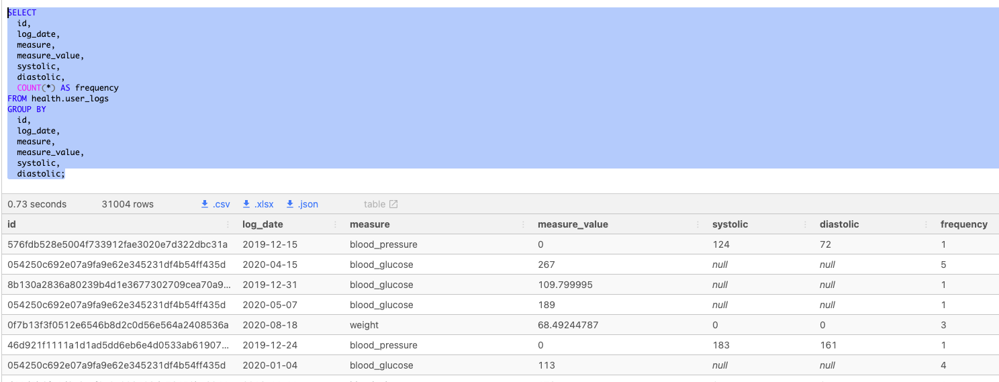

# Data Exploration Summary
* Let’s summarize this first data exploration section of the course with a systematic approach with some code snippets that you can follow for any future data exploration problem you might come across.

<br>

## Inspect Row Counts
* Straight forward enough to get a count of total rows for any particular table
```sql
SELECT
  COUNT(*) AS row_count
FROM health.user_logs;
```
|count|
|----|
43891

---

<br>

## Check For Duplicates & Record Frequency
* Using a like `GROUP BY` SQL statement below will return any unique row combination for the table as well as any duplicate counts for that row within the table
* The `GROUP BY` Statement must include all columns for the table along with the aggregate `COUNT` function to perform the duplicates/record frequency in your table
* The query is grouping by each column and thus any unique value in a column will return as a different row

```sql
SELECT
  id,
  log_date,
  measure,
  measure_value,
  systolic,
  diastolic,
  COUNT(*) AS frequency
FROM health.user_logs
GROUP BY
  id,
  log_date,
  measure,
  measure_value,
  systolic,
  diastolic;
```

* Second Row would categorize as a duplicate row due to that row having 5 entries in the table in which all columns grouped together returned the same result/row

---

<br>

## Single Column Frequency Counts
* Aggregate `COUNT` is being partitioned by the measure for the `GROUP BY` clause
* Window `OVER` function is being applied to each partitioned group
    * Initial number of grouped by count is multiplied by a 100 to create percentage (without return percentage of total = 1 (ex : 38692/43891 = 0.88154))
    * Frequency of the group (after being multiplied) is divided by the count of all the rows and performed `OVER` the return
    * Lastly, the `ROUND` function is performed on final result to return a percentage value rounded to the second decimal

```sql
SELECT
  measure,
  COUNT(*) AS frequency,
  ROUND(
    100 * COUNT(*) / SUM(COUNT(*)) OVER (),
    2
  ) AS measure_percentage
FROM health.user_logs
GROUP BY measure
ORDER BY frequency DESC;
```
|measure|frequency|measure_percentage|
|-----|-------|--------|
|blood_glucose|38692|88.15|
|weight|2782|6.34|
|blood_pressure|2417|5.51|

---

<br>

## Summary Statistics
* Use of `MIN`, `MAX`, `AVG`, `MODE`, `STDEV`, `VARIANCE` functions to obtain  statistical value for column's (ex : measure_value) common summary stats
* Median is obtained by using `PERCENTILE_CONT` on the `ORDER BY` group (column)
    * As function returns float, `CAST`'ing as `NUMERIC` makes the return value compatible for the `ROUND` function performed 
```sql
SELECT
  'weight' AS measure,
  ROUND(MIN(measure_value), 2) AS minimum_value,
  ROUND(MAX(measure_value), 2) AS maximum_value,
  ROUND(AVG(measure_value), 2) AS mean_value,
  ROUND(
    -- this function actually returns a float which is incompatible with ROUND!
    -- we use this cast function to convert the output type to NUMERIC
    CAST(PERCENTILE_CONT(0.5) WITHIN GROUP (ORDER BY measure_value) AS NUMERIC),
    2
  ) AS median_value,
  ROUND(
    MODE() WITHIN GROUP (ORDER BY measure_value),
    2
  ) AS mode_value,
  ROUND(STDDEV(measure_value), 2) AS standard_deviation,
  ROUND(VARIANCE(measure_value), 2) AS variance_value
FROM health.user_logs
WHERE measure = 'weight';
```
|measure|minimum_value|maximum_value|mean_value|median_value|mode_value|standard_deviation|variance_value|
|-----|-------|--------|------|--------|--------|-------|------|
|weight|0.00|39642120.00|28786.85|75.98|68.49|1062759.55|1129457862383.41

